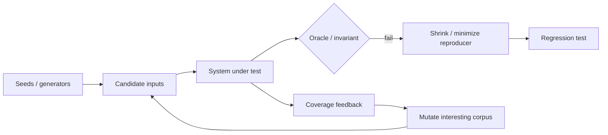
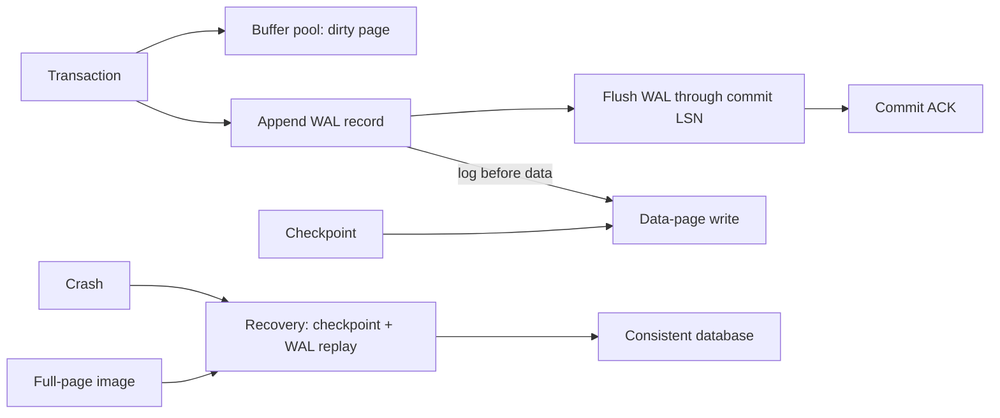

# 2026-09-21 16:00 — Interview Study Packages

README ve yakın `daily/2026-09-21/15-00.md` kontrol edildi. İlk taslaktaki HNSW/filtered ANN konusu `daily/2026-09-18/15-00.md` ile çakıştığı için çıkarıldı. Bu tur sanitizer'lardan sonraki testing engineering boşluğunu input-space exploration ile, storage bilgisini ise filesystem `fsync`/JBD2 katmanından database WAL/recovery katmanına ilerletir. Hedef yaklaşık %70 temel + %20 mülakat pratiği + %10 güncel/production bağlantıdır.

## Paket 1 — Junior → Staff Testing Engineering: Property-Based Testing, Coverage-Guided Fuzzing & Shrinking
**Süre:** 20–30 dk

### Konu anlatımı
Example-based test seçilmiş input/output çiftlerini doğrular. **Property-based testing (PBT)** tek tek örnek yerine geniş input uzayında invariant sınar: `decode(encode(x)) == x`, sort sonucunun sıralı ve input'un permutation'ı olması, idempotent operation'ın ikinci çalışmada state'i değiştirmemesi gibi. Framework input üretir; failure bulunca daha küçük bir karşı örneğe doğru **shrink** eder.

**Coverage-guided fuzzing** başka bir arama sinyali kullanır: corpus input'larını mutate eder ve yeni control-flow coverage açan input'ları saklar. Oracle yalnız expected-output değildir; crash, sanitizer violation, timeout, assertion, round-trip veya differential comparison olabilir. PBT specification/invariant bilgisini, fuzzing execution feedback'ini öne çıkarır; birlikte güçlüdür.

### Mental model
İki soru sor: **input'u kim seçiyor?** ve **yanlış olduğunu kim söylüyor?** Generator/fuzzer input arar; invariant/sanitizer/differential oracle yanlışlığı bildirir. Coverage yüksekliği correctness kanıtı değil, aramanın ulaştığı yerler için sinyaldir.

### İçeride ne oluyor?
1. PBT generator'ları domain constraint'lerinden çok sayıda input üretir.
2. Property implementation detail değil observable invariant ifade etmelidir.
3. Failure bulunursa shrinker aynı failure'ı koruyarak input'u küçültür.
4. Coverage-guided fuzzer seed corpus'u mutate eder; yeni edge/path coverage üreten input'ları corpus'a ekler.
5. Structured formatlarda dictionary/structure-aware mutation derin path'lere ulaşmayı hızlandırabilir.
6. Sanitizer'lar fuzzing oracle'ını güçlendirir; memory corruption veya UB görünür olur.
7. Minimal crash/property case kalıcı regression corpus'una alınmalıdır.

### Yüksek getirili mülakat soruları
1. Unit test ile property-based test farkı nedir?
2. Bir serializer için üç iyi property yaz.
3. Mid: coverage-guided fuzzing random input üretmekten nasıl farklıdır?
4. Mid: shrinking neden yalnız developer ergonomisi değildir?
5. Senior: parser fuzz target'ında hangi oracle'ları kullanırsın?
6. Senior: nondeterminism fuzzing verimini neden düşürür?
7. Staff: hangi target'ları per-PR, hangilerini nightly/continuous fuzzing'e koyarsın?
8. Staff: coverage plateau correctness anlamına gelmiyorsa campaign health'i nasıl ölçersin?

### Seviyeye göre cevap derinliği
- **Junior:** example vs property, invariant ve minimal failing case.
- **Mid:** generator, shrinker, seed corpus, mutation ve coverage feedback.
- **Senior:** sanitizer/differential oracle, determinism, structured input ve corpus management.
- **Staff:** CI budget, target selection, deduplication, regression promotion ve risk bazlı continuous fuzzing.

### Kısa alıştırma
Bir URL parser için en az beş property yaz: parse→serialize round-trip, normalization idempotence ve malformed-input safety dahil. Hangilerinin PBT generator'ı, hangilerinin coverage-guided fuzzer ile daha yüksek değer vereceğini gerekçelendir.

### Proje fikri
`parser-fuzz-lab`: küçük bir binary protocol veya URL parser yaz. Example tests + property tests ekle; aynı parser'ı libFuzzer + ASan/UBSan ile fuzz et. Crash input'larını minimize edip regression corpus'una taşı; CI'da kısa smoke, scheduled job'da uzun campaign çalıştır.

### Failure modes / trade-off / production bağlantısı
Zayıf property implementation'ı yeniden ifade eder. Aşırı reject eden generator input-space'i daraltır. Yavaş/nondeterministic target coverage-guided aramayı bozar. Yalnız line coverage'a optimize olmak semantic state-space'i kapsamaz. Parser, codec, RPC boundary, file format, compiler frontend ve security-sensitive decoder'larda fuzzing özellikle yüksek getiridir.

### Kaynaklar
- LLVM — libFuzzer: https://llvm.org/docs/LibFuzzer.html
- LLVM — SanitizerCoverage: https://clang.llvm.org/docs/SanitizerCoverage.html
- Hypothesis — Property-Based Testing: https://hypothesis.readthedocs.io/

---

## Paket 2 — Mid → Principal Databases/Storage: WAL, Checkpoints, Torn Pages & Recovery
**Süre:** 20–30 dk

### Konu anlatımı
Database buffer pool'daki dirty page'i her commit'te ana data file'a zorla yazmak pahalıdır. **Write-Ahead Logging (WAL)** bunu ordering kontratıyla ayırır: data page disk'e yazılmadan önce onu yeniden kurmaya yetecek log durable olmalıdır; commit başarı cevabı da seçilen durability politikasına göre ilgili WAL boundary'sine bağlanır.

**Checkpoint** recovery'nin başlangıç ufkunu sınırlar ve dirty-page flush yükünü düzenler; “checkpoint oldu, WAL gereksiz” demek değildir. Crash data-page write'ının ortasında olursa **torn page** oluşabilir. PostgreSQL `full_page_writes` ile checkpoint sonrasında bir page'in ilk değişikliğinde full-page image'ı WAL'a yazar; recovery kısmi page write'ını sağlam image'dan onarabilir.

### Mental model
WAL bir **yeniden yapma makbuzu**, data page ana defterdir. Önce makbuzu güvene al; ana defteri sonra güncelleyebilirsin. Checkpoint eski makbuzları keyfi silmek değil, recovery için güvenli başlangıç + dirty-state koordinasyonudur.

### İçeride ne oluyor?
1. Transaction buffer-pool page'ini değiştirir ve WAL record üretir; page LSN log konumuyla ilişkilidir.
2. Sequential WAL append, random data-page flush'larından daha uygun commit path sağlayabilir.
3. WAL-before-data invariant'ı: dirty page yazılmadan önce gerekli WAL durable olmalıdır.
4. Commit durability synchronous/asynchronous policy'ye göre WAL flush boundary'sine bağlanır.
5. Checkpoint dirty pages'i kontrollü flush ederek crash sonrası replay horizon'unu kısaltır; çok sık checkpoint I/O/write amplification yaratabilir.
6. Torn page, storage write atomicity page boyutundan küçük olduğunda crash anında eski+yeni byte'ların karışmasıdır.
7. PostgreSQL `full_page_writes`, checkpoint sonrasında page'in ilk değişikliğinde full image loglayarak torn-write recovery sağlar; WAL hacmi maliyeti vardır.
8. Recovery uygun checkpoint/WAL konumundan durable log'u redo eder.

### Yüksek getirili mülakat soruları
1. WAL neden “önce log, sonra data page” ister?
2. Commit ACK ile data page'in disk'e yazılması neden aynı an olmak zorunda değildir?
3. Mid: checkpoint WAL'ın yerine geçer mi?
4. Senior: checkpoint sıklığı recovery time ve steady-state I/O'yu nasıl etkiler?
5. Senior: torn page nedir; normal WAL record neden her zaman yeterli olmayabilir?
6. Staff: `fsync`, storage cache, WAL flush ve replication acknowledgement durability contract'ında nasıl ayrılır?
7. Principal: RPO/RTO, checkpoint cadence, WAL volume, replica lag ve storage latency arasında nasıl policy kurarsın?

### Seviyeye göre cevap derinliği
- **Junior/Mid:** buffer pool, dirty page, sequential WAL, log-before-data ve crash replay.
- **Senior:** checkpoint, LSN, torn page, full-page image ve write amplification.
- **Staff/Principal:** local vs replicated durability; RPO/RTO, storage guarantees, checkpoint storms ve observability.

### Kısa alıştırma
Page P değişti → WAL record üretildi → P'nin data-page write'ı başladı → güç kesildi. (a) WAL durable değilse, (b) WAL durable ise recovery farkını açıkla. Sonra torn-page varsayımını ekleyip full-page image'ın neden gerekli olabileceğini göster.

### Proje fikri
`mini-wal-kv`: append-only WAL + in-memory page/cache kullanan küçük KV store yaz. Monoton LSN ve configurable checkpoint ekle. Process'i rastgele kill ederek restart/replay testleri çalıştır; ikinci aşamada page write'ını yarıda kesip checksum/full-page snapshot yaklaşımını dene.

### Failure modes / trade-off / production bağlantısı
WAL'ın yazılmış olması durable olduğu anlamına gelmez; userspace/kernel/device cache zinciri önemlidir. Çok sık checkpoint recovery'yi kısaltırken foreground I/O ve full-page-image WAL hacmini artırabilir; çok seyrek checkpoint recovery süresini ve WAL retention ihtiyacını büyütür. Storage atomic-write varsayımını yanlış yapmak silent corruption'a kadar gider. Production'da commit latency, WAL bytes/sec, checkpoint duration, dirty-buffer pressure, replica lag ve recovery objective'leri birlikte değerlendirilmelidir.

### Kaynaklar
- PostgreSQL — WAL Configuration: https://www.postgresql.org/docs/current/wal-configuration.html
- PostgreSQL — Reliability and WAL: https://www.postgresql.org/docs/current/wal-reliability.html
- PostgreSQL — Continuous Archiving / PITR: https://www.postgresql.org/docs/current/continuous-archiving.html
