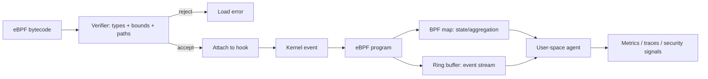

# 2026-09-21 16:00 — Interview Study Packages

README ve yakın `daily/2026-09-21/15-00.md` kontrol edildi. cgroup CPU/PSI ve TCP congestion-control tekrar edilmedi. Repo çapı aramada eBPF verifier/maps/ring-buffer ile HNSW filtered ANN için doğrudan paket bulunmadı.

## Paket 1 — Mid → Principal Cloud/DevOps/SRE: eBPF Verifier, Maps, Ring Buffer & Production Observability
**Süre:** 20–30 dk

### Konu anlatımı
**eBPF**, kernel içinde kontrollü programlar çalıştırıp networking, tracing, security ve observability sinyallerini kernel path'ine yakın noktada işleyebilmemizi sağlar. Mental model “kernel'e keyfi native code yüklemek” değil, **yükle → statik olarak doğrula → hook'a bağla → map/ring buffer üzerinden state/event paylaş** hattıdır.

Verifier programın güvenli yürütülebileceğini kanıtlamaya çalışır: register ve stack durumlarını, pointer türlerini, bounds/alignment bilgisini ve olası execution path'lerini izler. Kabul edilen program hook türüne göre çalışır. **BPF maps** kernel/user-space arasında state paylaşımı sağlar; hash, array, per-CPU ve başka map türleri vardır. Yüksek hacimli event akışı için `BPF_MAP_TYPE_RINGBUF`, farklı CPU'lardan event'leri ortak MPSC buffer'a taşıyabilir ve çapraz-CPU event ordering'i için per-CPU perf-buffer modelinden farklı özellikler sunar.



### Mental model
Verifier = **proof gate**, map = **shared state**, ring buffer = **event conveyor**. Production maliyeti yalnız program instruction sayısı değildir; event rate, map contention/cardinality, copy/serialization ve user-space consumer backpressure da bütçenin parçasıdır.

### İçeride ne oluyor?
1. Program kernel'e yüklenirken verifier abstract interpretation benzeri state tracking ile register/pointer değerlerini ve memory access safety'yi takip eder.
2. Branch'ler state-space yaratır; verifier eşdeğer/güvenli durumları prune ederek analizi sınırlar.
3. Program tracing/network/security hook'una attach edilir ve event olduğunda çalışır.
4. Map lookup/update ile aggregation veya cross-event state tutulabilir. Per-CPU map contention'ı azaltabilir ama merge maliyeti doğurur.
5. Ring buffer event payload'larını user-space consumer'a taşır. Consumer yetişemezse loss/backpressure stratejisi tasarım konusu olur.
6. Cardinality patlaması, hot-key contention ve aşırı event emission observability aracını workload'un kendisine dönüştürebilir.

### Yüksek getirili mülakat soruları
1. eBPF programı neden normal kernel module kadar serbest değildir?
2. Verifier neyi kanıtlamaya çalışır; pointer/bounds tracking neden önemlidir?
3. Mid: map ile ring buffer hangi farklı problemi çözer?
4. Senior: per-CPU map neyi iyileştirir, hangi merge/consistency maliyetini getirir?
5. Senior: tracing agent p99 latency'yi bozuyorsa hangi telemetry'yi toplarsın?
6. Staff: high-cardinality syscall/network telemetry için sampling, aggregation ve event streaming sınırlarını nasıl seçersin?
7. Principal: fleet-wide eBPF rollout'unda kernel-version/capability compatibility, blast radius ve rollback politikasını nasıl kurarsın?

### Seviyeye göre cevap derinliği
- **Junior/Mid:** hook, verifier, map ve user-space agent zincirini doğru açıkla.
- **Senior:** verifier constraints, per-CPU state, ring-buffer loss, cardinality ve overhead ölçümünü bağla.
- **Staff/Principal:** compatibility matrix, safe rollout, privilege/security boundary, SLO overhead budget ve fleet governance konuş.

### Kısa alıştırma
Bir HTTP service için request başına syscall event'i üretmek yerine per-CPU map'te `(syscall_id -> count,total_ns)` aggregate eden tasarım çiz. Hangi durumda raw event'i ring buffer'a göndereceğini ve drop oranını nasıl izleyeceğini yaz.

### Proje fikri
`ebpf-latency-lab`: tracepoint/kprobe tabanlı küçük bir collector ile syscall latency histogramı üret. Per-event streaming ile in-kernel/per-CPU aggregation seçeneklerini karşılaştır; CPU overhead, event loss, memory ve p99 application latency ölç.

### Failure modes / trade-off / production bağlantısı
Verifier rejection correctness/safety sınırıdır; “çalışmıyor” diye verifier'ı düşman görmek yerine program state-space'ini sadeleştirmek gerekir. Her eventi user-space'e taşımak yüksek throughput'ta pahalıdır; kernel-side aggregation maliyeti düşürür ama ayrıntıyı kaybettirir. Per-CPU state contention'ı azaltırken global görünüm için merge ister. Production'da observability overhead'i ayrıca SLO gibi bütçelenmeli, canary ve kill-switch ile rollout edilmelidir.

### Kaynaklar
- Linux Kernel — eBPF verifier: https://docs.kernel.org/bpf/verifier.html
- Linux Kernel — BPF maps: https://docs.kernel.org/bpf/maps.html
- Linux Kernel — BPF ring buffer: https://docs.kernel.org/bpf/ringbuf.html

---

## Paket 2 — Mid → CTO ML/AI/LLM + Databases: HNSW, Recall–Latency Trade-off & Filtered Vector Search
**Süre:** 20–30 dk

### Konu anlatımı
Embedding retrieval'da exact k-NN her query için bütün vektörlerle distance hesaplayarak kusursuz recall sağlayabilir ama veri büyüdükçe pahalılaşır. **Approximate nearest neighbor (ANN)** index'leri hız karşılığında bazı gerçek komşuları kaçırmayı kabul eder. **HNSW (Hierarchical Navigable Small World)** çok katmanlı proximity graph kurar: seyrek üst katmanlar uzun mesafeli navigation, yoğun alt katmanlar yerel refinement sağlar.

HNSW'yi production'da yalnız “hızlı vector index” diye düşünmek eksiktir. Ana sözleşme **recall ↔ latency ↔ memory ↔ build/update cost** arasındadır. Üstelik metadata filtering bu sözleşmeyi değiştirir. Örneğin pgvector'da approximate index scan sonrasında filtre uygulandığında seçici predicate adayların çoğunu eleyebilir; daha fazla aday tarama, iterative scan, partial index veya partitioning gerekebilir.

```mermaid
flowchart TD
 Q[Query embedding] --> TOP[Sparse upper HNSW layer]
 TOP --> MID[Closer entry points]
 MID --> BASE[Dense base graph]
 BASE --> C[ANN candidate set]
 C --> F{Metadata filter}
 F -->|enough survivors| K[Top-k]
 F -->|too few| MORE[Expand search / iterative scan]
 MORE --> BASE
 EXACT[Exact search sample] --> EVAL[Recall@k evaluation]
 K --> EVAL
```

### Mental model
HNSW = **highway + local streets**. Üst katman hızlıca doğru mahalleye götürür; alt katman komşuları dolaşır. `ef_search` benzeri search budget'ı “kaç sokağa bakacağım?” düğmesidir: artırmak çoğunlukla recall'ı iyileştirir ama latency/CPU'yu büyütür.

### İçeride ne oluyor?
1. Vektörler similarity metric'e göre graph node'larıdır; her node sınırlı komşuluk bağlantıları taşır.
2. Query üst katmandan başlar, daha yakın node'lara greedy/beam-benzeri navigation ile iner.
3. Base layer'da daha geniş candidate frontier taranır ve top-k seçilir.
4. Index parametreleri graph degree/build effort; query parametreleri search breadth üzerinden memory/build/recall/latency dengesini değiştirir.
5. ANN kalitesi exact ground-truth sample'a karşı `recall@k` ile ölçülmelidir; yalnız latency benchmark yeterli değildir.
6. Metadata predicate post-filter uygulanıyorsa candidate survival düşebilir. pgvector iterative scan yeterli sonuç bulunana veya scan limitine kadar daha fazla index tarayabilir.
7. Multi-tenant sistemde tek global ANN graph tenant distribution/skew'dan etkilenebilir; partitioning/separate indexes isolation ile memory/ops maliyeti arasında trade-off yaratır.

### Yüksek getirili mülakat soruları
1. Exact k-NN ile ANN arasındaki temel sözleşme nedir?
2. HNSW'de neden birden fazla graph layer vardır?
3. Mid: `ef_search` artırıldığında hangi iki metriği birlikte ölçersin?
4. Senior: metadata filter neden ANN recall'ını beklenmedik biçimde düşürebilir?
5. Senior: vector index memory footprint'i neden raw embedding boyutundan daha büyük olabilir?
6. Staff: partial index, partitioning ve iterative scan arasında nasıl seçim yaparsın?
7. Principal/CTO: RAG retrieval için recall artışının token/LLM maliyeti ve end-to-end answer quality ile ilişkisini nasıl optimize edersin?

### Seviyeye göre cevap derinliği
- **Junior/Mid:** embedding, distance/similarity, exact-vs-approximate ve recall@k kavramlarını açıkla.
- **Senior:** graph/search parameters, filtering, memory/build cost ve benchmark metodolojisini bağla.
- **Staff/Principal/CTO:** tenant isolation, index lifecycle, SLO/cost, online updates, ground-truth evaluation ve downstream RAG quality/business metric ilişkisini tartış.

### Kısa alıştırma
10.000 query için exact top-10 ground truth üretildiğini varsay. ANN sonuçlarıyla recall@10, p50/p95/p99 latency ve QPS ölçen benchmark planı yaz. Sonra tenant filtresi %2 selectivity'ye düştüğünde hangi deneyleri tekrarlayacağını belirt.

### Proje fikri
`hnsw-filter-lab`: PostgreSQL + pgvector üzerinde sentetik embedding ve `tenant_id/category_id` üret. Exact scan'i ground truth kabul edip HNSW için search budget, filter selectivity ve iterative-scan modlarını değiştir; recall@10, p99, visited tuples ve index size raporla.

### Failure modes / trade-off / production bağlantısı
ANN sonucu “yaklaşık” olduğu için yalnız başarılı HTTP response correctness kanıtı değildir. Recall drift veri dağılımı, filtre selectivity'si ve index/config değişimiyle oluşabilir. Search budget'ını körlemesine artırmak latency/CPU'yu büyütür; partitioning recall/isolation sağlayabilir ama çok sayıda küçük index ve operational complexity getirir. RAG'de retrieval recall tek başına ürün metriği değildir: gereksiz fazla candidate reranking ve prompt/token maliyetini büyütebilir.

### Kaynaklar
- Malkov & Yashunin — HNSW original paper: https://arxiv.org/abs/1603.09320
- IEEE TPAMI publication: https://doi.org/10.1109/TPAMI.2018.2889473
- pgvector — HNSW, filtering & iterative scans: https://github.com/pgvector/pgvector#hnsw
