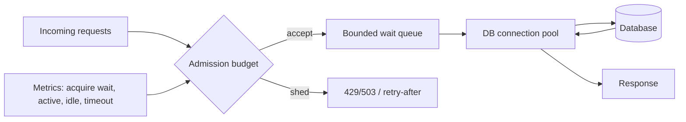
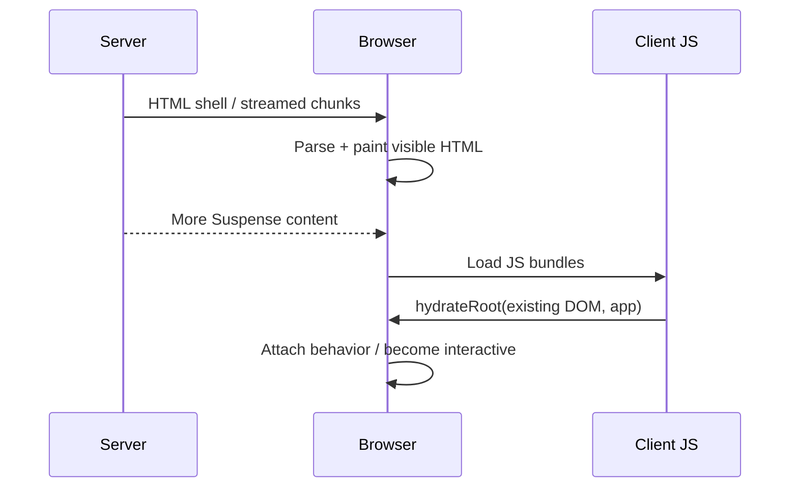

# 2026-09-21 17:00 — Interview Study Packages

README ve yakın `daily/2026-09-21/16-00.md` kontrol edildi. Repo çapı aramada WebSocket backpressure, LSM compaction, vector clocks/causality, Protobuf evolution ve Kubernetes probes gibi yakın konular bulunduğu için tekrar edilmedi. Bu tur backend/database capacity control ile frontend rendering lifecycle eksenlerine döner.

## Paket 1 — Mid → Principal Backend/Databases: Connection Pools, Queueing & Admission Control
**Süre:** 20–30 dk

### Konu anlatımı
Database connection pool'un amacı yalnız connection açma maliyetini amorti etmek değildir; daha önemlisi database'e aynı anda girebilecek işi **sınırlayan bir concurrency boundary** oluşturmaktır. Uygulama request concurrency'si 5.000 olsa bile DB'nin verimli active-query concurrency'si çok daha düşük olabilir. Pool sınırsız büyütülürse throughput artmak yerine lock contention, CPU context switching, buffer-cache churn ve tail latency artabilir.

Little's Law sezgisi `L = λW`: sistemde ortalama bekleyen/çalışan iş sayısı arrival rate ile residence time'ın çarpımıdır. Servis süresi yükseldiğinde aynı arrival rate daha fazla in-flight iş üretir. Bu pozitif feedback'i bounded pool, bounded wait queue, acquisition deadline ve overload rejection ile kırmak gerekir.

### Mental model
Connection pool'u **otopark**, wait queue'yu giriş kuyruğu olarak düşün. Otopark doluyken yeni katlar eklemek şehrin yol kapasitesini artırmaz. Asıl soru “kaç connection açabilirim?” değil, **DB kaç eşzamanlı işi verimli tamamlayabilir ve ne kadar beklemeye izin verebilirim?**

### İçeride ne oluyor?
1. Request pool'dan connection ister; idle connection varsa hemen lease edilir.
2. Pool doluysa request bounded queue'da bekler; acquisition timeout deadline budget'ından kısa olmalıdır.
3. Active query süresi uzarsa connection hold time uzar ve effective capacity düşer.
4. Büyük pool DB tarafında daha fazla backend/session resource'u tüketir. PostgreSQL `max_connections` değerine göre bazı kaynakları doğrudan boyutlandırır.
5. Queue sınırsızsa overload latency ve memory olarak saklanır; bounded queue erken rejection ile blast radius'u sınırlar.
6. Transaction-pooling proxy kullanmak connection sayısını azaltabilir fakat session-scoped state/feature semantiğini etkileyebilir.
7. Pool tuning tek başına çözüm değildir: slow query, lock wait, transaction scope ve downstream deadline birlikte ölçülmelidir.

### Yüksek getirili mülakat soruları
1. Connection pool neden sadece performans optimizasyonu değil bir admission-control mekanizmasıdır?
2. Pool size'ı neden request thread/goroutine sayısına eşitlemezsin?
3. Mid: pool acquisition timeout ile query timeout farkı nedir?
4. Senior: DB latency iki katına çıkınca queue neden nonlinear şekilde büyüyebilir?
5. Senior: büyük pool hangi durumlarda throughput'u düşürür?
6. Staff: 50 replica application pod'u aynı DB'ye bağlanıyorsa global connection budget'ı nasıl paylaştırırsın?
7. Principal: overload anında queue, shed, retry ve autoscaling policy'lerini nasıl birlikte tasarlarsın?

### Seviyeye göre cevap derinliği
- **Junior/Mid:** reuse, max pool size, acquire/release, timeout ve connection leak.
- **Senior:** queueing, Little's Law sezgisi, transaction duration, lock contention ve p99.
- **Staff:** fleet-wide connection budget, per-tenant admission, proxy semantics ve retry amplification.
- **Principal:** capacity envelope, SLO/error budget, overload policy ve database topology economics.

### Kısa alıştırma
DB için güvenli active connection budget'ı 120. 12 application pod'u var; 20 connection operasyonel/admin reserve bırakılacak. Pod başına başlangıç pool limitini hesapla. Sonra pod sayısı 40'a autoscale olduğunda neden aynı per-pod limiti koruyamayacağını açıkla ve global budget yaklaşımı öner.

### Proje fikri
`pool-pressure-lab`: PostgreSQL + küçük HTTP API kur. Pool size 5/20/100 için aynı load testini çalıştır; throughput, p50/p99, pool-acquire wait, DB active sessions ve CPU'yu kaydet. Bir sorguya yapay sleep/lock ekleyerek saturation knee noktasını gözle.

### Failure modes / trade-off / production bağlantısı
Connection leak pool starvation yaratır. Uzun transaction connection'ı rehin tutar. Unbounded queue timeout'u sadece ileri iter. Her pod'un bağımsız büyük pool'u autoscaling sırasında connection storm yaratır. Çok küçük pool ise DB boşken uygulamada gereksiz queue oluşturabilir. Production'da pool active/idle/waiters, acquisition latency/timeouts, transaction duration, DB CPU, lock waits ve query p99 birlikte izlenmelidir.

### Kaynaklar
- PostgreSQL 17 — Connections and Authentication: https://www.postgresql.org/docs/17/runtime-config-connection.html
- PostgreSQL — `pg_stat_activity`: https://www.postgresql.org/docs/current/monitoring-stats.html#MONITORING-PG-STAT-ACTIVITY-VIEW
- Google SRE — Addressing Cascading Failures / Queue Management: https://sre.google/sre-book/addressing-cascading-failures/

---

## Paket 2 — Junior → Staff Frontend: SSR, Hydration, Streaming & Hydration Mismatches
**Süre:** 20–30 dk

### Konu anlatımı
Server-side rendering (SSR) browser'a ilk HTML snapshot'ını server'da üretip gönderir. Fakat HTML'nin görünmesi uygulamanın interaktif olduğu anlamına gelmez. **Hydration**, client'taki React tree'sini mevcut server HTML'sine bağlayıp event handlers/state yönetimini devralır. React `hydrateRoot` için server ve client'ın ilk çıktısının eşleşmesini bekler; mismatch bir correctness bug'ı olarak ele alınmalıdır.

Streaming SSR tek büyük HTML string'ini beklemek yerine shell ve hazır olan Suspense boundary'lerini parça parça gönderebilir. Bu network/compute overlap ve daha erken content görünürlüğü sağlayabilir; fakat data consistency, error handling, cache policy ve hydration scheduling hâlâ tasarlanmalıdır.

### Mental model
SSR bir **fotoğraf**, hydration fotoğrafa **kontrolleri bağlamak** gibidir. Fotoğraf ile client'ın beklediği sahne farklıysa React hangi node'un hangi davranışa ait olduğunu güvenle varsayamaz. Streaming ise fotoğrafı tek seferde değil, hazır bölgeler halinde göndermektir.

### İçeride ne oluyor?
1. Server component tree'den HTML üretir; browser bunu JS tamamlanmadan parse/paint edebilir.
2. Client bundle geldikten sonra `hydrateRoot` mevcut DOM'u yeniden yaratmak yerine React mantığına bağlar.
3. İlk client render server output ile aynı olmalıdır. `Date.now()`, locale/timezone farkı, random değer, browser-only branch ve farklı data snapshot'ı mismatch üretebilir.
4. `renderToString` streaming sağlamaz; React'in streaming server API'leri shell/content'i zaman içinde gönderebilir.
5. Suspense boundary yavaş data'yı tüm document için head-of-line blocker yapmamak üzere fallback ve daha sonra gelen content ile ayırabilir.
6. İki-pass client-only rendering mismatch'i önleyebilir ama hydration sonrası ek render ve görsel sıçrama maliyeti doğurur.
7. Production'da TTFB/LCP tek başına yetmez; JS parse/execute, long tasks, hydration errors ve interaction responsiveness birlikte ölçülmelidir.

### Yüksek getirili mülakat soruları
1. SSR ile hydration arasındaki fark nedir?
2. Server HTML görünürken buton neden henüz çalışmayabilir?
3. Mid: hydration mismatch'in dört tipik sebebini say.
4. Mid: `renderToString` ile streaming server rendering farkı nedir?
5. Senior: streaming hangi latency'yi iyileştirir, hangisini otomatik çözmez?
6. Senior: server/client data snapshot tutarlılığını nasıl sağlarsın?
7. Staff: büyük uygulamada hangi UI bölgelerini server-rendered, client-interactive veya lazy-hydrated tasarlarsın; bundle ve observability budget'ını nasıl koyarsın?

### Seviyeye göre cevap derinliği
- **Junior:** SSR HTML üretir; hydration interaktiviteyi bağlar.
- **Mid:** mismatch nedenleri, browser-only API, deterministic first render, streaming temeli.
- **Senior:** Suspense boundaries, data/cache consistency, error recovery, JS execution ve UX metrics.
- **Staff:** rendering architecture, route/component boundaries, CDN/cache strategy, failure isolation ve performance budget.

### Kısa alıştırma
Server'da UTC, browser'da yerel timezone ile `new Date().toLocaleString()` render eden bir component düşün. Mismatch'i açıkla ve üç çözümü trade-off'larıyla karşılaştır: server snapshot'ını client'a taşıma, deterministic UTC ilk render + effect sonrası localize etme, client-only bölge.

### Proje fikri
`hydration-lab`: aynı ürün listesini (a) CSR, (b) `renderToString` SSR, (c) streaming SSR ile üret. Yapay 800 ms data delay ekle. TTFB, first content, JS bytes, long tasks ve interaction zamanını ölç; kasıtlı timestamp mismatch ekleyip production error logging ile yakala.

### Failure modes / trade-off / production bağlantısı
SSR server compute/caching maliyetini artırabilir. Streaming proxy/CDN buffering yüzünden beklenen faydayı vermeyebilir. Büyük client bundle erken HTML'ye rağmen interaktiviteyi geciktirir. Mismatch'i `suppressHydrationWarning` ile yaygın biçimde gizlemek gerçek data/correctness hatalarını örtebilir. Production kararını yalnız “SSR hızlıdır” sloganıyla değil route bazlı TTFB, LCP, INP/long-task, hydration error ve cache-hit verileriyle ver.

### Kaynaklar
- React — `hydrateRoot`: https://react.dev/reference/react-dom/client/hydrateRoot
- React — `renderToPipeableStream`: https://react.dev/reference/react-dom/server/renderToPipeableStream
- React — `renderToReadableStream`: https://react.dev/reference/react-dom/server/renderToReadableStream
- React — `renderToString`: https://react.dev/reference/react-dom/server/renderToString
