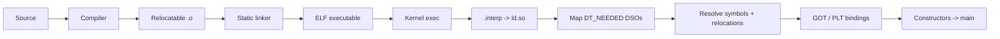
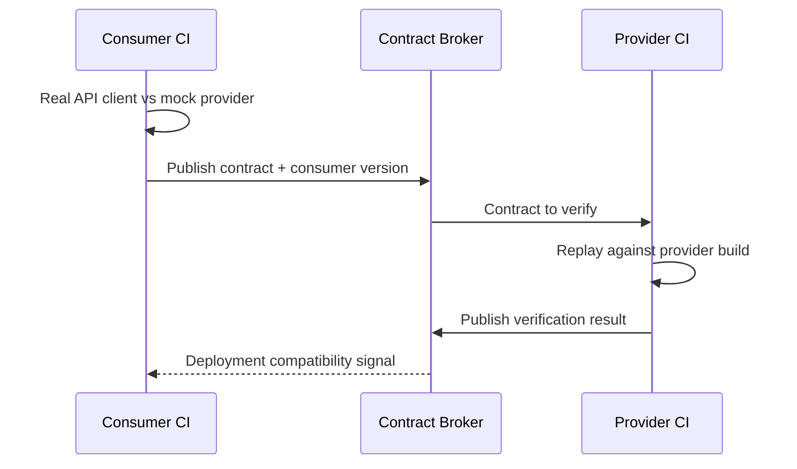

# 2026-09-21 18:00 — Interview Study Packages

README ve yakın `daily/2026-09-21/17-00.md` kontrol edildi. Son turdaki connection-pool/admission-control ve SSR/hydration tekrar edilmedi. Repo çapı aramada filesystem internals'ın inode/page-cache/fsync ve ext4/JBD2 katmanlarının zaten işlendiği görüldü; bu yüzden aynı temel anlatım yinelenmedi. Bu tur, açık kalan compiler/runtime zincirini ELF dynamic linking ile; testing engineering hattını consumer-driven contract testing ile ilerletiyor.

## Paket 1 — Mid → Principal Foundations/Runtime: ELF Dynamic Linking, Relocations, GOT/PLT & ABI
**Süre:** 20–30 dk

### Konu anlatımı
Compile edilmiş bir programın `main()` fonksiyonuna ulaşması yalnız CPU'nun ELF dosyasını çalıştırması değildir. Dinamik bağlı Linux programında ELF'in `.interp` kaydı runtime dynamic linker/loader'ı seçer. Loader gerekli shared object'leri bulur, process address space'e map eder, sembol/relocation işlerini çözer ve kontrolü programa verir.

ELF dynamic segment içindeki `DT_NEEDED`, symbol table ve relocation kayıtları runtime linker'a hangi bağımlılıkların ve adres düzeltmelerinin gerektiğini söyler. Position-independent code gerçek runtime adresini build sırasında bilemez; relocation, load address ile sembol bilgisini birleştirir. GOT (Global Offset Table) kodun runtime adreslerine dolaylı erişmesini, PLT (Procedure Linkage Table) ise özellikle external function çağrılarının dynamic resolver üzerinden bağlanmasını sağlar. Lazy binding'de bazı function relocation'ları ilk çağrıya kadar ertelenebilir; eager binding startup maliyetini öne çeker ama runtime'ın ortasında ilk-call resolution sürprizini azaltır.

### Mental model
Static linker **adresleri mümkün olduğunca önceden bağlayan editör**, dynamic linker ise process başlarken eksik adresleri tamamlayan **son kilometre bağlayıcısıdır**. GOT adres defteri, PLT ise ilk çağrıda doğru numarayı buldurabilen santral gibi düşünülebilir.

### İçeride ne oluyor?
1. Linker executable'a `DT_NEEDED` bağımlılıklarını ve dynamic relocation metadata'sını koyar.
2. Kernel ELF'i ve `.interp` ile belirtilen dynamic linker'ı map eder.
3. Loader library search policy ile gerekli DSO'ları bulur; her object için load bias/address oluşur.
4. Relocation kayıtları runtime adreslerini düzeltir; symbol lookup doğru definition'ı seçer.
5. GOT runtime adreslerini tutabilir; PLT external call'ları GOT/dynamic resolver üzerinden yönlendirebilir.
6. Lazy binding ilk function call'da resolution yapabilir; `-z now`/eager binding bunu startup'a taşır.
7. RELRO relocation sonrası belirli alanları read-only yaparak GOT overwrite gibi saldırı yüzeylerini daraltır.
8. ABI uyumsuzluğu compile başarılı olsa bile runtime'da missing symbol, symbol-version mismatch veya subtle memory-layout hatası üretebilir.

### Yüksek getirili mülakat soruları
1. Compiler, static linker ve dynamic linker görevlerini ayır.
2. ELF'te `DT_NEEDED` ne işe yarar?
3. Mid: relocation neden position-independent code'da gerekir?
4. Senior: GOT ve PLT arasındaki mental model farkı nedir?
5. Senior: lazy binding ile eager binding trade-off'u nedir?
6. Staff: `LD_LIBRARY_PATH`, RUNPATH, soname ve container image packaging hangi failure mode'ları yaratabilir?
7. Principal: ABI compatibility, symbol visibility/versioning, startup latency ve hardening politikasını platform standardı olarak nasıl yönetirsin?

### Seviyeye göre cevap derinliği
- **Junior/Mid:** compile → object → link → load zinciri, shared library, symbol ve relocation.
- **Senior:** PIC, load bias, GOT/PLT, lazy/eager binding, soname ve search path.
- **Staff:** symbol interposition, RELRO, visibility, ABI/versioning, debugging (`readelf`, `objdump`, `ldd`).
- **Principal:** fleet-wide ABI policy, plugin/runtime isolation, startup budget, supply-chain/hardening standardı.

### Kısa alıştırma
Küçük bir C programını shared library ile derle. `readelf -l`, `readelf -d`, `readelf -r` ve `objdump -d` ile `.interp`, `DT_NEEDED`, relocation ve PLT/GOT izlerini bul. Sonra eager binding ile yeniden linkleyip startup/first-call davranışının neyin değişmesini beklediğini yaz.

### Proje fikri
`elf-link-lab`: `libmathdemo.so` + executable üret; soname/version değiştirerek compatible ve incompatible upgrade senaryoları kur. `LD_DEBUG=libs,bindings`, `readelf` ve `objdump` çıktılarından bir startup timeline raporu çıkar.

### Failure modes / trade-off / production bağlantısı
Yanlış RUNPATH veya image layer eksikliği yalnız production'da `cannot open shared object` hatasına dönüşebilir. ABI drift sembol bulunsa bile struct/layout/calling-convention seviyesinde kırılabilir. Aşırı exported symbol interposition ve relocation maliyetini büyütür. Lazy binding startup'ı azaltabilir ama ilk çağrı latency'sini taşır; eager binding erken failure ve daha öngörülebilir runtime sağlayabilir. RELRO/NX/visibility performans ve güvenlik politikasının parçasıdır.

### Kaynaklar
- Linux `ld.so(8)`: https://man7.org/linux/man-pages/man8/ld.so.8.html
- Linux `elf(5)`: https://man7.org/linux/man-pages/man5/elf.5.html
- GNU C Library — Dynamic Linker: https://sourceware.org/glibc/manual/latest/html_node/Dynamic-Linker.html
- GNU Binutils `ld`: https://sourceware.org/binutils/docs/ld/

---

## Paket 2 — Junior → Staff Testing/Backend: Consumer-Driven Contract Testing, Provider Verification & CI Gates
**Süre:** 20–30 dk

### Konu anlatımı
Unit test tek process içindeki davranışı; integration/E2E test ise birden fazla gerçek bileşenin birlikte çalışmasını sınar. Microservice sistemlerinde kritik ara boşluk şudur: **consumer'ın gerçekten kullandığı API davranışı provider'ın yeni sürümünde hâlâ uyumlu mu?** Consumer-driven contract testing (CDC) bu compatibility sınırını executable contract olarak test eder.

Pact modelinde consumer kendi gerçek API client kodunu mock provider'a karşı çalıştırır ve beklediği request/response interaction'larından contract üretir. Provider CI daha sonra bu contract'ı gerçek provider build'ine karşı replay edip doğrular. Contract tüm provider davranışını test etmez; consumer'ın bağımlı olduğu gözlenebilir interface'i korur. Bu nedenle CDC, provider functional testinin veya az sayıdaki E2E testin yerine değil, aradaki compatibility katmanına oturur.

### Mental model
OpenAPI/schema **menüyü**, CDC ise belirli müşterinin gerçekten sipariş ettiği yemeklerin **çalışan kabul sözleşmesini** temsil eder. E2E test restoranın tamamını aynı anda sınarken contract test iki servis arasındaki dikişi daha hızlı ve lokal doğrular.

### İçeride ne oluyor?
1. Consumer test gerçek API client/data-access kodunu kullanır; generic HTTP çağrısını test içinde yeniden yazmak false confidence üretir.
2. Mock provider expected interaction'ı doğrular ve contract artifact üretir.
3. Contract consumer version bilgisiyle broker'a yayınlanır.
4. Provider verifier contract request'lerini provider build'ine replay eder; provider state kontrollü kurulmalıdır.
5. Verification sonucu broker'a geri yazılır; deployment gate consumer/provider version kombinasyonunun uyumluluğunu sorabilir.
6. Matchers gereksiz exact-value coupling'i azaltır; contract yalnız consumer için anlamlı alanları sıkı tutmalıdır.
7. Async/message contract'larında request/response yerine message metadata + payload compatibility sınırı test edilir.

### Yüksek getirili mülakat soruları
1. Contract test unit, integration ve E2E testten nasıl farklıdır?
2. Consumer-driven ne demektir; contract'ı neden yalnız provider yazmamalıdır?
3. Mid: schema validation ile executable contract arasındaki fark nedir?
4. Senior: contract test neden provider'ın business logic doğruluğunu kanıtlamaz?
5. Senior: matcher'ları fazla sıkı veya fazla gevşek yazmanın riski nedir?
6. Staff: onlarca consumer ve bağımsız deploy edilen provider için CI/deployment gate'i nasıl tasarlarsın?
7. Staff: event-driven sistemde backward/forward compatibility ile CDC'yi nasıl birlikte kullanırsın?

### Seviyeye göre cevap derinliği
- **Junior:** consumer/provider, interface compatibility ve breaking change.
- **Mid:** mock provider, generated contract, provider verification, schema vs behavior example.
- **Senior:** provider states, matcher design, async contracts, versioning ve false confidence sınırları.
- **Staff:** broker governance, deployment gate, branch/environment strategy, flaky-state isolation ve organization-wide ownership.

### Kısa alıştırma
`GET /users/{id}` consumer'ı yalnız `id`, `name` ve `status` alanlarını kullanıyor. Provider yeni `email` alanı ekliyor, `status` değerlerinden birini yeniden adlandırıyor ve `name` alanını nullable yapıyor. Hangi değişikliklerin consumer contract'ını kırması gerektiğini ve nedenini yaz.

### Proje fikri
`contract-gate-lab`: iki küçük servis kur. Consumer API client testinden Pact contract üret; provider CI'da verification çalıştır. Bir breaking response değişikliği yapıp gate'in deploy'u durdurduğunu göster; sonra matcher/consumer kodunu kontrollü migrate et.

### Failure modes / trade-off / production bağlantısı
Contract'ı implementation detail'larla doldurmak servisleri gereksiz kilitler. Yalnız happy-path interaction'ları false confidence yaratır. Provider state nondeterministic ise suite flaky olur. CDC authorization, latency, network policy, database migration ve gerçek multi-service workflow'u tek başına doğrulamaz; az ama kritik E2E smoke testleri ve provider functional testleri kalmalıdır. Production'da değer, breaking API değişikliğini staging/E2E kuyruğundan önce ilgili iki takımın CI sınırında yakalamaktır.

### Kaynaklar
- Pact — Introduction / Consumer Driven Contracts: https://docs.pact.io/
- Pact — Consumer Tests: https://docs.pact.io/consumer
- Pact — Provider Verification: https://docs.pact.io/getting_started/verifying_pacts
- Testcontainers — integration-test environments: https://testcontainers.com/
