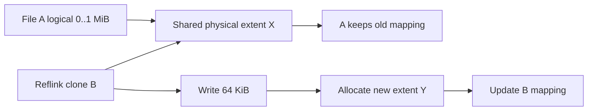
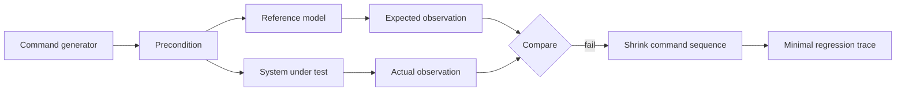

# 2026-09-21 19:00 — Interview Study Packages

README ve yakın `daily/2026-09-21/18-00.md` kontrol edildi. Son turdaki ELF dynamic linking ve consumer-driven contract testing tekrar edilmedi. Repo çapı aramada extents/reflink/CoW filesystem paketi ile model-based/state-machine testing için ayrı çalışma bulunmadı. Bu tur özellikle filesystem internals ve testing engineering boşluklarını bir katman daha kapatıyor.

## Paket 1 — Junior → Staff Foundations/Filesystem: Extents, Sparse Files, Reflink & Copy-on-Write
**Süre:** 20–30 dk

### Konu anlatımı
Bir dosyanın byte aralığını diskteki bloklara eşlemek için her bloğu ayrı ayrı işaretlemek ölçeklenmez. **Extent**, mantıksal dosya offset'inin ardışık bir aralığını fiziksel storage'daki ardışık bir aralıkla tek kayıt olarak temsil eder. Böylece büyük ve ardışık dosyalarda metadata azalır. Linux `FIEMAP`, userspace'e file extent mapping'lerini liste halinde raporlayabilir.

Sparse file'da mantıksal dosya boyutu ile gerçekten ayrılmış fiziksel alan farklıdır: hole bölgeleri okununca sıfır dönebilir ama storage tüketmeyebilir. `fallocate` önceden alan ayırabilir; unwritten extent fiziksel alanı rezerve edilmiş ama henüz kullanıcı verisi yazılmamış aralık olabilir.

**Reflink**, iki dosyanın aynı fiziksel extent'leri paylaşarak hızlı clone edilmesidir. Copy-on-write (CoW) filesystem'de paylaşılan extent'e yazılınca eski blok yerinde overwrite edilmek yerine yeni blok ayrılır, veri yazılır ve metadata yeni extent'e yönlendirilir. Bu snapshot/reflink'i ucuz başlatır; maliyet daha sonra overwrite, fragmentation ve metadata amplification olarak ortaya çıkabilir.

### Mental model
Extent, tek tek ev adresleri yerine **bir sokak aralığını** tek kayıtla tarif etmektir. Reflink ise iki haritanın başlangıçta aynı sokağı göstermesi; taraflardan biri değişiklik yaptığında yalnız değişen bölüm için yeni yol çizmesidir.

### İçeride ne oluyor?
1. File offset önce extent metadata'sında aranır; mapping logical range → physical range üretir.
2. Hole için fiziksel extent olmayabilir; read sıfır üretirken disk alanı tüketilmez.
3. Delayed allocation fiziksel konumu writeback'e kadar erteleyebilir; FIEMAP bunu `DELALLOC/UNKNOWN` olarak gösterebilir.
4. Unwritten extent ayrılmıştır fakat henüz initialized user data içermez; filesystem üzerinden read sıfır döndürür.
5. Reflink clone shared extent/reference metadata kurar; başlangıçta bulk data copy gerekmez.
6. Shared extent'e overwrite CoW tetikler: yeni blok ayır, değişen veriyi yaz, metadata pointer'ını atomik/durable biçimde güncelle.
7. Snapshot/reflink space-efficient başlar; zamanla divergent writes alan tüketir ve fragmentation yaratabilir.
8. Güncel Linux `iomap` katmanı page-cache I/O, direct I/O, writeback ve FIEMAP gibi operasyonlar için logical-range mapping abstraction'ı sağlar.

### Yüksek getirili mülakat soruları
1. Block mapping ile extent mapping arasındaki fark nedir?
2. Sparse file neden `stat` boyutu kadar disk tüketmeyebilir?
3. Mid: unwritten extent ile hole aynı şey midir?
4. Mid: reflink ile hard link arasındaki fark nedir?
5. Senior: CoW overwrite neden write amplification ve fragmentation yaratabilir?
6. Senior: snapshot neden backup ile aynı şey değildir?
7. Staff: database file'ı CoW filesystem üzerinde çalıştırırken latency, fsync ve fragmentation açısından hangi riskleri ölçersin?

### Seviyeye göre cevap derinliği
- **Junior:** logical file size, block, extent, sparse/hole.
- **Mid:** FIEMAP, preallocation, unwritten/delayed allocation, reflink.
- **Senior:** CoW update path, shared extents, fragmentation, checksums/snapshot trade-off'u.
- **Staff:** DB/container/image workloads, backup semantics, observability, allocator/writeback ve tail-latency etkisi.

### Kısa alıştırma
1 GiB sparse file oluştur; yalnız başına ve sonuna küçük veri yaz. `stat`, `du` ve destekleniyorsa `filefrag -v` ile logical size, allocated blocks ve extent sayısını karşılaştır. Reflink destekli filesystem varsa clone oluşturup clone'un küçük bir bölümünü değiştir; space kullanımındaki değişimi tahmin et ve ölç.

### Proje fikri
`extent-lab`: FIEMAP ioctl kullanan küçük bir CLI yaz. File'ın logical/physical extent'lerini, hole/unwritten/shared flag'lerini tablo olarak göster; sequential, sparse ve reflink-clone dosyalarında karşılaştırmalı rapor üret.

### Failure modes / trade-off / production bağlantısı
Reflink/snapshot “bedava kopya” değildir; overwrite ile alan ve metadata büyür. Snapshot aynı failure domain'deyse disk kaybına karşı backup değildir. CoW küçük random overwrite workload'larında fragmentation ve tail latency yaratabilir. FIEMAP sonucu dosya eşzamanlı değişiyorsa anlık snapshot garantisi değildir. VM image, container layer, backup staging ve large-file storage'da extent/reflink davranışı kapasite planını doğrudan etkiler.

### Kaynaklar
- Linux Kernel — FIEMAP: https://docs.kernel.org/filesystems/fiemap.html
- Linux Kernel — Btrfs: https://docs.kernel.org/filesystems/btrfs.html
- Linux Kernel — iomap design: https://docs.kernel.org/filesystems/iomap/design.html
- Linux Kernel — device-mapper snapshots: https://docs.kernel.org/admin-guide/device-mapper/snapshot.html

---

## Paket 2 — Mid → Principal Testing Engineering: Model-Based / State-Machine Testing
**Süre:** 20–30 dk

### Konu anlatımı
Example test tek bir trace'i doğrular; property-based testing geniş input uzayını tarar. Stateful sistemlerde asıl problem yalnız input değil, **operation sequence + state transition** uzayıdır. Model-based testing (MBT), production implementation'dan daha küçük ve anlaşılır bir reference model kurup generated command dizilerinin hem modelde hem system-under-test'te aynı gözlenebilir davranışı üretmesini sınar.

Bir KV store için model basit bir map olabilir. Generator mevcut modele göre `put/get/delete` komutları üretir; precondition geçersiz operasyonları engeller; transition model state'i günceller; postcondition gerçek sistem cevabını model beklentisiyle karşılaştırır. Failure bulunduğunda sequence shrink edilerek yüzlerce adımdan birkaç operation'lık minimal reproducer elde edilebilir.

### Mental model
Implementation gerçek şehir; model küçük ama kuralları açık **metro haritasıdır**. Test tek durağı değil, rastgele yolculuk dizilerini üretir ve gerçek sistemin haritanın izin verdiği transition'lardan sapıp sapmadığını kontrol eder.

### İçeride ne oluyor?
1. Abstract state yalnız correctness için gerekli bilgiyi tutar; production implementation'ı kopyalamaz.
2. Command generator state'e göre operation seçer ve parametre üretir.
3. Preconditions anlamsız/illegal command'ları sınırlar; aşırı precondition coverage'ı öldürebilir.
4. Model transition expected next state'i hesaplar; SUT gerçek operation'ı yürütür.
5. Postcondition response/state observation'ı modelle karşılaştırır.
6. Sequence generator uzun history'ler üretir; shrinker failing history'yi küçültür.
7. Concurrency eklenince sequential model tek başına yetmez; history'nin izin verilen sequential davranışa/consistency modeline uyup uymadığı ayrı oracle gerektirebilir.
8. Minimal failing trace regression suite'e alınır; seed, model version ve environment kaydedilir.

### Yüksek getirili mülakat soruları
1. Model-based testing ile ordinary property-based testing arasındaki fark nedir?
2. Reference model neden production kodunun ikinci kopyası olmamalıdır?
3. Mid: precondition ve postcondition rolleri nedir?
4. Senior: state-space explosion'ı nasıl kontrol edersin?
5. Senior: sequence shrinking neden bug triage için kritiktir?
6. Staff: distributed KV store için sequential modelden concurrent history checking'e nasıl geçersin?
7. Principal: hangi invariants modelde, hangileri production telemetry/canary'de doğrulanmalıdır?

### Seviyeye göre cevap derinliği
- **Junior/Mid:** state, command, transition, expected-vs-actual.
- **Senior:** generator bias, precondition, shrink, model independence, coverage metrics.
- **Staff:** concurrency histories, fault injection, determinism, reproducibility ve consistency oracle.
- **Principal:** risk-based model scope, CI bütçesi, production feedback, organizational ownership ve escaped-defect economics.

### Kısa alıştırma
Capacity=2 olan LRU cache için abstract model tanımla. `put/get/delete` command'larını, pre/postcondition'ları ve eviction invariant'ını yaz. `put(A), put(B), get(A), put(C)` sequence'inde model state'ini adım adım çıkar.

### Proje fikri
`state-machine-kv-test`: in-memory KV store veya küçük cache implementasyonu yaz. Hypothesis RuleBasedStateMachine benzeri bir araçla command sequence üret; bilerek eviction/versioning bug'ı ekle; framework'ün minimal failing trace'e shrink etmesini göster.

### Failure modes / trade-off / production bağlantısı
Model implementation kadar karmaşıksa aynı bug'ı iki kez yazma riski doğar. Generator yalnız happy path seçerse state-space geniş görünür ama kritik transition'lar hiç çalışmaz. Nondeterministic clock/randomness/retry reproducibility'yi bozar. Distributed sistemde tek-node state modelini consistency kanıtı sanmak hatadır. MBT özellikle cache, protocol parser/state machine, storage engine, scheduler, workflow ve API lifecycle testlerinde yüksek getiridir.

### Kaynaklar
- Hypothesis — Stateful testing: https://hypothesis.readthedocs.io/en/latest/stateful.html
- Chalmers — Model-based testing of data types with side effects: https://research.chalmers.se/en/publication/150539
- Chalmers — Testing a database for race conditions with QuickCheck: https://research.chalmers.se/en/publication/150540
