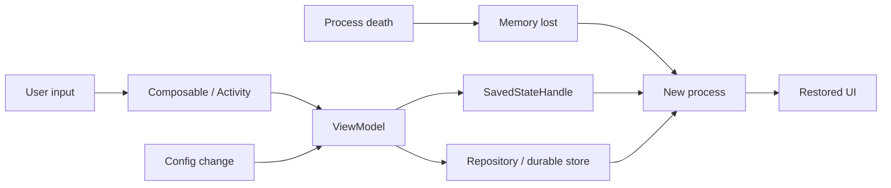
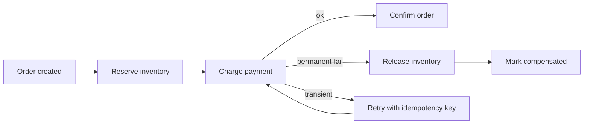

# 2026-09-21 20:00 — Interview Study Packages

README ve yakın `daily/2026-09-21/19-00.md` kontrol edildi. Extents/reflink/CoW filesystem ve model-based testing tekrar edilmedi. Repo çapı aramada Merkle anti-entropy ve PostgreSQL HOT/VACUUM gibi yakın adayların zaten işlendiği görüldü. Bu tur Android state restoration ile distributed workflow compensation boşluklarına odaklanıyor.

## Paket 1 — Junior → Staff Frontend/Mobile: Android Process Death, ViewModel & Saved State
**Süre:** 20–30 dk

### Konu anlatımı
Android'de ekran state'ini korumak için önce iki farklı olayı ayırmak gerekir: **configuration change** ve **process death**. Rotation gibi configuration change varsayılan olarak `Activity` recreation üretir. `ViewModel`, configuration recreation boyunca UI-related state'i taşıyabilir; fakat process sistem tarafından öldürülürse memory'deki ViewModel de gider. Küçük, yeniden oluşturulması pahalı olmayan UI state'i için `SavedStateHandle` / `rememberSaveable`; kalıcı business data için database/file/network-backed repository gerekir.

Bu yüzden state'i tek sepete koymak yerine ömrüne göre sınıflandır: ephemeral widget state, screen UI state, durable domain state. `SavedStateHandle` bir database değildir; process recreation için küçük bir recovery checkpoint'tir.

### Mental model
ViewModel'i **oturumdaki beyaz tahta**, SavedState'i **küçük checkpoint kartı**, durable repository'yi **kayıt sistemi** olarak düşün. Activity yeniden çizildiğinde beyaz tahta kalabilir; process ölünce beyaz tahta gider, checkpoint + kayıt sistemiyle yeniden kurarsın.

### İçeride ne oluyor?
1. Configuration change eski Activity instance'ını yok edip yenisini oluşturabilir.
2. ViewModelStore üzerinden ViewModel yeni Activity/Fragment instance'ına bağlanabilir.
3. Process death bütün in-memory graph'ı yok eder; static/singleton/ViewModel recovery garantisi değildir.
4. Saved state küçük ve serializable recovery state'i saklar; navigation args, query/filter, draft pointer gibi değerler uygundur.
5. Büyük object graph, bitmap veya authoritative business record saved state'e doldurulmamalıdır.
6. Restore sırasında durable source yeniden okunur; saved state yalnız ekranın nereden devam edeceğini söyler.
7. UI state derivable ise mümkün olduğunca source-of-truth'tan tekrar türetilir.

### Yüksek getirili mülakat soruları
1. Configuration change ile process death arasındaki fark nedir?
2. ViewModel hangi problemi çözer, hangisini çözmez?
3. Mid: `SavedStateHandle` ile Room/database kullanım sınırı nedir?
4. Mid: neden büyük object graph'ı saved state'e koymazsın?
5. Senior: offline form draft'ını rotation, process death ve app relaunch karşısında nasıl tasarlarsın?
6. Senior: restore sırasında stale server data ile local UI state çakışırsa source of truth nasıl seçilir?
7. Staff: büyük mobil uygulamada state ownership ve restoration test standardını nasıl kurarsın?

### Seviyeye göre cevap derinliği
- **Junior:** Activity recreation, ViewModel, temel state ayrımı.
- **Mid:** SavedStateHandle/rememberSaveable, durable storage, restore akışı.
- **Senior:** state ownership, offline draft, conflict/staleness, testability.
- **Staff:** navigation/state contract'ları, multi-module standart, observability ve recovery UX.

### Kısa alıştırma
Bir checkout ekranında `selectedAddressId`, `couponText`, `cartItems`, `paymentToken`, `scrollPosition` alanlarını ViewModel, saved state veya durable store arasında sınıflandır. Her seçim için process-death ve security gerekçesi yaz.

### Proje fikri
`process-death-lab`: Compose ile üç ekranlı mini form yaz. ViewModel + SavedStateHandle + Room kullan; developer option'dan background process destruction senaryosunu test et. Restore edilen ve edilmeyen alanları instrumentation test ile doğrula.

### Failure modes / trade-off / production bağlantısı
ViewModel'i persistence sanmak process death'te veri kaybına yol açar. Her şeyi saved state'e koymak serialization/size maliyeti ve hassas veri riski üretir. Her keystroke'u durable DB'ye senkron yazmak I/O ve complexity artırabilir. Production'da restore success, lost-draft complaint, crash/ANR, cold-start latency ve state-deserialization error'ları izlenmelidir.

### Kaynaklar
- Android Developers — Configuration changes: https://developer.android.com/guide/topics/resources/runtime-changes
- Android Developers — ViewModel saved state: https://developer.android.com/topic/libraries/architecture/viewmodel/viewmodel-savedstate
- Android Developers — Processes and threads: https://developer.android.com/guide/components/processes-and-threads

---

## Paket 2 — Mid → Principal Distributed Systems/System Design: Saga Compensation, Orchestration & Choreography
**Süre:** 20–30 dk

### Konu anlatımı
Bir business transaction birden fazla servis ve datastore'a yayıldığında tek ACID transaction sınırı kaybolur. **Saga**, işi local transaction'lara böler; başarılı adımlar forward progress sağlar, daha sonraki bir adım kalıcı biçimde başarısız olursa önceki etkiler domain-specific **compensating actions** ile düzeltilir. Compensation klasik rollback değildir: arada başka işlemler gerçekleşmiş olabilir ve bazı side effect'ler tam tersine çevrilemez.

İki yaygın coordination biçimi vardır. **Choreography**'de servisler event'lere tepki verir; az katılımcıda hafif olabilir ama dependency graph büyüdükçe akışı görmek zorlaşır. **Orchestration**'da coordinator state machine akışı açıkça yönetir; observability ve karmaşık branching kolaylaşır fakat orchestrator kritik bir bileşen olur.

### Mental model
Saga'yı tek büyük `BEGIN/COMMIT` değil, **durable bir business state machine** olarak düşün. Her ok için şu soruyu sor: tekrar çalışırsa ne olur, timeout olursa gerçek sonucu nasıl öğrenirim, ileri mi devam ederim yoksa hangi compensation'ı çalıştırırım?

### İçeride ne oluyor?
1. Her participant kendi local transaction'ını commit eder; global rollback log yoktur.
2. Step sonucu durable workflow state/event olarak kaydedilir.
3. Timeout sonucu `failed` demek değildir; outcome unknown olabilir. Retry idempotent olmalı veya remote status sorgulanmalıdır.
4. Compensation business semantic'tir: `refund`, `releaseReservation`, `cancelShipment`; byte-level undo değildir.
5. Compensation'ın kendisi de fail/retry olabilir, bu yüzden progress durable tutulur.
6. Choreography event graph'ı dağıtır; orchestration transition logic'i coordinator'da görünür kılar.
7. Saga isolation sağlamaz; concurrent saga'lar stale/intermediate state görebilir. Semantic locks, reservations veya version checks gerekebilir.
8. Irreversible side effect'ler mümkünse point-of-no-return sonrasına taşınır; gerektiğinde human intervention yolu tasarlanır.

### Yüksek getirili mülakat soruları
1. Saga ile 2PC arasındaki temel trade-off nedir?
2. Compensation neden database rollback ile aynı değildir?
3. Mid: choreography ve orchestration ne zaman seçilir?
4. Senior: payment timeout'unda retry double-charge yaratmadan nasıl ilerlersin?
5. Senior: compensation da başarısız olursa ne yaparsın?
6. Staff: saga isolation eksikliğini inventory reservation örneğinde nasıl kontrol edersin?
7. Principal: organization çapında workflow platformu için durability, audit, ownership ve operability standardını nasıl belirlersin?

### Seviyeye göre cevap derinliği
- **Junior/Mid:** local transaction, eventual consistency, compensation, idempotency.
- **Senior:** unknown outcome, durable state, retries, semantic locks, irreversible steps.
- **Staff:** orchestration/choreography sınırları, workflow versioning, observability, blast radius.
- **Principal:** platform-vs-library kararı, domain ownership, audit/compliance, operational economics.

### Kısa alıştırma
`CreateOrder -> ReserveInventory -> ChargePayment -> BookShipment` akışında her step için retry policy, idempotency key ve compensation yaz. Payment timeout'unda `failed` varsaymadan karar ağacı oluştur.

### Proje fikri
`saga-lab`: order/inventory/payment için üç küçük servis ve durable orchestrator kur. Her step'e deterministic failure injection ekle; retry, duplicate delivery, compensation ve orchestrator restart senaryolarını test et. Trace üzerinde saga ID ile uçtan uca akışı göster.

### Failure modes / trade-off / production bağlantısı
Duplicate message side effect'i iki kez çalıştırabilir; timeout unknown outcome yaratır; compensation irreversible external effect'i silemeyebilir; choreography dependency spaghetti'ye dönüşebilir; orchestrator SPOF olmamalı ve state'i durable olmalıdır. Production'da stuck saga age, step retry count, compensation rate/failure, manual-intervention queue, end-to-end completion latency ve duplicate suppression metriği izlenmelidir.

### Kaynaklar
- AWS Prescriptive Guidance — Saga patterns: https://docs.aws.amazon.com/prescriptive-guidance/latest/cloud-design-patterns/saga-patterns.html
- AWS Prescriptive Guidance — Saga orchestration: https://docs.aws.amazon.com/prescriptive-guidance/latest/cloud-design-patterns/saga-orchestration.html
- Azure Architecture Center — Compensating Transaction: https://learn.microsoft.com/en-us/azure/architecture/patterns/compensating-transaction
