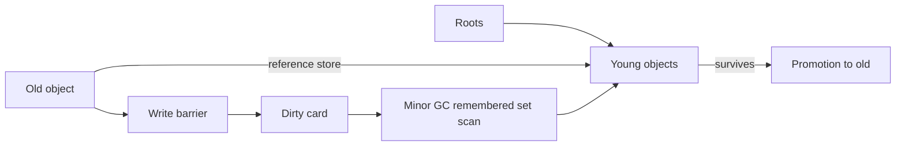
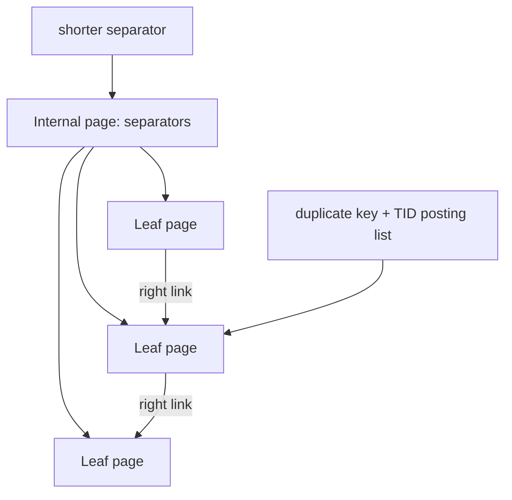

# 2026-09-21 21:00 — Interview Study Packages

README ve yakın `daily/2026-09-21/20-00.md` kontrol edildi. İlk aday olan epoll/io_uring paketi repo çapı ikinci kontrolde mevcut `docs/01-foundations/19-linux-async-io-epoll-io-uring.md` ile çakıştığı için çıkarıldı. Android state restoration ve Saga da tekrar edilmedi. Bu tur runtime zinciri ve B+Tree fiziksel temellerini ilerletiyor.

## Paket 1 — Junior → Principal Foundations/Runtime: Generational GC, Write Barriers, Card Tables & Safepoints
**Süre:** 20–30 dk

### Konu anlatımı
Tracing garbage collector önce hangi object'lerin root'lardan erişilebilir olduğunu belirler; erişilemeyenleri reclaim eder. Generational GC'nin temel sezgisi **generational hypothesis**'tir: çoğu object genç ölür. Heap young/old generation'lara ayrılır; young collection sık ve görece ucuz tutulur, yaşayan object'ler yaşlandıkça promote edilir.

Problem şudur: old generation'daki bir object young object'e pointer tutuyorsa yalnız young heap'i taramak yetmez. Her old object'i her minor GC'de taramak da generation avantajını bozar. **Write barrier**, reference store sırasında bu cross-generation ilişkiyi kaydeder. Yaygın yaklaşım card table'dır: heap küçük card bölgelerine bölünür; old→young pointer yazılan card dirty işaretlenir. Minor GC yalnız roots + dirty cards üzerinden young reachability'yi tamamlar.

### Mental model
Young heap'i sık temizlenen oda, old heap'i arşiv olarak düşün. Write barrier arşivden genç odaya açılan her yeni kapıyı küçük bir karta not eder. Temizlik ekibi tüm arşivi dolaşmaz; yalnız not edilen bölgeleri kontrol eder.

### İçeride ne oluyor?
1. Allocation çoğu runtime'da bump-pointer/TLAB benzeri hızlı path ile young generation'da başlar.
2. Minor collection roots ve remembered set üzerinden young live set'i bulur.
3. Surviving object'ler kopyalanabilir veya yaş/policy eşiğine göre old generation'a promote edilir.
4. Reference store write barrier'ı card/remembered-set metadata'sını günceller; barrier her pointer write'ın hot path maliyetine eklenebilir.
5. Card çok büyükse gereksiz tarama artar; çok küçükse metadata/barrier overhead artar.
6. Safepoint, runtime'ın thread state'ini GC/deoptimization gibi global operasyonlar için güvenli biçimde gözlemleyebildiği koordinasyon noktasıdır; her collector tamamen stop-the-world değildir ama bazı fazlar coordination ister.
7. Allocation rate, survivor rate, promotion ve old-gen pressure birlikte tail latency'yi belirler.

### Yüksek getirili mülakat soruları
1. Mark-sweep ile copying collector arasındaki temel fark nedir?
2. Generational hypothesis ne sağlar?
3. Minor GC neden bütün old generation'ı taramaz?
4. Mid: write barrier ve remembered set neyi çözer?
5. Senior: card size trade-off'u nedir?
6. Staff: yüksek allocation-rate servisinde throughput ile pause-time arasında nasıl tuning yaparsın?
7. Principal: runtime/collector seçimini p99 latency, memory headroom ve CPU economics ile nasıl bağlarsın?

### Seviyeye göre cevap derinliği
- **Junior:** reachability, roots, young/old generation, pause.
- **Mid:** promotion, write barrier, remembered set/card table.
- **Senior:** allocation fast path, fragmentation, concurrent phases, safepoint ve tail latency.
- **Staff/Principal:** workload profiling, collector/tuning seçimi, CPU-memory-latency economics ve operability.

### Kısa alıştırma
Old object `A`, young `B`'yi referanslasın. Root yalnız `A`'ya erişsin. Minor GC'nin write barrier/remembered set olmadan `B`'yi neden yanlışlıkla reclaim edebileceğini adım adım çiz; ardından dirty-card çözümünü ekle.

### Proje fikri
`mini-gen-gc`: object graph simülatörü yaz. Young/old generation, promotion threshold ve card table ekle; workload'larda scanned-object sayısı, promoted bytes ve pause proxy metriğini karşılaştır.

### Failure modes / trade-off / production bağlantısı
Eksik barrier memory corruption/liveness bug'ı yaratabilir; aşırı promotion old-gen pressure ve uzun collection üretir; büyük heap daha seyrek GC sağlarken worst-case scan/recovery süresini büyütebilir; allocation benchmark'ı tek başına p99 davranışını göstermez. Production'da allocation rate, live-set, promotion, GC CPU, pause histogramı ve memory headroom birlikte izlenmelidir.

### Kaynaklar
- OpenJDK HotSpot GC tuning guide: https://docs.oracle.com/en/java/javase/25/gctuning/
- OpenJDK HotSpot source: https://github.com/openjdk/jdk/tree/master/src/hotspot/share/gc
- V8 garbage collection overview: https://v8.dev/blog/trash-talk

---

## Paket 2 — Junior → Staff Databases: B+Tree Fanout, Separator Keys, Suffix Truncation & Deduplication
**Süre:** 20–30 dk

### Konu anlatımı
B+Tree'nin yüksek fanout'u page tabanlı indekslerin ana avantajıdır: internal node daha çok child pointer taşıdıkça ağaç yüksekliği küçülür. Internal key'lerin görevi gerçek row key'ini yeniden saklamak değil, komşu child key-range'lerini ayıracak **separator** sağlamaktır. Bu yüzden implementation, doğru ayrımı koruduğu sürece separator suffix'lerini kısaltabilir.

PostgreSQL B-tree'de suffix truncation parent separator tuple'ından gereksiz suffix attribute'larını kaldırabilir. Leaf seviyesinde duplicate key'ler posting-list tuple olarak deduplicate edilebilir. İki teknik farklı problemi çözer ama aynı fiziksel hedefe hizmet eder: page başına daha fazla yararlı bilgi, daha az split/bloat ve daha iyi cache/I/O davranışı.

### Mental model
Internal key'i adresin tamamı değil, iki sokağı ayırmaya yetecek **yön tabelası** olarak düşün. Leaf dedup ise aynı apartman adını her daire için yeniden yazmak yerine adı bir kez, TID listesini yanında tutmaktır.

### İçeride ne oluyor?
1. Page size sabitken entry küçüldükçe fanout artar; yaklaşık yükseklik `log_fanout(N)` ile azalır.
2. Leaf page index tuple/TID ilişkisini; internal page child downlink ve separator taşır.
3. Split parent'a yeni separator ekler; parent doluysa split yukarı cascade edebilir.
4. Separator'ın composite key'in tüm suffix'lerini taşıması gerekmeyebilir; range'i ayırmaya yeten prefix korunur.
5. PostgreSQL dedup aynı key'e ait leaf tuple'larını tek key + sıralı TID posting list biçiminde temsil edebilir.
6. Dedup duplicate-heavy index boyutunu ve split baskısını azaltabilir; her datatype/collation/index biçiminde güvenli değildir.
7. `INCLUDE` index'lerde dedup kullanılamaması gibi implementation kısıtları physical design kararını etkiler.

### Yüksek getirili mülakat soruları
1. B+Tree neden binary tree yerine yüksek fanout kullanır?
2. Internal separator key ile leaf key'in görevi nasıl farklıdır?
3. Composite key `(tenant_id, created_at, id)` için separator neden tüm suffix'i taşımak zorunda olmayabilir?
4. Mid: fanout artışı tree height ve page read sayısını nasıl etkiler?
5. Senior: duplicate-heavy workload'da posting-list dedup ne kazandırır?
6. Staff: key width, INCLUDE columns, fillfactor, split rate ve cache residency arasında nasıl trade-off kurarsın?
7. Staff: MVCC version churn ile physical duplicate index tuples arasındaki ilişki nedir?

### Seviyeye göre cevap derinliği
- **Junior:** page, leaf/internal node, fanout, O(log N).
- **Mid:** separator/downlink, split propagation, key width etkisi.
- **Senior:** suffix truncation, posting-list dedup, MVCC churn, cache/I/O.
- **Staff:** workload-aware physical index design, bloat/split observability, write/read amplification.

### Kısa alıştırma
8 KiB page varsay. Internal entry 64 byte iken ve 32 byte'a indiğinde kaba fanout'u hesapla; 100 milyon key için `ceil(log_fanout(N))` ile yaklaşık seviyeyi karşılaştır. Header/fragmentation'ı ihmal ettiğini belirt.

### Proje fikri
`btree-page-lab`: sabit boyutlu page üzerinde internal/leaf node simülatörü yaz. Configurable key width, separator truncation ve duplicate posting-list ile fanout, split count ve tree height karşılaştır.

### Failure modes / trade-off / production bağlantısı
Geniş composite/include key'ler fanout'u düşürür; monoton insert hot rightmost page yaratabilir; duplicate-heavy index bloat yapabilir; dedup CPU işi ekler ve semantik güvenlik koşullarına bağlıdır. Production'da index size, split/bloat belirtileri, cache hit, read/write latency ve VACUUM davranışı birlikte değerlendirilmelidir.

### Kaynaklar
- PostgreSQL 18 B-Tree Indexes: https://www.postgresql.org/docs/18/btree.html
- PostgreSQL page inspection: https://www.postgresql.org/docs/18/pageinspect.html
- PostgreSQL source nbtree README: https://github.com/postgres/postgres/blob/master/src/backend/access/nbtree/README
