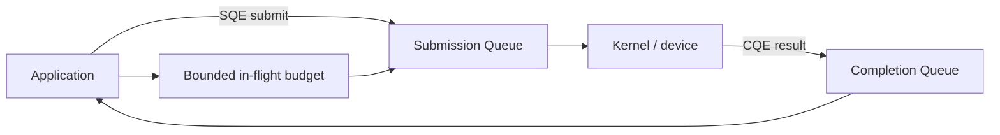
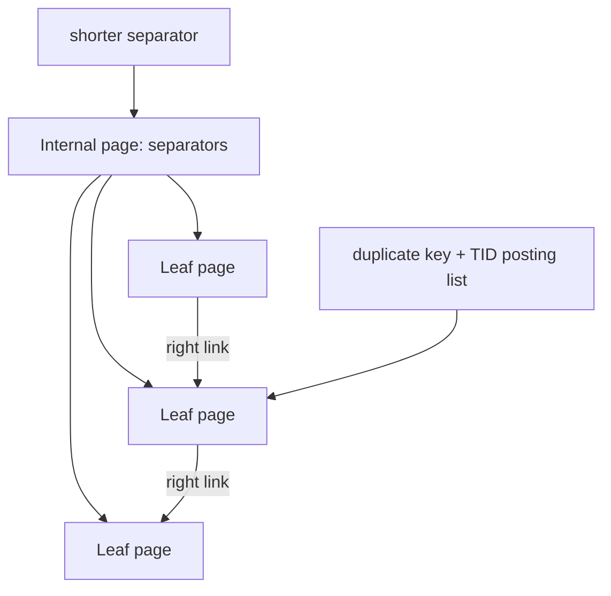

# 2026-09-21 21:00 — Interview Study Packages

README ve yakın `daily/2026-09-21/20-00.md` kontrol edildi. Android state restoration ve Saga tekrar edilmedi. Repo aramasında `io_uring` readiness/completion modeli ve B+Tree separator/suffix truncation için ayrı paket bulunmadı. Bu tur yaklaşık %70 temel boşluk, %20 mülakat pratiği, %10 güncel Linux/PostgreSQL ayrıntısı dengesinde ilerliyor.

## Paket 1 — Mid → Principal Foundations/Backend: epoll, io_uring, Readiness vs Completion
**Süre:** 20–30 dk

### Konu anlatımı
Blocking I/O modelinde thread bir syscall sırasında bekleyebilir. `epoll` gibi readiness API'lerinde kernel, descriptor'ın bir operasyonu bloklamadan ilerletebileceğine dair readiness bildirir; uygulama ardından `read/write/accept` çağrısını yapar. Completion modelinde ise uygulama işi önce submit eder, daha sonra tamamlanmış operasyonun sonucunu completion kanalından alır.

Linux `io_uring`, userspace ile kernel arasında submission queue (SQ) ve completion queue (CQ) ring'leri kullanır. Uygulama SQE hazırlar, kernel operasyonu yürütür, CQE sonuç taşır. Bu yalnız 'daha hızlı async I/O' sloganı değildir: batching, syscall amortization, queue depth, backpressure, cancellation ve buffer lifetime tasarımını değiştirir.

### Mental model
`epoll`: **kapı açıldı, şimdi işlemi dene**. `io_uring`: **iş emrini kuyruğa bıraktım, sonucu completion kuyruğundan alacağım**. İki modelde de limitsiz concurrency yoktur; queue depth bir resource budget'tır.

### İçeride ne oluyor?
1. `epoll` interest set üzerinde readiness event'leri döndürür; edge-triggered kullanımda descriptor genellikle `EAGAIN`'e kadar drain edilir.
2. `io_uring` SQE opcode, fd, buffer ve operation metadata taşır; CQE result/error döndürür.
3. Ring yapısı submission/completion'ı batch etmeye ve bazı syscall geçişlerini amortize etmeye izin verir.
4. In-flight operation arttıkça throughput artabilir; fakat memory pinning, queueing latency ve cancellation maliyeti de artar.
5. Buffer veya request context completion gelmeden reuse/free edilirse correctness bug oluşur.
6. Timeout/cancellation yarışlarında 'cancel istedim' ile 'operation kesinlikle side effect üretmedi' aynı şey değildir.
7. Production event loop'ta bounded queue, deadline ve overload policy gerekir.

### Yüksek getirili mülakat soruları
1. Blocking, readiness ve completion I/O modellerini karşılaştır.
2. `epoll` edge-triggered kullanımında neden `EAGAIN`'e kadar okuma yapılır?
3. `io_uring` SQ ve CQ neyi temsil eder?
4. Mid: batching syscall overhead'i nasıl azaltabilir?
5. Senior: queue depth'i limitsiz artırmak neden throughput'u sonsuza kadar artırmaz?
6. Staff: cancellation, timeout ve buffer lifetime için nasıl ownership modeli kurarsın?
7. Principal: yüksek-QPS proxy'de epoll'dan io_uring'e geçişi hangi benchmark ve failure metric'leriyle değerlendirirsin?

### Seviyeye göre cevap derinliği
- **Junior/Mid:** blocking vs nonblocking, readiness, SQ/CQ, completion.
- **Senior:** batching, queue depth, buffer lifetime, cancellation race, backpressure.
- **Staff/Principal:** kernel/device queueing, tail latency, observability, fallback/compatibility ve migration economics.

### Kısa alıştırma
10k eşzamanlı connection alan proxy için iki pseudocode event loop çiz: biri `epoll`, biri completion queue modeli. Her birinde bounded in-flight limit ve timeout noktasını işaretle.

### Proje fikri
`io-model-lab`: aynı echo/file server'ı blocking-thread-pool, epoll ve io_uring varyantlarıyla kur. Throughput yanında p50/p99 latency, CPU/syscall sayısı ve in-flight queue depth ölç.

### Failure modes / trade-off / production bağlantısı
Unbounded submission memory/latency patlaması yaratır; completion gelmeden buffer reuse corruption üretir; cancellation sonucu yanlış yorumlanırsa duplicate side effect oluşabilir; microbenchmark kazancı gerçek workload'da device/network bottleneck yüzünden kaybolabilir. Production'da queue depth, CQ lag, cancellation/timeout rate, syscall rate, CPU ve p99 latency birlikte izlenmelidir.

### Kaynaklar
- Linux kernel io_uring API: https://kernel.org/doc/html/latest/userspace-api/io_uring.html
- io_uring man pages: https://man7.org/linux/man-pages/man7/io_uring.7.html
- epoll(7): https://man7.org/linux/man-pages/man7/epoll.7.html

---

## Paket 2 — Junior → Staff Databases: B+Tree Fanout, Separator Keys, Suffix Truncation & Deduplication
**Süre:** 20–30 dk

### Konu anlatımı
B+Tree'nin yüksek fanout'u disk/page tabanlı indekslerin ana avantajıdır: internal node mümkün olduğunca çok child pointer taşırsa ağaç yüksekliği küçülür. Internal key'lerin görevi çoğu zaman gerçek row key'i saklamak değil, komşu child key-range'lerini **ayırt edecek separator** sağlamaktır. Bu yüzden implementation, separator'ı doğru ayrımı koruduğu sürece kısaltabilir.

PostgreSQL B-tree'de suffix truncation parent'a taşınan separator tuple'dan gereksiz suffix attribute'larını kaldırabilir. Leaf seviyesinde ise duplicate key'ler posting-list tuple olarak deduplicate edilebilir. İki teknik farklı problemi çözer ama aynı fiziksel hedefe hizmet eder: page başına daha fazla yararlı routing/data bilgisi, daha az split/bloat ve daha iyi cache/I/O davranışı.

### Mental model
Internal key'i **adresin tamamı** değil, iki sokağı ayırmaya yetecek **yön tabelası** olarak düşün. Leaf dedup ise aynı apartman adını her daire için yeniden yazmak yerine apartman adını bir kez, daire/TID listesini yanında tutmaktır.

### İçeride ne oluyor?
1. Page size sabitken entry küçüldükçe fanout artar; yaklaşık yükseklik `log_fanout(N)` ile azalır.
2. Leaf page gerçek index tuple/TID ilişkisini taşırken internal page child'a downlink ve separator taşır.
3. Split yeni page ve parent separator gerektirir; parent da doluysa split yukarı cascade edebilir.
4. Separator'ın tüm composite key suffix'lerini taşıması gerekmeyebilir; range'i ayırmaya yeten prefix korunur.
5. PostgreSQL dedup aynı key'e ait birden fazla leaf tuple'ı tek key + sıralı TID posting list biçiminde temsil edebilir.
6. Dedup page split'i geciktirebilir ve duplicate-heavy index boyutunu düşürebilir; her datatype/collation/index biçiminde güvenli değildir.
7. `INCLUDE` index'lerde dedup kullanılamaması gibi implementation kısıtları physical design kararını etkiler.

### Yüksek getirili mülakat soruları
1. B+Tree neden binary tree yerine yüksek fanout kullanır?
2. Internal separator key ile leaf key'in görevi nasıl farklıdır?
3. Composite key `(tenant_id, created_at, id)` için separator neden tüm suffix'i taşımak zorunda olmayabilir?
4. Mid: fanout artışı tree height ve page read sayısını nasıl etkiler?
5. Senior: duplicate-heavy workload'da posting-list dedup ne kazandırır, ne zaman kazandırmaz?
6. Staff: key width, INCLUDE columns, fillfactor, split rate ve cache residency arasında nasıl trade-off kurarsın?
7. Staff: MVCC version churn ile physical duplicate index tuples arasındaki ilişki nedir?

### Seviyeye göre cevap derinliği
- **Junior:** page, leaf/internal node, fanout, O(log N).
- **Mid:** separator/downlink, split propagation, key width etkisi.
- **Senior:** suffix truncation, posting-list dedup, MVCC churn, cache/I/O.
- **Staff:** workload-aware physical index design, bloat/split observability, write/read amplification.

### Kısa alıştırma
8 KiB page varsay. Internal entry 64 byte iken ve 32 byte'a indiğinde kaba fanout'u hesapla; 100 milyon key için `ceil(log_fanout(N))` ile yaklaşık seviyeyi karşılaştır. Header/fragmentation'ı ihmal ettiğini belirt.

### Proje fikri
`btree-page-lab`: sabit boyutlu page üzerinde internal/leaf node simülatörü yaz. Configurable key width, separator truncation ve duplicate posting-list seçeneğiyle fanout, split count ve tree height karşılaştır.

### Failure modes / trade-off / production bağlantısı
Geniş composite/include key'ler fanout'u düşürür; monoton insert hot rightmost page yaratabilir; duplicate-heavy index bloat yapabilir; dedup CPU işi ekler ve semantik güvenlik koşullarına bağlıdır. Production'da index size, page split/bloat belirtileri, cache hit, read/write latency ve VACUUM davranışı birlikte değerlendirilmelidir.

### Kaynaklar
- PostgreSQL 18 B-Tree Indexes: https://www.postgresql.org/docs/18/btree.html
- PostgreSQL page inspection: https://www.postgresql.org/docs/18/pageinspect.html
- PostgreSQL source nbtree README: https://github.com/postgres/postgres/blob/master/src/backend/access/nbtree/README
