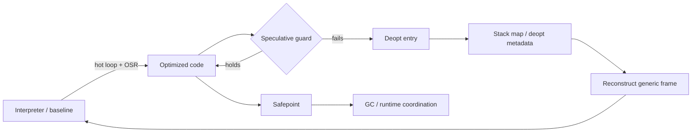
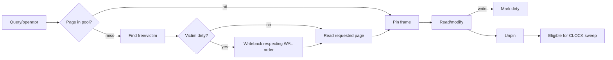

# 2026-09-21 22:00 — Interview Study Packages

README ve yakın `daily/2026-09-21/21-00.md` kontrol edildi. Generational GC/write barriers ile B+Tree physical-layout konuları tekrar edilmedi. Ek repo taramasında SPIFFE/SVID/federation içeriğinin zaten canonical ve eski daily notlarında bulunduğu görüldüğü için ilk 22:00 taslağındaki workload-identity paketi çıkarıldı. Repo aramasında `deoptimization OSR safepoint stack map` ve `buffer pool eviction CLOCK dirty page pin` için ayrı paket bulunmadı. Bu tur compiler/runtime zincirini speculative optimization'ın geri dönüş mekanizmasına, database internals hattını ise B+Tree'nin altında çalışan buffer-manager katmanına ilerletiyor.

## Paket 1 — Mid → Principal Foundations/Runtime: JIT Deoptimization, OSR, Safepoints & Stack Maps
**Süre:** 20–30 dk

### Konu anlatımı
JIT compiler sıcak kodu optimize ederken runtime'da gözlediği varsayımları kullanabilir: bir call site'ın çoğunlukla tek tipe gitmesi, object shape'in sabit kalması veya belirli branch'in baskın olması gibi. Varsayım yanlış hale geldiğinde **deoptimization (deopt)** optimize edilmiş machine-code frame'ini daha genel execution state'e geri dönüştürerek correctness'i korur.

Ters yöndeki geçiş **on-stack replacement (OSR)**'dır: uzun süren loop bitmeden interpreter/baseline frame'i optimize edilmiş koda geçirilebilir. Her iki yönde runtime'ın logical execution state'i yeniden kurabilmesi gerekir. Compiler bu nedenle belirli instruction address'lerde runtime için gerekli live value'ların register, stack slot veya constant konumlarını bildiren **stack map/deopt metadata** üretir.

**Safepoint**, GC/deoptimization gibi runtime koordinasyonu için execution state'in güvenilir biçimde gözlenebildiği noktadır. Safepoint'i “her thread her an durdurulabilir” diye düşünmek yanlıştır; compiler ve runtime gerekli metadata ve invariants'ın geçerli olduğu noktaları birlikte tanımlar.

### Mental model
Optimize edilmiş frame'i sıkıştırılmış seyahat çantası gibi düşün: bazı logical değerler eliminate edilmiş veya register'lara dağılmıştır. Deopt metadata, gerektiğinde kaynak/bytecode düzeyindeki state'i yeniden kurma manifestosudur. OSR ise yolculuk devam ederken daha hızlı araca geçmektir.

### İçeride ne oluyor?
1. Profiling counters hot function/loop ve type feedback toplar.
2. Optimizer speculative assumption'ları guard'larla korur.
3. Guard başarısız olursa deopt entry runtime'a kontrol verir.
4. Stack map belirli instruction address için live value location'larını register/stack/constant olarak kaydeder.
5. Runtime metadata ile interpreter/baseline frame veya başka continuation oluşturur.
6. OSR entry, loop ortasındaki mevcut state'i optimized representation'a map eder; normal function-entry compilation'dan daha zordur.
7. Safepoint yoğunluğu responsiveness'i artırabilir fakat code-size/check overhead yaratır; çok seyrek safepoint uzun handshake latency doğurabilir.
8. Inlining/escape analysis ile optimize-away edilen logical state deopt sırasında recoverable kalmalıdır.

### Yüksek getirili mülakat soruları
1. JIT neden speculative optimization yapar?
2. Deoptimization exception handling ile aynı şey midir?
3. Stack map neyi kaydeder; debug info'dan nasıl farklıdır?
4. Senior: escape analysis veya inlining deopt reconstruction'ı neden zorlaştırır?
5. Senior: OSR neden yalnız function'ı yeniden compile etmek değildir?
6. Staff: safepoint placement throughput ile worst-case pause/handshake latency arasında nasıl trade-off yaratır?
7. Principal: deopt storm'u production telemetry'de nasıl teşhis eder ve tiering policy'ye nasıl bağlarsın?

### Seviyeye göre cevap derinliği
- **Mid:** profiling, guard, deopt ve OSR kavramlarını doğru bağlar.
- **Senior:** live values, frame reconstruction, stack maps ve optimization etkisini açıklar.
- **Staff:** safepoint density, code size, latency, uncommon traps ve observability trade-off'larını tartışır.
- **Principal:** workload economics, tiering policy, rollout riski ve runtime/compiler ownership sınırlarını tasarlar.

### Kısa alıştırma
`sum(objects)` loop'unda optimizer bütün elemanların aynı shape'e sahip olduğunu varsaysın. Loop ortasında farklı shape gelsin. Guard failure → deopt → frame reconstruction akışında korunması gereken `i`, `sum`, current object ve continuation değerlerini çiz.

### Proje fikri
`toy-tiered-vm`: küçük bytecode interpreter yaz; loop counter ile hot loop tespit et. Integer-only fast path ve type guard ekle. Guard fail olduğunda bytecode PC + locals ile interpreter'a dön; OSR/deopt sayılarını ölç.

### Failure modes / trade-off / production bağlantısı
Aşırı speculation deopt storm ve CPU jitter yaratabilir; eksik metadata correctness bug'ına dönüşür; fazla safepoint/check code-size ve throughput maliyeti getirir; profiling feedback workload değişimiyle bayatlayabilir. Production'da compilation CPU, code-cache pressure, deopt reason/rate, OSR count, safepoint/handshake latency ve p99 birlikte izlenmelidir.

### Kaynaklar
- LLVM Stack Maps & Patch Points: https://llvm.org/docs/StackMaps.html
- LLVM GC Safepoints / Statepoints: https://llvm.org/docs/Statepoints.html
- V8 TurboFan JIT: https://v8.dev/docs/turbofan

---

## Paket 2 — Junior → Staff Databases: Buffer Pool, Pinning, Dirty Pages & CLOCK-Sweep
**Süre:** 20–30 dk

### Konu anlatımı
B+Tree bir page'in **hangisi** olduğunu bulur; buffer manager ise page'in RAM'de olup olmadığını ve RAM doluysa hangi frame'in çıkarılacağını yönetir. Database buffer pool, storage page'lerinin kontrollü RAM cache'idir. Buffer hit ise query RAM'den devam eder; miss ise boş frame bulunur veya eviction adayı seçilip page storage'dan okunur.

Frame aktif operation tarafından kullanılıyorsa **pin/reference** eviction'ı engeller. Page değiştirildiğinde **dirty** olur; dirty frame yeniden kullanılmadan önce güvenli writeback gerekir. WAL kullanan sistemlerde data page'in kalıcılaştırılması log ordering invariant'ını ihlal edemez.

PostgreSQL'in `pg_buffercache` görünümü `usagecount`, `isdirty` ve `pinning_backends` gibi alanlar sunar. `usagecount` CLOCK-sweep access count'tur: exact LRU'nun pahalı global ordering'i yerine yaklaşık kullanım bilgisiyle replacement kararı verilebilir.

### Mental model
Buffer pool sınırlı masalı arşivdir. Page raftan masaya gelir. Çalışan page'i kullanırken pin koyar; masa boşaltılamaz. Değişiklik varsa dirty etiketi vardır ve page doğrudan atılamaz. CLOCK eli yakın zamanda değer görmeyen, pinli olmayan masaları victim adayı yapar.

### İçeride ne oluyor?
1. Page identifier buffer table/hash lookup ile frame'e çevrilir.
2. Hit durumunda pin/refcount artırılır; concurrent eviction önlenir.
3. Miss durumunda free frame veya replacement victim gerekir.
4. CLOCK benzeri algoritma usage/recent-reference sinyalini azaltarak aday arar; pinned frame atlanır.
5. Dirty victim gerekiyorsa writeback latency foreground query'ye sızabilir; background writer/checkpointer bunu yumuşatır.
6. WAL sisteminde ilgili log güvenli olmadan data page'in ilerlemesi recovery invariant'ını bozabilir.
7. Sequential scan cache'i kirletebilir; scan/ring stratejileri hot OLTP pages'i korumaya yardım eder.
8. Database buffer pool ile OS page cache birlikte kullanıldığında double-caching ve memory-accounting trade-off'u doğabilir.

### Yüksek getirili mülakat soruları
1. Buffer pool neden B+Tree'den ayrı katmandır?
2. Pin ile dirty flag arasındaki fark nedir?
3. Neden pinned page eviction edilemez?
4. Mid: CLOCK neden exact LRU'ya tercih edilebilir?
5. Senior: dirty-page eviction p99 latency'yi nasıl yükseltir?
6. Senior: sequential scan cache pollution yaratırsa ne yaparsın?
7. Staff: shared buffer budget, OS cache, checkpoint/writeback ve working-set arasında nasıl tuning modeli kurarsın?

### Seviyeye göre cevap derinliği
- **Junior:** page/frame, hit/miss, dirty ve eviction.
- **Mid:** pin/refcount, CLOCK/LRU farkı, background writeback.
- **Senior:** WAL-before-data ordering, checkpoint pressure, cache pollution ve concurrency.
- **Staff:** working-set estimation, memory budget, NUMA/I/O topology, tail latency ve observability.

### Kısa alıştırma
4 frame'lik pool için `(page, usagecount, pinned, dirty)` değerleri üret. CLOCK eli gezerken atlanan frame'leri, düşürülen usagecount'ları ve ilk güvenli victim'i elle bul. Victim dirty olduğunda eklenen I/O yolunu ayrıca göster.

### Proje fikri
`buffer-pool-lab`: 64–256 frame'lik page-cache simülatörü yaz. Exact LRU, CLOCK ve scan-resistant basit ring stratejilerini Zipf + sequential-scan workload'larında hit ratio, eviction count, dirty writeback ve p95 miss cost ile karşılaştır.

### Failure modes / trade-off / production bağlantısı
Working set pool'dan büyükse thrashing oluşur; uzun pin'ler eviction freedom'ı azaltır; checkpoint/dirty burst write-latency spike yaratır; devasa pool OS memory pressure veya NUMA maliyetini büyütebilir; yalnız hit ratio writeback ve tail latency'yi gizler. Production'da cache hit, usage-count dağılımı, dirty/pinned buffers, read/write IOPS, checkpoint write volume ve query latency birlikte incelenmelidir.

### Kaynaklar
- PostgreSQL 18 `pg_buffercache`: https://www.postgresql.org/docs/18/pgbuffercache.html
- PostgreSQL 18 Resource Consumption: https://www.postgresql.org/docs/18/runtime-config-resource.html
- PostgreSQL source buffer manager: https://github.com/postgres/postgres/tree/master/src/backend/storage/buffer
