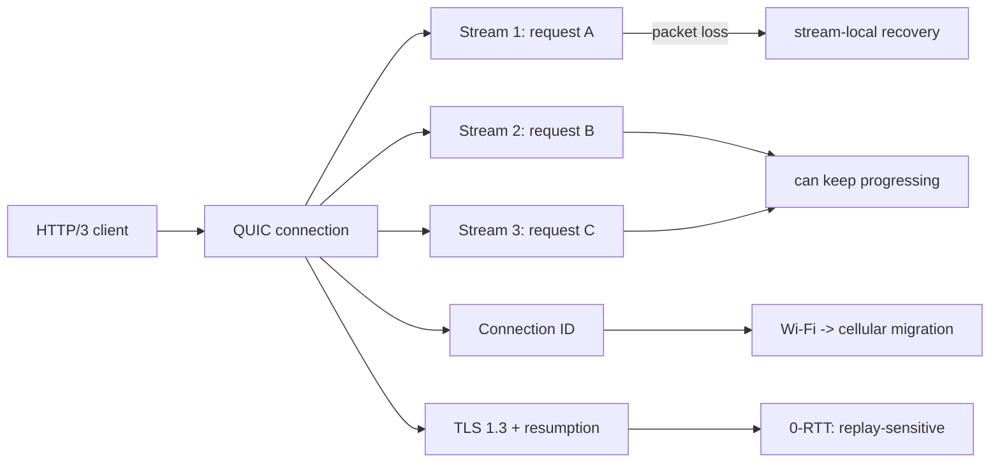
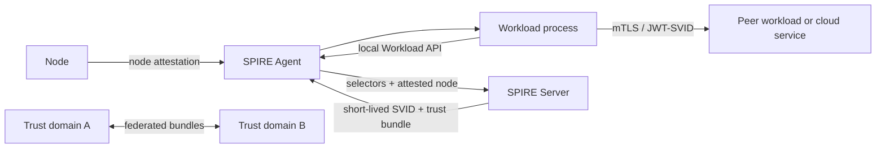

# 2026-09-21 22:00 — Interview Study Packages

README ve yakın `daily/2026-09-21/21-00.md` kontrol edildi. Generational GC/write barriers ile B+Tree physical-layout konuları tekrar edilmedi. Repo çapı kontrolde QUIC/HTTP/3 ve SPIFFE/SPIRE workload identity için doğrudan eşleşme bulunmadı. Bu tur networking ile cybersecurity/cloud identity eksenlerini ilerletiyor.

## Paket 1 — Junior → Principal Networking/Backend: QUIC, HTTP/3, Stream Independence, 0-RTT & Connection Migration
**Süre:** 20–30 dk

### Konu anlatımı
HTTP/2 tek TCP connection üzerinde çok sayıda logical stream multiplex eder; fakat TCP byte stream'in packet loss recovery'si stream sınırlarını bilmez. Kaybolan bir TCP segmenti yeniden gelene kadar daha sonra ulaşmış bytes uygulamaya teslim edilemediği için bağımsız HTTP/2 stream'leri transport katmanında birlikte stall olabilir.

QUIC bu problemi UDP üzerinde kendi reliable transport katmanını kurarak farklı ele alır. Reliability ve ordering connection çapında tek byte stream yerine **QUIC stream** düzeyinde sağlanır. Bir stream'deki kayıp, başka stream'in bytes'ının uygulamaya teslimini zorunlu olarak durdurmaz. HTTP/3, HTTP semantics'i QUIC stream'lerine map eder; her request/response exchange tipik olarak kendi bidirectional request stream'ini kullanır.

QUIC ayrıca TLS 1.3 handshake'i transport ile bütünleştirir, connection ID ile endpoint IP/port değişiminden sonra connection migration'a izin verebilir ve resumption sırasında 0-RTT application data taşıyabilir. Fakat 0-RTT replay riski taşır: düşük latency, application semantics açısından ücretsiz değildir.

### Mental model
TCP+HTTP/2'yi tek ray üzerinde birden fazla vagon gibi düşün: raydaki engel arkadaki bağımsız vagonları da bekletebilir. QUIC'te logical akışların recovery bağımsızlığı daha yüksektir. Connection ID ise oturumun yalnız IP:port çiftine yapışmasını engelleyen taşıma kimliği gibi davranır.

### İçeride ne oluyor?
1. QUIC packet'ları UDP datagramları içinde taşınır; reliability, ACK/loss detection ve congestion control QUIC tarafından uygulanır.
2. Stream'lerin kendi offset alanları vardır; receiver bir stream'in contiguous bytes'ını başka stream'deki eksikten bağımsız teslim edebilir.
3. HTTP/3 HEADERS/DATA frame'leri QUIC stream'lerinde taşınır. HTTP/2'deki bazı flow-control/framing görevleri transporta devredilir.
4. Header compression için HPACK yerine QPACK kullanılır. QPACK dynamic-table dependency'lerini yönetirken compression efficiency ile blocking riskini dengeler.
5. Connection migration'da yeni path reachability path validation ile doğrulanır; yeni path'in RTT/congestion özellikleri eski path ile aynı varsayılmaz.
6. 0-RTT önceki session state'ini kullanarak application data'yı handshake tamamlanmadan gönderebilir; replay-safe olmayan mutation'lar için dikkat gerekir.
7. UDP blocking, middlebox davranışı veya path MTU sorunları nedeniyle production client'ları HTTP/2 fallback stratejisine ihtiyaç duyabilir.

### Yüksek getirili mülakat soruları
1. HTTP/2 multiplexing neden TCP-level head-of-line blocking'i tamamen çözmez?
2. QUIC neden UDP kullanmasına rağmen reliable olabilir?
3. HTTP/3'te bir stream'deki packet loss neden diğer stream'leri aynı biçimde durdurmaz?
4. Mid: QPACK neden HPACK'in aynısı değildir?
5. Senior: 0-RTT neden POST/payment gibi operasyonlarda risklidir?
6. Staff: mobile network handoff sırasında connection migration'ı nasıl gözlemler ve güvenli rollout edersin?
7. Principal: HTTP/3 adoption kararını latency gain, UDP reachability, CPU cost, observability ve fallback economics ile nasıl verirsin?

### Seviyeye göre cevap derinliği
- **Junior:** UDP/TCP farkı, multiplexing, stream ve handshake.
- **Mid:** stream-local ordering, QUIC reliability, QPACK, connection ID.
- **Senior:** 0-RTT replay, path validation, congestion/RTT reset, fallback.
- **Staff/Principal:** fleet rollout, mobile/network diversity, CPU/network economics, protocol observability ve graceful degradation.

### Kısa alıştırma
Üç paralel request A/B/C aynı connection'da çalışıyor. A'ya ait bir packet kayboluyor. HTTP/2-over-TCP ile HTTP/3-over-QUIC için hangi katmanda neyin beklediğini iki timeline ile çiz. Ardından client Wi-Fi'dan cellular'a geçsin; QUIC connection migration'ın ek adımlarını ekle.

### Proje fikri
`h3-loss-lab`: HTTP/2 ve HTTP/3 destekleyen küçük servis kur. `tc netem` benzeri kontrollü loss/latency altında paralel request'lerin p50/p99 değerlerini ölç; protocol, loss rate ve connection reuse'a göre karşılaştır. Mutation endpoint'inde 0-RTT'yi kapatıp kararını README'de açıkla.

### Failure modes / trade-off / production bağlantısı
0-RTT replay-sensitive operation'larda duplicate side effect yaratabilir; UDP bazı ağlarda engellenebilir; QPACK state yanlış yönetilirse blocking/correctness sorunu çıkar; migration sonrası eski congestion estimate'i körlemesine sürdürmek yeni path'i overload edebilir. Production'da protocol negotiation/fallback rate, handshake latency, retransmission/loss, RTT, migration success, QPACK blocked-stream göstergeleri ve CPU/request birlikte izlenmelidir.

### Kaynaklar
- IETF RFC 9000 — QUIC: https://www.rfc-editor.org/rfc/rfc9000
- IETF RFC 9114 — HTTP/3: https://www.rfc-editor.org/rfc/rfc9114
- IETF RFC 9204 — QPACK: https://www.rfc-editor.org/rfc/rfc9204

---

## Paket 2 — Mid → CTO Cybersecurity/Cloud: SPIFFE/SPIRE Workload Identity, Attestation, SVIDs & Federation
**Süre:** 20–30 dk

### Konu anlatımı
Service-to-service authentication'ın klasik anti-pattern'i uzun ömürlü API key/client secret'ı workload içine dağıtmaktır. Secret rotation, leakage blast radius ve bootstrap problemi büyüdükçe "bu process gerçekte kim?" sorusu yalnız credential possession ile cevaplanamaz.

SPIFFE workload identity için vendor-neutral bir kimlik modeli tanımlar. Bir workload `spiffe://trust-domain/path` biçiminde SPIFFE ID alabilir. Kimliği ispatlayan belge **SVID**'dir; X.509-SVID mTLS için, JWT-SVID token tabanlı entegrasyonlar için kullanılabilir. SPIRE ise SPIFFE API'lerinin production implementasyonlarından biridir: node ve workload attestation yapar, selectors/registration policy üzerinden doğru workload'a kısa ömürlü SVID verir ve local Workload API üzerinden rotation'ı otomatikleştirir.

### Mental model
Human IAM'de employee badge neyse workload identity'de SVID odur; farkı badge'in process/node attributes üzerinden otomatik ve kısa ömürlü verilmesidir. Trust domain bir kimlik namespace'i ve trust boundary'dir. Federation iki domain'in aynı CA olmasını değil, birbirinin trust bundle'ını kontrollü biçimde tanımasını sağlar.

### İçeride ne oluyor?
1. SPIRE Agent önce node attestation ile bulunduğu node'un kimliğini kanıtlar.
2. Workload local Workload API'ye bağlandığında agent process/Kubernetes gibi ortamdan selectors toplar.
3. Registration entry, selectors'ı verilecek SPIFFE ID ile eşler.
4. Agent workload'a private key + kısa ömürlü X.509-SVID ve gerekli trust bundle'ı sağlayabilir; rotation application'ın statik secret dağıtmasına gerek bırakmadan yenilenir.
5. Peer X.509-SVID'i trust bundle ve SPIFFE ID authorization policy ile doğrular. Authentication tek başına authorization değildir.
6. JWT-SVID OIDC-compatible remote sistemlerle federation için kullanılabilir; target JWKS/discovery üzerinden signature doğrular ve SPIFFE ID/audience policy uygular.
7. Ayrı trust domain'ler federation bundle endpoint'leri üzerinden birbirinin trust roots/bundle'larını öğrenebilir; federation blast radius ve organizational boundary tasarımının parçasıdır.

### Yüksek getirili mülakat soruları
1. Workload identity neden yalnız secret manager kullanmakla aynı problem değildir?
2. SPIFFE ID ile SVID arasındaki fark nedir?
3. Mid: node attestation ile workload attestation neden iki ayrı adımdır?
4. Senior: X.509-SVID ile JWT-SVID'i hangi durumlarda seçersin?
5. Staff: trust domain boundary'lerini cluster, environment, business unit veya organization bazında nasıl tasarlarsın?
6. Principal: federation yanlış yapılandırılırsa blast radius nasıl büyür ve hangi policy/telemetry ile sınırlandırırsın?
7. CTO: static credential elimination yatırımını breach risk, developer friction, platform ownership ve migration cost ile nasıl gerekçelendirirsin?

### Seviyeye göre cevap derinliği
- **Mid:** SPIFFE ID, SVID, Workload API, short-lived credential.
- **Senior:** node/workload attestation, selectors, rotation, mTLS/JWT ve authorization ayrımı.
- **Staff/Principal:** trust-domain topology, federation, HA, policy distribution, migration ve incident containment.
- **CTO:** platform adoption economics, compliance evidence, ownership modeli, lock-in azaltma ve credential-risk programı.

### Kısa alıştırma
Kubernetes'teki `payments/api` workload'unun AWS'deki bir servise static access key olmadan erişmesini tasarla. SPIFFE ID, selectors, JWT-SVID audience, remote IAM mapping, rotation ve revocation/incident adımlarını çiz.

### Proje fikri
`spire-zero-secret-lab`: iki workload'u SPIRE ile tanımla; X.509-SVID ile mTLS kur. Sonra ikinci trust domain ekleyip federation uygula. Sertifika dosyasını image içine koymadan rotation'ı göster; expired/unauthorized identity failure'larını test et.

### Failure modes / trade-off / production bağlantısı
Geniş selectors yanlış workload'a identity verebilir; trust-domain/federation policy hatası blast radius'u büyütebilir; control-plane outage rotation süresini aşarsa workloads kimlik yenileyemeyebilir; authentication sonrası authorization unutulursa geçerli identity gereğinden fazla erişim kazanır. Production'da SVID issuance/renewal errors, expiry headroom, attestation failures, bundle freshness, denied SPIFFE IDs, federation health ve policy-change audit trail izlenmelidir.

### Kaynaklar
- SPIFFE/SPIRE Concepts: https://spiffe.io/docs/latest/spire-about/spire-concepts/
- SPIFFE Working with SVIDs: https://spiffe.io/docs/latest/deploying/svids/
- SPIFFE Workload Registration: https://spiffe.io/docs/latest/deploying/registering/
- SPIFFE Federation architecture: https://spiffe.io/docs/latest/architecture/federation/readme/
- SPIRE OIDC/AWS workload federation: https://spiffe.io/docs/latest/keyless/oidc-federation-aws/
