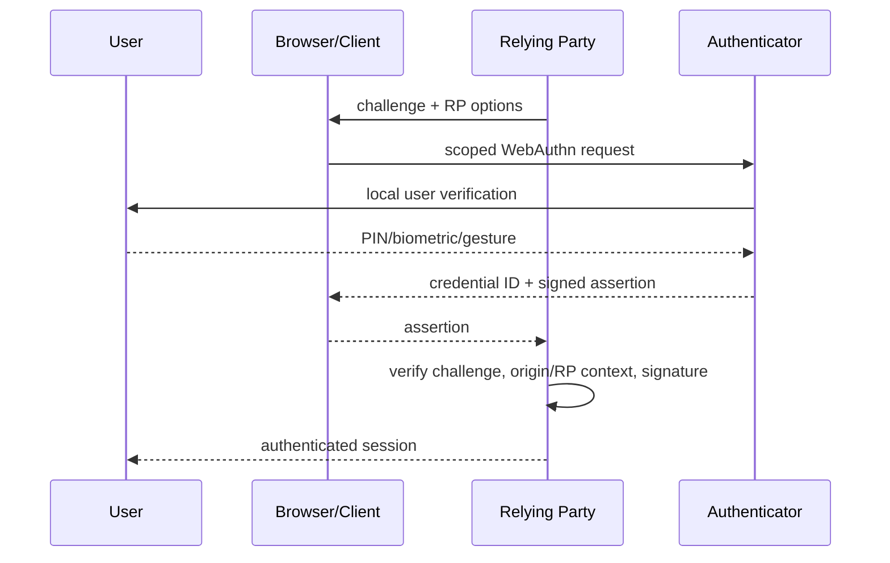
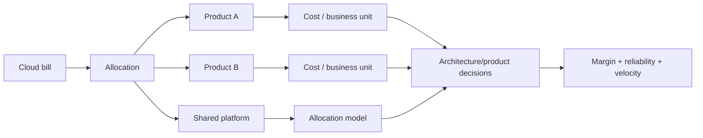

# 2026-09-21 23:00 — Interview Study Packages

README ve yakın `daily/2026-09-21/22-00.md` kontrol edildi. JIT deoptimization/OSR ve database buffer-pool konuları tekrar edilmedi. Repo çapı aramada model-registry promotion ile consistent/rendezvous hashing içeriklerinin zaten bulunduğu görüldü ve aday havuzundan çıkarıldı. Bu tur cybersecurity/authentication ve leadership/product/business eksenlerine dönüyor.

## Paket 1 — Junior → Principal Cybersecurity/Backend: WebAuthn, Passkeys, Phishing Resistance & Account Recovery
**Süre:** 20–30 dk

### Konu anlatımı
Password authentication'da server ve kullanıcı bir shared secret etrafında çalışır; phishing'in temel avantajı kullanıcının bu secret'ı yanlış origin'e verebilmesidir. WebAuthn bunu public-key challenge/response modeline çevirir. Registration sırasında authenticator RP için credential key pair üretir; server credential ID ve public key gibi doğrulama materyalini saklar. Authentication sırasında server fresh challenge üretir; authenticator RP/origin bağlamında challenge'ı imzalar; private key server'a gitmez.

Passkey, FIDO credential ailesindeki kullanıcı deneyimi ve deployment modelidir. Credential sync edilebilir veya device-bound olabilir. "Passkey = biometric" yanlıştır: biometric/PIN çoğunlukla authenticator içindeki local user verification mekanizmasıdır; RP'ye biometric template gönderilmez. W3C, 25 Ağustos 2026'da WebAuthn Level 3'ü Recommendation olarak yayımladı.

### Mental model
Password bir sırrı kanıtlarken sırrın kendisini kullanıcıdan ister. WebAuthn'da server "bu RP'ye bağlı private key sende mi?" diye tek kullanımlık challenge sorar. Authenticator cevabı imzalar; phishing site doğru RP için imza aldıramaz. Ancak güçlü login, zayıf recovery veya çalınmış session cookie'yi otomatik düzeltmez.

### İçeride ne oluyor?
1. Registration'da server random challenge ve RP bilgisi üretir.
2. Authenticator credential oluşturur; private key authenticator/provider güvenlik sınırında kalır, public key RP'ye döner.
3. Authentication assertion'ı challenge freshness, RP/origin bağlamı ve signature ile doğrulanır.
4. User presence ile user verification aynı kavram değildir; policy assurance ihtiyacına göre ayrılır.
5. Attestation authenticator özellikleri hakkında kanıt sağlayabilir; consumer sistemlerde privacy ve ecosystem uyumluluğu nedeniyle zorunlu kılmak dikkat ister.
6. Synced passkeys recovery/cross-device UX'i kolaylaştırır; device-bound credential daha yüksek cihaz bağlama assurance'ı sağlayabilir.
7. Account recovery ayrı bir authentication path'tir. Daha zayıf email/SMS fallback tüm phishing-resistant tasarımı downgrade edebilir.
8. Authentication sonrası session cookie çalınırsa passkey saldırıyı tek başına durdurmaz; session lifecycle ve re-authentication ayrıca tasarlanır.

### Yüksek getirili mülakat soruları
1. WebAuthn neden password database breach riskini değiştirir?
2. Passkey neden biometric ile eş anlamlı değildir?
3. Mid: challenge replay nasıl engellenir; RP/origin binding phishing'i nasıl azaltır?
4. Senior: synced ve device-bound passkey trade-off'ları nelerdir?
5. Senior: attestation ne zaman değerli, ne zaman privacy/interoperability maliyetidir?
6. Staff: password + SMS'ten passkey'e migration yaparken recovery downgrade'ını nasıl engellersin?
7. Principal: consumer ve workforce authentication için assurance, recovery, fraud, support cost ve adoption metriklerini nasıl birlikte yönetirsin?

### Seviyeye göre cevap derinliği
- **Junior:** public/private key, challenge ve local user verification'ı doğru ayırır.
- **Mid:** registration/authentication ceremony, replay ve RP binding'i açıklar.
- **Senior:** attestation, sync/device-bound, recovery ve session theft failure mode'larını tartışır.
- **Staff/Principal:** migration, policy, fraud telemetry, accessibility, support ve assurance ekonomisini tasarlar.

### Kısa alıştırma
Bir fintech login flow'u çiz: iki passkey kayıtlı olsun. Yeni passkey enrollment, bütün passkey'lerin kaybı ve yüksek riskli para transferi için hangi re-authentication/recovery gate'lerinin gerektiğini yaz. "Email link yeter" varsayımını threat-model et.

### Proje fikri
`passkey-auth-lab`: WebAuthn test RP'si kur. Registration/authentication challenge'larını server-side tek kullanımlık ve süreli sakla; bir hesaba birden çok credential ekle, revoke ekranı ve audit log üret. Replay edilmiş challenge ve yanlış-origin testlerini ekle.

### Failure modes / trade-off / production bağlantısı
Zayıf recovery account takeover'a dönüşür; passkey enrollment ele geçirilmiş session üzerinden korunmasızsa attacker kendi credential'ını ekleyebilir; aşırı attestation policy kullanıcıları dışlayabilir; legacy password endpoint downgrade yolu bırakabilir. Registration/auth success, fallback/recovery rate, new-credential events, suspicious recovery, session theft signals ve support tickets birlikte izlenmelidir.

### Kaynaklar
- W3C — WebAuthn Level 3 Recommendation announcement (25 Aug 2026): https://www.w3.org/news/2026/web-authentication-an-api-for-accessing-public-key-credentials-level-3-is-now-a-w3c-recommendation/
- FIDO Alliance — Passkeys: https://fidoalliance.org/passkeys/
- FIDO Alliance — Specifications overview: https://fidoalliance.org/specifications-overview/
- NIST — Syncable Authenticators supplement overview: https://www.nist.gov/news-events/news/2024/04/giving-nist-sp-800-63b-boost-nist-sp-800-63b-supplement-incorporating
- OWASP Authentication Cheat Sheet: https://cheatsheetseries.owasp.org/cheatsheets/Authentication_Cheat_Sheet.html

---

## Paket 2 — Senior → CTO Leadership/Product/Business: FinOps Unit Economics, Cost Allocation & Architecture Decisions
**Süre:** 20–30 dk

### Konu anlatımı
Cloud cost yalnız faturayı küçültme problemi değildir. Teknik lider için asıl soru, harcamanın hangi ürün değerini ürettiği ve marjı nasıl etkilediğidir. Toplam aylık cloud spend tek başına zayıf sinyaldir; büyüyen sağlıklı ürünün faturası da büyür. Bu nedenle maliyet, iş hacmine normalize edilmelidir: `cost / request`, `cost / active customer`, `GPU cost / 1M tokens`, `warehouse cost / successful pipeline` gibi unit economics metrikleri gerekir.

Cost allocation shared platform maliyetini owner/product/environment gibi boyutlara bağlar. Showback takımlara görünürlük sağlar; chargeback maliyeti bütçelerine gerçekten yansıtır. Ancak kusursuz allocation peşinde koşmak da pahalıdır: bazı shared maliyetler yaklaşık dağıtılır. FinOps kararı reliability, performance, engineering time ve opportunity cost ile birlikte alınmalıdır.

### Mental model
Fatura termometredir; unit economics teşhistir. "%20 tasarruf" hedefi yerine "aynı SLO ve ürün çıktısında işlem başına maliyeti düşür" de. Cost allocation muhasebe doğruluğu değil karar kalitesi için yeterince iyi bir haritadır.

### İçeride ne oluyor?
1. Billing export/tag/label/account hierarchy ham maliyeti üretir.
2. Direct cost doğrudan owner'a atanır; shared Kubernetes, observability, network veya data-platform maliyeti allocation key ister.
3. Unit denominator ürün değerini temsil etmelidir; request sayısı her iş modelinde doğru değildir.
4. Commitment/Reserved capacity indirimi utilization tahmini ve lock-in riski getirir.
5. Rightsizing CPU/RAM/GPU israfını azaltabilir fakat headroom'u aşırı kesmek tail latency ve incident riskini büyütür.
6. Data transfer ve cross-region architecture görünmeyen marginal cost üretebilir.
7. Showback davranış değişikliği için görünürlük yaratır; chargeback daha güçlü teşvik ama politik/gaming riski taşır.
8. Architecture decision, maliyet farkını engineering migration cost, SLO, revenue risk ve option value ile birlikte hesaplamalıdır.

### Yüksek getirili mülakat soruları
1. Cloud spend artışı ne zaman kötü değildir?
2. Unit cost neden toplam faturadan daha iyi karar metriği olabilir?
3. Senior: shared Kubernetes cluster maliyetini takımlara nasıl dağıtırsın?
4. Staff: commitment discount ile autoscaling esnekliği arasındaki trade-off nedir?
5. Principal: observability maliyetini azaltırken incident-detection kalitesini nasıl korursun?
6. EM: showback ile chargeback arasında ne zaman geçiş yaparsın?
7. CTO: gross margin düşerken reliability de kötüleşiyorsa 90 günlük teknik/finansal planı nasıl kurarsın?

### Seviyeye göre cevap derinliği
- **Senior:** cost drivers, utilization, unit metric ve temel allocation.
- **Staff:** shared-platform allocation, SLO/headroom, data transfer ve commitment portfolio.
- **Principal/EM:** incentives, ownership, platform economics ve migration ROI.
- **CTO:** gross margin, revenue risk, capital allocation, vendor leverage ve teknoloji stratejisini bağlar.

### Kısa alıştırma
Aylık $120k platform: compute $55k, database $30k, observability $20k, network $15k. Product A trafiğin %70'ini ama DB storage'ın %40'ını kullanıyor. Tek oranla allocation ile driver-based allocation'ı karşılaştır; hangi kararın yanlış çıkabileceğini yaz.

### Proje fikri
`unit-economics-dashboard`: billing export benzeri dataset oluştur; owner/product/environment allocation, shared-cost dağıtımı ve `cost / successful transaction` metriği hesapla. SLO ve p95 latency'yi aynı dashboard'a koy; rightsizing senaryoları için before/after karar kaydı üret.

### Failure modes / trade-off / production bağlantısı
Sadece spend hedeflemek reliability'yi kesebilir; yanlış denominator ürün davranışını çarpıtır; tag coverage eksikse "unallocated" maliyet büyür; chargeback local optimization yaratabilir; commitment aşırıysa talep düşünce stranded cost oluşur. Cost/unit, allocation coverage, commitment utilization, idle ratio, egress, SLO/error-budget ve gross-margin trendi birlikte okunmalıdır.

### Kaynaklar
- FinOps Foundation — FinOps Framework: https://www.finops.org/framework/
- FinOps Foundation — Allocation: https://www.finops.org/framework/capabilities/allocation/
- AWS Well-Architected — Cost Optimization Pillar: https://docs.aws.amazon.com/wellarchitected/latest/cost-optimization-pillar/welcome.html
- Google Cloud Architecture Framework — Cost optimization: https://cloud.google.com/architecture/framework/cost-optimization
- Microsoft Azure Well-Architected — Cost Optimization: https://learn.microsoft.com/azure/well-architected/cost-optimization/
