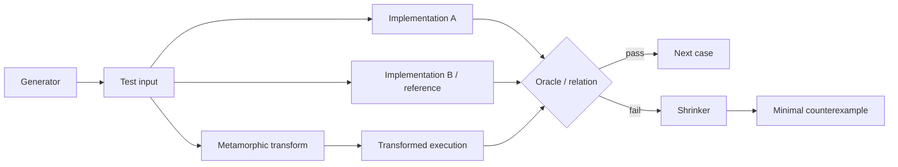
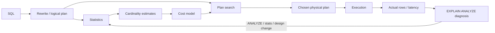

# 2026-09-21 23:00 — Interview Study Packages

README ve yakın `daily/2026-09-21/22-00.md` kontrol edildi. JIT deoptimization/OSR/safepoints/stack maps ve buffer-pool/CLOCK-sweep tekrar edilmedi. İlk 23:00 taslağındaki WebAuthn/passkeys konusu repo çapı kontrolde birden fazla eski daily ve canonical chapter ile çakıştığı için çıkarıldı. `metamorphic differential testing oracle` ve `query optimizer cardinality estimation statistics histogram join order` aramalarında ayrı paket bulunmadı. Bu tur testing-engineering hattını oracle problemine, database hattını optimizer/cardinality katmanına ilerletiyor.

## Paket 1 — Mid → Principal Testing Engineering: Differential & Metamorphic Testing, Oracles and Shrinking
**Süre:** 20–30 dk

### Konu anlatımı
Test üretmek tek başına yeterli değildir; üretilen girdinin sonucunun doğru olup olmadığını söyleyen bir **test oracle** gerekir. Compiler, database optimizer, numerical library veya serializer gibi karmaşık sistemlerde beklenen çıktıyı her girdi için elle yazmak pratik değildir.

**Differential testing**, aynı semantiği gerçekleştirmesi beklenen iki veya daha fazla implementation/modu aynı girdide çalıştırıp observable sonuçlarını karşılaştırır. Örneğin toy compiler'ın interpreter sonucu ile optimized backend sonucu aynı olmalıdır.

**Metamorphic testing** ise tek bir doğru çıktı yerine girdiler/çıktılar arasındaki korunması gereken ilişkiyi tanımlar. Örneğin bir listenin permutation'ı `sort` sonucunu değiştirmemeli; SQL sorgusuna semantik olarak eşdeğer güvenli rewrite uygulandığında relation korunmalıdır.

Property-based testing burada input generation ve **shrinking** motoru olabilir. Üç kavramı ayır: generator “ne denenecek?”, oracle/metamorphic relation “doğru ne?”, shrinker “hata nasıl küçültülecek?” sorusunu cevaplar.

### Mental model
Differential testing iki bağımsız hesap makinesine aynı problemi vermektir: sonuçlar ayrışırsa en az bir tarafta sorun vardır. Metamorphic testing'de cevabı bilmek yerine bir korunma yasası bilirsin: girdiyi belirli biçimde dönüştürdüğünde çıktı ilişkisinin nasıl kalması gerektiğini test edersin.

### İçeride ne oluyor?
1. Generator valid ve adversarial input space'i örnekler.
2. Normalization katmanı timestamp, ordering ve random ID gibi nondeterministic alanları kontrol altına alır.
3. Differential oracle internal representation yerine observable semantics'i karşılaştırır.
4. Metamorphic relation `f(T(x))` ile `f(x)` arasındaki beklenen ilişkiyi tanımlar.
5. Failure bulununca shrinker input'u küçültür; grammar/schema/state invariants korunmalıdır.
6. Reference implementation'ın da bug'lı olabileceği unutulmamalıdır; bağımsız implementation veya invariant çapraz kontrolü güveni artırır.
7. Floating-point, concurrency ve unordered collections exact equality yerine tolerance/canonicalization/partial-order oracle gerektirebilir.
8. Hızlı deterministic corpus her commit'te, geniş generated corpus daha seyrek/dedicated worker'larda koşabilir.

### Yüksek getirili mülakat soruları
1. Test oracle nedir ve generated testing'de neden kritiktir?
2. Differential testing ile property-based testing arasındaki fark nedir?
3. Üç metamorphic relation örneği ver.
4. Senior: iki implementation aynı bug'ı paylaşıyorsa differential testing neden kaçırabilir?
5. Senior: nondeterministic sistemlerde false positive nasıl azaltılır?
6. Staff: compiler/database için corpus, generator ve shrinker mimarisini nasıl kurarsın?
7. Principal: generated-testing bütçesini CI latency, bug yield ve reproducibility ile nasıl yönetirsin?

### Seviyeye göre cevap derinliği
- **Mid:** oracle, differential comparison, metamorphic relation ve shrinking'i ayırır.
- **Senior:** nondeterminism, canonicalization, shared-bug riskini ve domain-aware generator'ları tartışır.
- **Staff:** corpus lifecycle, deterministic replay, distributed workers ve failure triage tasarlar.
- **Principal:** test yatırımını escaped-defect maliyeti, CI bütçesi ve ownership modeliyle bağlar.

### Kısa alıştırma
Bir JSON serializer için encode→decode round-trip, object-key permutation, whitespace, numeric boundary ve Unicode davranışını kapsayan metamorphic/property kontrolleri yaz. Aynı input'u iki serializer'a vererek differential oracle ekle; failure için shrink sırasını tasarla.

### Proje fikri
`query-diff-lab`: küçük relational-expression evaluator yaz. Random table + expression üret; expression'ı güvenli eşdeğer rewrite'larla dönüştür. Original ve transformed sonucu canonicalize edip karşılaştır; failure'ı tablo satırı ve AST node sayısına göre shrink et.

### Failure modes / trade-off / production bağlantısı
Reference'a kör güven shared/reference bug riski taşır. Geçersiz generator input'ları signal/noise oranını bozar. Nondeterminism flaky test üretir. Pahalı oracle CI'ı yavaşlatır. Kötü shrinker dev counterexample bırakır. Production failure örnekleri regression corpus'a dönüştürülmeli; seed, version, feature flags ve environment replay için saklanmalıdır.

### Kaynaklar
- Hypothesis: https://hypothesis.works/
- LLVM Testing Guide: https://llvm.org/docs/TestingGuide.html
- SQLite TH3: https://www.sqlite.org/th3.html

---

## Paket 2 — Junior → Principal Databases: Cardinality Estimation, Statistics & Query Optimizer Failure Modes
**Süre:** 20–30 dk

### Konu anlatımı
Query optimizer'ın işi yalnız “index var mı?” diye bakmak değildir. SQL birçok eşdeğer physical plan'a sahip olabilir: sequential/index scan; hash/merge/nested-loop join; farklı join order'ları ve parallelism dereceleri. Optimizer arama uzayında tahmini maliyeti düşük planı seçer.

Merkezde **cardinality estimation** vardır: her plan node'undan kaç row çıkacak? Tahmin yanlışsa sonraki cost hesabı zincirleme bozulabilir. PostgreSQL table/page counts, distinct counts, null fraction, most-common-values (MCV) ve histogram bounds gibi statistics kullanır. `ANALYZE` bunları örnekleme ile günceller; statistics yaklaşık ve zamanla stale olabilir.

Önemli hata kaynağı **correlation**'dır. Optimizer iki predicate'i bağımsız varsayıp selectivity'leri çarparsa ilişkili kolonlarda ciddi misestimate yapabilir. PostgreSQL extended statistics functional dependencies, multivariate `ndistinct` ve MCV listeleriyle bazı cross-column ilişkilerini modelleyebilir.

### Mental model
Optimizer rota planlayıcıdır. Cost model yol sürelerini, cardinality estimation her kavşakta kaç aracın kalacağını tahmin eder. İlk kavşakta 10 yerine 1 milyon araç tahmin edersen sonraki rota seçimi matematiksel olarak tutarlı olsa bile pratikte kötü olabilir.

### İçeride ne oluyor?
1. Parser/rewrite sonrası logical operators oluşur.
2. Planner base relation row/page sayıları ve column statistics'i okur.
3. Predicate selectivity tahminleri node cardinality'sine çevrilir.
4. Candidate access path/join algorithm'ları için CPU/I/O/memory cost hesaplanır.
5. Join order büyüdükçe search space kombinatoryal patlar; optimizer aramayı sınırlamak zorundadır.
6. Correlated predicates independence assumption'ı bozabilir; extended statistics bazı durumlarda tahmini düzeltir.
7. Prepared statement'ta generic plan planning maliyetini azaltabilir; parameter skew varsa custom plan daha iyi olabilir.
8. `EXPLAIN ANALYZE` estimated ve actual rows'u karşılaştırarak cardinality error'ın ilk büyüdüğü node'u bulmaya yardım eder.

### Yüksek getirili mülakat soruları
1. Cardinality ile selectivity arasındaki fark nedir?
2. Histogram ve MCV listesi neden birlikte yararlıdır?
3. Stale statistics nasıl kötü plana yol açar?
4. Mid: index olduğu halde optimizer neden sequential scan seçebilir?
5. Senior: correlated columns neden independence assumption'ı bozar?
6. Senior: `EXPLAIN ANALYZE` ile kötü planın kök nedenini nasıl ararsın?
7. Staff: plan regression'ı statistics, parameter skew, cost model ve physical design arasında nasıl ayırırsın?
8. Principal: optimizer hint/plan pinning'in uzun vadeli operasyonel riski nedir?

### Seviyeye göre cevap derinliği
- **Junior:** scan/index/join seçeneklerini ve cost-based seçimi açıklar.
- **Mid:** selectivity, histogram, MCV, stale stats ve estimated-vs-actual rows'u bağlar.
- **Senior:** correlation, extended stats, parameter skew, join order ve spill etkilerini tartışır.
- **Staff:** plan-regression observability, statistics policy ve safe rollout tasarlar.
- **Principal:** version upgrade, workload governance, plan pinning ve platform ownership trade-off'larını yönetir.

### Kısa alıştırma
1 milyon satırda `country` ve `city` kuvvetli correlated olsun. Planner her predicate için `0.01` selectivity bulup bağımsızlıkla çarpsın. Gerçekte conjunction 8.000 row döndürüyorsa estimate/actual farkını hesapla ve nested-loop/hash-join kararına etkisini anlat.

### Proje fikri
`cardinality-lab`: PostgreSQL'de skew ve correlation içeren synthetic dataset oluştur. `ANALYZE`, farklı statistics target'ları ve `CREATE STATISTICS` öncesi/sonrası `EXPLAIN (ANALYZE, BUFFERS)` çıktısını kaydet. Node bazında q-error üret ve plan değişikliklerini raporla.

### Failure modes / trade-off / production bağlantısı
Düşük statistics resolution skew'i gizler; yüksek target ANALYZE süresi/catalog boyutunu artırır. Stale stats plan regression yaratır. Correlation yanlış cardinality üretir. Parameter-sensitive workload generic plan altında kötüleşebilir. Hint/plan pinning kısa vadeli istikrar sağlarken dağılım değişince teknik borca dönüşebilir. Production'da estimated/actual divergence, planning time, temp spill, buffer reads, plan değişimi ve p95/p99 latency birlikte izlenmelidir.

### Kaynaklar
- PostgreSQL 18 — Statistics Used by the Planner: https://www.postgresql.org/docs/18/planner-stats.html
- PostgreSQL 18 — How the Planner Uses Statistics: https://www.postgresql.org/docs/18/planner-stats-details.html
- PostgreSQL 18 — Using EXPLAIN: https://www.postgresql.org/docs/18/using-explain.html
- PostgreSQL 18 — Query Planning configuration: https://www.postgresql.org/docs/18/runtime-config-query.html
