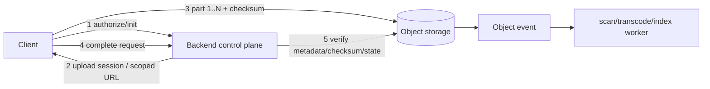

# 2026-09-22 00:00 — Interview Study Packages

README ve yakın `daily/2026-09-21/23-00.md` kontrol edildi. Differential/metamorphic testing ve query-optimizer cardinality-estimation konuları tekrar edilmedi. Repo aramasında feature-store/point-in-time join de daha önce işlendiği için elendi. Bu tur cybersecurity/backend ile object-storage/system-design hatlarına dönüyor.

## Paket 1 — Mid → Principal Cybersecurity/Backend: OAuth 2.0 Authorization Code + PKCE, Token Rotation & Device Flow
**Süre:** 20–30 dk

### Konu anlatımı
OAuth bir authentication protokolü değil, delegated authorization çerçevesidir. Modern redirect tabanlı istemcide ana akış Authorization Code + PKCE'dir. İstemci rastgele `code_verifier` üretir, bunun `S256` challenge'ını authorization request'e koyar; authorization code döndüğünde token endpoint verifier'ı challenge ile bağlar. Böylece code ele geçirilse bile verifier olmadan token'a çevrilmesi zorlaşır. RFC 9700 (Ocak 2025) authorization server'ların PKCE desteklemesini ve challenge varsa verifier'ı enforce etmesini ister; redirect URI'larda exact matching ve open redirector'lardan kaçınma da temel güvenlik kontrolüdür.

Refresh token uzun ömürlü yetki taşıdığı için rotation/reuse detection ile ele geçirilme blast radius'u azaltılabilir. Device Authorization Grant ise TV/CLI gibi input-constrained cihazın kullanıcıyı ayrı bir browser'a yönlendirmesine izin verir; cihaz `device_code` ile polling yaparken kullanıcı `user_code` ile yetkilendirir. Device flow phishing'e sihirli çözüm değildir; kullanıcı kodunun yanlış cihaza bağlanması ve polling davranışı threat model'e dahildir.

```mermaid
sequenceDiagram
 participant C as Client
 participant B as Browser
 participant AS as Authorization Server
 C->>C: verifier + S256 challenge
 C->>B: authorize(challenge, exact redirect URI)
 B->>AS: user auth + consent
 AS-->>C: authorization code
 C->>AS: code + verifier
 AS-->>C: access token (+ refresh token)
 C->>C: rotate refresh token; detect reuse
```

### Mental model
Authorization code tek kullanımlık bagaj fişi, PKCE verifier ise yalnız istemcide kalan ikinci parçadır. Refresh token kasa anahtarıdır: access token'dan daha sıkı saklanır ve mümkünse her kullanımda yenilenir.

### İçeride ne oluyor?
1. Redirect URI exact match code/token sızıntısı yüzeyini daraltır.
2. `state` transaction/session correlation için kullanılır; PKCE code interception'a karşı cryptographic binding sağlar.
3. Public client secret saklayamaz; PKCE bu yüzden özellikle kritiktir, ancak güncel BCP confidential client'larda da önerir.
4. Access token audience/scope/expiry resource server'da doğrulanır; bearer token çalınırsa süresi boyunca kullanılabilir.
5. Refresh-token rotation eski token reuse'ını sinyal haline getirir; token family revoke edilebilir.
6. Device flow'da polling interval/backoff uygulanmalı; user code kısa ve kullanıcı tarafından doğrulanabilir olmalıdır.

### Yüksek getirili mülakat soruları
- OAuth ile OpenID Connect farkı nedir?
- PKCE hangi saldırıyı azaltır; `state` ile neden aynı şey değildir?
- Neden implicit flow yerine authorization code + PKCE tercih edilir?
- Senior: refresh-token rotation ve reuse detection nasıl çalışır?
- Staff: browser, native mobile, CLI ve TV istemcileri için hangi flow'u seçersin?
- Principal: token lifetime, revocation, auditability ve UX arasında organizasyon standardını nasıl kurarsın?

### Seviyeye göre cevap derinliği
- **Mid:** code, token endpoint, PKCE, scopes ve redirect URI.
- **Senior:** replay, rotation, audience, sender-constrained seçenekler ve browser threat model.
- **Staff:** multi-client policy, key/token lifecycle, observability ve incident response.
- **Principal:** identity-platform governance, compatibility, migration ve blast-radius bütçesi.

### Kısa alıştırma
Bir SPA, native mobile app ve smart-TV için authorization akışını seç. Redirect URI, PKCE, refresh-token storage/rotation ve logout/revocation davranışını tablo halinde gerekçelendir.

### Proje fikri
`oauth-flow-lab`: küçük authorization-code + PKCE client yaz; verifier/challenge üretimini, callback state doğrulamasını ve refresh-token rotation simülasyonunu ekle. Deliberate code interception ve stale refresh-token reuse testleri yaz.

### Failure modes / trade-off / production bağlantısı
Open redirect, gevşek redirect matching, token'ı loglama, aşırı uzun token TTL, refresh token'ı browser'da uygunsuz saklama ve rotation yarışları yaygın hatalardır. Production'da token-exchange failure, invalid_grant/reuse sinyali, refresh rate, auth latency ve suspicious redirect/audience hataları izlenir.

### Kaynaklar
- RFC 9700 — OAuth 2.0 Security Best Current Practice: https://www.rfc-editor.org/rfc/rfc9700.html
- RFC 7636 — PKCE: https://www.rfc-editor.org/rfc/rfc7636.html
- RFC 8628 — Device Authorization Grant: https://www.rfc-editor.org/rfc/rfc8628.html

---

## Paket 2 — Junior → Staff System Design/Backend: Object Storage Multipart Upload, Checksums & Direct-to-Storage Architecture
**Süre:** 20–30 dk

### Konu anlatımı
Büyük dosyayı uygulama sunucusundan tek HTTP request ile geçirmek memory, timeout ve bandwidth bottleneck'i yaratır. Object storage tasarımında control plane ile data plane'i ayırmak güçlü bir modeldir: backend kimlik/yetki, object key, boyut/content policy ve upload session'ı yönetir; istemci kısa ömürlü yetkiyle parçaları doğrudan object storage'a yollar.

Multipart upload büyük nesneyi bağımsız part'lara böler. Part'lar paralel ve retry edilebilir; completion aşaması hangi part'ların hangi sırayla tek nesneye dönüşeceğini commit eder. Integrity için ETag'i evrensel full-object MD5 sanmak hatadır: S3 multipart nesnelerde ETag tüm nesnenin doğrudan MD5'i değildir. Güncel S3 dokümanı full-object ve composite checksum modellerini, CRC/SHA/MD5/XXHash seçeneklerini ayrı tanımlar.



### Mental model
Backend hava trafik kontrolüdür; dosya byte'larını taşıyan kargo uçağı değildir. Multipart upload parçalara ayrılmış sevkiyat, completion ise manifest commit'idir. Checksum taşıma sırasında bütünlük kanıtıdır; authorization değildir.

### İçeride ne oluyor?
1. Backend key namespace ve upload policy üretir; yetki kısa ömürlü ve minimum kapsamlı olmalıdır.
2. Client part'ları paralel yükler; retry yalnız başarısız part'ı tekrarlar.
3. Her part checksum ile doğrulanabilir; completion full-object veya composite checksum politikasına göre doğrulanır.
4. Incomplete multipart uploads storage maliyeti yaratabilir; lifecycle/abort cleanup gerekir.
5. Completion sonrası async malware scan, media processing veya metadata extraction yapılabilir; object henüz public/servable kabul edilmemelidir.
6. Idempotent finalize endpoint aynı upload'ın tekrar completion talebini güvenle ele almalıdır.

### Yüksek getirili mülakat soruları
- Neden 5 GB dosyayı API server üzerinden proxy etmek istemezsin?
- Multipart upload'ın retry ve throughput avantajı nedir?
- ETag neden güvenilir bir full-object MD5 varsayımı değildir?
- Senior: presigned/scoped upload yetkisinde hangi constraint'leri koyarsın?
- Senior: orphan multipart uploads nasıl temizlenir?
- Staff: upload-complete event'i, virus scan'i ve user-visible state'i nasıl idempotent tasarlarsın?

### Seviyeye göre cevap derinliği
- **Junior:** object/key, multipart, retry ve checksum.
- **Mid:** direct upload, scoped URL, parallelism, completion ve cleanup.
- **Senior:** integrity vs authenticity, idempotency, async processing, abuse controls.
- **Staff:** multi-region placement, lifecycle, cost, quota ve operational recovery.

### Kısa alıştırma
20 GB video upload için 64 MiB part seçildiğini varsay. Yaklaşık part sayısını hesapla; concurrency=8 için retry stratejisi, checksum noktaları ve abort policy tasarla.

### Proje fikri
`multipart-upload-lab`: local S3-compatible storage veya cloud sandbox ile initiate/upload-part/complete API'si kur. Client'ta parallel part upload, checksum, retry ve resume manifest'i; backend'de quota ve idempotent finalize ekle.

### Failure modes / trade-off / production bağlantısı
Çok küçük part request overhead'ini, çok büyük part retry maliyetini artırır. Sınırsız parallelism client/network/storage throttling yaratır. Incomplete uploads para yakar. URL expiry uzun olursa abuse window büyür; kısa olursa uzun upload'lar yenileme ister. Production'da completion rate, orphan bytes, checksum mismatch, part retry, upload p95, egress ve scan backlog izlenir.

### Kaynaklar
- Amazon S3 Multipart Upload: https://docs.aws.amazon.com/AmazonS3/latest/userguide/mpuoverview.html
- Amazon S3 Object Integrity / Checksums: https://docs.aws.amazon.com/AmazonS3/latest/userguide/checking-object-integrity-upload.html
- Amazon S3 Presigned URLs: https://docs.aws.amazon.com/AmazonS3/latest/userguide/using-presigned-url.html
