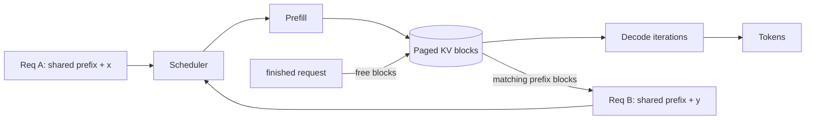
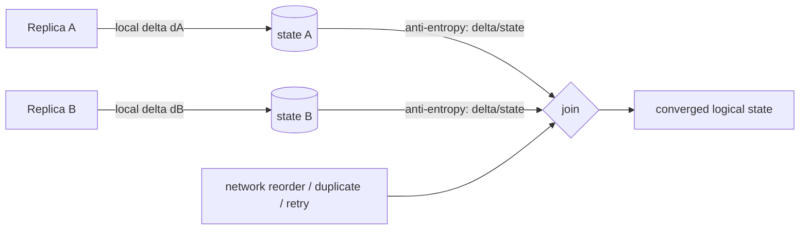

# 2026-09-22 01:00 — Interview Study Packages

README ve yakın `daily/2026-09-22/00-00.md` kontrol edildi. OAuth/PKCE ve object-storage multipart upload tekrar edilmedi. Repo çapı aramada WASI ve Kubernetes topology-spread/PDB adaylarının daha önce işlendiği görülüp elendi. Bu tur ML/AI/LLM serving ile distributed systems hatlarına dönüyor.

## Paket 1 — Mid → Principal ML/AI/LLM + MLOps: KV Cache, PagedAttention, Continuous Batching & Prefix Reuse
**Süre:** 20–30 dk

### Konu anlatımı
Autoregressive transformer inference iki farklı faz gibi düşünülmelidir. **Prefill** aşamasında prompt token'ları paralel işlenir ve her layer için attention key/value (KV) state üretilir. **Decode** aşamasında ise her yeni token önceki token'ların KV state'ini tekrar hesaplamak yerine cache'ten okur. Bu nedenle production LLM serving'de GPU belleğinin önemli bölümü yalnız model weights değil, aktif sequence'ların KV cache'i tarafından tüketilebilir.

Naif tasarım her request için `max_context + max_new_tokens` büyüklüğünde contiguous alan ayırır. Gerçek request uzunlukları değişken olduğundan internal fragmentation ve düşük concurrency oluşabilir. PagedAttention yaklaşımı KV state'i sabit boyutlu blok/page'lere ayırıp logical sequence'i fiziksel bloklara eşler; böylece memory allocation request uzunluğuyla kademeli büyür ve boş kapasite daha iyi paylaşılır.

**Continuous batching** statik bir batch'in tamamen bitmesini beklemek yerine scheduler'ın her iteration'da tamamlanan sequence'ları çıkarıp yeni request'leri admit etmesine izin verir. **Prefix caching/reuse** ise ortak system prompt veya tekrar eden prefix için daha önce hesaplanan KV bloklarını yeniden kullanarak özellikle time-to-first-token (TTFT) maliyetini azaltabilir. Güncel vLLM dokümantasyonu PagedAttention, continuous batching, chunked prefill ve prefix caching'i serving özellikleri arasında listeler; TensorRT-LLM de block tabanlı KV pool, cross-request prefix reuse, eviction ve offload mekanizmalarını belgeler.

### Mental model
Model weights **kütüphane**, KV cache ise her aktif okuyucunun tuttuğu **çalışma notlarıdır**. PagedAttention çalışma notlarını tek büyük defter yerine yeniden eşlenebilir sayfalara böler. Continuous batching sabit otobüs seferi değil, her durakta inen yolcunun yerine yenisinin binebildiği metro gibidir. Prefix cache ise ortak giriş bölümünün notlarını tekrar yazmamaktır.

### İçeride ne oluyor?
1. Prefill prompt'u işler ve her attention layer için K/V tensörleri üretir; decode yeni token başına cache'i büyütür.
2. KV footprint kabaca `tokens × layers × KV heads × head_dim × K/V × bytes` ile büyür; GQA/MQA KV-head sayısını azaltarak cache maliyetini düşürebilir.
3. Paged allocation logical token ranges'i fiziksel blocks'a map eder; request tamamlandığında blocks pool'a döner.
4. Scheduler yalnız compute'u değil KV capacity'yi de admission constraint olarak görür. Büyük context request'i çok sayıda kısa request'i dışarı itebilir.
5. Prefix reuse yalnız token prefix'i gerçekten eşleştiğinde doğrudur. Model/adaptor/config/tenant isolation gibi cache identity bileşenleri yanlış tasarlanırsa correctness veya privacy riski doğar.
6. Cache eviction hit-rate ile admission capacity arasında trade-off'tur. CPU/disk offload GPU kapasitesini genişletebilir fakat transfer latency ve bandwidth maliyeti ekler.
7. Throughput tek başına yeterli metrik değildir: TTFT, inter-token latency (ITL), tokens/s, queue delay, cache utilization ve eviction birlikte değerlendirilmelidir.

### Yüksek getirili mülakat soruları
- KV cache neden vardır ve neden context uzadıkça pahalılaşır?
- Prefill ile decode fazlarının compute/memory karakteri neden farklıdır?
- PagedAttention hangi memory-allocation problemini azaltır?
- Mid: continuous batching statik batching'den neden daha iyi GPU utilization sağlayabilir?
- Senior: prefix caching TTFT'yi ne zaman düşürür, ne zaman hiç fayda sağlamaz?
- Senior: uzun-context request'lerin kısa request'leri aç bırakmasını nasıl önlersin?
- Staff: TTFT SLO'su ile throughput hedefini scheduler/admission seviyesinde nasıl dengelersin?
- Principal: multi-tenant serving'de KV reuse, isolation, GPU memory budget ve cost/token standardını nasıl yönetirsin?

### Seviyeye göre cevap derinliği
- **Mid:** prefill/decode, KV cache, batching, GPU memory temel modeli.
- **Senior:** block allocation, fragmentation, prefix hit/miss, eviction, GQA/MQA ve latency decomposition.
- **Staff:** scheduler policy, admission, fairness, multi-GPU/disaggregated serving, observability ve overload control.
- **Principal:** fleet capacity, tenant isolation, model mix, SLO sınıfları, cost/token ve platform standardizasyonu.

### Kısa alıştırma
Aynı 4K-token system prompt'u kullanan 100 eşzamanlı request olduğunu varsay. Prefix reuse kapalı/açık durumda hangi compute ve memory işlerinin tekrarlandığını çiz. Sonra bir 64K-context request geldiğinde scheduler'ın admission/fairness kararını ve izleyeceğin TTFT/ITL metriklerini yaz.

### Proje fikri
`llm-serving-scheduler-lab`: gerçek GPU gerekmeden block-based KV allocator simülatörü yaz. Request arrival, prompt/output length, fixed block size, prefix hit ve eviction olaylarını modelle. Static batching ile continuous batching'i utilization, queue delay, TTFT proxy'si ve wasted-block oranında karşılaştır.

### Failure modes / trade-off / production bağlantısı
Aşırı büyük block size internal fragmentation ve düşük prefix match verimi; çok küçük block size metadata/scheduling overhead'i yaratabilir. Aggressive batching throughput'u artırırken TTFT'yi bozabilir. Cache reuse tenant sınırlarını aşarsa veri sızıntısı riski oluşur. Offload kapasiteyi artırır ama PCIe/NVLink/host-memory darboğazı yaratabilir. Production'da KV utilization, free blocks, eviction/reuse rate, prefix-hit tokens, queue depth, admission rejection, TTFT p50/p95/p99, ITL ve tokens/s izlenir.

### Kaynaklar
- vLLM docs — PagedAttention, continuous batching, prefix caching: https://docs.vllm.ai/en/stable/
- NVIDIA TensorRT-LLM — KV Cache System: https://nvidia.github.io/TensorRT-LLM/features/kvcache.html
- NVIDIA TensorRT-LLM — KV cache reuse: https://nvidia.github.io/TensorRT-LLM/latest/legacy/advanced/kv-cache-reuse.html

---

## Paket 2 — Junior → Principal Distributed Systems: CRDTs, Strong Eventual Consistency & Delta-State Replication
**Süre:** 20–30 dk

### Konu anlatımı
Eventual consistency tek başına 'sonunda bir şey olur' demek değildir. Replica'lar network partition sırasında bağımsız update kabul ediyorsa, tekrar iletişim kurduklarında aynı logical state'e **deterministik** biçimde yakınsamaları gerekir. Conflict-free Replicated Data Types (CRDT) bu merge davranışını veri tipinin cebrine gömer. Amaç her conflict için merkezi coordinator veya sonradan elle reconciliation yazmak yerine, belirli operasyonların/state merge'in convergence garantisini tasarımın parçası yapmaktır.

İki ana aile yararlı mental model verir. **State-based (CvRDT)** replica state'lerini gönderir; merge işlemi join-semilattice üzerinde associative, commutative ve idempotent olduğunda mesaj tekrarları/sıra değişiklikleri convergence'ı bozmaz. **Operation-based (CmRDT)** update operasyonlarını yayar ve delivery varsayımları daha önemlidir. **Delta-state CRDT** ise full state yerine küçük delta-state'ler üretip state-based join özelliklerini koruyarak bandwidth maliyetini azaltmayı hedefler.

Basit G-Counter'da her replica yalnız kendi sayacını artırır; merge component-wise `max`, read ise component toplamıdır. PN-Counter iki grow-only counter ile increment/decrement'i modeller. Set'lerde iş zorlaşır: concurrent add/remove için yalnız değer saklamak yetmez; observed-remove yaklaşımında benzersiz tags/causal context hangi eklemenin gerçekten gözlemlenip kaldırıldığını ayırır.

### Mental model
CRDT 'conflict yok' demek değildir; **conflict'in çözüm kuralı veri tipinin içinde deterministik olarak tanımlıdır**. State-based merge'i kümelerin birleşimi gibi düşün: aynı parçayı iki kez almak sonucu değiştirmemeli. Delta-state ise her seferinde bütün kitabı göndermek yerine yeni sayfaları gönderip aynı merge kuralını kullanmaktır.

### İçeride ne oluyor?
1. Strong eventual consistency'nin temel sezgisi: aynı update kümesini görmüş doğru replica'lar eşdeğer state'e yakınsar.
2. State-based merge için idempotence duplicate delivery'yi, commutativity reorder'ı, associativity batching/merge grouping'i tolere etmeyi kolaylaştırır.
3. G-Counter state'i replica-id -> monoton counter map'idir; merge her component için `max` alır.
4. Remove içeren set'lerde causal metadata/tags gerekir; aksi halde gecikmiş add bir remove'u istemeden 'diriltebilir'.
5. Tombstone/identifier metadata sınırsız büyüyebilir; garbage collection genellikle 'hangi replica hangi geçmişi kesin gördü?' sorusunu ve dolayısıyla ek koordinasyon/causal knowledge'ı gündeme getirir.
6. Delta-state CRDT full state transferini azaltır; fakat anti-entropy protocol, delta retention ve causal delivery gereksinimleri hâlâ production tasarımıdır.
7. CRDT invariant'ları otomatik çözmez. Örneğin `balance >= 0`, global uniqueness veya kapasite sınırı gibi cross-object/global invariant'lar coordination gerektirebilir.

### Yüksek getirili mülakat soruları
- Eventual consistency ile strong eventual consistency arasındaki fark nedir?
- State-based CRDT merge neden idempotent olmalıdır?
- G-Counter nasıl merge edilir ve neden iki replica aynı değere yakınsar?
- Mid: PN-Counter decrement'i nasıl destekler?
- Senior: OR-Set'te concurrent add/remove neden causal metadata ister?
- Senior: tombstone/metadata garbage collection neden zor bir distributed-systems problemidir?
- Staff: CRDT ile consensus'u hangi workload sınırında seçersin?
- Principal: offline-first global product'ta convergence, invariant, storage overhead ve operability arasında platform politikasını nasıl kurarsın?

### Seviyeye göre cevap derinliği
- **Junior:** replica, concurrent update, deterministic merge ve eventual convergence.
- **Mid:** G/PN-Counter, state-vs-op based, idempotent merge.
- **Senior:** causal context, OR-Set semantics, metadata growth, anti-entropy ve invariants.
- **Staff:** CRDT/consensus boundary, multi-object transactions, failure recovery ve observability.
- **Principal:** product semantics, compliance/delete semantics, topology, cost ve organization-wide consistency contracts.

### Kısa alıştırma
A ve B replica'larında G-Counter başta `{A:0,B:0}`. Partition sırasında A üç, B iki increment yapsın. Mesajları duplicate ve ters sırada teslim ederek component-wise max merge'in neden yine 5 sonucuna ulaştığını göster. Ardından aynı yaklaşımın basit bir set remove'u için neden yeterli olmadığını açıkla.

### Proje fikri
`crdt-sync-lab`: üç replica'lı G-Counter ve observed-remove set simülatörü yaz. Network layer mesaj drop/reorder/duplicate üretsin. Anti-entropy sonunda convergence property testi ekle; full-state ile delta-state modlarında transfer edilen byte/state-unit miktarını karşılaştır.

### Failure modes / trade-off / production bağlantısı
Yanlış merge fonksiyonu sessiz divergence üretir. Unbounded replica IDs/tombstones metadata şişmesine yol açar. Clock/causal metadata yanlış yönetilirse remove semantics bozulabilir. CRDT seçmek uniqueness, quota veya para transferi gibi invariant'ları kendiliğinden çözmez. Production'da replica lag, anti-entropy bytes, merge duration, state/metadata size, tombstone ratio, convergence delay ve invariant violation sinyalleri izlenmelidir.

### Kaynaklar
- Shapiro et al. — Conflict-Free Replicated Data Types (SSS 2011): https://hal.science/inria-00609399
- Almeida, Shoker, Baquero — Delta State Replicated Data Types: https://arxiv.org/abs/1603.01529
- Preguiça, Baquero, Shapiro — Conflict-free Replicated Data Types overview: https://arxiv.org/abs/1805.06358
