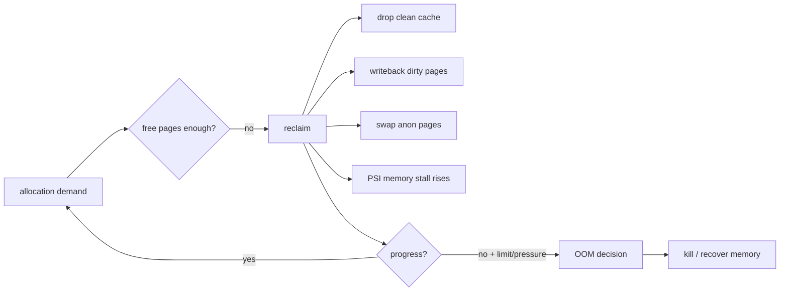
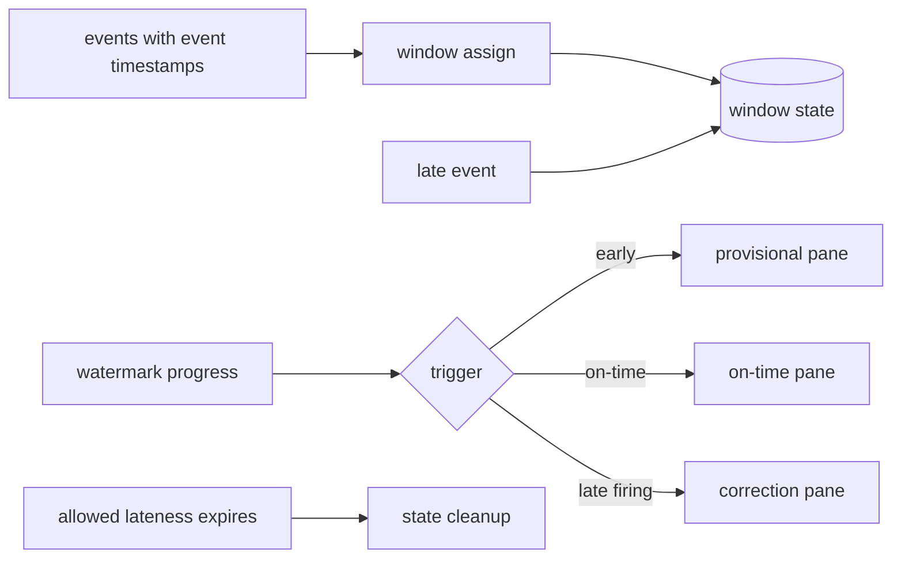

# 2026-09-22 02:00 — Interview Study Packages

README ve yakın `daily/2026-09-22/01-00.md` kontrol edildi. KV-cache/PagedAttention ve CRDT konuları tekrar edilmedi. Repo çapı aramada bu turun iki temel boşluğu için doğrudan eşleşme bulunmadı: Linux memory reclaim/PSI ve stream-processing event time/watermarks.

## Paket 1 — Mid → Principal OS/SRE: Linux Memory Reclaim, PSI, cgroup v2 & OOM
**Süre:** 20–30 dk

### Konu anlatımı
Linux'ta `free memory` tek başına sağlık metriği değildir: RAM page cache dahil faydalı işler için kullanılır. Asıl soru allocation gerektiğinde kernel'in yeterli sayfayı makul gecikmeyle geri kazanıp kazanamadığıdır. Reclaim file-backed clean page'leri düşürebilir, dirty page'leri writeback'e gönderebilir ve koşullara göre anonymous memory'i swap'e taşıyabilir. Reclaim ilerleyemezken allocation baskısı sürerse OOM kararı gündeme gelir.

cgroup v2 bu davranışı workload sınırına taşır: `memory.low` best-effort koruma, `memory.min` hard protection, `memory.high` throttling/reclaim sınırı, `memory.max` hard limit olarak düşünülebilir. `memory.max` altında kullanım azaltılamazsa cgroup içi OOM kill gerçekleşebilir. PSI (Pressure Stall Information) ise yalnız byte saymak yerine CPU/memory/I/O yüzünden task'ların ne kadar süre ilerleyemediğini ölçer; `/proc/pressure/*` ve cgroup pressure dosyaları üzerinden `some`/`full` sinyalleri verir.

### Mental model
RAM'i doluluk yüzdesi olan bir depo değil, sürekli devreden bir çalışma seti olarak düşün. Reclaim depo raflarını boşaltma operasyonudur; PSI ise rafların doluluğunu değil çalışanların raf beklerken kaybettiği zamanı ölçer.

### İçeride ne oluyor?
1. File-backed clean cache yeniden diskten okunabildiği için reclaim adayıdır; dirty data önce writeback ister.
2. Anonymous page'in backing store'u yoktur; swap varsa eviction için yol açar.
3. Direct reclaim request yapan thread'in latency'sine doğrudan yansıyabilir; background reclaim baskıyı önceden azaltmaya çalışır.
4. Multi-Gen LRU güncel kernel'lerde page-reclaim seçimlerini çalışma-seti davranışına göre iyileştirmeyi amaçlar.
5. cgroup `memory.high` workload'u reclaim/throttling yoluyla yavaşlatabilir; `memory.max` hard containment sağlar.
6. PSI `some`, en az bazı task'ların stall olduğu süreyi; `full`, tüm non-idle task'ların aynı anda stall olduğu ağır thrashing durumunu görünür kılar.
7. OOM yalnız 'RAM %100' olayı değildir; reclaimability, limits, protection ve allocation context önemlidir.

### Yüksek getirili mülakat soruları
- Neden `free` RAM'in az olması tek başına problem değildir?
- Page cache ile anonymous memory reclaim açısından nasıl farklıdır?
- Mid: direct reclaim tail latency'yi nasıl yükseltir?
- Senior: `memory.high` ile `memory.max` farkı nedir?
- Senior: RSS normal görünürken PSI neden alarm verebilir?
- Staff: memory-pressure SLO'sunu hangi PSI/cgroup/app metrikleriyle kurarsın?
- Principal: multi-tenant platformda protection, hard limit ve OOM blast-radius politikasını nasıl standardize edersin?

### Seviyeye göre cevap derinliği
- **Mid:** page cache, anonymous pages, reclaim, swap, OOM.
- **Senior:** direct/background reclaim, dirty writeback, cgroup v2 ve PSI.
- **Staff:** workload isolation, alerting, capacity headroom ve latency correlation.
- **Principal:** fleet policy, noisy-neighbor containment, cost/headroom ve platform defaults.

### Kısa alıştırma
Bir pod'un RSS'i 6 GiB, limiti 8 GiB ve node'da yoğun page cache olduğunu varsay. p99 latency yükselirken `memory.pressure some` artıyor. OOM beklemeden hangi metrikleri ve cgroup dosyalarını kontrol edeceğini, olası reclaim zincirini çiz.

### Proje fikri
`memory-pressure-lab`: cgroup v2 altında kontrollü anon/file-cache workload üret; `memory.high` ve `memory.max` değerlerini değiştirerek PSI, major faults, reclaim ve latency'yi kaydet.

### Failure modes / trade-off / production bağlantısı
Sadece RSS alarmı reclaim stall'larını kaçırır; yalnız OOM saymak çok geç sinyaldir. Aşırı `memory.min` koruması diğer workload'ları aç bırakabilir. Swap kapasite sağlar ama tail latency'yi bozabilir. Production'da PSI, working set/RSS, page faults, reclaim, swap I/O, OOM kills ve app p95/p99 birlikte korele edilmelidir.

### Kaynaklar
- Linux kernel — PSI: https://docs.kernel.org/accounting/psi.html
- Linux kernel — cgroup v2 memory controller: https://docs.kernel.org/admin-guide/cgroup-v2.html
- Linux kernel — Multi-Gen LRU: https://docs.kernel.org/admin-guide/mm/multigen_lru.html

---

## Paket 2 — Junior → Staff Data Engineering: Event Time, Watermarks, Late Data & Triggers
**Süre:** 20–30 dk

### Konu anlatımı
Streaming'de üç zamanı ayır: event time olayın gerçekleştiği zaman, ingestion time sisteme giriş, processing time operator'ün olayı işlediği zamandır. Network gecikmesi, mobile offline çalışma ve partition backlog'u nedeniyle arrival order event-time order değildir.

Window aggregation'ın temel sorusu 'bu pencere ne zaman yeterince tamamlandı?'dır. Watermark, event-time ilerlemesine dair sistem tahminidir; `W` watermark'ı kabaca `W` öncesindeki event'lerin büyük ölçüde görüldüğü iddiasıdır. Watermark pencere sonunu geçtiğinde on-time sonuç üretilebilir; sonra gelen kayıt late data'dır. Allowed lateness correctness/latency/state-retention maliyeti arasında açık bir ürün kararıdır. Trigger'lar watermark'ı beklemeden early sonuç veya geç veri geldiğinde correction üretebilir.

### Mental model
Watermark duvar saati değil, pipeline'ın 'event-time'da buraya kadar geldiğime inanıyorum' işaretidir. Window muhasebe dönemi, early firing ön rapor, late firing düzeltme fişi, allowed lateness ise defteri ne kadar süre açık tutacağındır.

### İçeride ne oluyor?
1. Timestamp extractor event-time'ı kayda bağlar; window assigner state anahtarını belirler.
2. Parallel source/operator watermark'ları birleşirken yavaş/idle partition global ilerlemeyi tutabilir.
3. Flink'te downstream current watermark upstream watermark'ların minimumundan etkilenir; idle source handling bu yüzden önemlidir.
4. Watermark window sonunu geçtiğinde event-time trigger on-time pane çıkarabilir.
5. Allowed lateness boyunca state tutulur; geç event yeniden firing/correction yaratabilir.
6. Accumulating ve discarding panes downstream semantics'i değiştirir; sink idempotency/upsert modeliyle birlikte tasarlanmalıdır.
7. Çok geniş lateness state ve compute maliyetini artırır; çok dar lateness doğruluk/completeness kaybı yaratır.

### Yüksek getirili mülakat soruları
- Event time ile processing time farkı nedir?
- Watermark kesin saat midir, progress sinyali midir?
- Mid: idle Kafka partition watermark'ı neden tutabilir?
- Senior: allowed lateness'i nasıl seçersin?
- Senior: accumulating vs discarding trigger sonucu sink tasarımını nasıl etkiler?
- Staff: billing gibi correction isteyen bir pipeline'ın end-to-end semantics'ini nasıl kurarsın?

### Seviyeye göre cevap derinliği
- **Junior:** event/processing time ve window kavramı.
- **Mid:** watermark, out-of-order ve late data.
- **Senior:** triggers, idleness, state retention, upsert/idempotency.
- **Staff:** business correctness, replay/backfill, SLO ve state/cost governance.

### Kısa alıştırma
10:00–10:05 window'u için watermark 10:06'ya ilerledikten sonra event-time 10:04:30 olan kayıt gelsin. Allowed lateness 0 ve 5 dakika durumlarında sonucu karşılaştır; correction gerekiyorsa sink'in nasıl idempotent/upsert davranacağını yaz.

### Proje fikri
`watermark-lab`: sentetik out-of-order event generator ile fixed windows kur. Delay dağılımını değiştir; watermark lag, late-event ratio, retained state ve correction count ölç. Idle partition senaryosu ekle.

### Failure modes / trade-off / production bağlantısı
Aggressive watermark veri kaybettirebilir; konservatif watermark latency ve state'i büyütür. Idle partition ilerlemeyi dondurabilir. Non-idempotent sink late firing ile double count yaratabilir. Production'da watermark lag, late/drop ratio, state size, checkpoint duration, source lag ve correction rate birlikte izlenmelidir.

### Kaynaklar
- Apache Beam Programming Guide — watermarks/triggers/late data: https://beam.apache.org/documentation/programming-guide/
- Apache Flink stable docs — debugging event time: https://nightlies.apache.org/flink/flink-docs-stable/docs/ops/debugging/debugging_event_time/
- Apache Flink docs — windows/allowed lateness: https://nightlies.apache.org/flink/flink-docs-release-1.19/docs/dev/datastream/operators/windows/
