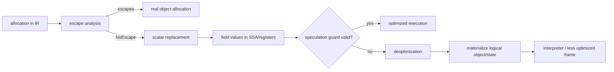
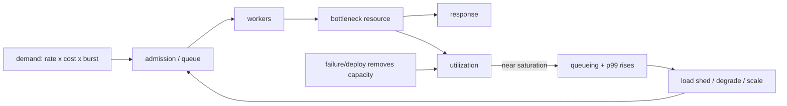

# 2026-09-22 03:00 — Interview Study Packages

README ve yakın `daily/2026-09-22/02-00.md` kontrol edildi. Önceki Linux memory reclaim/PSI ve event-time/watermark konuları tekrar edilmedi. Repo çapı aramada NUMA'nın Kubernetes/TLB bağlamında değinilmiş olduğu, deterministic distributed-system testing'in ise zaten canonical chapter'a sahip olduğu görüldü; bu yüzden yeni paket olarak seçilmediler. Bu turun iki boşluğu: runtime escape analysis/scalar replacement ve SRE capacity modeling/queueing.

## Paket 1 — Mid → Principal Compiler/Runtime: Escape Analysis, Scalar Replacement & Deoptimization
**Süre:** 20–30 dk

### Konu anlatımı
JIT derleyicinin bir allocation gördüğünde ilk sorusu yalnız “heap mi stack mi?” değildir. Daha güçlü soru şudur: bu nesnenin kimliği programın gözlemlenebilir davranışı için gerçekten gerekli mi? Escape analysis bir nesne referansının method/thread sınırlarından kaçıp kaçmadığını yaklaşık olarak belirler. HotSpot terminolojisinde `NoEscape`, `ArgEscape` ve `GlobalEscape` gibi sınıflamalar optimizasyon kararlarına girdi olur.

Nesne kaçmıyorsa JIT allocation'ı tamamen ortadan kaldırıp alanlarını ayrı SSA/scalar değerler olarak taşıyabilir: scalar replacement. Bu, “heap allocation stack'e taşındı” demek değildir; HotSpot dokümantasyonu scalar-replaceable allocation'ların elimine edilebildiğini ve HotSpot'ın bunu genel bir stack-allocation dönüşümü olarak yapmadığını açıkça ayırır. Aynı analiz lock elision gibi optimizasyonlara da fırsat verebilir.

Speculative optimization nedeniyle compiled code bir guard'ın artık geçerli olmadığını keşfederse deoptimization ile interpreter/baseline state'e dönebilir. Scalar-replaced nesnenin fiziksel heap objesi yoksa runtime deopt sırasında gerekli logical object state'ini yeniden materialize edebilmelidir. Bu yüzden escape analysis, debug metadata, safepoint/deopt metadata ve GC/runtime zinciri birbirinden bağımsız değildir.

### Mental model
Escape analysis “bu kutuyu dışarıdan biri görebilir mi?” sorusudur. Kimse kutunun kimliğini gözlemleyemiyorsa derleyici kutuyu üretmeden içindeki değerleri taşıyabilir. Deoptimization ise optimize edilmiş sahneden kaynak dil/JVM state'ine geri dönüş sözleşmesidir; ortadan kaldırılan kutu gerekiyorsa yeniden kurulmalıdır.

### İçeride ne oluyor?
1. IR üzerinde allocation/reference kullanım grafiği analiz edilir; conservative alias/call sınırları optimizasyonu kısıtlayabilir.
2. NoEscape nesne scalar-replaceable ise allocation ve field load/store'lar scalar SSA değerlerine dönüşebilir.
3. Object identity, reflection/JVMTI, uncommon control-flow merge'leri veya karmaşık escape yolları optimizasyonu sınırlayabilir.
4. Lock yalnız thread-local/non-escaping nesneyi koruyorsa bazı lock operasyonları elimine edilebilir.
5. Deopt metadata logical locals, operand stack ve virtual/scalar-replaced object state'ini yeniden kurmaya yetecek bilgiyi taşır.
6. Escape analysis bir semantic guarantee değil compiler optimization'dır; kod doğruluğu optimizasyonun gerçekleşmesine bağlı olmamalıdır.

### Yüksek getirili mülakat soruları
- Escape analysis hangi problemi çözer?
- Scalar replacement ile stack allocation neden aynı şey değildir?
- Mid: object identity hangi optimizasyonları engelleyebilir?
- Senior: inlining escape analysis'i neden güçlendirebilir?
- Senior: scalar-replaced object deoptimization sırasında nasıl geri oluşturulur?
- Staff: allocation rate düştüğü halde latency neden mutlaka düşmeyebilir?
- Principal: JIT optimizasyonlarını fleet-level performans standardına dönüştürürken benchmark, observability ve rollback politikasını nasıl kurarsın?

### Seviyeye göre cevap derinliği
- **Mid:** escape/no-escape, allocation elimination, scalar replacement.
- **Senior:** inlining, aliasing, lock elision, speculative optimization ve deopt bağlantısı.
- **Staff:** GC allocation pressure, profiling/JIT warmup, deopt storms ve benchmark tasarımı.
- **Principal:** runtime/version rollout, workload çeşitliliği, regression gates ve cost/latency ekonomisi.

### Kısa alıştırma
Hot loop içinde her iterasyonda iki alanlı `Point` oluşturup yalnız `x+y` döndüren kod ile nesneyi global listeye ekleyen sürümü karşılaştır. Hangi sürümde allocation elimination beklediğini ve nedenini yaz; sonra identity/hash/reflection gibi gözlemlenebilirliklerin varsayımı nasıl bozabileceğini tartış.

### Proje fikri
`escape-lab`: JMH ile kısa ömürlü immutable value-object benchmark'ları oluştur. Escape eden/etmeyen, inline edilen/edilmeyen varyantlarda allocation rate, GC pressure ve p99 ölç; JIT compilation/deoptimization loglarıyla korele et.

### Failure modes / trade-off / production bağlantısı
Microbenchmark'ta dead-code elimination sonucu sahte hızlanma üretmek kolaydır. “JIT kesin stack allocate eder” varsayımı implementation detail'e bağımlıdır. Aşırı polymorphism/inlining sınırları EA fırsatını yok edebilir; deopt storm tail latency'yi bozabilir. Production'da allocation rate, GC pause/concurrent-cycle maliyeti, JIT compilation, deoptimization, CPU ve p95/p99 birlikte değerlendirilmelidir.

### Kaynaklar
- Oracle Java 24 — HotSpot VM Performance Enhancements / Escape Analysis: https://docs.oracle.com/en/java/javase/24/vm/java-hotspot-virtual-machine-performance-enhancements.html
- OpenJDK — HotSpot Escape Analysis and Scalar Replacement Status: https://cr.openjdk.org/~cslucas/escape-analysis/EscapeAnalysis.html

---

## Paket 2 — Junior → CTO SRE/System Design: Capacity Modeling, Queueing, Headroom & Overload
**Süre:** 20–30 dk

### Konu anlatımı
Capacity planning “kaç QPS kaldırıyoruz?” sorusundan daha geniştir. Bir servisin talebi request rate, request başına maliyet, concurrency ve burstiness ile; kapasitesi CPU, memory, I/O, downstream limitleri ve latency hedefiyle tanımlanır. Aynı QPS iki farklı request mix'inde tamamen farklı CPU veya DB maliyeti üretebilir.

Basit bir başlangıç mental modeli Little's Law'dır: kararlı durumda sistemdeki ortalama iş sayısı yaklaşık `L = λW`; örneğin 2,000 req/s ve 50 ms ortalama service/residence time yaklaşık 100 concurrent request demektir. Fakat utilization doygunluğa yaklaştıkça queueing delay doğrusal davranmaz; küçük bir kapasite kaybı veya burst p99'u patlatabilir.

Bu yüzden production capacity “benchmark max QPS” değildir. Hedef latency/SLO altında sustainable throughput, failure sırasında gereken headroom, deploy sırasında eksilen instance'lar, zonal loss, autoscaling gecikmesi ve downstream bottleneck birlikte düşünülür. Google SRE rehberi capacity planning'i performance testing ile birleştirmeyi ve breaking point'i bilmenin cascading failure riskini azalttığını vurgular; ayrıca uzun queue'ların memory ve latency büyüttüğünü, overload altında erken reject/degrade davranışının gerekli olabildiğini anlatır.

### Mental model
Capacity bir hız limiti değil, latency hedefiyle birlikte tanımlanan güvenli çalışma zarfıdır. Headroom boşuna duran kapasite değil; burst, deploy ve failure için satın alınmış opsiyondur. Queue ise kapasite yaratmaz, yalnız işi geleceğe taşır.

### İçeride ne oluyor?
1. Demand'i yalnız QPS değil weighted work units veya dominant-resource maliyetiyle modellemek gerekebilir.
2. Load test saturation knee'ini, latency curve'ünü ve ilk bottleneck'i ortaya çıkarır.
3. Little's Law concurrency/latency/rate ilişkisi için sanity check sağlar; dağılım ve burst davranışını tek başına çözmez.
4. Queue büyütmek kısa burst'leri absorbe edebilir fakat sustained overload'da latency ve memory'yi büyütür.
5. Autoscaling reactive ise provisioning/warmup gecikmesi boyunca headroom gerekir.
6. N+1/N+2 veya zonal-loss senaryoları peak demand ile birlikte test edilmelidir.
7. Load shedding, admission control, priority ve graceful degradation kapasite tükendiğinde sistemin kontrollü başarısız olmasını sağlar.

### Yüksek getirili mülakat soruları
- Throughput, concurrency ve latency nasıl ilişkilidir?
- Neden max benchmark QPS production capacity değildir?
- Mid: queue büyütmek ne zaman faydalı, ne zaman zararlıdır?
- Senior: autoscaling varsa neden headroom hâlâ gerekir?
- Staff: zonal failure sırasında kapasite planını nasıl doğrularsın?
- Principal: request mix değişince QPS tabanlı capacity modelini nasıl düzeltirsin?
- CTO: %20 ek headroom'un cloud maliyetini hangi revenue/reliability riskiyle kıyaslarsın?

### Seviyeye göre cevap derinliği
- **Junior:** throughput, latency, utilization, queue kavramları.
- **Mid:** Little's Law, bottleneck ve load-test curve.
- **Senior:** saturation knee, burst, autoscaling lag, load shedding.
- **Staff/Principal:** multi-region/zonal failure, weighted demand model, capacity SLO ve release gates.
- **CTO:** headroom maliyeti, growth forecast, revenue-at-risk ve reliability budget arasında portföy kararı.

### Kısa alıştırma
Bir instance SLO altında 400 req/s taşıyor; peak 4,800 req/s. Bir zone kaybında kapasitenin %33'ü gidecek ve deploy sırasında ayrıca bir instance unavailable olabilecek. En az instance sayısını yalnız bölme işlemiyle değil, failure headroom ve autoscaling gecikmesi varsayımlarını yazarak hesapla.

### Proje fikri
`capacity-envelope-lab`: küçük HTTP servisine ucuz/pahalı request mix'i ekle. k6/vegeta benzeri yükle utilization–throughput–p99 eğrisi çıkar; bounded queue, admission control ve autoscaling benzetimiyle saturation knee ve rejected-work maliyetini raporla.

### Failure modes / trade-off / production bağlantısı
Ortalama latency p99 çöküşünü saklar. QPS request cost değişimini gizler. Uzun queue overload'u daha geç ama daha yıkıcı gösterir. Autoscaler kendi ölçüm gecikmesine yenilebilir. Aşırı headroom maliyeti büyütür; yetersiz headroom cascading failure riskini artırır. Production dashboard'u demand mix, concurrency, queue depth/age, utilization, rejected/degraded traffic, p95/p99 ve downstream saturation'ı birlikte göstermelidir.

### Kaynaklar
- Google SRE — Addressing Cascading Failures: https://sre.google/sre-book/addressing-cascading-failures/
- Google SRE — Handling Overload: https://sre.google/sre-book/handling-overload/
- Google SRE — Production Environment / capacity example: https://sre.google/sre-book/production-environment/
