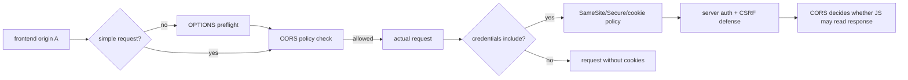
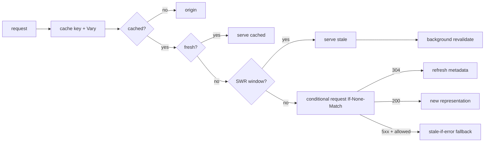

# 2026-09-22 04:00 — Interview Study Packages

README ve yakın `daily/2026-09-22/03-00.md` kontrol edildi. Escape analysis/scalar replacement ve capacity modeling/queueing tekrar edilmedi. Repo çapı aramada eBPF ve PostgreSQL SSI gibi adayların zaten canonical işlendiği görüldü. Bu turun iki boşluğu: browser security boundary olarak CORS/cookie/CSRF etkileşimi ve HTTP cache correctness/availability tasarımı.

## Paket 1 — Junior → Staff Frontend/Backend/Cybersecurity: CORS, Preflight, Credentialed Requests, SameSite & CSRF
**Süre:** 20–30 dk

### Konu anlatımı
CORS bir authentication veya CSRF mekanizması değildir; browser'ın **cross-origin response'u frontend JavaScript'e açıp açmayacağını** yöneten Fetch-protocol katmanıdır. Same-origin policy temel izolasyondur; CORS server'ın kontrollü gevşetme sinyalidir. Bazı cross-origin isteklerde browser actual request'ten önce `OPTIONS` preflight göndererek method/header iznini sorar.

Credentialed cross-origin fetch ayrı dikkat ister. Fetch standardına göre preflight request'in credentials mode'u `same-origin` olduğundan preflight credential taşımaz; fakat actual request `credentials: include` kullanabilir. Bu durumda server wildcard `Access-Control-Allow-Origin: *` yerine explicit origin döndürmeli ve `Access-Control-Allow-Credentials: true` ile opt-in etmelidir.

Cookie gönderimi ise CORS'tan bağımsız cookie kurallarına da tabidir. `SameSite` cross-site context'te cookie'nin gönderilip gönderilmeyeceğini sınırlar. `SameSite=None` cross-site kullanıma izin verir ama `Secure` gerektirir. Bu nedenle “CORS açık, cookie niye gitmedi?” sorusunun cevabı credentials mode, SameSite, Secure ve third-party-cookie policy zincirinde olabilir.

### Mental model
CORS = “JavaScript cevabı okuyabilir mi?”, cookies = “browser credential gönderir mi?”, CSRF defense = “server bu state-changing isteğin meşru kullanıcı niyeti olduğunu nasıl doğrular?” Bunları tek güvenlik özelliği gibi düşünme.

### İçeride ne oluyor?
1. Origin scheme + host + port üçlüsüdür; site/SameSite kavramı bununla aynı değildir.
2. Non-simple method/header kombinasyonları preflight tetikleyebilir; browser policy cevabını cache'leyebilir.
3. Credentialed CORS'ta explicit allowed origin ve credentials opt-in gerekir; wildcard origin kullanılamaz.
4. `fetch` credentials default'u `same-origin` olduğundan cross-origin cookie için çoğu senaryoda `include` gerekir.
5. `SameSite=Lax/Strict` cross-site cookie akışını kısıtlar; `None` cross-site akışa izin verir ve `Secure` ister.
6. CORS CSRF'yi tek başına çözmez. SameSite defense-in-depth'tir; state-changing işlemlerde CSRF token/origin validation gibi uygulama kontrolleri gerekebilir.

### Yüksek getirili mülakat soruları
- SOP ile CORS arasındaki fark nedir?
- Preflight neden vardır ve actual request'ten nasıl farklıdır?
- Neden credentialed CORS ile `Access-Control-Allow-Origin: *` kullanamazsın?
- `credentials: include` verdiğin halde cookie neden gitmeyebilir?
- CORS neden CSRF koruması değildir?
- Senior: allowlist'te request `Origin` değerini körlemesine reflect etmek neden risklidir?
- Staff: SPA + API farklı origin'lerdeyse session-cookie mimarisini nasıl tasarlar, debug eder ve gözlemlersin?

### Seviyeye göre cevap derinliği
- **Junior:** origin/SOP, basit CORS fikri, preflight.
- **Mid:** credentials mode, ACAO/ACAC, SameSite/Secure.
- **Senior:** CSRF ayrımı, origin allowlist, proxy/cache `Vary: Origin`, third-party-cookie davranışı.
- **Staff:** browser/API trust boundary, cookie scope, BFF alternatifi, migration ve telemetry.

### Kısa alıştırma
`app.example` frontend'i `api.example` API'sine session cookie ile `POST` atıyor. Sonra frontend `app.partner.test` alanına taşınıyor. Gerekli Fetch, CORS ve cookie ayarlarını yaz; CSRF için hangi ek kontrolü koyacağını açıkla.

### Proje fikri
`cors-cookie-lab`: iki farklı local origin kur. Simple/preflight request, `credentials: include`, explicit/wildcard ACAO ve `SameSite=Lax/None` kombinasyonlarını test eden küçük bir matrisi otomatikleştir; browser network trace'leriyle sonucu belgeleyip güvenli baseline çıkar.

### Failure modes / trade-off / production bağlantısı
- `Origin` header'ını doğrulamadan response'a yansıtmak allowlist'i anlamsızlaştırabilir.
- Preflight başarısızlığını backend 5xx sanmak yanlış teşhistir.
- `SameSite=None` geniş cookie yüzeyi yaratır; CSRF ve third-party-cookie policy etkisini düşünmek gerekir.
- CDN/proxy origin'e göre farklı CORS response cache'liyorsa cache key/`Vary` yanlışlığı başka origin'e yanlış policy taşıyabilir.
- Production'da preflight failure rate, CORS-denied client errors, auth/session failure, CSRF rejection ve origin dağılımı birlikte izlenmelidir.

### Birincil / güncel kaynaklar
- WHATWG Fetch Standard — CORS protocol & credentials: https://fetch.spec.whatwg.org/
- MDN — CORS: https://developer.mozilla.org/en-US/docs/Web/HTTP/Guides/CORS
- MDN — Set-Cookie / SameSite: https://developer.mozilla.org/en-US/docs/Web/HTTP/Reference/Headers/Set-Cookie
- OWASP — Session Management Cheat Sheet: https://cheatsheetseries.owasp.org/cheatsheets/Session_Management_Cheat_Sheet.html

---

## Paket 2 — Mid → Principal Backend/System Design: HTTP Cache Revalidation, ETag, Vary, stale-while-revalidate & stale-if-error
**Süre:** 20–30 dk

### Konu anlatımı
HTTP caching “TTL koy ve unut” değildir. Cache correctness üç soruya ayrılır: **hangi representation aynı cache key'e ait**, **ne kadar süre fresh**, **stale olduğunda nasıl validate/fallback edilir**. RFC 9111 freshness hesabında shared cache için `s-maxage`, sonra `max-age`, sonra `Expires` gibi explicit metadata'yı kullanır. Stale response hemen çöpe atılmak zorunda değildir; validator varsa conditional request ile revalidation yapılabilir.

`ETag` representation sürümünü tanımlayan validator'dır. Cache `If-None-Match` gönderir; değişmediyse origin `304 Not Modified` ile body taşımadan metadata'yı yenileyebilir. `Vary`, URL dışında hangi request header'larının representation seçimini etkilediğini cache'e bildirir; eksik `Vary` yanlış kullanıcı/dil/encoding varyantının paylaşılmasına, aşırı `Vary` ise hit ratio'nun çökmesine yol açabilir.

RFC 5861 `stale-while-revalidate` ile cache'in kısa süre stale cevabı servis ederken arka planda revalidate etmesine, `stale-if-error` ile belirli upstream hatalarında kontrollü stale fallback'e izin verir. Bunlar latency/availability kazandırır ama freshness bütçesini bilinçli biçimde genişletir.

### Mental model
Cache policy bir **bounded staleness contract**'tır. `max-age` normal freshness bütçesi, validator ucuz doğrulama mekanizması, `stale-while-revalidate` latency bütçesi, `stale-if-error` availability bütçesidir. `Vary` ise “aynı URL'nin hangi varyantları birbirinden ayrı tutulmalı?” sorusudur.

### İçeride ne oluyor?
1. Cache response'u method/target ve `Vary` tarafından etkilenmiş request alanlarıyla eşler.
2. `Age` response'un üretiminden beri geçen süreyi freshness hesabına taşır.
3. Fresh entry doğrudan reuse edilir; stale entry validator ile revalidate edilebilir.
4. Strong/weak ETag semantics farklı use-case'lere uygundur; ETag opaque validator olarak ele alınmalıdır.
5. SWR sırasında kullanıcı stale response alabilirken cache async revalidation başlatabilir.
6. `stale-if-error` 500/502/503/504 gibi hata durumlarında availability'yi artırabilir; ödeme/bakiye gibi strict-fresh veride riskli olabilir.

### Yüksek getirili mülakat soruları
- `no-cache` ile `no-store` neden aynı değildir?
- `ETag` + `If-None-Match` bandwidth'i nasıl azaltır?
- `Vary` cache correctness'i nasıl korur ve hit ratio'yu nasıl bozabilir?
- `stale-while-revalidate` tail latency'yi nasıl etkiler?
- `stale-if-error` hangi endpoint'lerde tehlikelidir?
- Senior: cache stampede ile revalidation nasıl etkileşir?
- Principal: CDN/browser/service cache katmanlarında freshness ve invalidation sözleşmesini nasıl standardize edersin?

### Seviyeye göre cevap derinliği
- **Mid:** fresh/stale, max-age, ETag/304.
- **Senior:** `Vary`, shared/private cache, SWR/SIE, stampede.
- **Staff:** multi-layer cache key, purge/versioning, observability ve correctness testing.
- **Principal:** endpoint sınıflarına göre freshness/availability policy, organization-wide cache contract ve incident rollback.

### Kısa alıştırma
Ürün kataloğu 60 sn stale olabilir, fiyat 5 sn, stok ise checkout sırasında fresh olmalı. Browser/CDN için `Cache-Control`, validator ve fallback politikasını üç endpoint için ayrı tasarla.

### Proje fikri
`http-cache-lab`: ETag üreten küçük origin + reverse proxy kur. `max-age`, `Vary: Accept-Language`, SWR ve SIE senaryolarında origin request count, bytes transferred, p95/p99 ve stale-served oranını ölç; yanlış `Vary` ile bilinçli correctness bug üretip testle yakala.

### Failure modes / trade-off / production bağlantısı
- Yanlış cache key tenant/user verisi sızdırabilir; personalization shared cache'te özel dikkat ister.
- Çok uzun TTL rollback'i geciktirir; çok kısa TTL origin yükünü artırır.
- Her header'ı `Vary`'a koymak cache fragmentation yaratır.
- SWR/SIE stale veri penceresini genişletir; domain freshness toleransıyla eşleşmelidir.
- Production'da hit ratio, revalidation/304 ratio, origin offload, cache age, stale-served count, purge latency ve yanlış-varyant incident'leri izlenmelidir.

### Birincil / güncel kaynaklar
- RFC 9111 — HTTP Caching: https://www.rfc-editor.org/rfc/rfc9111.html
- RFC 9110 — HTTP Semantics / conditional requests: https://www.rfc-editor.org/rfc/rfc9110.html
- RFC 5861 — stale-while-revalidate / stale-if-error: https://www.rfc-editor.org/rfc/rfc5861.html
- MDN — HTTP caching: https://developer.mozilla.org/en-US/docs/Web/HTTP/Guides/Caching
