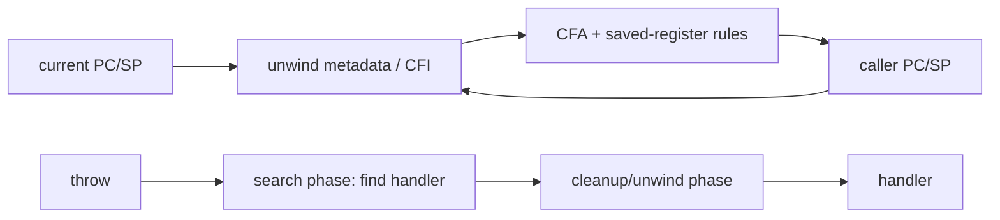
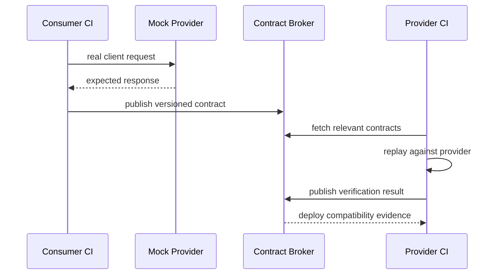

# 2026-09-22 05:00 — Interview Study Packages

README ve yakın `daily/2026-09-22/04-00.md` kontrol edildi. CORS/cookie/CSRF ve HTTP cache revalidation tekrar edilmedi. Repo aramasında doğrudan canonical karşılığı bulunmayan iki boşluk seçildi: runtime zincirinde stack unwinding/exception ABI ve testing engineering'de consumer-driven contract testing.

## Paket 1 — Mid → Principal Foundations/Runtime: Stack Unwinding, DWARF CFI & Exception ABI
**Süre:** 20–30 dk

### Konu anlatımı
Bir exception, profiler veya crash reporter stack'i “sihirli” biçimde okumaz. Runtime'ın mevcut frame'den caller frame'e nasıl döneceğini bilmesi gerekir. Modern native toolchain'lerde compiler/linker, register ve stack durumunun nasıl geri kurulacağını anlatan unwind metadata üretir. DWARF Call Frame Information (CFI), Canonical Frame Address ve register recovery kurallarıyla bu yürüyüşü tarif eder.

C++ exception handling iki ayrı işi birleştirir: uygun handler'ı bulmak ve stack'i güvenli biçimde unwind ederek cleanup/destructor çalıştırmak. ABI bu işin compiler, runtime library ve linker arasında uyumlu olmasını sağlar. “Zero-cost exceptions” ifadesi throw'un ücretsiz olduğu anlamına gelmez; normal control-flow'da explicit exception check maliyetini azaltmayı, maliyetin metadata ve exceptional path'e taşınmasını anlatır.

Frame pointer ile unwind metadata aynı şey değildir. Frame pointer bazı profiller/debug senaryolarını kolaylaştırabilir; fakat optimize edilmiş kodda güvenilir unwinding için platform ABI'si ve unwind tables kritik olabilir. Tail-call optimization, inlining, signal/interrupt frame'leri ve JIT code bu mental modeli zorlaştırır.

### Mental model
Stack unwinding = “bu instruction noktasından caller state'ini yeniden kurma protokolü”. Exception ABI = “compiler'ın ürettiği metadata ile runtime unwinder'ın aynı dili konuşması”.

### İçeride ne oluyor?
1. Compiler prologue/epilogue ve register-save kararlarına uygun unwind bilgisi üretir.
2. Linker ilgili unwind section'larını executable/shared object içine taşır.
3. Unwinder instruction pointer'a göre frame bilgisini bulur.
4. CFA ve register recovery kuralları caller state'ini reconstruct eder.
5. Exception runtime önce uygun landing pad/handler'ı arayabilir, sonra cleanup/destructor çalıştırarak frame'leri açar.
6. JIT runtime'ları ürettikleri code için stack-map/unwind bilgisini runtime'a kaydetmek zorundadır.

### Yüksek getirili mülakat soruları
- Stack trace oluşturmak için runtime hangi bilgilere ihtiyaç duyar?
- Frame pointer ile DWARF unwind metadata arasındaki fark nedir?
- “Zero-cost exception” neyi ifade eder, neyi etmez?
- Senior: inlining ve tail-call optimization stack trace'i nasıl etkiler?
- Senior: neden exception ABI compiler ve runtime arasında bir sözleşmedir?
- Staff: mixed native/JIT stack'lerde profiling ve crash unwinding'i nasıl tasarlarsın?
- Principal: observability için frame-pointer policy ile binary-size/performance trade-off'unu nasıl standardize edersin?

### Seviyeye göre cevap derinliği
- **Mid:** call stack, saved registers, caller reconstruction.
- **Senior:** CFI/CFA, exception search/cleanup, optimization etkileri.
- **Staff:** JIT registration, async profiling, stripped symbols ve crash pipeline.
- **Principal:** fleet-wide build policy, debuginfo retention, symbol server, overhead ve incident MTTR.

### Kısa alıştırma
Üç frame'li basit bir call chain çiz. Her frame için SP, return address ve iki callee-saved register varsay. Caller state'inin hangi metadata ile reconstruct edileceğini yaz; sonra frame pointer kaldırıldığında hangi bilginin unwind table'a taşınması gerektiğini açıkla.

### Proje fikri
`unwind-lab`: küçük bir C/C++ programını debug/release, frame-pointer açık/kapalı varyantlarda derle. `readelf --debug-dump=frames`, debugger backtrace ve profiler çıktısını karşılaştır; binary-size ve stack-trace farklarını raporla.

### Failure modes / trade-off / production bağlantısı
- Eksik/bozuk unwind metadata crash reporter'ın stack'i yarıda kesmesine yol açabilir.
- Aggressive optimization source-level frame'leri fiziksel frame'lerle birebir eşleştirmez.
- Symbol stripping deployment boyutunu düşürür ama ayrı debug-symbol saklama zinciri gerektirir.
- Frame pointer tutmak observability'yi kolaylaştırabilir fakat target/workload'a göre register/optimization maliyeti yaratabilir.
- Production'da build-id, symbol server, debuginfo retention ve profiler/crash-reporter doğruluğu aynı release pipeline'ın parçası olmalıdır.

### Birincil kaynaklar
- GCC Internals — exception unwind mechanisms: https://gcc.gnu.org/onlinedocs/gccint/
- Itanium C++ ABI — Exception Handling: https://itanium-cxx-abi.github.io/cxx-abi/abi-eh.html
- DWARF Standard: https://dwarfstd.org/

---

## Paket 2 — Mid → Staff Testing/Backend: Consumer-Driven Contract Testing & Safe API Evolution
**Süre:** 20–30 dk

### Konu anlatımı
Schema validation ile contract testing aynı problem değildir. OpenAPI gibi schema/specification bir API'nin izin verdiği geniş yüzeyi tarif edebilir; consumer-driven contract (CDC) ise gerçek bir consumer'ın provider'dan hangi interaction ve davranışlara bağımlı olduğunu executable örneklerle kaydeder. Amaç tüm sistemi uçtan uca deploy edip brittle integration suite çalıştırmadan consumer-provider uyumluluğunu CI'da doğrulamaktır.

Pact modelinde consumer gerçek API client kodunu mock provider'a karşı çalıştırır ve kullanılan interaction'lardan contract üretir. Provider CI bu contract'ları gerçek provider implementation'a replay ederek doğrular. Broker/registry contract ve verification sonuçlarını versiyonlar; release gate “bu consumer/provider sürümleri doğrulanmış mı?” sorusuna cevap verebilir.

Contract'ı fazla strict yazmak testleri kırılganlaştırır. Consumer'ın gerçekten ihtiyaç duymadığı response alanlarını exact match etmek provider'ın güvenli değişikliklerini engeller. Tersine, sadece schema test etmek semantic beklentileri kaçırabilir: status code, gerekli header, belirli provider state veya consumer'ın branch ettiği enum değerleri gibi.

### Mental model
Schema = “hangi mesajlar biçimsel olarak geçerli olabilir?” Contract test = “bu consumer gerçekte hangi interaction'a güveniyor ve provider bunu hâlâ karşılıyor mu?”

### İçeride ne oluyor?
1. Consumer test gerçek client adapter'ını mock provider'a karşı çalıştırır.
2. Interaction request, minimal expected response ve provider state ile kaydedilir.
3. Contract consumer version'ıyla publish edilir.
4. Provider CI ilgili consumer contract'larını indirir ve endpoint'e replay eder.
5. Verification sonucu publish edilir; deployment gate compatibility graph'ını kullanabilir.
6. Async/message contract'larında aynı fikir request/response yerine message payload/metadata'ya uygulanır.

### Yüksek getirili mülakat soruları
- Contract test ile end-to-end integration test arasındaki fark nedir?
- OpenAPI schema validation neden tek başına CDC'nin yerini tutmaz?
- Consumer neden yalnızca gerçekten kullandığı response alanlarını contract'a koymalı?
- Senior: provider state nedir ve test determinism'i için neden önemlidir?
- Senior: mobile client'lar eski sürümlerde aylarca kaldığında compatibility gate nasıl değişir?
- Staff: yüzlerce service ve consumer için contract ownership/versioning'i nasıl yönetirsin?
- Staff: contract test hangi bug sınıflarını yakalamaz?

### Seviyeye göre cevap derinliği
- **Mid:** consumer/provider, executable contract ve provider verification.
- **Senior:** loose matching, provider states, versioning, async messages ve schema-vs-behavior ayrımı.
- **Staff:** broker governance, deployment gates, multi-version consumers ve ownership.

### Kısa alıştırma
Bir mobile consumer `GET /users/{id}` cevabından yalnızca `id`, `name` ve `status` kullanıyor. Provider response'a `last_login` ekliyor, `status` enum'una yeni değer ekliyor ve `name` alanını nullable yapmak istiyor. Hangi değişikliklerin contract açısından güvenli olduğunu consumer davranışına göre ayrı ayrı tartış.

### Proje fikri
`contract-evolution-lab`: iki küçük service kur. Consumer testinden contract üret, provider CI'da verify et. Sonra additive field, field removal, enum expansion ve type change yaparak hangi değişikliklerin gerçek consumer'ı kırdığını göster; schema-diff sonucu ile CDC sonucunu karşılaştır.

### Failure modes / trade-off / production bağlantısı
- UI/business logic'i contract test içine taşımak interaction patlaması ve brittle suite yaratır.
- Exact response matching provider'ı gereksiz yere kilitler.
- Provider verification geçse bile auth, network, timeout, data migration ve multi-service workflow bug'ları kalabilir; E2E tamamen ortadan kalkmaz.
- Eski mobile/desktop consumer sürümleri compatibility window'u uzatır.
- Production'da contract verification sonucu, deployed version graph, consumer usage telemetry ve deprecation policy birlikte yönetilmelidir.

### Birincil / güncel kaynaklar
- Pact — Introduction: https://docs.pact.io/
- Pact — Consumer tests: https://docs.pact.io/consumer
- Pact — Provider verification: https://docs.pact.io/getting_started/verifying_pacts
- OpenAPI Specification: https://spec.openapis.org/oas/
