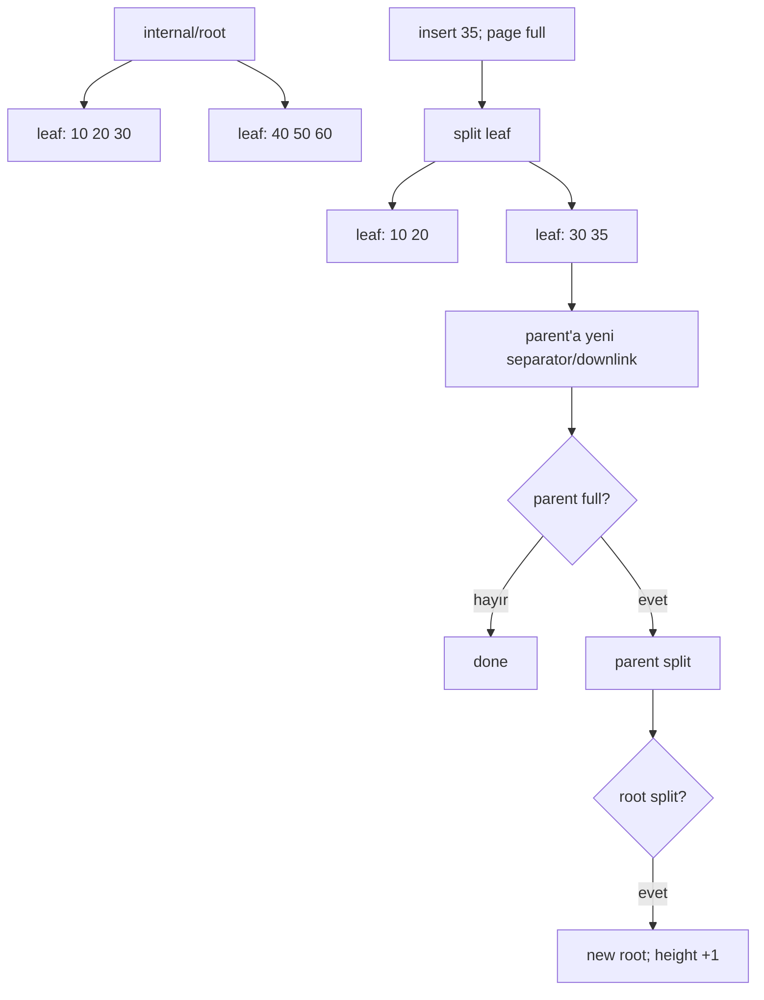
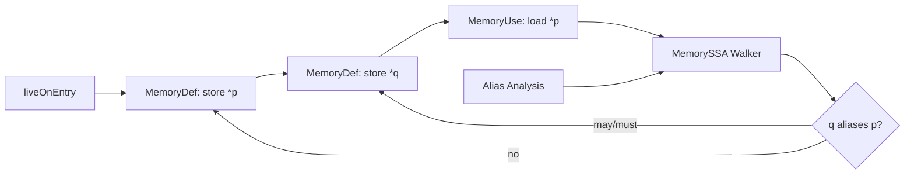

# 2026-09-22 06:00 — Interview Study Packages

README ve yakın `daily/2026-09-22/05-00.md` kontrol edildi. Stack unwinding/exception ABI ve consumer-driven contract testing tekrar edilmedi. Repo aramasında CFS/EEVDF'nin zaten canonical olduğu görüldü; bu tur iki temel boşluğa odaklanıyor: B+Tree page split/height growth ve compiler middle-end'de MemorySSA/alias analysis.

## Paket 1 — Junior → Principal Databases: B+Tree Page Split, Separator Keys & Height Growth
**Süre:** 20–30 dk

### Konu anlatımı
B+Tree'nin production değerini yalnızca `O(log n)` diye açıklamak eksiktir. Asıl fikir, disk/buffer-pool page boyutuna uygun yüksek fan-out ile ağacın sığ kalmasıdır. Internal page'ler arama yönlendiren separator/downlink'leri, leaf page'ler ise sıralı index entry'lerini taşır. Bir leaf'e yeni entry sığmazsa page split gerekir: entry'lerin bir bölümü yeni sibling page'e taşınır ve parent'a yeni child'ı ayıran bir separator/downlink eklenir.

Parent da doluysa split yukarı doğru cascade edebilir. Root split olduğunda yeni root oluşur ve ağacın yüksekliği bir artar. Bu olay pahalı olabilir ama her insert'te olmaz; yüksek fan-out nedeniyle height tipik olarak küçüktür. PostgreSQL 18 dokümantasyonu leaf/internal page ayrımını, level'ların doubly-linked page listeleri olmasını ve split'in parent/root'a kadar cascade edebilmesini açıklar.

Deletion tarafında textbook 'merge hemen yapılır' modeli production engine'lerde fazla basittir. MVCC version churn, garbage index tuples, deduplication ve vacuum/cleanup politikaları split baskısını etkiler. PostgreSQL bottom-up index deletion ile beklenen bazı version-churn split'lerini önlemeye çalışır.

### Mental model
B+Tree = “RAM pointer tree” değil, page-oriented sorted routing structure. Split = local capacity overflow'un structural değişikliğe dönüşmesi; root split = height artışının tek kapısı.

### İçeride ne oluyor?
1. Search root'tan leaf'e separator/downlink'lerle iner.
2. Leaf'te insertion position bulunur.
3. Yeterli free space varsa entry page'e eklenir.
4. Page doluysa yeni sibling allocate edilir ve key/entry'ler bölüştürülür.
5. Parent'a yeni child için separator/downlink eklenir.
6. Parent overflow ederse aynı süreç yukarı taşınır.
7. Root overflow ederse yeni root yaratılır.
8. Production engine concurrency, WAL/crash safety, MVCC garbage ve page cleanup ile bu algoritmayı birlikte yönetir.

### Yüksek getirili mülakat soruları
- B+Tree neden binary search tree yerine database index'lerinde uygundur?
- Internal node ile leaf node arasındaki fark nedir?
- Page split nasıl çalışır ve neden parent'ı etkileyebilir?
- Mid: root split neden tree height'i artırır?
- Senior: random insert ile monotonik insert split/locality davranışını nasıl değiştirir?
- Senior: MVCC version churn neden index bloat/split baskısı yaratabilir?
- Staff: hot-page contention, fill factor, WAL volume ve page split latency'yi nasıl gözlemlersin?
- Principal: index tasarımı ile write amplification/read latency/storage cost arasında nasıl politika kurarsın?

### Seviyeye göre cevap derinliği
- **Junior:** sorted pages, fan-out, logarithmic traversal.
- **Mid:** leaf/internal ayrımı, separator/downlink ve cascading split.
- **Senior:** page locality, MVCC churn, dedup/cleanup, write amplification.
- **Staff:** concurrent split safety, WAL, buffer pool, observability ve workload shape.
- **Principal:** index portfolio, storage economics, operational policy ve migration risk.

### Kısa alıştırma
Her leaf'in en fazla 4 key tuttuğu küçük bir B+Tree çiz. `10,20,30,40,50,35,25` insert'lerini sırayla uygula; hangi adımda leaf split olduğunu, parent separator'ın nasıl değiştiğini ve hangi koşulda root split olacağını işaretle.

### Proje fikri
`btree-page-lab`: sabit page kapasitesine sahip küçük bir B+Tree simülatörü yaz. Sequential ve random key workload'larında height, split count, average occupancy ve write count ölç. Sonra basit bir fill-factor parametresi ekleyip trade-off'u raporla.

### Failure modes / trade-off / production bağlantısı
- Düşük occupancy daha fazla page/I/O; aşırı doluluk ise insert sırasında split baskısı yaratır.
- Random write workload locality'yi bozabilir; monotonik key workload sağ kenarı hot spot yapabilir.
- MVCC garbage temizlenmezse gereksiz split ve scan maliyeti doğabilir.
- Split yalnızca CPU işi değildir: dirty page, WAL, buffer-pool pressure ve contention üretir.
- Production'da index size/bloat, page split eğilimi, buffer hit ratio, WAL bytes ve write latency birlikte izlenmelidir.

### Birincil / güncel kaynaklar
- PostgreSQL 18 — B-Tree Indexes / Implementation: https://www.postgresql.org/docs/18/btree.html
- PostgreSQL source — `src/backend/access/nbtree/README`: https://github.com/postgres/postgres/blob/master/src/backend/access/nbtree/README

---

## Paket 2 — Mid → Principal Compiler/Runtime: MemorySSA, Alias Analysis & Memory Dependence
**Süre:** 20–30 dk

### Konu anlatımı
Klasik SSA register/value dünyasında her assignment yeni bir version üretir ve phi node control-flow birleşimlerinde hangi version'ın geldiğini ifade eder. Memory daha zordur: iki pointer aynı location'ı gösterebilir, function call görünmeyen state'i değiştirebilir ve load/store ilişkisini anlamadan compiler güvenli code motion veya dead-store elimination yapamaz.

LLVM MemorySSA, memory operasyonları üzerine sanal bir SSA katmanı kurar. Temel düğümler `MemoryDef`, `MemoryUse` ve `MemoryPhi`'dır. Store, bazı call/fence/ordered operations yeni memory version'ı tanımlayan `MemoryDef`; salt okuma `MemoryUse`; control-flow merge ise `MemoryPhi` olabilir. MemorySSA tek başına bütün alias problemini çözmez: walker, alias-analysis bilgisini kullanarak bir access'in gerçek/potansiyel clobber'ını arar.

Kritik trade-off precision vs compile time'dır. LLVM MemorySSA memory'yi çok sayıda kusursuz partition'a bölmek yerine deliberately daha kaba temsil kullanır; alias analysis daha sonra disambiguation sağlar. Bu, optimization query'lerini pratik maliyette tutar.

### Mental model
SSA values'a version verir; MemorySSA tüm memory state'ine ucuz sanal version zinciri verir. Alias analysis “bu iki address aynı yere dokunabilir mi?” sorusunu, MemorySSA ise “bu use'a hangi memory definition ulaşabilir/clobber edebilir?” sorusunu birlikte çözer.

### İçeride ne oluyor?
1. Function IR taranır ve memory-touching instructions MemoryAccess'lere eşlenir.
2. `MemoryDef` yeni memory version oluşturur; `MemoryUse` mevcut version'ı tüketir.
3. Control-flow birleşiminde gerekli yerde `MemoryPhi` oluşur.
4. Walker defining-access zincirinde geriye gider.
5. Alias analysis ilgisiz store'ları eleyerek gerçek clobber'a yaklaşır.
6. LICM/GVN/DSE gibi optimizasyonlar bu bilgiyi güvenli transformation için kullanabilir.
7. IR değişirse MemorySSA'nın updater API'leriyle tutarlı kalması gerekir.

### Yüksek getirili mülakat soruları
- Normal SSA memory'yi modellemekte neden yetersiz kalır?
- `MemoryDef`, `MemoryUse`, `MemoryPhi` neyi temsil eder?
- Alias analysis ile MemorySSA'nın görevleri nasıl ayrılır?
- Senior: `store *q` ile `load *p` arasında no-alias kanıtı hangi optimizasyonları açabilir?
- Senior: volatile/atomic operations neden yalnızca MemorySSA graph'ına bakılarak taşınamaz?
- Staff: daha hassas alias bilgisi optimization quality ile compile time'ı nasıl etkiler?
- Principal: compiler pipeline'da analysis invalidation/update maliyetini nasıl yönetirsin?

### Seviyeye göre cevap derinliği
- **Mid:** SSA, aliasing, load/store dependence ve üç MemorySSA node tipi.
- **Senior:** clobber walk, dominance, phi, LICM/DSE ve atomic/volatile sınırları.
- **Staff:** precision/compile-time trade-off, incremental update ve pass interaction.
- **Principal:** pipeline architecture, analysis caching/invalidation, optimization budget ve regression policy.

### Kısa alıştırma
`store 1, *p; store 2, *q; x = load *p` dizisini ele al. (a) `p` ve `q` must-alias, (b) no-alias, (c) may-alias durumlarında load'un hangi store tarafından clobber edilebileceğini çiz. Sonra hangi durumda ikinci store load açısından atlanabilir açıklayarak alias bilgisinin değerini göster.

### Proje fikri
`memoryssa-lab`: küçük C örneklerini LLVM IR'a çevir. `opt -passes='print<memoryssa>' -disable-output` ile MemorySSA'yı incele; pointer aliasing'i değiştiren örneklerde graph ve LICM/DSE davranışını karşılaştır.

### Failure modes / trade-off / production bağlantısı
- Fazla conservative alias sonucu optimization fırsatlarını kaçırır.
- Unsound no-alias varsayımı silent miscompile üretir; correctness performanstan önce gelir.
- Aşırı precision compile time ve memory kullanımını büyütebilir.
- IR mutation sonrası stale analysis compiler bug'ına dönüşebilir.
- Production compiler/toolchain ekipleri optimization regressions, compile-time bütçesi, code-size ve runtime benchmark'larını birlikte gate etmelidir.

### Birincil / güncel kaynaklar
- LLVM — MemorySSA: https://llvm.org/docs/MemorySSA.html
- LLVM — Alias Analysis: https://llvm.org/docs/AliasAnalysis.html
- LLVM — Writing an LLVM Pass / New Pass Manager: https://llvm.org/docs/WritingAnLLVMNewPMPass.html
