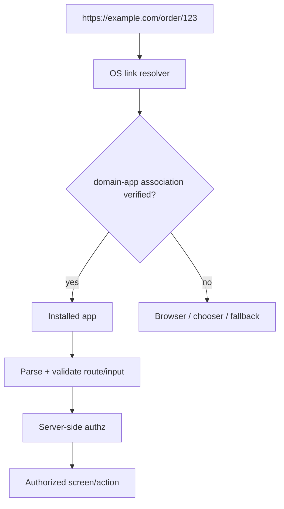

# 2026-09-22 07:00 — Interview Study Packages

README ve yakın `daily/2026-09-22/06-00.md` kontrol edildi. B+Tree page split/height growth ve MemorySSA/alias analysis tekrar edilmedi. Repo aramasında Merkle-tree anti-entropy zaten canonical olduğu için elendi. Bu tur networking ile frontend/mobile-security kesişimine dönüyor.

## Paket 1 — Junior → Principal Networking/Backend: TCP Flow Control vs Congestion Control
**Süre:** 20–30 dk

### Konu anlatımı
TCP'de iki ayrı kapasite problemi vardır. **Flow control**, alıcının uygulama/buffer tüketim hızını korur: receiver ACK'lerde advertised receive window (`rwnd`) bildirir. **Congestion control** ise ağın taşıma kapasitesini korur: sender congestion window (`cwnd`) ve algoritmanın sinyalleriyle uçuşta tutulabilecek veriyi sınırlar. Pratik mental model: gönderici yaklaşık `min(rwnd, cwnd)` kadar veriyi ACK beklemeden uçuşta tutabilir; gerçek gönderim ayrıca socket/application durumu, pacing, MSS ve implementasyon ayrıntılarından etkilenir.

RFC 9293 TCP header'daki Window alanını alıcının kabul etmeye hazır olduğu byte sayısı olarak tanımlar ve temel congestion-control algoritmalarına RFC 5681 üzerinden referans verir. Bu ayrım mülakatta kritik: receiver yavaşsa `rwnd`; path/router kuyruğu doluyorsa congestion mekanizması baskındır.

```mermaid
flowchart LR
 A[Application sender] --> S[TCP sender]
 R[TCP receiver] --> B[Application receiver]
 S -- data --> N[Network path]
 N --> R
 R -- ACK + rwnd --> S
 N -- loss/ECN/RTT signals --> C[Congestion controller]
 C -- cwnd/pacing --> S
 S --> M[send budget ≈ min(rwnd,cwnd)]
```

### İçeride ne oluyor?
1. Receiver socket buffer doldukça advertised window küçülebilir; sıfıra kadar inebilir.
2. Window scaling büyük bandwidth-delay-product bağlantılarında 16-bit pencere sınırını genişletir.
3. Congestion control slow start/congestion avoidance gibi mekanizmalarla path kapasitesini arar ve congestion sinyallerine tepki verir.
4. ACK davranışı, RTT, loss/ECN ve pacing throughput/tail latency üzerinde etkilidir.
5. Büyük buffer throughput'u koruyabilir ama queueing delay/bufferbloat yaratabilir.

### Yüksek getirili mülakat soruları
- Flow control ile congestion control arasındaki fark nedir?
- `rwnd` ve `cwnd` aynı anda varsa effective flight limit'i nasıl düşünürsün?
- Zero-window ne anlatır; packet loss ile aynı problem midir?
- Bandwidth yüksek ama RTT de yüksekse neden window scaling önemlidir?
- Büyük socket/network buffer neden her zaman daha iyi değildir?
- Senior: p99 yükselirken loss düşükse hangi queue/buffer metriklerine bakarsın?
- Principal: global RPC platformunda congestion/backpressure sinyallerini application admission control ile nasıl bağlarsın?

### Seviyeye göre cevap derinliği
Junior: receiver-vs-network ayrımı. Mid: `rwnd`, `cwnd`, RTT ve flight size. Senior: BDP, pacing, bufferbloat, ECN ve observability. Staff/Principal: transport sinyallerini RPC timeout, queue budget, load shedding ve multi-region kapasite kararlarıyla birleştirme.

### Kısa alıştırma
100 ms RTT ve 1 Gbit/s path için bandwidth-delay product'ı yaklaşık hesapla. 64 KiB receive window ile teorik throughput neden path kapasitesinin çok altında kalabilir? Sonra window scaling'in neyi değiştirdiğini açıkla.

### Proje fikri
`tcp-window-lab`: Linux network namespace/netem ile RTT ve bandwidth sınırla; iperf3 sırasında socket buffer, throughput, RTT ve retransmission ölç. Receiver'ı bilerek yavaşlatıp flow-control-bound ile network-congestion-bound koşulları ayır.

### Failure modes / trade-off / production
Flow control'u congestion control sanmak yanlış remediation üretir. Buffer'ı körlemesine büyütmek tail latency'yi bozabilir. Application queue/backpressure yoksa transport sağlıklı görünürken servis memory'si şişebilir. Production'da RTT, retransmission/loss, ECN varsa CE sinyalleri, socket queue/buffer, send/receive window, throughput ve application queue age birlikte incelenmelidir.

### Birincil kaynaklar
- RFC 9293 — TCP: https://www.rfc-editor.org/rfc/rfc9293.html
- RFC 5681 — TCP Congestion Control: https://www.rfc-editor.org/rfc/rfc5681.html
- RFC 7323 — TCP Extensions for High Performance / Window Scale: https://www.rfc-editor.org/rfc/rfc7323.html

---

## Paket 2 — Junior → Staff Frontend/Mobile/Cybersecurity: Verified Deep Links, Universal Links & App Links
**Süre:** 20–30 dk

### Konu anlatımı
Deep link bir URL/URI'den uygulama içindeki belirli ekrana yönlendirmedir. Güvenlik farkı, **kim bu link namespace'ini sahiplenebilir?** sorusundadır. Custom scheme (`myapp://`) pratik olabilir ama OS seviyesinde domain ownership kanıtı sağlamaz; başka uygulamalar aynı scheme'i kaydedebilir. iOS Universal Links ve Android App Links ise HTTPS domain ile uygulama arasında platformun doğruladığı association kurar.

Android'de manifest'teki `android:autoVerify="true"` ile sistem ilgili host için `https://host/.well-known/assetlinks.json` association'ını doğrular. iOS tarafında app'in Associated Domains entitlement'ı ile domain'deki `apple-app-site-association` (AASA) birlikte çalışır. Verified association routing güvenini artırır; fakat link payload'unu güvenilir yapmaz. Path/query parametreleri hâlâ untrusted input'tur ve authorization server-side yeniden uygulanmalıdır.



### İçeride ne oluyor?
1. Web domain association dosyası app identity/signing bilgisi ve izin verilen ilişkiyi ifade eder.
2. Uygulama kendi platform manifest/entitlement'ında domain'i ilan eder.
3. OS association'ı doğrular ve uygun HTTPS link routing policy'si oluşturur.
4. Uygulama gelen URL'yi parse eder; allowlist route, canonicalization ve input validation uygular.
5. Sensitive action için yalnız link possession'a güvenilmez; authenticated session ve object-level authorization tekrar kontrol edilir.
6. Web fallback, app-not-installed ve association-cache/update davranışı rollout tasarımının parçasıdır.

### Yüksek getirili mülakat soruları
- Custom URL scheme ile verified HTTPS deep link arasındaki güvenlik farkı nedir?
- Android `assetlinks.json` neyi doğrular?
- Universal/App Link doğrulanmış olsa bile neden query parametrelerini untrusted sayarsın?
- Deep link ile password reset/checkout gibi sensitive flow tasarlarken hangi kontroller gerekir?
- Association dosyası rollout'u neden release engineering problemidir?
- Senior: signing key/package/bundle değişiminde migration nasıl yapılır?
- Staff: web, iOS ve Android ekipleri arasında ownership ve compatibility contract'ını nasıl kurarsın?

### Seviyeye göre cevap derinliği
Junior: deep link ve web fallback. Mid: domain-app verification, route parsing. Senior: hijacking, authorization, key/app migration ve observability. Staff: cross-platform contract, staged rollout, backward compatibility ve incident response.

### Kısa alıştırma
`https://shop.example.com/order/123?coupon=X` linki için threat model çıkar: kötü niyetli başka app, değiştirilmiş order id, expired session ve yanlış association deployment senaryolarında beklenen davranışı yaz.

### Proje fikri
`verified-link-lab`: küçük web domain + Android App Link örneği kur; `assetlinks.json`, manifest ve iki route ekle. Association'ı kasıtlı bozup verification durumunu ADB ile gözle; route parametrelerini allowlist/authorization ile koru.

### Failure modes / trade-off / production
Association dosyasının yanlış hostta olması, signing fingerprint değişimi, CDN/cache gecikmesi ve fazla geniş path eşleşmesi routing'i bozabilir. Verification yalnız app-domain ilişkisidir; IDOR/authorization açığını çözmez. Production'da link-open success rate, web fallback, verification/routing failure, app version, domain ve route bazlı hata telemetrisi izlenmelidir; hassas token/query değerleri loglanmamalıdır.

### Birincil/güncel kaynaklar
- Android Developers — App Links: https://developer.android.com/training/app-links/add-applinks
- Android Developers — Verify App Links: https://developer.android.com/training/app-links/verify-applinks
- Apple Developer — Debugging Universal Links (TN3155): https://developer.apple.com/documentation/technotes/tn3155-debugging-universal-links
