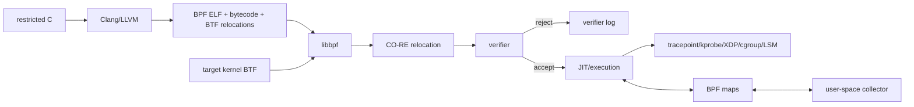
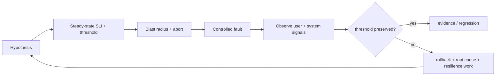

# 2026-09-22 07:00 — Interview Study Packages

README ve yakın `daily/2026-09-22/06-00.md` kontrol edildi. B+Tree page split/height growth ve MemorySSA tekrar edilmedi. Repo-wide aramada filesystem internals, CFS/EEVDF, fuzzing/sanitizers ve TCP congestion control zaten canonical bulundu; bu nedenle 07:00 için yeni iki boşluk seçildi: eBPF verifier/JIT/CO-RE ve fault-injection/chaos experiment engineering.

## Paket 1 — Mid → Principal Foundations/SRE: eBPF Verifier, JIT, Maps, BTF & CO-RE
**Süre:** 20–30 dk

### Konu anlatımı
eBPF, kernel source değiştirmeden veya kernel module yüklemeden kernel hook'larında sandboxed program çalıştırma mekanizmasıdır. Production zinciri source → BPF bytecode → loader/relocation → verifier → JIT/execution → hook şeklindedir. “C kodu compile oldu” programın kernel tarafından kabul edileceği anlamına gelmez: verifier register türlerini, scalar range'lerini, pointer provenance'ı, stack initialization'ı ve branch state'lerini izleyerek unsafe memory access'i reddeder.

BPF maps kernel programı ile user space arasında bounded/shared state sağlar. BTF type metadata taşır. CO-RE (Compile Once – Run Everywhere), BPF object'teki BTF/relocation bilgisini target kernel'in BTF bilgisiyle eşleyerek field offset gibi değerleri load-time'da düzeltir. Böylece kernel-version portability artar. Accepted bytecode desteklenen mimarilerde JIT ile native code'a çevrilebilir.

### Mental model
Verifier = güvenlik kapısı; BTF/CO-RE = portability katmanı; maps = kernel/user-space state köprüsü; JIT = accepted bytecode'un hızlı execution yolu.

### İçeride ne oluyor?
1. Clang/LLVM source'u BPF ISA'ya compile eder.
2. ELF object program sections, maps, BTF ve CO-RE relocation metadata'sını taşır.
3. libbpf target BTF'yi okuyup relocation'ları çözer.
4. `bpf()` syscall ile maps/program yüklenir.
5. Verifier abstract state üzerinden memory/pointer safety'yi kanıtlar.
6. Accepted program interpreter/JIT yoluna geçer ve hook'a attach edilir.
7. Maps telemetry/state paylaşır; user space sonuçları toplar.

### Yüksek getirili mülakat soruları
- eBPF verifier neden gereklidir; normal compiler type checker'dan farkı nedir?
- Mid: BPF map ne işe yarar?
- Senior: verifier pointer provenance ve bounds bilgisini neden izler?
- Senior: BTF ve CO-RE hangi portability problemini çözer?
- Staff: high-cardinality tracing programı production latency/memory'yi nasıl bozabilir?
- Principal: fleet-wide eBPF platformunda privilege, kernel compatibility, rollout ve blast radius'u nasıl yönetirsin?

### Seviyeye göre cevap derinliği
- **Mid:** bytecode, verifier, maps, attach hook ve JIT zinciri.
- **Senior:** abstract interpretation/range tracking, BTF/CO-RE relocation ve overhead.
- **Staff:** verifier compatibility, map lifecycle/cardinality, sampling ve fleet rollout.
- **Principal:** privilege boundary, supply-chain, kernel matrix, platform ownership ve failure containment.

### Kısa alıştırma
Bir syscall-latency tracer tasarla: hook, başlangıç timestamp map'i, PID/TID cardinality sınırı ve histogram export'unu çiz. “Map dolarsa?” ve “Verifier neden reddedebilir?” sorularını cevapla.

### Proje fikri
**ebpf-latency-lab:** libbpf CO-RE ile syscall veya TCP latency tracer yaz; iki kernel sürümünde çalıştır. Verifier log, JIT durumu, map memory ve event rate'i ölç; sampling ve bounded-map politikası ekle.

### Failure modes / trade-off / production bağlantısı
Verifier rejection deployment'ı kırabilir. CO-RE layout portability sağlar ama semantic kernel değişikliklerini sihirli biçimde çözmez. High-cardinality maps memory baskısı, hot-hook programları CPU/latency overhead'i yaratır. Privileged BPF geniş attack surface olabilir. Load/attach failure, map occupancy, dropped events, per-hook overhead ve kernel compatibility birlikte izlenmelidir.

### Kaynaklar
- Linux kernel — eBPF userspace API: https://docs.kernel.org/userspace-api/ebpf/index.html
- Linux kernel — eBPF verifier: https://docs.kernel.org/bpf/verifier.html
- Linux kernel — libbpf / CO-RE: https://docs.kernel.org/bpf/libbpf/libbpf_overview.html
- Linux kernel — BTF: https://docs.kernel.org/bpf/btf.html
- Linux kernel — CO-RE relocations: https://docs.kernel.org/bpf/llvm_reloc.html

---

## Paket 2 — Mid → CTO Testing/SRE: Fault Injection, Chaos Experiments & Steady-State Validation
**Süre:** 20–30 dk

### Konu anlatımı
Fault injection belirli failure mode'u kontrollü tetikler: dependency timeout, packet loss, process kill, disk-full veya zone loss gibi. Chaos experiment ise falsifiable bir resilience hipotezini sınar: “bu fault altında kullanıcıya görünen steady-state ölçütü kabul sınırında kalacak mı?” Güçlü deney “servisi boz ve bak” değildir. Önce SLI/eşik, blast radius ve abort condition tanımlanır; sonra fault uygulanıp teknik ve kullanıcı etkisi ölçülür.

Bu yaklaşım deterministic unit/integration testlerin yerine geçmez. Onlar hızlı correctness tabanıdır; fault injection failure-path coverage sağlar; production-benzeri chaos ise retry, timeout, queue, failover ve autoscaling gibi dağıtık etkileşimlerin gerçek davranışını sınar.

### Mental model
Chaos = rastgele kırmak değil, resilience hakkında kontrollü hipotez testi. En kritik safety primitive fault değil blast-radius ve abort kontrolüdür.

### İçeride ne oluyor?
1. Kritik user journey ve steady-state SLI seçilir.
2. Fault model incident geçmişi veya architecture riskinden türetilir.
3. Scope tek instance/cell/tenant/canary ile sınırlandırılır.
4. Abort threshold ve rollback deneyden önce doğrulanır.
5. Fault enjekte edilir; latency/error/saturation + business signal izlenir.
6. Retry, queue, breaker, failover ve autoscaling davranışı ölçülür.
7. Bulgular backlog/runbook/alert/regression test değişikliğine dönüşür.

### Yüksek getirili mülakat soruları
- Fault injection ile chaos experiment arasındaki fark nedir?
- Neden steady-state metriği önceden tanımlanmalıdır?
- Mid: dependency timeout deneyinde ne ölçersin?
- Senior: retry storm/cascading failure'ı nasıl yakalarsın?
- Staff: production chaos için blast radius ve kill switch nasıl tasarlanır?
- Principal: chaos programını incident learning ve change governance ile nasıl bağlarsın?
- CTO: hangi reliability risklerinde chaos yatırımının iş değeri yüksektir?

### Seviyeye göre cevap derinliği
- **Mid:** fault, hypothesis, metric ve rollback ayrımı.
- **Senior:** timeout/retry/breaker interactions, saturation ve recovery.
- **Staff:** cell/canary isolation, experiment platformu ve governance.
- **Principal/CTO:** risk portfolio, customer-impact budget, regulatory boundary ve ROI.

### Kısa alıştırma
Checkout servisinin payment dependency'sine 2 saniye latency ekleyen deney için hipotez, steady-state SLI, blast radius, abort threshold ve fallback davranışını yaz. Retry=3 ise amplification riskini açıklayıp düzelt.

### Proje fikri
**resilience-lab:** küçük API + dependency kur. Toxiproxy veya uygulama fault shim'i ile latency, timeout ve reset enjekte et. Retry/backoff/breaker kombinasyonlarında p95/p99, error rate ve dependency request amplification'ı karşılaştır.

### Failure modes / trade-off / production bağlantısı
Belirsiz hipotez gürültü üretir; büyük blast radius outage yaratabilir. Kill switch fault sistemiyle aynı failure domain'indeyse rollback çalışmayabilir. Retry downstream yükünü katlayabilir. Staging gerçek traffic shape'i temsil etmeyebilir; production deneyi güçlü guardrail ister. Başarı metriği yalnız “up” değil user SLI + recovery time + amplification olmalıdır.

### Kaynaklar
- Principles of Chaos Engineering: https://principlesofchaos.org/
- Google SRE Book — Testing for Reliability: https://sre.google/sre-book/testing-reliability/
- AWS Fault Injection Service: https://docs.aws.amazon.com/fis/
- Kubernetes disruptions: https://kubernetes.io/docs/concepts/workloads/pods/disruptions/
