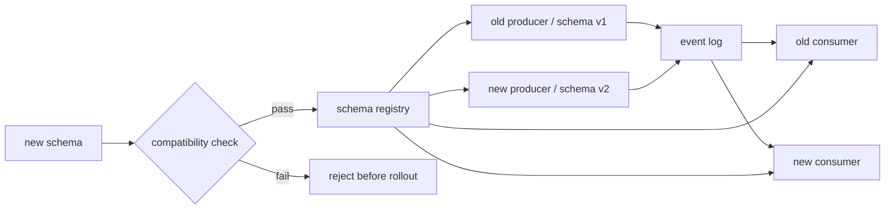
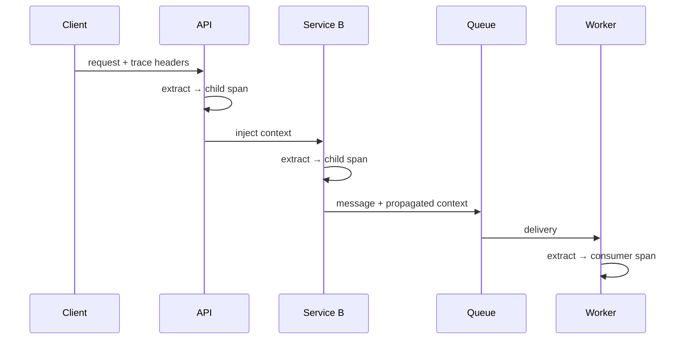

# 2026-09-22 08:00 — Interview Study Packages

README ve yakın `daily/2026-09-22/07-00.md` kontrol edildi. eBPF verifier/CO-RE ve chaos/fault-injection tekrar edilmedi. Repo aramasında aşağıdaki iki konu için doğrudan canonical eşleşme bulunmadı: schema evolution/compatibility ve OpenTelemetry context propagation/baggage.

## Paket 1 — Mid → Principal Data Engineering/Distributed Systems: Schema Evolution, Compatibility & Reader/Writer Contracts
**Süre:** 20–30 dk

### Konu anlatımı
Event-driven sistemde şema yalnız veri şekli değil, producer ile consumer arasındaki zamana yayılmış kontrattır. Producer ve consumer aynı anda deploy edilmez; topic/log içindeki eski kayıtlar aylarca yaşayabilir. Bu nedenle “yeni kod yeni JSON'u parse ediyor” yeterli değildir: yeni reader eski writer verisini, bazen de eski reader yeni writer verisini okuyabilmelidir.

Avro bunu açıkça **writer schema** ve **reader schema** ayrımıyla modeller. Schema resolution iki sürüm arasındaki alan/type farklarının nasıl çözüleceğini tanımlar. Registry katmanı ise yeni şema sürümünü kabul etmeden önce compatibility policy uygular. `BACKWARD`, `FORWARD`, `FULL` ve bunların `TRANSITIVE` varyantları deploy ve replay varsayımlarını kod haline getirir.

### Mental model
Schema registry = distributed deploy'lar için compile-time benzeri guardrail. Compatibility yönü, “hangi zaman yönündeki producer/consumer kombinasyonu birlikte çalışmalı?” sorusunun cevabıdır.

### İçeride ne oluyor?
1. Producer belirli schema version/ID ile payload serialize eder.
2. Consumer schema ID üzerinden writer schema'yı bulur.
3. Reader schema ile writer schema arasında resolution yapılır.
4. Yeni schema registration sırasında policy kontrol edilir.
5. Transitive mod yalnız son sürüm değil tüm ilgili geçmiş sürümlerle uyumu kontrol eder.
6. CI/CD compatibility testini deployment gate'e dönüştürebilir.
7. Replay/backfill eski payload'ları tekrar canlı hale getirdiği için retention horizon compatibility kararını etkiler.

### Yüksek getirili mülakat soruları
- Backward ve forward compatibility hangi deploy yönlerini korur?
- Neden yalnız `latest` ile compatibility kontrolü uzun retention'da yetersiz olabilir?
- Avro writer schema / reader schema ayrımı neden önemlidir?
- Bir field eklemek ne zaman breaking change olur?
- Enum/union değişiklikleri neden risklidir?
- Staff: yüzlerce consumer'lı topic için ownership ve migration protokolü nasıl tasarlanır?
- Principal: schema governance ile takım bağımsızlığını nasıl dengelersin?

### Seviyeye göre cevap derinliği
- **Mid:** optional/default field, backward/forward ayrımı, schema ID.
- **Senior:** reader/writer resolution, replay, mixed-version deployment ve CI gate.
- **Staff:** subject strategy, transitive policy, ownership, migration sequencing.
- **Principal:** organization-wide data contracts, governance, lineage, incident containment ve retention economics.

### Kısa alıştırma
`OrderCreated{id, total}` şemasına `currency` alanı ekle. Eski kayıtların replay edildiğini ve eski consumer'ların 48 saat daha çalışacağını varsay. Default/optional kararını ve gerekli compatibility modunu gerekçelendir.

### Proje fikri
**schema-evolution-lab:** Avro + küçük registry kur. v1→v2 alan ekleme/silme/type-change senaryolarını CI compatibility testiyle çalıştır; eski kayıt replay'i ve mixed-version consumer testi ekle.

### Failure modes / trade-off / production bağlantısı
Registry check semantic anlamı doğrulamaz: `total_cents` alanını aynı integer tipinde `total_dollars` anlamına çevirmek wire-compatible ama semantically breaking olabilir. Default değer yanlış business anlamı üretebilir. Non-transitive policy uzun retention/replay'de eski sürümleri kırabilir. Production'da schema-registration failures, deserialize errors, unknown schema IDs, consumer lag ve replay/backfill sonuçları izlenmelidir.

### Kaynaklar
- Apache Avro 1.12 specification — Schema Resolution: https://avro.apache.org/docs/1.12.0/specification/
- Confluent — Schema Evolution and Compatibility: https://docs.confluent.io/platform/current/schema-registry/fundamentals/schema-evolution.html
- Confluent — Schema Registry API compatibility endpoint: https://docs.confluent.io/platform/current/schema-registry/develop/api.html

---

## Paket 2 — Junior → Staff Backend/SRE: OpenTelemetry Context Propagation, TraceContext & Baggage
**Süre:** 20–30 dk

### Konu anlatımı
Distributed trace ancak servisler aynı request zincirini ilişkilendirebildiğinde dağıtık olur. Context propagation, span context gibi cross-cutting state'i HTTP headers veya messaging metadata gibi bir carrier'a **inject** edip downstream'de **extract** etme mekanizmasıdır. OpenTelemetry `TextMapPropagator` soyutlamasıyla bunu transporttan ayırır; W3C Trace Context yaygın trace propagation formatıdır.

`Baggage`, trace identity'den farklı olarak request boyunca taşınabilen key/value context'tir. Güçlüdür ama her hop'ta taşındığı için maliyet ve güven sınırı vardır. PII, credential veya secret baggage'a konmamalı; untrusted inbound context sanitize/ignore edilebilmelidir.

### Mental model
Trace context = correlation identity; baggage = taşınan application context; propagator = context ile wire carrier arasındaki codec/boundary.

### İçeride ne oluyor?
1. Inbound carrier'dan propagator context'i extract eder.
2. Server span parent context ile başlatılır.
3. Outbound request öncesi current context carrier'a inject edilir.
4. Async messaging'de publish/consume boundary ayrıca instrument edilir.
5. Sampling kararı trace flags/state üzerinden taşınabilir; downstream kendi span ilişkisini korur.
6. Baggage ayrı key/value state'tir; span attribute ile aynı şey değildir.
7. Trust boundary'de inbound/outbound propagation policy uygulanır.

### Yüksek getirili mülakat soruları
- Context propagation olmazsa distributed trace nasıl görünür?
- `inject` ve `extract` ne yapar?
- Trace context ile baggage farkı nedir?
- Baggage neden PII/secret için kötü yerdir?
- Async queue consumer span'ını producer ile nasıl ilişkilendirirsin?
- Senior: forged inbound trace headers için trust policy nasıl tasarlanır?
- Staff: multi-language fleet'te propagation standardizasyonu ve migration nasıl yapılır?

### Seviyeye göre cevap derinliği
- **Junior:** trace/span parent-child ve header propagation.
- **Mid:** inject/extract, carrier, W3C TraceContext, baggage.
- **Senior:** async boundaries, sampling, trust/sanitization, cardinality ve overhead.
- **Staff:** fleet-wide propagator policy, compatibility, observability governance ve incident debugging.

### Kısa alıştırma
API → payment → Kafka → worker zincirinde context'in nerede inject/extract edildiğini çiz. `tenant_id`, `user_email`, `debug=true` için hangisinin baggage'a girebileceğini riskleriyle tartış.

### Proje fikri
**propagation-lab:** iki HTTP servis + queue worker kur. OpenTelemetry ile trace context'i HTTP ve message headers üzerinden geçir; propagation'ı kasıtlı kırıp orphan trace üret, sonra boundary testleriyle yakala.

### Failure modes / trade-off / production bağlantısı
Header propagation unutulursa trace parçalanır. Baggage büyürse bandwidth/CPU maliyeti ve data-leak riski artar. Untrusted caller forged context gönderebilir. Yüksek-cardinality baggage'ı körlemesine metric label'a çevirmek telemetry sistemini pahalılaştırabilir. Production'da orphan/root span oranı, propagation parse failures, baggage size, exporter drops ve sampling davranışı izlenmelidir.

### Kaynaklar
- OpenTelemetry specification — Context Propagators API: https://opentelemetry.io/docs/specs/otel/context/api-propagators/
- OpenTelemetry specification — Baggage API: https://opentelemetry.io/docs/specs/otel/baggage/api/
- OpenTelemetry — Context propagation security guidance: https://opentelemetry.io/docs/concepts/context-propagation/
- W3C Trace Context: https://www.w3.org/TR/trace-context/
