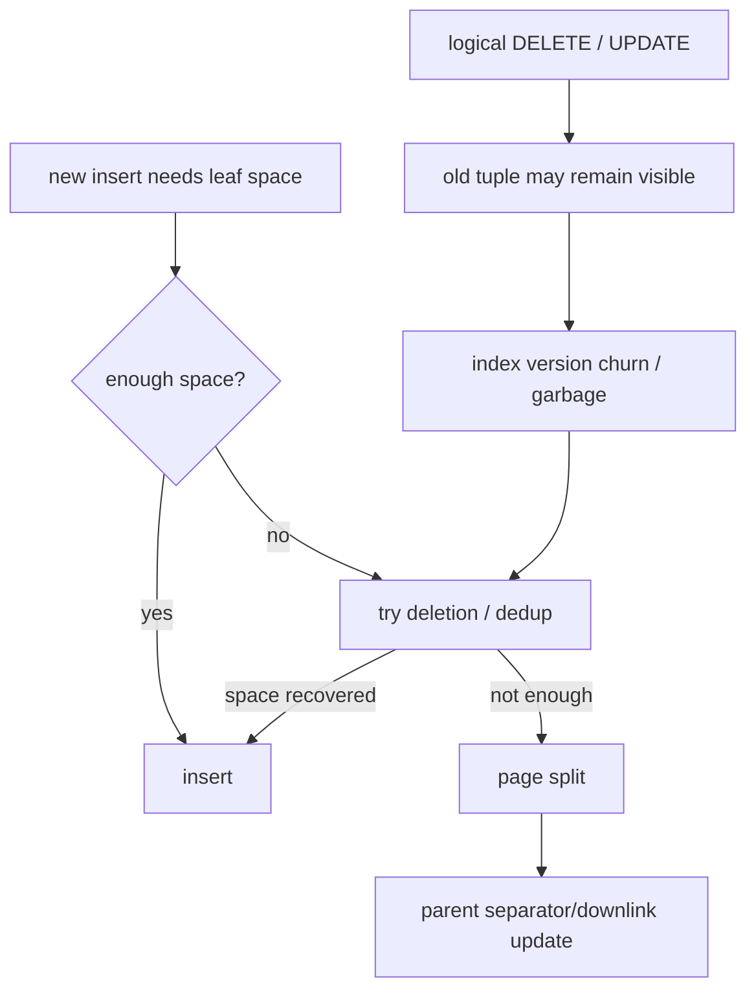
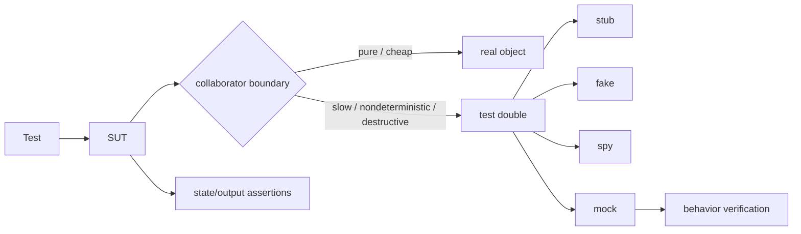

# 2026-09-22 08:00 — Interview Study Packages

README ve yakın `daily/2026-09-22/07-00.md` kontrol edildi. eBPF ve chaos engineering tekrar edilmedi. İlk aday olan schema evolution repo-wide kontrolde hem canonical chapter hem eski daily olarak bulundu; elendi. Filesystem VFS/page-cache de mevcut canonical chapter'da bulundu. Bu tur iki daha dar boşluğu ilerletiyor: B+Tree delete/space-reclamation gerçekliği ve testing engineering'de test-double sınırları.

## Paket 1 — Junior → Principal Databases: B+Tree Deletion, MVCC Garbage, Deduplication & Fillfactor
**Süre:** 20–30 dk

### Konu anlatımı
Ders kitabındaki klasik B+Tree deletion algoritması, bir node minimum occupancy altına düşünce sibling'den redistribution/borrow yapmayı; bu yetmezse merge edip parent separator'ını güncellemeyi öğretir. Bu invariant algoritmayı anlamak için önemlidir. Production database index'inde ise deletion, concurrency ve MVCC nedeniyle daha farklı görünebilir: bir SQL `DELETE` veya `UPDATE`, index tuple'ını aynı anda fiziksel olarak yok etmek zorunda değildir.

PostgreSQL B-Tree'de MVCC version churn aynı logical row için bir süre birden fazla index tuple üretebilir. PostgreSQL 18, anticipated page split öncesinde bottom-up index deletion ile garbage tuple'ları temizleyerek split'i önlemeye çalışabilir. Ayrı bir simple deletion yolu `LP_DEAD` olarak işaretlenmiş güvenli tuple'ları opportunistic temizler. Duplicate key'ler ayrıca posting-list tabanlı deduplication ile sıkıştırılabilir. Interview cevabında önce textbook invariant'ı, sonra engine-specific MVCC/maintenance gerçeğini ayırmak güçlüdür.

`fillfactor` boşluk–yoğunluk trade-off'udur: daha fazla boş alan future inserts/updates ve version churn için headroom verir; daha yüksek occupancy read/storage verimliliğini artırabilir fakat mutable workload'da page split riskini yükseltebilir.

### Mental model
Textbook B+Tree: **underflow → borrow or merge**. MVCC production engine: **logical death → visibility horizon → safe cleanup; split pressure can trigger local cleanup first**.

### İçeride ne oluyor?
1. Leaf entries ordered key space'i; internal pages navigation separator/downlink'lerini taşır.
2. Classical deletion occupancy invariant'ını borrow/merge ile korur.
3. MVCC engine eski row version'larını active snapshot'lar nedeniyle hemen reclaim edemeyebilir.
4. PostgreSQL bottom-up deletion, version-churn kaynaklı beklenen split öncesinde leaf page'de targeted cleanup yapabilir.
5. `LP_DEAD` işaretleri simple deletion için opportunistic signal olabilir.
6. Deduplication duplicate keys'i key + TID posting list biçiminde daha yoğun temsil edebilir.
7. VACUUM yine table/index çapında lifecycle ve TID reuse güvenliği için gereklidir.

### Yüksek getirili mülakat soruları
- B+Tree delete sonrası underflow klasik olarak nasıl çözülür?
- Junior: borrow/redistribution ile merge arasındaki fark nedir?
- Mid: neden production MVCC index'i SQL DELETE anında fiziksel entry'yi silmeyebilir?
- Senior: version churn neden page split ve scan cost yaratır?
- Senior: deduplication hangi workload'da faydalıdır?
- Staff: fillfactor, update rate, long-running snapshots ve index bloat ilişkisini nasıl teşhis edersin?
- Principal: index maintenance politikasını write amplification, read latency, storage ve maintenance budget ile nasıl dengelersin?

### Seviyeye göre cevap derinliği
- **Junior:** leaf/internal ayrımı; borrow, merge, root shrink sezgisi.
- **Mid:** logical vs physical deletion ve MVCC visibility.
- **Senior:** bottom-up/simple deletion, dedup, fillfactor, version churn.
- **Staff:** bloat, long snapshot, autovacuum, page split ve observability korelasyonu.
- **Principal:** workload-class bazlı index policy, maintenance window, cost ve SLO.

### Kısa alıştırma
Order=4 küçük bir B+Tree çiz. Bir leaf'ten key silerek underflow oluştur; önce sibling redistribution, sonra merge senaryosunu göster. Ardından aynı örneği MVCC altında düşün: silinen entry'nin active snapshot nedeniyle fiziksel olarak kaldığını varsay ve neden klasik merge'in hemen gerçekleşmeyebileceğini açıkla.

### Proje fikri
**btree-churn-lab:** PostgreSQL'de indexed fakat sık UPDATE edilen bir tablo oluştur. Farklı fillfactor değerleri ve uzun snapshot altında index size, update throughput ve `EXPLAIN (ANALYZE, BUFFERS)` davranışını karşılaştır; VACUUM sonrası değişimi kaydet.

### Failure modes / trade-off / production bağlantısı
Uzun transaction/snapshot garbage reclamation'ı geciktirebilir. Yüksek fillfactor mutable index'te split baskısını artırabilir; gereğinden düşük fillfactor storage/cache verimliliğini düşürür. Duplicate-heavy index dedup'tan yararlanabilir fakat `INCLUDE` index'lerde PostgreSQL B-Tree dedup uygulanmaz. Bloat belirtisini yalnız dosya boyutuyla değil update churn, vacuum progress, query latency ve buffer I/O ile birlikte yorumla.

### Kaynaklar
- PostgreSQL 18 — B-Tree indexes / bottom-up deletion / deduplication: https://www.postgresql.org/docs/18/btree.html
- PostgreSQL 18 — CREATE INDEX / fillfactor / deduplicate_items: https://www.postgresql.org/docs/18/sql-createindex.html

---

## Paket 2 — Mid → Staff Testing Engineering: Test Doubles, State vs Behavior Verification & Mock Boundaries
**Süre:** 20–30 dk

### Konu anlatımı
Test double, production collaborator yerine testte kullanılan kontrollü nesne için genel terimdir. Yararlı vocabulary: **dummy** yalnız parametreyi doldurur; **fake** çalışan ama production'a uygun olmayan basitleştirilmiş implementation'dır; **stub** canned response verir; **spy** çağrıları kaydeder; **mock** beklenen interaction'ları önceden tanımlar ve behavior verification yapar.

Asıl tasarım sorusu “mock mı stub mı?”dan daha büyüktür: test hangi contract'ı doğrulamalı? **State verification**, observable sonuç/state üzerinden doğrular. **Behavior verification**, collaborator ile belirli interaction'ın gerçekleşmesini doğrular. Internal call sequence'i aşırı mock'lamak refactor sırasında davranış değişmediği halde testleri kırılgan yapar. Buna karşılık gerçek network, clock, mail, payment gateway veya destructive dependency testleri yavaş, nondeterministic ya da tehlikeli yapabilir; burada iyi seçilmiş boundary double güçlüdür.

Hermetic hedef, test sonucunun internet, wall clock, global machine state veya paylaşılan mutable service gibi dış etkilerden kontrolsüz biçimde etkilenmemesidir. Ancak fake'in production semantics'ten sapması da false confidence yaratabilir. Bu yüzden unit testte double, contract/integration testte gerçek protocol/schema ve az sayıda end-to-end test birbirini tamamlar.

### Mental model
Double seçimi framework tercihi değil, **controllability + fidelity + coupling** trade-off'udur. Mümkünse observable behavior doğrula; external boundary'leri kontrollü hale getir; implementation detail'i contract sanma.

### İçeride ne oluyor?
1. SUT'nin gerçek contract ve side-effect boundary'leri belirlenir.
2. Pure/cheap collaborator mümkünse gerçek bırakılır.
3. Nondeterministic veya pahalı boundary için uygun double seçilir.
4. Stub input control sağlar; fake daha geniş çalışan model sunar; spy observation toplar; mock interaction expectation taşır.
5. State assertion user-visible semantics'i; behavior assertion gerekli collaboration protocol'ünü doğrular.
6. Contract/integration testleri double'ın gerçek dependency'den drift etmesini yakalamalıdır.

### Yüksek getirili mülakat soruları
- Stub, fake, spy ve mock arasındaki fark nedir?
- Mid: state verification ile behavior verification ne zaman ayrışır?
- Senior: over-mocking neden refactor friction yaratır?
- Senior: in-memory database fake'i hangi production bug'larını kaçırabilir?
- Staff: ödeme sağlayıcısı entegrasyonu için unit/contract/integration/E2E test portfolio'sunu nasıl kurarsın?
- Staff: clock, randomness ve retry/backoff'u deterministic nasıl test edersin?

### Seviyeye göre cevap derinliği
- **Mid:** double taxonomy ve deterministic test gerekçesi.
- **Senior:** observable contract, implementation coupling, fake drift ve interaction-testing sınırı.
- **Staff:** boundary architecture, contract verification, hermetic CI ve test-cost portfolio.

### Kısa alıştırma
`CheckoutService -> Inventory -> Payment -> Email` akışı için her dependency'de real/fake/stub/mock seçimlerini yap. Sonra bir refactor'da internal method sayısı değiştiğinde hangi assertion'ların kırılmaması gerektiğini işaretle.

### Proje fikri
**double-boundary-lab:** küçük checkout servisi yaz. Clock ve payment gateway'i interface arkasına al; fake gateway + controllable clock ile unit testler kur. Aynı gateway için sandbox/contract integration testi ekle ve fake'in semantics drift'ini bilerek oluşturup hangi katmanın yakaladığını göster.

### Failure modes / trade-off / production bağlantısı
Over-mocking implementation'a coupling ve false confidence üretir. Aşırı real dependency CI'ı yavaş/flaky yapar. Fake production semantics'ten drift edebilir. Mock expectation'ları network protocolünün yalnız mutlu yolunu temsil edebilir. Production incident'lerinden çıkan edge case'leri fake/stub senaryolarına ve gerçek contract testlerine birlikte geri besle; flaky rate, suite latency ve escaped integration defects'i test stratejisinin sinyalleri olarak izle.

### Kaynaklar
- Martin Fowler — Test Double: https://martinfowler.com/bliki/TestDouble.html
- Martin Fowler — Mocks Aren't Stubs: https://martinfowler.com/articles/mocksArentStubs.html
- Google Testing Blog: https://testing.googleblog.com/
