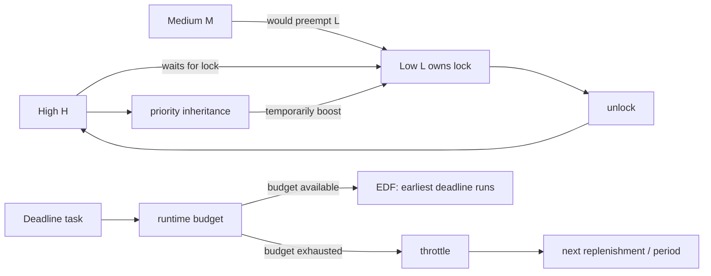
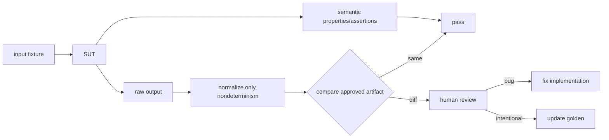

# 2026-09-22 09:00 — Interview Study Packages

README ve yakın `daily/2026-09-22/08-00.md` kontrol edildi. B+Tree deletion/MVCC cleanup ve test-double sınırları tekrar edilmedi. Repo-wide kontrolde io_uring, filesystem extents/reflink, ELF dynamic linking ve model-based testing zaten canonical içerik olarak bulunduğu için elendi. Bu tur iki daha dar temel boşluğu ilerletiyor: Linux real-time scheduling/priority inversion ve testing engineering'de golden/snapshot regression testlerinin oracle kalitesi.

## Paket 1 — Mid → Principal Linux: SCHED_DEADLINE, EDF/CBS & Priority Inversion
**Süre:** 20–30 dk

### Konu anlatımı
Normal fair scheduling ile real-time scheduling aynı hedefi optimize etmez. Fair scheduler runnable task'ler arasında CPU payını ve responsiveness'i dengelerken real-time workload'un sorusu şudur: belirli bir iş, belirli bir zaman bütçesi içinde deadline'ına yetişecek mi?

Linux `SCHED_DEADLINE`, Earliest Deadline First (EDF) seçimini Constant Bandwidth Server (CBS) ile birleştirir. Bir task `runtime`, `deadline` ve `period` parametreleriyle tanımlanır: her period içinde en fazla runtime kadar CPU bütçesi, deadline zaman sınırı içinde kullanılmalıdır. CBS bütçeyi izole eder; bütçe tükenince task replenish edilene kadar throttle edilir. EDF ise eligible deadline task'leri arasında en erken scheduling deadline'a sahip olanı seçer. Admission control önemlidir: CPU kapasitesinden fazla reservation kabul edilirse teorik deadline garantisi anlamsızlaşır.

Ayrı ama kritik problem **priority inversion**'dır. Yüksek öncelikli H task'i, düşük öncelikli L'nin tuttuğu lock'u beklerken orta öncelikli M task'i L'yi sürekli preempt ederse H dolaylı olarak M'nin arkasında kalır. Priority inheritance (PI), H beklerken lock owner L'nin scheduling priority/parameters'ını geçici yükselterek L'nin critical section'ı bitirmesine yardım eder. Linux rtmutex bu mekanizmayı destekler; PREEMPT_RT daha fazla kernel locking yolunu preemptible/PI-aware hale getirir.

### Mental model
`SCHED_DEADLINE`: **reservation + urgency**. CBS “ne kadar CPU kullanabilirsin?” sınırını, EDF “kim önce koşmalı?” sırasını belirler. Priority inheritance ise lock bekleme zincirinde scheduler'ın gördüğü priority ile gerçek dependency'yi yeniden hizalar.

### İçeride ne oluyor?
1. Deadline task `runtime/deadline/period` reservation'ı ister.
2. Admission control toplam bandwidth'in schedulable sınırı aşmasını engellemeye çalışır.
3. CBS remaining runtime ve scheduling deadline state'ini tutar.
4. Task CPU kullandıkça runtime budget azalır; sıfırlanınca throttle edilir.
5. EDF en erken scheduling deadline'ı seçer.
6. Lock contention'da rtmutex owner/waiter ilişkisini izler.
7. Daha yüksek priority waiter varsa PI owner'a geçici boost propagate edebilir; nested lock zincirlerinde inheritance zincir boyunca ilerleyebilir.
8. Unlock sonrası boost geri alınır ve normal scheduling state'ine dönülür.

### Yüksek getirili mülakat soruları
- Fair scheduling ile real-time scheduling hedefleri nasıl farklıdır?
- Mid: EDF sezgisi nedir; `runtime`, `deadline`, `period` neyi temsil eder?
- Senior: CBS neden yalnız EDF kullanmaktan farklıdır?
- Senior: priority inversion'ı H/M/L örneğiyle açıkla; priority inheritance neyi çözer?
- Senior: PI neden bütün latency problemlerini çözmez?
- Staff: CPU affinity, IRQ load, lock contention ve deadline miss'i nasıl teşhis edersin?
- Principal: hard/soft real-time ihtiyacını normal Linux service SLO'sundan nasıl ayırır; PREEMPT_RT veya dedicated cores kararını nasıl verirsin?

### Seviyeye göre cevap derinliği
- **Mid:** EDF ve deadline reservation kavramlarını doğru ayırır; priority inversion örneğini kurar.
- **Senior:** CBS budget/throttling, admission control, rtmutex PI ve bounded critical section konuşur.
- **Staff:** IRQ/preemption, affinity/isolation, tracing, overload ve multicore etkilerini production teşhisine bağlar.
- **Principal:** determinism, utilization, operational complexity ve product latency contract'ını birlikte tartar.

### Kısa alıştırma
Tek CPU'da A=`runtime 20ms, deadline 50ms, period 100ms`; B=`runtime 10ms, deadline 30ms, period 50ms` olsun. Utilization reservation toplamını hesapla; aynı anda wake olduklarında EDF sırasını çiz. Sonra L'nin lock tuttuğu, H'nin lock beklediği ve M'nin CPU-bound olduğu priority-inversion timeline'ını PI öncesi/sonrası çiz.

### Proje fikri
**deadline-pi-lab:** disposable Linux VM'de `rt-app` veya küçük pthread programıyla OTHER/FIFO/DEADLINE workload'ları üret. CPU utilization, wakeup latency ve deadline miss'lerini kaydet; ayrı deneyde PI-enabled mutex ile H/M/L contention senaryosunu ölç. Production host üzerinde scheduler policy değiştirme.

### Failure modes / trade-off / production bağlantısı
Yanlış real-time priority starvation yaratabilir. Oversubscription deadline miss üretir. Uzun non-preemptible/IRQ bölgeleri PI'nin düzeltemeyeceği latency ekleyebilir. Lock convoy ve nested dependency tail latency'yi büyütür. CPU frequency/power management da timing'i etkileyebilir. Production'da scheduler class, CPU affinity, run-queue pressure, throttling/deadline misses, IRQ placement ve lock contention birlikte incelenmelidir.

### Kaynaklar
- Linux Kernel — Deadline Task Scheduling: https://docs.kernel.org/scheduler/sched-deadline.html
- Linux Kernel — EEVDF Scheduler: https://docs.kernel.org/scheduler/sched-eevdf.html
- Linux Kernel — Lock types / rtmutex: https://docs.kernel.org/locking/locktypes.html
- Linux Kernel — Real-time theory / priority inheritance: https://docs.kernel.org/core-api/real-time/theory.html

---

## Paket 2 — Junior → Staff Testing Engineering: Golden/Snapshot Tests, Normalization & Reviewable Oracles
**Süre:** 20–30 dk

### Konu anlatımı
Golden veya snapshot test, karmaşık bir output'u önceden onaylanmış bir artifact ile karşılaştıran regression oracle'dır. Compiler diagnostics, generated code, CLI output, serializer output, rendered trees ve API response shape gibi büyük sonuçlarda yüzlerce küçük assertion yerine okunabilir diff sağlayabilir.

Fakat snapshot kendi başına “doğru”yu bilmez. İlk baseline yanlış olabilir; developer `update snapshots` komutunu düşünmeden çalıştırırsa bug yeni expected output'a dönüşebilir. Bu yüzden golden file'ın değeri **reviewable oracle** olmasından gelir: deterministic output, küçük diff, kontrollü update ve semantic invariant'larla desteklenmiş review.

Nondeterministic alanlar — timestamp, UUID, address, temp path, map iteration order — snapshot churn üretir. Çözüm assertion'ı gevşetmek değil, output'u contract'a uygun biçimde normalize/canonicalize etmektir. Ancak aşırı normalization gerçek regression'ı gizleyebilir. İyi test, unstable implementation detail'i değil kullanıcı/consumer açısından anlamlı representation'ı snapshot'lar.

LLVM regression suite bunun güçlü bir örneğidir: küçük test dosyaları ve `lit` altyapısı ile compiler davranışındaki regressions hedefli biçimde doğrulanır; `FileCheck` gibi araçlar tüm output'u kör byte snapshot yapmak yerine ilgili textual pattern'leri kontrol etmeye izin verir.

### Mental model
Golden file **kaydedilmiş gerçek değil, version-controlled oracle**'dır. Snapshot'ın kalitesi dosya sayısıyla değil, diff'in review edilebilirliği ve yanlış değişikliği reddetme gücüyle ölçülür.

### İçeride ne oluyor?
1. Stable fixture test input'unu üretir.
2. SUT karmaşık output üretir.
3. Yalnız nondeterministic/irrelevant alanlar canonicalize edilir.
4. Actual output committed golden ile karşılaştırılır.
5. Diff failure artifact'i olur.
6. Intentional değişiklikte explicit update mode golden'ı yeniler; diff code review'da incelenir.
7. Critical semantics ayrıca targeted assertion/property ile korunur; snapshot tek oracle değildir.

### Yüksek getirili mülakat soruları
- Golden/snapshot test ne zaman çok sayıda assertion'dan daha uygundur?
- Junior: snapshot test neden regression testidir?
- Mid: nondeterministic timestamp/UUID nasıl ele alınır?
- Senior: snapshot update workflow'u nasıl false confidence üretebilir?
- Senior: byte-for-byte golden yerine pattern/semantic assertion ne zaman daha iyi olur?
- Staff: 20 bin golden testli compiler/codegen reposunda churn ve CI cost'u nasıl yönetirsin?
- Staff: hangi output alanlarını normalize etmenin tehlikeli olduğuna nasıl karar verirsin?

### Seviyeye göre cevap derinliği
- **Junior:** fixture → actual → expected diff akışını açıklar.
- **Mid:** determinism, normalization ve explicit update workflow'u kurar.
- **Senior:** oracle strength, over-broad snapshots, semantic assertions ve review ergonomics konuşur.
- **Staff:** test sharding, changed-area selection, artifact retention, flaky/churn metrics ve ownership tasarlar.

### Kısa alıştırma
Bir CLI çıktısında `request_id`, timestamp, sorted olmayan map ve kullanıcıya gösterilen error code var. Hangilerini normalize edeceğini seç; error code'u neden normalize etmemen gerektiğini açıkla. Ardından tüm output snapshot'ı ile 3 semantic assertion yaklaşımını karşılaştır.

### Proje fikri
**golden-oracle-lab:** küçük parser/code-generator yaz. 15 fixture için committed golden outputs üret; update flag ekle. Timestamp/path normalization uygula. Sonra intentional syntax değişikliği ve accidental error-message regression'ı oluştur; review diff'lerinin hangisini güvenilir biçimde ayırdığını belgeleyip kritik invariants için ek assertions yaz.

### Failure modes / trade-off / production bağlantısı
Devasa snapshot'lar review'da rubber-stamp davranışını teşvik eder. Otomatik toplu update bug'ı baseline'a gömebilir. Platform-dependent newline/path/locale flakiness yaratabilir. Aşırı normalization signal'ı silebilir. Production incident'inden çıkan kullanıcı-visible regression, minimal fixture + semantic assertion + gerekiyorsa golden artifact olarak suite'e geri beslenmelidir. Snapshot churn rate, flaky rate, diff size ve review ownership test sağlığının sinyalleridir.

### Kaynaklar
- LLVM — Testing Infrastructure Guide: https://llvm.org/docs/TestingGuide.html
- LLVM — FileCheck: https://llvm.org/docs/CommandGuide/FileCheck.html
- Go — testing package: https://pkg.go.dev/testing
