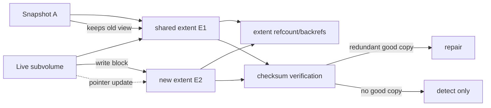
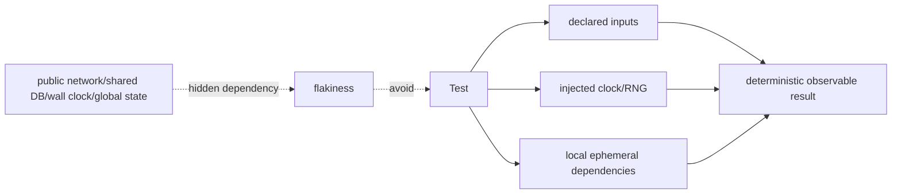

# 2026-09-22 10:00 — Interview Study Packages

README ve yakın `daily/2026-09-22/09-00.md` kontrol edildi. SCHED_DEADLINE/priority inversion ile golden/snapshot testing tekrar edilmedi. Repo-wide aramada compiler backend register allocation, concurrent B+Tree split/right-link, ext4/JBD2 journaling, HNSW filtered vector search ve technical-debt portfolio konularının zaten canonical olduğu görüldüğü için elendi. Bu tur filesystem internals'i Copy-on-Write katmanına, testing engineering'i hermeticity/test-size katmanına ilerletiyor. Hedef yaklaşık %70 temel + %20 mülakat pratiği + %10 güncel production bağlantısıdır.

## Paket 1 — Junior → Principal Filesystem Internals: Copy-on-Write, Btrfs Snapshots, Extent Refcounts & Checksums
**Süre:** 20–30 dk

### Konu anlatımı
Copy-on-Write (CoW) filesystem'de paylaşılan bir block/extent yerinde overwrite edilmek yerine yeni bir fiziksel konuma yazılır; metadata pointer'ları yeni versiyona çevrilir. Eski versiyon snapshot veya başka reflink sahibi tarafından kullanılmaya devam edebilir. Bu, snapshot yaratmayı bütün dosyaları kopyalamaktan çok daha ucuz hale getirir: başlangıçta çoğu data/metadata ortaktır, divergence yalnız değişen bölgelerde oluşur.

Btrfs extent tabanlıdır ve subvolume/snapshot tree'leri block paylaşabilir. Extent tree kullanılan byte range'leri, reference count/back-reference bilgisini ve ownership ilişkisini izler. Shared extent'e yazıldığında yeni extent allocation + pointer update oluşur; eski extent son reference kalkana kadar reclaim edilmez. CoW metadata tree node'larını da etkileyebilir; küçük random write bu yüzden data write'tan daha fazla metadata allocation/write amplification yaratabilir.

Checksumming farklı bir eksendir. Btrfs data ve metadata'yı varsayılan olarak checksum'lar; metadata checksum node header'da, data checksum'ları checksum tree'de tutulur. Read sırasında checksum mismatch silent corruption sinyalidir. Redundant kopya varsa filesystem doğru kopyayı kullanıp bozuk kopyayı onarabilir; tek kopya varsa checksum bozulmayı tespit eder ama kayıp bilgiyi geri getiremez. `scrub`, online checksum verification yaparak latent corruption'ı normal application read'i beklemeden taramaya yarar.

### Mental model
CoW snapshot = **paylaş, değişince ayır**. Refcount/backref “bu extent'i kim kullanıyor?”, checksum “okuduğum bitler yazdığım bitlerle aynı mı?” sorusunu cevaplar. Snapshot backup değildir; aynı failure domain'de paylaşılan storage'ı korur.

### İçeride ne oluyor?
1. File logical range bir data extent'e işaret eder.
2. Snapshot/subvolume root'ları aynı tree/data extent'lerini paylaşabilir.
3. Shared extent'e modification geldiğinde allocator yeni extent ayırır.
4. Yeni data yazılır; ilgili metadata path'i CoW ile yeni node'lara taşınabilir.
5. Parent/root pointer'ları yeni generation'a çevrilir; transaction commit yeni root'u görünür kılar.
6. Extent tree refcount/backref'lerle shared ownership'i izler; son reference kalkınca alan reclaim edilebilir.
7. Data checksum write öncesi hesaplanır; read sonrası doğrulanır. Metadata block'ları da checksum taşır.
8. Scrub allocated data/metadata'yı okuyup checksum doğrular; redundant profile'da sağlam replica ile repair mümkün olabilir.

### Yüksek getirili mülakat soruları
- Junior: CoW ile in-place overwrite arasındaki temel fark nedir?
- Mid: snapshot neden ilk anda full copy kadar alan tüketmez?
- Mid: reflink ile normal file copy arasındaki storage farkı nedir?
- Senior: küçük random write neden CoW filesystem'de write amplification/fragmentation yaratabilir?
- Senior: checksum neden backup veya replication değildir?
- Staff: snapshot retention, qgroup/refcount metadata ve deletion latency arasında nasıl trade-off kurarsın?
- Principal: database workload için CoW, compression, direct I/O ve application-level WAL etkileşimini nasıl benchmark edip production policy'ye çevirirsin?

### Seviyeye göre cevap derinliği
- **Junior:** overwrite yerine yeni block ve snapshot paylaşımı sezgisi.
- **Mid:** extent, reflink, snapshot, checksum ve scrub ayrımı.
- **Senior:** metadata CoW, refcount/backref, fragmentation, write amplification ve recovery boundary.
- **Staff:** retention/deletion cost, multi-device redundancy, observability ve workload-specific tuning.
- **Principal:** filesystem semantics'i database durability, backup/RPO, fleet policy ve hardware failure modeline bağlar.

### Kısa alıştırma
100 GiB subvolume snapshot'landıktan sonra live tree'de 4 GiB'lık bir dosyanın 64 MiB'lık bölümü yeniden yazılıyor. “Snapshot hemen 100 GiB ek alan yer” varsayımını düzelt; hangi extent'lerin paylaşılmaya devam ettiğini çiz. Ardından tek-device checksum mismatch ile mirrored profile'daki checksum mismatch'in olası sonuçlarını karşılaştır.

### Proje fikri
**cow-snapshot-lab:** disposable VM/loopback Btrfs filesystem oluştur. Büyük sparse file + snapshot üret; `cp --reflink=always`, küçük random overwrites ve snapshot deletion sonrası filesystem usage, extent layout ve scrub çıktısını kaydet. Aynı workload'u snapshot yokken karşılaştır. Gerçek production volume üzerinde corruption deneyi yapma.

### Failure modes / trade-off / production bağlantısı
Snapshot'ı backup sanmak aynı disk/controller/fleet failure domain'ini gözden kaçırır. Çok snapshot ve yoğun random overwrite fragmentation ile metadata/refcount maliyetini artırabilir; snapshot deletion anlık “free” değildir. Checksum corruption'ı bulur fakat redundant sağlam copy yoksa repair garantisi vermez. Production'da allocation/ENOSPC headroom, metadata usage, fragmentation, scrub error sayıları, device error counters, snapshot retention/deletion süreleri ve workload latency birlikte izlenmelidir.

### Kaynaklar
- Linux Kernel — Btrfs: https://docs.kernel.org/filesystems/btrfs.html
- Btrfs — Btrees / extent & checksum trees: https://btrfs.readthedocs.io/en/latest/dev/dev-btrees.html
- Btrfs — Design / Copy-on-Write logging: https://btrfs.readthedocs.io/en/latest/dev/dev-btrfs-design.html
- Btrfs — Checksumming: https://btrfs.readthedocs.io/en/stable/Checksumming.html

---

## Paket 2 — Mid → Staff Testing Engineering: Hermetic Tests, Test Sizes & Deterministic Boundaries
**Süre:** 20–30 dk

### Konu anlatımı
Bir testin hızlı olması tek başına güvenilir olduğu anlamına gelmez. **Hermetic test**, sonucunu yalnız açıkça tanımlanmış input/dependency'lerden üretir; developer laptop'ındaki saat, locale, `$HOME`, rastgele açık port, public network servisi, başka testin bıraktığı state veya shared staging database gibi gizli dependency'lere dayanmaz. Aynı source + declared inputs ile tekrar çalıştırıldığında aynı davranışı vermesi beklenir.

Test size, unit/integration etiketinden daha operasyonel bir sözleşme olabilir. Google'ın Small/Medium/Large modelinde small test network/database/filesystem gibi kaynakları kullanmaz; medium localhost ve daha fazla process/thread/resource kullanabilir; large external systems'e kadar çıkabilir. Bazel'ın test environment yaklaşımı da hermeticity'yi declared dependencies ve controlled runner environment üzerinden tarif eder. Amaç “her şeyi mock'la” değildir: gerçek DB semantics önemliyse ephemeral local DB/container ile medium test, üçüncü taraf gerçek endpoint'i gerekiyorsa az sayıda controlled large test seçilebilir.

Determinism için dependency boundary'lerini tasarlamak gerekir. Clock enjekte edilir; RNG seed kontrol edilir; temp directory test runner'dan alınır; ports OS tarafından allocate edilir; locale/timezone explicit olur; external HTTP yerine protocol-faithful fake veya local server kullanılabilir. Test sırası bağımsız olmalı ve cleanup yalnız mutlu path'e güvenmemelidir. Bu yaklaşım parallelism, caching, remote execution ve flaky-test triage'ını kolaylaştırır.

### Mental model
Hermeticity = **testin dünyasını küçült ve sınırlarını ilan et**. Test size bu dünyanın ne kadar büyük olmasına izin verdiğini söyleyen execution contract'ıdır; “unit/integration” tartışmasından daha ölçülebilir olabilir.

### İçeride ne oluyor?
1. Runner test için controlled environment/temp area sağlar.
2. Build/test declaration gerekli files, binaries ve services'i açıkça belirtir.
3. Clock/RNG/config/process boundary'leri inject edilir veya deterministic seed kullanır.
4. Network gerekiyorsa small'dan medium/large'a bilinçli geçilir; localhost ephemeral service tercih edilir.
5. Test kendi fixture/state'ini yaratır; başka testin ordering'ine güvenmez.
6. Cleanup fixture teardown ile yapılır; parallel run collision'ları unique namespace/port ile önlenir.
7. CI test size'a göre timeout, sharding, resource budget ve retry politikası uygulayabilir.
8. Flaky test retry ile “yeşile boyanmaz”; hidden dependency/root cause sınıflandırılır.

### Yüksek getirili mülakat soruları
- Mid: hermetic test nedir; deterministic test ile ilişkisi nedir?
- Mid: neden gerçek wall clock'a bağlı test kırılgandır; sleep yerine ne kullanırsın?
- Senior: gerçek PostgreSQL semantics'i test etmek isterken hermeticity'yi nasıl korursun?
- Senior: localhost kullanan integration test neden public staging endpoint kullanan testten daha güvenilir olabilir?
- Senior: test isolation ile test doubles arasındaki ilişki nedir; her dependency'yi mock'lamak neden yanlış olabilir?
- Staff: 40 dakikalık flaky CI suite'ini test-size/resource sınıflarıyla nasıl yeniden tasarlarsın?
- Staff: retries, quarantine ve flaky-rate SLO'su arasında nasıl policy kurarsın?

### Seviyeye göre cevap derinliği
- **Mid:** hidden dependency, clock/network/state kaynaklı nondeterminism ve fixture isolation.
- **Senior:** ephemeral real dependency, fake-vs-real fidelity, parallelism, seed/reproduction ve cleanup.
- **Staff:** test taxonomy, CI scheduling/sharding/cache, quarantine governance, ownership ve flaky-rate metrics.

### Kısa alıştırma
Şu testi incele: `sleep(2)`, `localhost:5432` sabit portu, developer'ın local timezone'u ve shared `test_db` kullanıyor. Dört nondeterminism/collision kaynağını çıkar; fake clock, ephemeral DB, dynamic port ve explicit timezone ile hermetic bir taslak çiz. Hangisinin small, hangisinin medium test olacağını belirt.

### Proje fikri
**hermetic-ci-lab:** küçük API service için iki suite kur. Birinci suite wall clock + shared DB + fixed port kullansın; ikinci suite injected clock, disposable DB, dynamic port ve isolated temp directory kullansın. Her suite'i 100 kez parallel çalıştır; runtime distribution, flaky rate ve reproducibility'yi karşılaştır. CI'da test-size labels ve ayrı timeout/shard policy ekle.

### Failure modes / trade-off / production bağlantısı
Aşırı mocking gerçek protocol/DB semantics hatalarını kaçırabilir; aşırı large/E2E test yavaş ve flaky feedback loop üretir. Retry root cause'u gizleyebilir. Shared test account/data parallelism'i bozar ve cleanup failure blast radius yaratır. Production incident'lerinden çıkan contract'lar mümkün olan en küçük hermetic test katmanına indirgenmeli; CI'da p50/p95 runtime, flaky rate, retry-pass oranı, quarantine yaşı ve size dağılımı izlenmelidir.

### Kaynaklar
- Bazel — Test Encyclopedia / hermetic test environment: https://bazel.build/reference/test-encyclopedia
- Google Testing Blog — Test Sizes: https://testing.googleblog.com/2010/12/test-sizes.html
- Google Testing Blog — Hermetic Servers: https://testing.googleblog.com/2012/10/hermetic-servers.html
- Google Testing Blog — Test Flakiness: https://testing.googleblog.com/2020/12/test-flakiness-one-of-main-challenges.html
