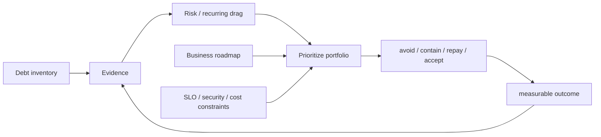

# 2026-09-22 10:00 — Interview Study Packages

README ve yakın `daily/2026-09-22/09-00.md` kontrol edildi. Linux SCHED_DEADLINE/priority inversion ile golden/snapshot testing tekrar edilmedi. Repo aramasında consistent/rendezvous hashing, WASI ve DNS negative caching zaten canonical içerik olarak bulunduğu için elendi. Bu tur ML/data-serving ile leadership/product eksenine dönüyor.

## Paket 1 — Mid → Principal ML/AI/LLM + Data Engineering: HNSW ANN, Filtered Vector Search & Recall/Latency Tuning
**Süre:** 20–30 dk

### Konu anlatımı
Embedding search'te exact k-nearest-neighbor tüm adaylarla distance hesaplayarak yüksek recall verir ama veri büyüdükçe CPU/latency maliyeti artar. Approximate Nearest Neighbor (ANN) indeksleri daha küçük aday uzayını gezerek latency/throughput kazanır; bunun bedeli bazı gerçek komşuları kaçırabilmektir.

HNSW (Hierarchical Navigable Small World) çok katmanlı proximity graph kurar. Üst katmanlar seyrek “express lane”, alt katmanlar daha yoğun yerel komşuluk gibidir. Query üst seviyeden bir entry point ile başlar, greedy biçimde yakın düğümlere ilerler ve katman katman aşağı iner. Alt katmanda daha geniş candidate set tutulur. `ef_search` benzeri search breadth parametresi büyüdükçe genellikle recall artar fakat daha çok distance evaluation, CPU ve latency ödenir. Build tarafında `M` node başına bağlantı derecesini, `ef_construction` ise index inşasında candidate breadth'i etkiler; daha yüksek değerler memory/build cost karşılığında graph quality'yi artırabilir.

Production'daki kritik sürpriz **metadata filtering**'dir. “tenant_id=X AND language=tr ORDER BY embedding distance LIMIT 10” sorgusunda ANN önce adayları bulup filtre sonradan uygulanıyorsa selective filter adayların çoğunu eleyebilir ve LIMIT'ten az sonuç veya düşük recall üretebilir. pgvector 0.8.0+ iterative scans, yeterli filtered result bulunana veya scan budget'a ulaşana kadar ANN index'ini genişletmeye devam edebilir. Alternatifler selective alan için exact/B-tree prefilter, partial index, partitioning veya vector engine'in native pre-filter stratejisidir.

```mermaid
flowchart TD
 Q[query vector] --> L2[sparse upper HNSW layer]
 L2 --> L1[closer entry points]
 L1 --> L0[dense base graph]
 L0 --> C[ANN candidates]
 C --> F{metadata filter}
 F -->|enough k| R[top-k]
 F -->|too few| I[iterative scan / expand budget]
 I --> C

 E[exact top-k on sample] --> M[recall@k]
 R --> M
 M --> T[recall-latency-cost tuning]
```

### Mental model
HNSW = **highway → neighborhood → local search**. `ef_search` arama fenerinin genişliği gibidir. Filter ise bulunan adayların bir kısmını kapıdan geri çevirir; bu yüzden unfiltered recall iyi olsa bile filtered recall kötü olabilir.

### İçeride ne oluyor?
1. Vector'lar metric'e uygun graph komşuluklarıyla indexlenir.
2. Query sparse üst katmanda hızlıca iyi bölgeye yaklaşır.
3. Her alt katmanda candidate frontier genişletilir.
4. Base layer'da yaklaşık nearest candidates oluşur.
5. Metadata predicate uygulanır; engine'e göre pre-, post- veya hybrid filtering olabilir.
6. Selective filter candidate starvation yaratırsa iterative scan/search breadth artırılabilir.
7. Offline exact search sample'ı ground truth üretir; ANN sonucu `recall@k` ile karşılaştırılır.
8. Production tuning yalnız p50 latency değil p95/p99, recall slice'ları, memory/index size, build time ve QPS ile yapılır.

### Yüksek getirili mülakat soruları
- Exact kNN ile ANN arasındaki temel trade-off nedir?
- HNSW'de hierarchy neden faydalıdır?
- `M`, `ef_construction` ve `ef_search` hangi maliyetleri etkiler?
- Cosine, inner product ve L2 metric seçimi embedding normalization ile nasıl ilişkilidir?
- Selective metadata filter neden ANN recall'ını düşürebilir?
- Iterative scan neyi düzeltir; hangi latency/memory bedelini getirir?
- Senior: recall@10'u production-benzeri query distribution ile nasıl ölçersin?
- Staff: multi-tenant RAG'de tenant isolation, partitioning ve index topology'yi nasıl tasarlarsın?
- Principal: embedding model migration sırasında dual-index, shadow query ve rollback planını nasıl kurarsın?

### Seviyeye göre cevap derinliği
- **Mid:** exact vs ANN, graph sezgisi, recall/latency trade-off'u.
- **Senior:** HNSW parametreleri, metric/normalization, filtered ANN ve benchmark methodology.
- **Staff:** tenant/data skew, partitioning, rebuild, memory capacity ve online observability.
- **Principal:** embedding migration, fleet cost, quality SLO, multi-region/index lifecycle ve rollback.

### Kısa alıştırma
10.000 query'lik evaluation setinde exact top-10 ground truth üret. HNSW için üç `ef_search` değeri dene. Önce filtersiz, sonra yalnız verinin %2'sini eşleyen tenant filtresiyle recall@10, p95 latency ve result-count distribution karşılaştır. “LIMIT 10 ama 3 sonuç” vakasını ayrıca ölç.

### Proje fikri
**filtered-ann-lab:** PostgreSQL + pgvector üzerinde 100k–1M synthetic embedding oluştur. HNSW index kur; `ef_search`, iterative scan, B-tree metadata prefilter, partial index ve partitioning varyantlarını karşılaştır. Dashboard: recall@k, p50/p95/p99, rows returned, buffers/CPU, index size ve build time.

### Failure modes / trade-off / production bağlantısı
- Yalnız latency benchmark edip recall ölçmemek sessiz kalite kaybıdır.
- Random query set gerçek tenant/filter skew'unu temsil etmeyebilir.
- Çok yüksek `ef_search` ANN avantajını azaltabilir.
- Çok düşük search breadth selective filter altında result starvation yaratabilir.
- Embedding model değişirken eski/yeni vector space'leri aynı index'te karıştırmak anlamsız distance üretir.
- Delete/update churn ve index rebuild/maintenance operasyonel kapasite ister.
- Tenant authorization yalnız vector filter'a bırakılmamalı; güvenlik sınırı ayrıca uygulanmalıdır.

Production'da recall proxy/offline eval, empty/undersized result rate, query filter selectivity, p95/p99 latency, distance evaluations, CPU, memory/index bytes, build/rebuild duration ve embedding-version dağılımı izlenmelidir.

### Kaynaklar
- Malkov & Yashunin — HNSW paper: https://arxiv.org/abs/1603.09320
- IEEE/PubMed record: https://pubmed.ncbi.nlm.nih.gov/30602420/
- pgvector README — HNSW, filtering, iterative scans: https://github.com/pgvector/pgvector/blob/master/README.md

---

## Paket 2 — Senior → CTO Leadership/Product/Business: Technical Debt Portfolio, Risk Pricing & Investment Governance
**Süre:** 20–30 dk

### Konu anlatımı
Technical debt yalnız “çirkin kod” değildir. Bir teknik karar bugün delivery'yi hızlandırırken gelecekte change cost, incident probability, security exposure, cloud spend veya hiring/onboarding friction artırabilir. Debt metaforunun yararlı kısmı şudur: **principal** mevcut yapısal yük, **interest** ise bu yük yüzünden her değişiklikte tekrar ödenen ek maliyettir.

CTO seviyesinde sorun tek tek refactor ticket'larını seçmek değil, debt'i bir **risk ve yatırım portföyü** olarak yönetmektir. Her debt item için en az dört boyut düşün: exposure (hangi ürün/gelir/SLO etkileniyor), likelihood (failure veya gecikme olasılığı), recurring drag (her sprint/incident'ta ödenen interest) ve remediation cost. Bunlara option value eklenir: bazı platform yatırımları gelecekteki ürün seçeneklerini hızlandırır; bazı “temizlik” işleri ise measurable outcome üretmeden opportunity cost yaratır.

Bu nedenle “%20 zamanı tech debt'e ayıralım” tek başına strateji değildir. Daha güçlü model: debt register + owner + evidence + risk class + trigger + target outcome. Reliability debt error-budget burn ile, security debt exploitability/exposure ile, developer-productivity debt lead time/rework ile, cost debt unit economics ile bağlanabilir. Yatırım kararı ürün roadmap'i ve şirket risk appetite'ıyla aynı masada verilmelidir.



### Mental model
Technical debt backlog değil **balance sheet + risk register** gibi düşünülür. Her item “bunu düzeltmek güzel olur” değil, “hangi gelecekteki nakit akışı, teslimat hızı veya risk profili değişecek?” sorusuyla fiyatlanır.

### İçeride ne oluyor?
1. Debt kaynakları incident review, architecture review, security findings, delivery metrics ve cost telemetry'den toplanır.
2. Item'lar reliability/security/velocity/cost/compliance gibi sınıflara ayrılır.
3. Evidence eklenir: incident minutes, change failure, repeated toil, cloud cost, dependency EOL, audit finding.
4. Risk ve recurring drag yaklaşık boyutlandırılır; sahte hassasiyetten kaçınılır.
5. Remediation seçenekleri karşılaştırılır: repay, isolate/contain, migrate gradually, accept, retire product surface.
6. Roadmap kapasitesi business outcome ve risk appetite ile tahsis edilir.
7. Her yatırım için exit criterion belirlenir: örneğin deploy lead time -%30, Sev-1 class'ı kapanması, cost/request -%20.
8. Sonuç ölçülür; debt register yaşayan karar sistemi olarak güncellenir.

### Yüksek getirili mülakat soruları
- Technical debt ile sıradan bug veya feature request'i nasıl ayırırsın?
- Senior: “Bu servisi rewrite edelim” talebini nasıl değerlendirirsin?
- Staff: debt item'larını risk ve recurring drag ile nasıl sıralarsın?
- Principal: platform migration'ın option value'sunu nasıl ölçersin?
- EM: feature delivery ile debt repayment kapasitesini nasıl müzakere edersin?
- CTO: board'a neden 2 çeyrek platform yatırımı gerektiğini hangi business metric'lerle anlatırsın?
- CTO: hangi debt bilinçli olarak kabul edilmelidir?
- Incident sonrası “bir daha olmasın” yatırımı ile over-engineering arasındaki sınır nedir?

### Seviyeye göre cevap derinliği
- **Senior:** local debt'i change cost, incidents ve maintainability ile bağlar.
- **Staff:** birden çok takımın dependency graph'ı, migration sequence ve ownership'i yönetir.
- **Principal:** platform standardı, option value, systemic risk ve long-horizon trade-off kurar.
- **EM:** capacity allocation, incentives ve delivery predictability'yi yönetir.
- **CTO:** teknoloji yatırımını revenue, margin, regulatory exposure, reliability ve strategic optionality ile fiyatlar.

### Kısa alıştırma
Üç debt item'ı karşılaştır: (A) ayda 8 engineer-hour manuel release toil, (B) yılda yaklaşık bir kez 2 saatlik checkout outage riski, (C) 9 ay sonra EOL olacak kritik dependency. Her biri için evidence, exposure, likelihood/drag, remediation cost, deadline/trigger ve başarı metriği yaz. Tek bir scalar skor üretmek yerine karar gerekçesini açıkla.

### Proje fikri
**debt-portfolio-dashboard:** küçük bir repo + dashboard oluştur. Debt item schema'sı: owner, class, evidence, affected systems, risk band, recurring hours/month, estimated remediation, trigger/deadline, target metric, decision log. Aylık review ile accepted/contained/repaid durumlarını ve realized outcome'u izle.

### Failure modes / trade-off / production bağlantısı
- Debt'i yalnız story-point backlog'a çevirmek business exposure'u gizler.
- Tek “debt score” sahte kesinlik yaratır ve tail risk'i ezebilir.
- Rewrite bias incremental containment/migration seçeneklerini gölgeler.
- Yalnız developer sentiment ile önceliklendirmek customer/revenue riskini kaçırabilir.
- Yalnız kısa vadeli ROI güvenlik/compliance ve low-frequency/high-impact reliability riskini küçümseyebilir.
- Owner ve exit criterion olmayan platform programları sonsuz yatırıma dönüşebilir.

Production bağlantısı: debt register incident/postmortem, SLO/error-budget, vulnerability/EOL, CI/CD lead time, change failure, toil, cloud unit cost ve customer-impact telemetry'sine bağlanmalıdır. CTO için amaç “sıfır debt” değil, şirket stratejisine uygun **bilinçli risk taşıma ve yatırım verimliliği**dir.

### Kaynaklar
- Google SRE — Eliminating Toil: https://sre.google/sre-book/eliminating-toil/
- Google SRE — Embracing Risk: https://sre.google/sre-book/embracing-risk/
- Google SRE — Error Budgets and Policy: https://sre.google/workbook/error-budget-policy/
- Martin Fowler — Technical Debt Quadrant (kavramsal referans): https://martinfowler.com/bliki/TechnicalDebtQuadrant.html
