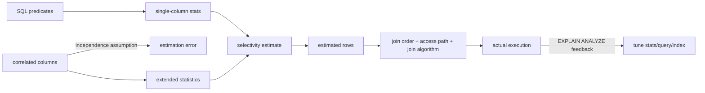
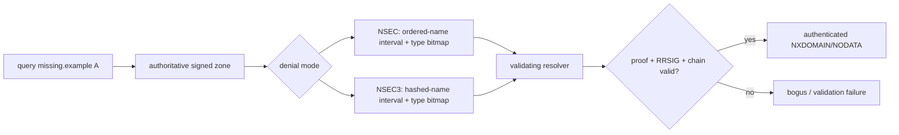

# 2026-09-22 11:00 — Interview Study Packages

README ve yakın `daily/2026-09-22/10-00.md` kontrol edildi. CoW/Btrfs snapshot internals ve hermetic test/test-size konuları tekrar edilmedi. Repo-wide aramada WebAuthn/passkeys zaten birkaç canonical bölümde bulunduğu için elendi. Bu tur veritabanı optimizer internals ile DNSSEC authenticated denial of existence katmanına ilerliyor.

## Paket 1 — Mid → Principal Databases: Cardinality Estimation, Histograms & Extended Statistics
**Süre:** 20–30 dk

### Konu anlatımı
Query optimizer yalnız SQL'in semantiğini değil, her ara operatörden yaklaşık kaç satır çıkacağını da tahmin etmek zorundadır. **Cardinality estimation (CE)** bu tahmindir ve join order, index scan vs sequential scan, hash join vs nested loop ve memory/work allocation gibi kararların temel input'udur. Tahmin hatası plan ağacında çarpılarak büyüyebilir: filtre gerçekte 100 satır üretirken planner 100.000 beklerse daha ilk node'da yanlış fiziksel strateji seçilebilir.

PostgreSQL `ANALYZE` örnekleme ile column statistics üretir. `null_frac`, `n_distinct`, most-common-values/frequencies ve histogram bounds dağılım hakkında özet bilgi taşır. Histogram her değeri saklamaz; dağılımı yaklaşık bucket'lara sıkıştırır. Planner predicate selectivity tahminini bu özetlerden üretir. Statistics target yükseltmek daha ayrıntılı örnek/istatistik sağlayabilir ama ANALYZE zamanı ve catalog/statistics maliyetini artırır.

Tek-column istatistiklerin kritik kör noktası **correlation/dependency between columns**'dır. Örneğin `city='Istanbul' AND country='TR'` bağımsız iki predicate değildir. Planner bağımsızlık varsayımı yaparsa selectivity'leri çarpıp ciddi hata üretebilir. PostgreSQL `CREATE STATISTICS` ile functional dependencies, multivariate distinct counts ve multivariate MCV gibi extended statistics toplayabilir. Bunlar her kombinasyon için otomatik üretilmez; hangi kolon kümelerinin birlikte önemli olduğunu workload'dan seçmek gerekir.

### Mental model
Optimizer **haritanın kendisiyle değil, sıkıştırılmış istatistiksel bir haritayla** plan yapar. CE hatası yanlış yol tarifidir; kötü executor bazen yalnız yanlış cardinality bilgisinin kurbanıdır.

### İçeride ne oluyor?
1. `ANALYZE` table sample alır ve column statistics üretir.
2. Equality predicate MCV veya distinct-count bilgisinden selectivity tahmini alabilir.
3. Range predicate histogram bucket'larından yaklaşık selectivity çıkarabilir.
4. Birden fazla predicate için planner çoğu durumda bağımsızlık varsayımına ihtiyaç duyar.
5. Correlated columns bu varsayımı bozar; extended statistics dependency/MCV/ndistinct bilgisi ekler.
6. Estimated rows plan node'larının cost hesabını ve join order'ı etkiler.
7. `EXPLAIN (ANALYZE ...)` estimated-vs-actual rows farkını görünür kılar.
8. Çözüm körlemesine statistics target artırmak değil; stale stats, skew, correlation, parameter sensitivity ve predicate shape'i ayırmaktır.

### Yüksek getirili mülakat soruları
- Mid: cardinality estimation neden query plan için kritiktir?
- Mid: MCV listesi ile histogram hangi farklı dağılım problemlerini çözer?
- Senior: iki correlated predicate'de independence assumption nasıl hata üretir?
- Senior: estimated rows 100, actual rows 1M ise hangi root-cause sırasıyla bakarsın?
- Senior: statistics target'ı her kolonda maksimum yapmak neden iyi policy değildir?
- Staff: multi-tenant skew ve parameter-sensitive workload için CE sorununu nasıl gözlemlersin?
- Principal: optimizer regression'larını upgrade öncesi plan-diff + workload replay ile nasıl gate edersin?

### Seviyeye göre cevap derinliği
- **Mid:** selectivity, histogram, MCV, estimated-vs-actual rows.
- **Senior:** skew, stale stats, correlation, extended statistics ve join-order etkisi.
- **Staff:** workload-specific stats policy, plan regression detection, tenant/data-shape segmentation.
- **Principal:** optimizer/version rollout, benchmark corpus, SLO/cost regression gate ve rollback.

### Kısa alıştırma
10M satırlı tabloda `country='TR'` %10, `city='Istanbul'` %4 görünüyor; fakat Istanbul satırlarının tamamı TR içinde. Bağımsızlık varsayımı iki predicate birlikte kaç satır tahmin eder? Gerçek 400k ise hata oranını hesapla ve hangi extended statistics türünün yardımcı olabileceğini tartış.

### Proje fikri
**ce-lab:** PostgreSQL'de correlated `country/city` ve skewed tenant dataset üret. `ANALYZE`, `pg_stats`, `EXPLAIN (ANALYZE, BUFFERS)` ile estimated/actual ratio'yu kaydet. `CREATE STATISTICS` öncesi/sonrası join order, runtime ve buffer reads'i karşılaştır.

### Failure modes / trade-off / production bağlantısı
Stale statistics, hızla değişen distributions, rare values, correlated columns ve parameter sensitivity kötü CE üretebilir. Daha yüksek statistics target planning/catalog maliyetini artırır ve her correlation'ı çözmez. Production'da estimated/actual row ratio, plan hash/change, query p95/p99, temp spill, buffer reads ve autovacuum/analyze freshness birlikte izlenmelidir.

### Kaynaklar
- PostgreSQL 17 — Statistics Used by the Planner: https://www.postgresql.org/docs/17/planner-stats.html
- PostgreSQL 17 — CREATE STATISTICS: https://www.postgresql.org/docs/17/sql-createstatistics.html
- PostgreSQL 17 — Using EXPLAIN: https://www.postgresql.org/docs/17/using-explain.html

---

## Paket 2 — Mid → Principal Networking/Cybersecurity: DNSSEC NSEC/NSEC3 & Authenticated Denial of Existence
**Süre:** 20–30 dk

### Konu anlatımı
DNSSEC yalnız var olan RRset'lerin imzasını doğrulamakla yetinemez. Bir saldırgan gerçek cevabı silip “bu isim yok” diyebilseydi signed positive answers yeterli olmazdı. Bu nedenle resolver'ın **name veya RR type gerçekten yok** iddiasını da kriptografik olarak doğrulayabilmesi gerekir: authenticated denial of existence.

NSEC, zone içindeki canonical name ordering'de bir sonraki owner name'i ve mevcut RR type bitmap'ini signed bir record olarak taşır. Böylece iki mevcut isim arasındaki aralığın boş olduğu veya bir isimde belirli QTYPE'ın bulunmadığı kanıtlanabilir. Fakat zincirin kendisi zone içeriğinin enumerate edilmesini kolaylaştırabilir.

NSEC3 isimleri hash'leyerek denial chain'i hash order'da kurar ve Opt-Out desteği ekler. Bu zone enumeration'ı zorlaştırır ama protokol/validation complexity ve hashing cost getirir; hash gizlilik şifrelemesi değildir. NSEC3 proof'larında closest encloser, next-closer ve wildcard ihtimallerinin doğru kanıtlanması önemlidir. Güncel RFC 9824 (Eylül 2025) online-signing senaryoları için Compact Denial of Existence yaklaşımını standartlaştırarak tek minimally-covering NSEC/NSEC3 ile daha küçük negative response ve daha az online signing işi hedefler.

### Mental model
DNSSEC'te **yokluk da imzalanabilir bir kanıt gerektirir**. NSEC boş name interval'ını açık isimlerle, NSEC3 ise hash-space interval'ıyla ispatlar.

### İçeride ne oluyor?
1. Resolver DNSSEC validation için chain of trust/DNSKEY/DS bağlamını kurar.
2. Positive RRset yoksa authoritative server signed denial records döndürür.
3. NSEC name interval ve type bitmap ile name/type nonexistence kanıtlar.
4. NSEC3 aynı fikri hashed owner-name space'e taşır; salt/iteration/algorithm parametreleri kullanır.
5. NXDOMAIN proof wildcard sentezinin de mümkün olmadığını göstermelidir; NSEC3'te closest-encloser/next-closer reasoning kritik olabilir.
6. Validator denial RR'nin RRSIG'ini ve proof coverage'ını doğrular.
7. Invalid/expired/missing proof secure zone'da cevabı `bogus` hale getirebilir; bunu sıradan NXDOMAIN gibi kabul etmek güvenlik hatasıdır.
8. NSEC/NSEC3 negative proofs cache'lenebilir; aggressive use authoritative query load'unu azaltabilir.

### Yüksek getirili mülakat soruları
- Mid: DNSSEC neden negative answer'ları da authenticate etmek zorundadır?
- Mid: NSEC name nonexistence ile type nonexistence'i nasıl kanıtlar?
- Senior: NSEC'in zone enumeration trade-off'u nedir; NSEC3 neyi değiştirir?
- Senior: NSEC3 hashing neden confidentiality sağlamaz?
- Senior: wildcard varken NXDOMAIN proof neden daha karmaşıktır?
- Staff: validation failure ile normal NXDOMAIN telemetry'sini neden ayırırsın?
- Principal: DNSSEC rollover, negative caching, resolver compatibility ve outage blast-radius'unu nasıl rollout edersin?

### Seviyeye göre cevap derinliği
- **Mid:** signed negative proof, NSEC interval/type bitmap.
- **Senior:** NSEC3 hashing, Opt-Out, wildcard/closest-encloser ve enumeration trade-off.
- **Staff:** validator behavior, caching, operational observability ve rollover/failure modes.
- **Principal:** DNS provider/resolver interoperability, key lifecycle, staged rollout ve availability-vs-security policy.

### Kısa alıştırma
Zone'da `a.example` ve `d.example` var, `b.example` yok. NSEC yaklaşımında hangi interval'ın `b.example` yokluğunu kanıtlayabileceğini çiz. Sonra `a.example` var ama `AAAA` yok senaryosunda type bitmap'in rolünü açıkla. Wildcard `*.example` eklenince NXDOMAIN reasoning'in neden ek kanıt istediğini tartış.

### Proje fikri
**dnssec-denial-lab:** disposable BIND/Knot zone veya test fixture ile signed zone kur. NSEC ve NSEC3 varyantlarında `dig +dnssec` ile NXDOMAIN/NODATA cevaplarını kaydet; RRSIG/NSEC/NSEC3 proof'larını karşılaştır. Deliberately broken signature/expired test fixture ile validating resolver'ın bogus davranışını gözle. Public production zone'u bozma.

### Failure modes / trade-off / production bağlantısı
Expired signatures, broken chain-of-trust, yanlış NSEC3 parametre/Opt-Out kullanımı ve wildcard proof hataları resolution outage yaratabilir. NSEC enumeration kolaylığı getirir; NSEC3 complexity/CPU ve offline dictionary riskini tamamen yok etmez. DNSSEC confidentiality veya DoS koruması değildir. Production'da SERVFAIL/validation-bogus rate, DNSKEY/DS rollover state, signature expiry horizon, NXDOMAIN/NODATA rate, response size ve authoritative QPS birlikte izlenmelidir.

### Kaynaklar
- RFC 4033 — DNS Security Introduction and Requirements: https://www.rfc-editor.org/rfc/rfc4033.html
- RFC 5155 — DNSSEC Hashed Authenticated Denial of Existence (NSEC3): https://www.rfc-editor.org/rfc/rfc5155.html
- RFC 7129 — Authenticated Denial of Existence in the DNS: https://www.rfc-editor.org/rfc/rfc7129.html
- RFC 9276 — Guidance for NSEC3 Parameter Settings: https://www.rfc-editor.org/rfc/rfc9276.html
- RFC 9824 — Compact Denial of Existence in DNSSEC (September 2025): https://www.rfc-editor.org/rfc/rfc9824.html
