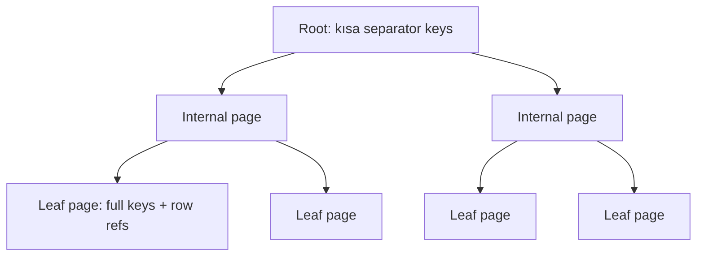
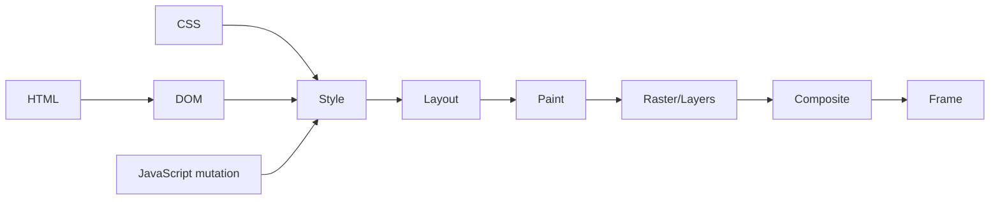

# 2026-09-22 12:00 — Interview Study Packages

README ve yakın `daily/2026-09-22/11-00.md` kontrol edildi. Cardinality estimation/histograms ve DNSSEC NSEC/NSEC3 tekrar edilmiyor. Repo-wide aramada compiler SSA/phi/dominators, dynamic linking/GOT/PLT ve differential/metamorphic testing zaten işlendiği için elendi. Bu tur B+Tree fiziksel anahtar küçültme/fanout hattı ile frontend rendering internals hattına ilerliyor.

## Paket 1 — Junior → Principal Databases: B+Tree Separator Keys, Suffix Truncation, Fanout & Height
**Süre:** 20–30 dk

### Konu anlatımı
B+Tree'nin performansını yalnız `O(log n)` diye açıklamak eksiktir. Gerçek maliyet; page boyutu, internal tuple boyutu, fanout, tree height ve cache/I/O davranışıyla belirlenir. Internal node'daki separator key'in görevi bir heap row'u temsil etmek değil, aramayı doğru child page'e yönlendirmektir. Bu yüzden bazı implementasyonlar separator'ın ayırt etmek için gerekmeyen suffix kolonlarını atabilir.

PostgreSQL B-Tree'de page split sırasında yeni parent downlink için pivot tuple oluşturulur. Suffix truncation, özellikle multicolumn indexlerde separator için gereksiz trailing attribute'ları kaldırarak internal tuple'ları küçültebilir. Daha küçük internal tuple → page başına daha fazla downlink → daha yüksek fanout → aynı kayıt sayısında daha az tree level ihtimali demektir. Bu, leaf deduplication'dan farklıdır: dedup duplicate leaf tuple'larını posting list biçiminde sıkıştırırken suffix truncation internal/pivot key temsilini küçültür.

Basit yaklaşım: yaklaşık `fanout ≈ usable_page_bytes / avg_internal_entry_bytes`; yükseklik de kabaca `ceil(log_fanout(N_leaf_pages))`. Gerçekte page header, line pointer, fill, variable-length datum ve split politikaları vardır; formül capacity intuition içindir.

### Mental model

`internal key küçülür → page'e daha çok child pointer sığar → fanout artar → height düşebilir → lookup daha az page touch yapar`

### İçeride ne oluyor?
1. Search internal page'de separator/pivot key'lerle doğru child'ı seçer.
2. Leaf dolarsa split olur ve parent'a yeni downlink gerekir.
3. Parent'a taşınan separator'ın yalnız routing için gerekli kısmı tutulabilir.
4. Internal entry boyutu küçüldükçe aynı page daha çok downlink taşır.
5. Tree height ancak root split ile artar; fanout height-growth eşiğini belirler.
6. Composite index kolon sırası yalnız query predicate'lerini değil physical key width ve fanout'u da etkileyebilir.

### Yüksek getirili mülakat soruları
1. B+Tree neden binary tree değildir; yüksek fanout neden storage için değerlidir?
2. Separator key ile leaf key arasındaki semantik fark nedir?
3. Suffix truncation neyi optimize eder, leaf deduplication'dan farkı nedir?
4. 8 KiB page ve ortalama 32-byte internal entry ile kaba fanout nasıl hesaplarsın?
5. Senior: geniş composite key tree height ve cache residency'yi nasıl etkiler?
6. Staff/Principal: index width, covering index, write amplification ve lookup latency arasında nasıl karar verirsin?

### Beklenen cevap derinliği
- **Junior:** B+Tree page tabanlıdır; internal node routing, leaf node row reference taşır.
- **Mid:** fanout/height ve separator key'i açıklar.
- **Senior:** split, pivot tuple, suffix truncation, cache/I/O ve composite-key width bağlantısını kurar.
- **Staff:** index-design kararını workload, page density, write amplification ve observability ile bağlar.
- **Principal:** storage-engine invariant'larını ürün latency/SLO ve capacity economics ile tartışır.

### Kısa alıştırma
8 KiB usable page varsay. Ortalama internal entry 64 byte iken kaba fanout'u, suffix truncation sonrası 32 byte olduğunda yeni fanout'u hesapla. 1 milyon leaf page için iki durumda gereken internal level sayısını yaklaşık karşılaştır.

### Proje fikri
`btree-fanout-lab`: PostgreSQL'de `(tenant_id, long_text_key, created_at)` gibi geniş composite index oluştur. `pageinspect` ile örnek internal/leaf page'leri incele; index size, tree level ve query buffer hits ölç. Sonra kolon genişliği/sırası değiştirip sonucu karşılaştır.

### Failure modes / trade-off / production
`O(log n)` diyerek page geometry'yi yok saymak; covering index uğruna çok geniş key/include payload üretmek; dedup ile suffix truncation'ı aynı mekanizma sanmak tipik hatalardır. Production'da index size, level, cache hit, read amplification, split/bloat ve write latency birlikte izlenmelidir. Daha geniş index read path'i iyileştirirken write amplification ve cache pressure yaratabilir.

### Kaynaklar
- PostgreSQL 18 B-Tree internals: https://www.postgresql.org/docs/18/btree.html
- PostgreSQL 18 CREATE INDEX: https://www.postgresql.org/docs/18/sql-createindex.html
- PostgreSQL source `src/backend/access/nbtree/README`: https://github.com/postgres/postgres/blob/master/src/backend/access/nbtree/README

---

## Paket 2 — Junior → Staff Frontend: Browser Rendering Pipeline, Layout, Paint & Compositing
**Süre:** 20–30 dk

### Konu anlatımı
Frontend performansını yalnız bundle size veya framework seçimiyle açıklamak eksiktir. Browser HTML/CSS/JS ve diğer kaynakları ekrandaki pixel'lere dönüştürürken DOM/style hesaplama, layout, paint ve compositing gibi aşamalardan geçer. Bir değişikliğin maliyeti hangi aşamaları yeniden tetiklediğine bağlıdır.

Layout geometrinin hesaplandığı katmandır: element nerede ve ne kadar büyük? Paint, görsel çizim komutlarını üretir. Compositing ise ayrı layer/raster sonuçlarını doğru sırada ekranda birleştirir. `transform`/`opacity` gibi bazı değişiklikler uygun durumda layout/paint'i atlayıp compositor ağırlıklı ilerleyebilir; fakat “GPU = bedava” değildir: fazla layer memory tüketir ve upload/raster maliyeti doğurabilir.

JS aynı frame içinde DOM write yaptıktan sonra geometry read (`getBoundingClientRect`, bazı layout property'leri) isterse browser pending style/layout işini senkron tamamlamak zorunda kalabilir. Read/write'ların döngü içinde karışması layout thrashing üretir. 60 Hz ekranda frame bütçesi yaklaşık 16.7 ms olsa da browser'ın tüm işi bu bütçeyi paylaşır.

### Mental model

### İçeride ne oluyor?
1. Parser DOM'u; CSS sistemi style bilgisini üretir/günceller.
2. Layout box geometry'yi hesaplar.
3. Paint görünür içeriği çizim operasyonlarına dönüştürür.
4. Rasterization bu içeriği pixel/tile sonuçlarına çevirir.
5. Compositor layer'ları birleştirip frame üretir.
6. DOM/style mutation invalidation yaratabilir; kapsamı değişikliğe bağlıdır.
7. Zorunlu senkron layout ve long main-thread task interaction latency'yi yükseltir.

### Yüksek getirili mülakat soruları
1. Layout, paint ve composite arasındaki fark nedir?
2. Neden `transform: translate()` çoğu durumda `left/top` animasyonundan daha ucuz olabilir?
3. Forced synchronous layout nedir?
4. Layout thrashing nasıl oluşur ve nasıl azaltılır?
5. Senior: compositor layer sayısını sınırsız artırmak neden kötü olabilir?
6. Staff: lab benchmark ile gerçek kullanıcı INP/LCP verisi çelişirse nasıl triage edersin?

### Beklenen cevap derinliği
- **Junior:** DOM/style/layout/paint/composite sırasını ve temel farkları anlatır.
- **Mid:** invalidation, frame budget, read/write batching ve DevTools timeline kullanır.
- **Senior:** main thread/compositor ayrımı, raster, layer memory ve forced layout trade-off'larını tartışır.
- **Staff:** RUM + trace + device class + percentile yaklaşımıyla performans bütçesi ve rollout tasarlar.

### Kısa alıştırma
100 kartın her iterasyonda width'ini değiştirip hemen `offsetWidth` okuyan bir loop yaz. Sonra tüm read'leri ve write'ları iki ayrı faza ayır. Chrome DevTools Performance panelinde Layout event sayısı ve toplam süresini karşılaştır.

### Proje fikri
`render-pipeline-lab`: aynı animasyonu üç yöntemle kur: `left`, `transform`, canvas. CPU throttling altında frame time, long task ve interaction latency ölç; sonuçları bir teknik karar kaydında açıkla.

### Failure modes / trade-off / production
“Her şey compositor'da çalışır”, “will-change her yere eklenmeli” veya “60 FPS tek başarı metriğidir” yaklaşımları yanlıştır. Layer promotion memory ve raster maliyeti yaratabilir; gerçek kullanıcı cihazları lab makinesinden çok farklıdır. Production'da INP/LCP/CLS, long tasks ve RUM device/network segmentleri birlikte incelenmeli; regression release/canary ile korele edilmelidir.

### Kaynaklar
- Chrome for Developers — Blink: https://developer.chrome.com/docs/web-platform/blink
- Chrome for Developers — Performance: https://developer.chrome.com/docs/performance
- web.dev — Rendering performance: https://web.dev/articles/rendering-performance
- Chrome DevTools Performance: https://developer.chrome.com/docs/devtools/performance
