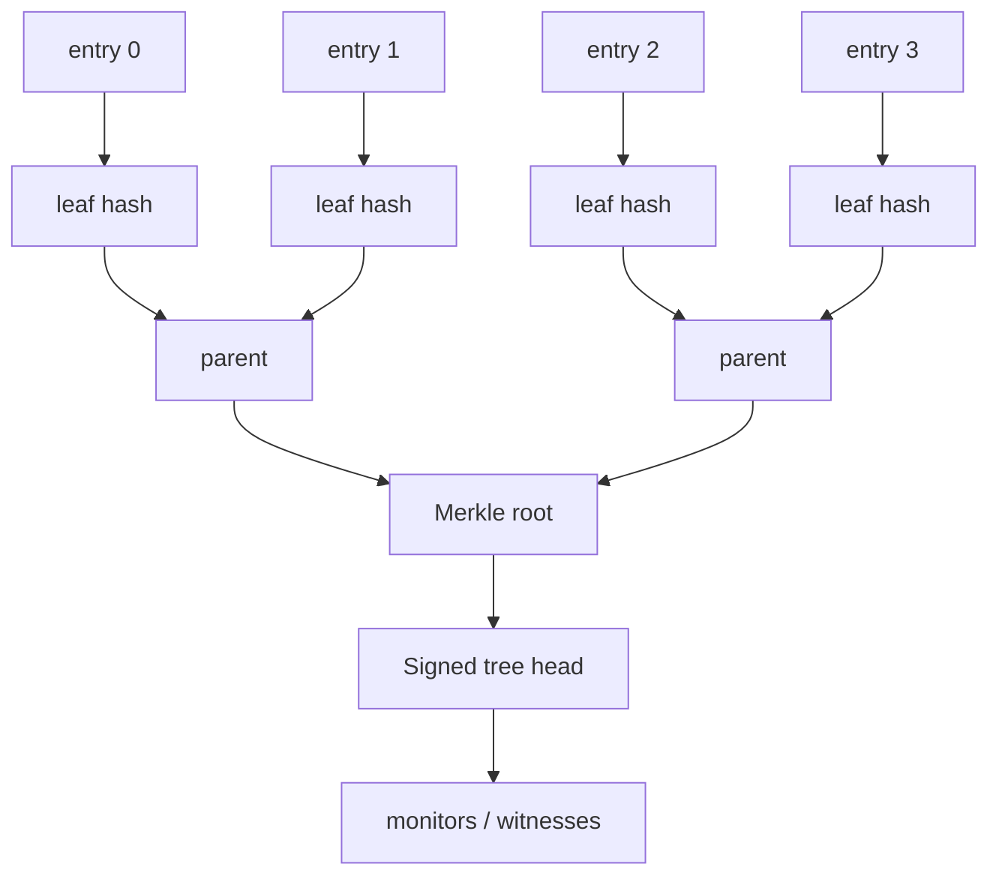
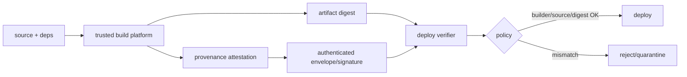

# 2026-09-22 13:00 — Interview Study Packages

README ve yakın `daily/2026-09-22/12-00.md` kontrol edildi. B+Tree separator/suffix truncation ve browser rendering pipeline tekrar edilmiyor. Repo-wide aramada transparency-log/Merkle inclusion-consistency proof ile SLSA/in-toto provenance için doğrudan canonical eşleşme bulunmadı. Bu tur cybersecurity/distributed systems ile cloud/DevOps/security hattına dönüyor.

## Paket 1 — Mid → Principal Cybersecurity + Distributed Systems: Transparency Logs, Merkle Inclusion & Consistency Proofs
**Süre:** 20–30 dk

### Konu anlatımı
Transparency log, olayları yalnız saklayan bir audit tablosu değil; geçmişi sonradan sessizce değiştirmeyi kriptografik olarak fark edilebilir yapan append-only veri yapısıdır. Certificate Transparency ve Sigstore/Rekor gibi sistemlerde temel fikir, ordered log entry'lerini Merkle tree leaf'lerine bağlamak ve belirli aralıklarla tree root'u imzalamaktır.

Merkle **inclusion proof**, belirli bir leaf'in belirli tree size/root altında bulunduğunu O(log n) sibling hash ile kanıtlar. **Consistency proof** ise eski bir tree head'in yeni ağacın prefix'i olduğunu; yani yeni log'un eskisini rewrite etmeden yalnız append ederek büyüdüğünü kanıtlar. Bunlar farklı soruları cevaplar: `entry var mı?` ve `geçmiş değişmedi mi?`.

Signed Tree Head (STH) tree size, root hash ve zamanı imzalı bir checkpoint'e bağlar. Fakat kriptografik proof tek başına global tek-gerçek görünüm garantisi değildir: kötü niyetli log farklı istemcilere farklı ama kendi içinde geçerli tree view'ları gösterebilir. Bu yüzden monitor/witness/gossip benzeri bağımsız gözlem ve checkpoint karşılaştırması trust modelinin önemli parçasıdır.

### Mental model

`inclusion proof = leaf → root için eksik sibling hash'ler`

`consistency proof = old root/tree_size → new root/tree_size append-only ilişkisi`

### İçeride ne oluyor?
1. Entry deterministic biçimde leaf hash'e çevrilir; leaf/node domain separation uygulanabilir.
2. Parent hash child hash'lerden türetilir; root tüm ordered prefix'e commitment olur.
3. Log belirli tree size için root/checkpoint'i imzalar.
4. Inclusion verifier leaf index + sibling path ile root'u yeniden hesaplar.
5. Consistency verifier eski ve yeni root'un aynı prefix history'den geldiğini kontrol eder.
6. Monitor yeni entry'leri tarayıp beklenmeyen identity/certificate/artifact olaylarını arar.
7. Witness/checkpoint paylaşımı split-view/equivocation riskini azaltmak için bağımsız gözlem sağlar.

### Yüksek getirili mülakat soruları
1. Merkle root neden bütün log'u tek bir digest'e bağlayabilir?
2. Inclusion proof ile consistency proof arasındaki fark nedir?
3. Proof boyutu neden yaklaşık O(log n)'dir?
4. Signed tree head neyi kanıtlar, neyi kanıtlamaz?
5. Append-only log neden normal immutable database tablosundan farklı bir trust property sağlar?
6. Senior: malicious log iki kullanıcıya iki farklı valid root gösterirse ne olur?
7. Staff/Principal: witness/gossip/monitor topolojisini availability ve trust-domain trade-off'larıyla nasıl tasarlarsın?

### Beklenen cevap derinliği
- **Mid:** Merkle tree, root, inclusion proof ve append-only fikrini doğru ayırır.
- **Senior:** tree size/checkpoint, consistency proof, split-view ve monitor rolünü açıklar.
- **Staff:** proof serving, sharding, checkpoint distribution ve operational failure mode'ları tartışır.
- **Principal:** trust domains, independent witnesses, incident evidence retention ve supply-chain/certificate governance bağlantısını kurar.

### Kısa alıştırma
8 leaf'li binary Merkle tree çiz. `leaf 3` için inclusion path'te hangi sibling hash'lerin gerektiğini işaretle. Sonra 8-leaf root'tan 12-leaf root'a geçişte neden yalnız `root8` ile `root12` eşitliğine bakmanın append-only geçmişi kanıtlamadığını açıkla.

### Proje fikri
`transparency-log-lab`: append-only küçük bir log yaz. Her append sonrası Merkle root üret; `prove-inclusion(index)` ve `verify-inclusion` ekle. Ardından eski/new checkpoint için consistency proof doğrulaması ve iki conflicting checkpoint'i yakalayan basit witness geliştir.

### Failure modes / trade-off / production
İmzalı root'u otomatik olarak global truth sanmak; inclusion ile consistency'yi karıştırmak; monitor çalışmıyorken log'un güvenli olduğunu varsaymak; checkpoint/proof retention'ı ihmal etmek tipik hatalardır. Büyük log'da proof serving/cache, sharding ve monitor lag maliyet yaratır. Production'da tree size/checkpoint age, inclusion latency/error, consistency verification failure, monitor lag, conflicting checkpoint ve signer/witness health izlenmelidir.

### Kaynaklar
- RFC 9162 — Certificate Transparency Version 2.0: https://www.rfc-editor.org/rfc/rfc9162.html
- Sigstore Rekor overview: https://docs.sigstore.dev/logging/overview/
- Sigstore Rekor security model: https://docs.sigstore.dev/about/security/
- Sigstore Rekor sharding: https://docs.sigstore.dev/logging/sharding/

---

## Paket 2 — Mid → CTO Cloud/DevOps/SRE + Cybersecurity: SLSA Provenance, in-toto Attestations & Build Trust Boundaries
**Süre:** 20–30 dk

### Konu anlatımı
Bir artifact'in imzası `bu byte'lar bu signer tarafından onaylandı` sorusuna yardımcı olur; fakat tek başına `hangi source revision, hangi build workflow, hangi dependencies ve hangi builder bu artifact'i üretti?` sorularını cevaplamaz. **Provenance**, artifact'i üretim sürecine bağlayan doğrulanabilir metadata'dır.

SLSA Build Provenance v1.2, in-toto attestation framework üzerinde `subject` artifact digest'lerini bir `predicate` içindeki build tanımı ve run details ile bağlar. `buildType`, `externalParameters`, `resolvedDependencies`, `builder.id` gibi alanlar policy engine'in `bu artifact beklediğim trusted builder ve beklediğim inputs ile mi üretildi?` sorusunu değerlendirmesini sağlar.

En kritik mental model: provenance dosyasının varlığı güven demek değildir. Consumer önce attestation authentication/signature/envelope'ını doğrulamalı, sonra subject digest'in deploy edeceği artifact ile aynı olduğunu kontrol etmeli, ardından builder identity/build type/source/dependency gibi policy'leri uygulamalıdır. User-controlled build step provenance'ın trusted alanlarını serbestçe yazabiliyorsa attestation yalnız saldırganın iddiasını imzalamış olur.

### Mental model

`artifact signature ≠ complete build provenance`

`attestation exists ≠ attestation policy accepted`

### İçeride ne oluyor?
1. Build platform immutable output digest'lerini `subject` olarak kaydeder.
2. Build definition; build type ve dış parametreleri tanımlar.
3. Resolved dependencies mümkün olduğunca exact digest/revision ile kaydedilir.
4. `builder.id`, provenance doğruluğu için güvenilen build platform trust boundary'sini temsil eder.
5. Statement/predicate authenticated envelope içinde taşınır; verifier signer-builder eşleşmesini doğrular.
6. Admission/release policy artifact digest + provenance claims üzerinde karar verir.
7. Provenance ve verification evidence incident response/audit için saklanır.

### Yüksek getirili mülakat soruları
1. SBOM ile provenance arasındaki fark nedir?
2. Artifact signature neden provenance'ın yerine geçmez?
3. `subject.digest` neden deployment verification'ın merkezindedir?
4. `builder.id` neyi temsil eder ve neden yalnız workflow adı değildir?
5. User-controlled CI step provenance üretirse hangi trust problemi doğar?
6. Staff: self-hosted runner ile hosted builder trust boundary'si nasıl farklılaşır?
7. Principal/CTO: organization-wide provenance enforcement'ı legacy pipelines, developer velocity ve incident risk ile nasıl dengelersin?

### Beklenen cevap derinliği
- **Mid:** artifact, digest, signature, provenance ve attestation ayrımını yapar.
- **Senior:** subject/predicate/builder/dependency modelini ve verification order'ını açıklar.
- **Staff:** trusted control plane, signer-builder policy, admission gate ve migration tasarlar.
- **Principal:** multi-platform trust roots, evidence retention, break-glass ve supply-chain incident response'u yönetir.
- **CTO:** enforcement seviyesini software supply-chain risk, compliance, delivery lead time ve platform yatırım maliyetiyle ilişkilendirir.

### Kısa alıştırma
Şu policy'yi tasarla: yalnız `repo X / main` kaynaklı, approved hosted builder'da üretilmiş ve deploy edilen digest ile provenance `subject.digest` eşleşen image production'a girebilsin. Hangi claim'leri trusted control plane'den beklediğini ve hangi alanları untrusted input sayacağını yaz.

### Proje fikri
`provenance-gate-lab`: küçük bir container build pipeline'ında artifact digest + SLSA-style provenance üret. Ayrı verifier; digest, builder identity ve source revision policy'sini kontrol etsin. Provenance'ı başka image'a replay etme, builder id'yi değiştirme ve source revision mismatch senaryolarının reddedildiğini test et.

### Failure modes / trade-off / production
Provenance üretip verify etmemek security theater'dır. Mutable tag'i digest yerine güvenmek TOCTOU/replay riskini büyütür. Build worker'ın signing/trusted metadata yetkisine erişmesi trust boundary'yi bozar. Eksik dependency capture forensic değeri azaltır. Çok sert ilk rollout developer bypass davranışı yaratabilir. Production'da provenance coverage, verification reject reason, unsigned/unattested artifact, builder identity, policy version, exception/break-glass kullanımı ve deploy edilen digest'in attested digest ile eşleşmesi izlenmelidir.

### Kaynaklar
- SLSA v1.2 Build Provenance: https://slsa.dev/spec/v1.2/build-provenance
- SLSA v1.2 Provenance overview: https://slsa.dev/spec/v1.2/provenance
- in-toto Attestation Framework v1.2 spec: https://github.com/in-toto/attestation/blob/main/spec/README.md
