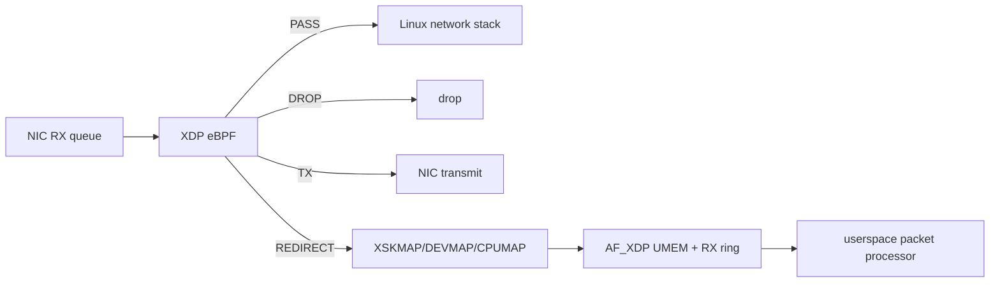
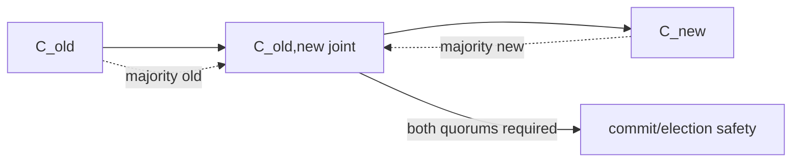

# 2026-09-22 14:00 — Interview Study Packages

README ve yakın `daily/2026-09-22/13-00.md` kontrol edildi. Transparency logs/Merkle proofs ve SLSA/in-toto provenance tekrar edilmiyor. Repo-wide aramada XDP/eBPF packet processing ve Raft joint-consensus membership change için doğrudan canonical eşleşme bulunmadı.

## Paket 1 — Junior → Principal Networking/Cloud: XDP, eBPF Packet Processing & AF_XDP
**Süre:** 20–30 dk

### Konu anlatımı
XDP (eXpress Data Path), Linux receive path'inin çok erken noktasında eBPF programı çalıştırarak paketi klasik network stack maliyetlerinin önemli kısmına girmeden PASS, DROP, TX veya REDIRECT gibi kararlara yönlendirebilir. eBPF kernel içinde privileged context'te çalıştığı için program load aşamasında verifier tarafından güvenlik koşullarına karşı kontrol edilir.

XDP ile AF_XDP'yi ayırmak önemlidir: XDP kernel içindeki packet hook/programming modelidir; AF_XDP ise XDP_REDIRECT ile frame'leri UMEM ve RX/TX ring'leri üzerinden userspace packet processor'a taşıyabilen yüksek performanslı socket ailesidir. Driver-native XDP ile generic/SKB mode arasında performans ve uyumluluk trade-off'u vardır; AF_XDP'de zero-copy desteklenmiyorsa copy path'e düşülebilir.

### Mental model

### İçeride ne oluyor?
1. Program uygun XDP attach point'e yüklenir; verifier kabul etmeden çalışamaz.
2. Packet data/data_end sınırları kontrol edilerek header parsing yapılır.
3. BPF maps policy/state/telemetry için kernel-userspace paylaşım alanı sağlar.
4. REDIRECT kararı XSKMAP/DEVMAP gibi map'lerle başka consumer'a yönlenebilir.
5. AF_XDP UMEM sabit frame'lere bölünür; RX/TX ile fill/completion ring'leri ownership aktarımını yönetir.
6. Driver desteği varsa native/zero-copy yollar daha düşük copy/stack maliyeti sağlayabilir; destek yoksa fallback davranışı ölçülmelidir.

### Yüksek getirili mülakat soruları
1. XDP neden iptables veya normal userspace socket'ten daha erken packet decision verebilir?
2. eBPF verifier hangi risk sınıfını azaltmaya çalışır?
3. XDP_PASS, DROP, TX ve REDIRECT arasındaki fark nedir?
4. BPF map neden normal process memory değildir?
5. AF_XDP'de UMEM ve ring'lerin rolü nedir?
6. Senior: zero-copy neden her sistemde otomatik kazanım değildir?
7. Staff/Principal: XDP tabanlı DDoS/filtering rollout'unda correctness, observability ve rollback'i nasıl tasarlarsın?

### Beklenen cevap derinliği
- **Junior:** XDP'nin erken ingress hook olduğunu ve PASS/DROP kararlarını açıklar.
- **Mid:** verifier, maps, redirect ve AF_XDP ring/UMEM modelini ayırır.
- **Senior:** driver/native vs generic, copy vs zero-copy, queue affinity ve backpressure tartışır.
- **Staff/Principal:** safe rollout, map lifecycle, fleet/kernel compatibility, telemetry ve blast radius'u yönetir.

### Kısa alıştırma
Bir UDP packet filter için Ethernet + IPv4 + UDP header parsing adımlarını çiz. Her header erişiminden önce `data_end` kontrolünün nerede gerektiğini işaretle; ardından DROP/PASS counters için per-CPU map tasarla.

### Proje fikri
`xdp-rate-lab`: test namespace/veth üzerinde basit XDP UDP allow/drop programı kur; map üzerinden policy güncelle ve `BPF_PROG_RUN` ile unit test ekle. İkinci aşamada desteklenen ortamda AF_XDP redirect path'i ölç.

### Failure modes / trade-off / production
Yanlış parser packet drop storm yaratabilir. Map key/value ABI değişimi userspace-agent uyumsuzluğu doğurabilir. Generic fallback performans beklentisini bozabilir. AF_XDP ring/UMEM starvation drop yaratır. Production'da attach/load failure, verifier errors, XDP action counters, per-queue drops, redirect failures, ring occupancy, copy/zero-copy mode ve CPU/pps birlikte izlenmelidir.

### Kaynaklar
- Linux kernel — eBPF Userspace API: https://docs.kernel.org/userspace-api/ebpf/index.html
- Linux kernel — AF_XDP: https://docs.kernel.org/networking/af_xdp.html
- Linux kernel — BPF maps: https://docs.kernel.org/bpf/maps.html
- Linux kernel — BPF_PROG_RUN: https://docs.kernel.org/bpf/bpf_prog_run.html

---

## Paket 2 — Mid → Principal Distributed Systems/System Design: Raft Membership Changes & Joint Consensus
**Süre:** 20–30 dk

### Konu anlatımı
Consensus cluster'ında node eklemek veya çıkarmak yalnız config dosyasını değiştirmek değildir: quorum tanımı değişir. Eski configuration `C_old` ile yeni configuration `C_new` arasında doğrudan atlama, farklı majorities'in aynı anda karar verebilmesine yol açabilecek güvenlik boşluğu yaratabilir. Raft'ın klasik joint-consensus yaklaşımı geçişte `C_old,new` ara configuration'ını kullanır; seçim ve commitment için hem eski hem yeni configuration majorities'i gerekir. Joint configuration commit edildikten sonra final `C_new` log entry'si replike edilir.

Membership change normal replicated log üzerinden ilerlediği için configuration da state-machine history'nin parçasıdır. Buradaki ana mental model: quorum matematiği yalnız node sayısı değil, ardışık configuration'ların majority intersection özelliğidir.

### Mental model

### İçeride ne oluyor?
1. Leader membership-change entry'sini log'a ekler ve replicate eder.
2. Joint configuration aktifken quorum hesapları hem old hem new majority ister.
3. Böylece transition sırasında tek taraflı disjoint majority'nin güvenli karar vermesi engellenir.
4. Joint entry committed olduğunda leader final new-configuration entry'sini üretir.
5. Removed server final configuration sonrası quorum hesabından çıkar; operational shutdown ayrı lifecycle problemidir.
6. Reconfiguration sırasında leader failure/retry olduğunda configuration log state'inden yeniden türetilmelidir; side-channel mutable config güvenli değildir.

### Yüksek getirili mülakat soruları
1. 3 node'dan 5 node'a geçerken config'i tek adım değiştirmek neden risklidir?
2. Joint consensus hangi iki majority'yi ister?
3. Membership neden replicated log'un parçası olmalıdır?
4. Leader transition ortasında ölürse yeni leader hangi configuration'ı kullanır?
5. Node remove ile process'i kapatmak neden aynı işlem değildir?
6. Senior: lagging yeni node'u voting member yapmak hangi availability riskini doğurur?
7. Staff/Principal: autoscaling ile consensus membership'i neden doğrudan bağlamak istemezsin?

### Beklenen cevap derinliği
- **Mid:** quorum/majority ve membership'in safety etkisini açıklar.
- **Senior:** joint configuration, log ordering, leader failure ve catch-up riskini tartışır.
- **Staff:** reconfiguration API, sequencing, observability ve operator guardrail tasarlar.
- **Principal:** failure domains, quorum placement, automation rate limits ve regional migration stratejisini bağlar.

### Kısa alıştırma
`C_old={A,B,C}`, `C_new={B,C,D,E,F}` için old ve new majority boyutlarını hesapla. Joint phase'te yalnız `B,C,D` ACK verirse entry'nin neden/niçin commit edilemeyeceğini iki quorum açısından göster.

### Proje fikri
`raft-membership-sim`: yalnız quorum mantığını simule eden küçük state machine yaz. old → joint → new geçişini, leader crash'i, lagging node ve concurrent reconfiguration rejection senaryolarını property tests ile doğrula.

### Failure modes / trade-off / production
Aynı anda birden çok membership değişimi state-space'i büyütür; implementation genellikle serialized change ister. Yeni voter catch-up olmadan eklenirse quorum availability düşebilir. Removed node'un eski config ile çalışmaya devam etmesi operational split-brain belirtileri yaratabilir. Production'da active config/version, voter health, replication lag, joint-state duration, rejected config changes, leader changes ve quorum margin izlenmelidir.

### Kaynaklar
- Raft ana yayınlar sayfası ve extended paper: https://raft.github.io/
- Ongaro & Ousterhout, In Search of an Understandable Consensus Algorithm: https://raft.github.io/raft.pdf
- Ongaro dissertation (membership change ayrıntıları): https://web.stanford.edu/~ouster/cgi-bin/papers/OngaroPhD.pdf
