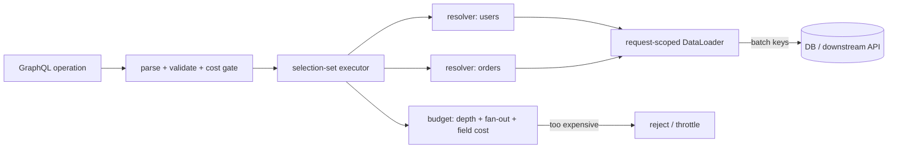
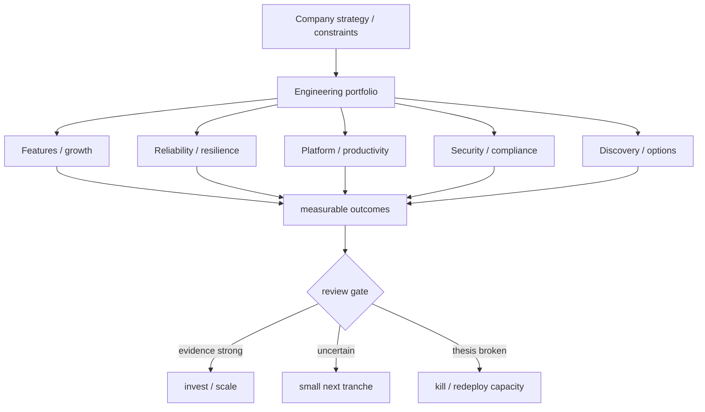

# 2026-09-22 15:00 — Interview Study Packages

README ve yakın `daily/2026-09-22/14-00.md` kontrol edildi. XDP/AF_XDP ve Raft membership/joint-consensus tekrar edilmiyor. Repo-wide aramada Kafka consumer rebalance, OpenTelemetry tail sampling, LSM compaction, OAuth/PKCE ve CRDT gibi adayların zaten canonical olduğu görüldü. Bu tur doğrudan canonical eşleşme bulunmayan GraphQL execution-cost/N+1 ve engineering investment/portfolio-allocation boşluklarına dönüyor.

## Paket 1 — Junior → Principal Backend/System Design: GraphQL Execution Cost, N+1, DataLoader & Query Budgets
**Süre:** 20–30 dk

### Konu anlatımı
GraphQL istemcinin response shape'ini selection set ile belirlemesine izin verir. Bu esneklik backend maliyetini otomatik olarak sınırlamaz: küçük görünen tek HTTP isteği, nested resolver zinciri nedeniyle çok sayıda database/RPC çağrısına dönüşebilir. Klasik örnek N+1 problemidir: bir parent listesi için 1 sorgu, sonra her parent'ın child alanı için N ayrı sorgu.

GraphQL September 2025 specification'a göre query selection set'leri normal execution'da paralelleştirilebilir; top-level mutation fields ise side-effect sırasını korumak için serial yürütülür. Executor'ın resolver graph'ı ile storage access pattern'i aynı şey değildir. Bu nedenle production tasarımında üç katmanı ayrı düşün: **schema/execution graph → data-fetch graph → resource budget**.

DataLoader benzeri request-scoped loader'lar aynı execution frame'indeki key lookup'larını batch edip duplicate key'leri memoize ederek N+1 round-trip'lerini azaltabilir. Fakat batching authorization'ı ortadan kaldırmaz ve request'ler arasında yanlış cache paylaşımı veri sızıntısına yol açabilir. Ayrıca yalnız depth limiti yeterli değildir: shallow ama büyük fan-out/list query çok pahalı olabilir. Depth, list cardinality ve field-specific cost birlikte bütçelenmelidir.

### Mental model

### İçeride ne oluyor?
1. Operation parse edilir, schema'ya karşı validate edilir ve fragments/directives dahil effective selection graph çıkarılır.
2. Query root/subfields dependency izin verdiği ölçüde parallel resolve edilebilir; mutation root fields serial semantics taşır.
3. Naive resolver `users -> each user's orders` yolunda 1 + N backend call üretebilir.
4. Request-scoped loader `load(userId)` çağrılarını key listesine coalesce eder; batch function sonuçları input key sırasına tekrar map etmelidir.
5. Loader memoization aynı request içinde duplicate fetch'i azaltır; shared cross-user cache olarak tasarlanmamalıdır.
6. Cost gate yalnız AST depth değil list multiplier, pagination bound, expensive field weight ve gerekirse authenticated-client budget'ını hesaba katar.
7. Runtime telemetry tahmini cost ile gerçek DB/RPC count, rows scanned, response bytes ve latency arasındaki sapmayı izlemelidir.

### Yüksek getirili mülakat soruları
1. GraphQL neden N+1 problemine yatkındır?
2. DataLoader batching ile caching arasındaki fark nedir?
3. Loader neden çoğunlukla request-scoped olmalıdır?
4. Batch function neden sonuçları input key sırasına hizalamalıdır?
5. Query depth limiti neden tek başına DoS/cost koruması değildir?
6. Senior: `users(first:100){orders(first:100){items(first:100)}}` için cost modelini nasıl kurarsın?
7. Staff: schema ergonomisini bozmadan field weights, pagination caps ve persisted/trusted operations'ı nasıl birleştirirsin?
8. Principal: multi-tenant GraphQL gateway'de fairness, budget versioning ve backward compatibility nasıl yönetilir?

### Beklenen cevap derinliği
- **Junior:** selection set, resolver ve N+1'i örnekler.
- **Mid:** request-scoped batching/memoization ve key-order contract'ını açıklar.
- **Senior:** depth/fan-out/list cardinality, authorization ve downstream saturation'ı tartışır.
- **Staff:** static cost estimation + runtime telemetry + per-client budgets tasarlar.
- **Principal:** organization-wide schema governance, tenant fairness, gateway policy ve migration stratejisini bağlar.

### Kısa alıştırma
`users(first:50) -> orders(first:20) -> items(first:10)` query'si için naive worst-case entity count ve olası resolver round-trip sayısını hesapla. Sonra DataLoader ile hangi çağrıların batch edilebileceğini işaretle. `users=1`, `orders=2`, `items=3` field weight ve list multiplier kullanan basit bir cost formülü öner.

### Proje fikri
`graphql-cost-lab`: küçük bir GraphQL API kur. Önce naive resolver'larla N+1 üret; DB-call counter ekle. Ardından request-scoped DataLoader ekleyip aynı query'de call sayısını karşılaştır. AST validation aşamasına depth + list multiplier + field weight budget'ı ekle; rejection reason ve estimated/actual cost metriği yayınla.

### Failure modes / trade-off / production
Global DataLoader cache tenant/user authorization boundary'sini bozabilir. Aşırı büyük batch SQL `IN` listesi veya downstream payload limitine çarpabilir. Yalnız depth limiti geniş listeleri kaçırır; yalnız static cost gerçek storage skew'ını kaçırabilir. Aggressive budget legitimate analytics/client query'lerini kırabilir. Production'da operation hash/name, estimated cost, actual resolver count, batch size, DB/RPC calls, rows scanned, response bytes, p95/p99 latency, rejected-cost count ve tenant bazlı consumption izlenmelidir.

### Kaynaklar
- GraphQL Specification — September 2025: https://spec.graphql.org/September2025/
- GraphQL Specification — current versions: https://spec.graphql.org/
- GraphQL DataLoader reference implementation: https://github.com/graphql/dataloader
- GraphQL Golden Path — Depth limits (WIP guidance): https://goldenpath.graphql.org/solutions/depth-limits/

---

## Paket 2 — Senior → CTO Leadership/Product/Business: Engineering Investment Portfolio, Options & Kill Criteria
**Süre:** 20–30 dk

### Konu anlatımı
Üst seviye engineering leadership'ta roadmap yalnız feature listesi değildir; sınırlı insan/sermaye kapasitesinin farklı getiri ve risk profillerine dağıtıldığı bir **yatırım portföyüdür**. Feature delivery revenue/adoption opsiyonu yaratabilir; reliability işi expected loss'u düşürebilir; platform işi future delivery lead time'ını azaltabilir; security/compliance işi tail-risk ve regulatory exposure'ı düşürebilir; discovery/spike ise belirsizliği satın alınabilir maliyetle azaltır.

En önemli ayrım `priority score` ile `decision system` arasındadır. Tek sayı (RICE, WSJF vb.) tartışmayı yapılandırabilir ama korelasyon, dependency, tail risk, option value ve capacity coupling'i gizleyebilir. CTO seviyesinde amaç 'en yüksek score'u seçmek' değil; şirket hedefleri, runway, reliability/security obligations ve reversible/irreversible bets altında dengeli bir portfolio kurmaktır.

Bir yatırımın başlangıç kriteri kadar **kill/continue/scale kriteri** de önceden tanımlanmalıdır. Sunk-cost etkisini azaltmak için her büyük bet'e measurable hypothesis, leading indicator, review date ve stop condition bağlanır. Reversible bet küçük tranche'larla fonlanabilir; irreversible migration/regulatory commitment daha güçlü evidence ve downside analysis ister.

### Mental model

### İçeride ne oluyor?
1. Strategy, non-negotiable constraints ve planning horizon açıklaştırılır: revenue, retention, reliability, compliance, runway.
2. Work items output değil outcome hypothesis olarak ifade edilir: 'platform kur' yerine 'service onboarding lead time 10 günden 2 güne insin'.
3. Her bet için expected upside, downside/tail risk, confidence, time-to-information, reversibility ve capacity/dependency kaydedilir.
4. Portfolio category guardrail'ları tek bir acil feature'ın reliability/security/platform kapasitesini sürekli yemesini engeller.
5. Büyük belirsiz işler tranche'lara bölünür; her tranche yeni bilgi üretmeli veya risk azaltmalıdır.
6. Review gate'te sunk cost değil forward-looking expected value değerlendirilir.
7. Capacity yeniden tahsis edilir; iptal edilen iş 'başarısızlık' değil, ucuz öğrenme sağladıysa option exercise sonucu olabilir.

### Yüksek getirili mülakat soruları
1. Engineering roadmap'i neden feature backlog'u gibi yönetmemeliyiz?
2. Reliability yatırımının ROI'sini revenue feature'ıyla nasıl karşılaştırırsın?
3. Reversible ve irreversible technical bet farkı nedir?
4. Platform investment için leading indicator nedir; vanity metric nedir?
5. Kill criteria neden işe başlamadan önce tanımlanmalıdır?
6. Staff/Principal: iki takımın platform migration'ı ile customer feature dependency'sini nasıl sequence edersin?
7. EM/Director: roadmap'e sürekli interrupt geliyorsa hangi capacity guardrail'ları kurarsın?
8. CTO: runway kısalırken security/reliability/platform yatırım oranını hangi sinyallerle değiştirirsin?

### Beklenen cevap derinliği
- **Senior:** outcome, dependency, opportunity cost ve reversible bet dilini kullanır.
- **Staff/Principal:** cross-team leverage, platform adoption ve technical-risk reduction'ı ölçer.
- **EM/Director:** capacity allocation, review cadence ve delivery predictability'yi yönetir.
- **CTO:** portfolio'yu company strategy, runway, gross margin, regulatory/tail risk ve organizational capability ile bağlar.

### Kısa alıştırma
100 engineer-week kapasiteyi dört aday arasında dağıt: checkout conversion feature, database failover reliability, internal developer platform ve compliance control automation. Her biri için expected outcome, confidence, downside, time-to-information ve kill criterion yaz. Sonra runway'in 18 aydan 8 aya düştüğü senaryoda allocation'ı yeniden yap ve nedenini açıkla.

### Proje fikri
`engineering-portfolio-review`: örnek 12 initiative için basit decision register oluştur. Her initiative'e hypothesis, category, capacity, confidence, reversibility, leading metric, review date ve kill/scale criterion ekle. Aylık review simülasyonunda yeni evidence geldikçe capacity'yi yeniden tahsis et ve karar değişikliklerini ADR benzeri log'la tut.

### Failure modes / trade-off / production
Tek score'a kör güvenmek false precision üretir. Platform ROI'sini yalnız adoption sayısıyla ölçmek gerçek lead-time/reliability etkisini kaçırır. Reliability/security işini sürekli 'sonra'ya atmak nonlinear tail risk biriktirir. Her şeyi strategic initiative yapmak WIP ve context switching'i artırır. Kill criterion olmadan prestige/sunk-cost yatırımı sürer. Production/işletme bağlantısında portfolio health için WIP, cycle time, incident/error-budget trendi, security exposure age, platform adoption + lead-time etkisi, initiative hypothesis hit-rate, capacity drift ve cost-to-serve birlikte izlenmelidir.

### Kaynaklar
- Google SRE Book — Embracing Risk: https://sre.google/sre-book/embracing-risk/
- Google SRE Workbook — Error Budget Policy: https://sre.google/workbook/error-budget-policy/
- AWS Well-Architected — Cost Optimization Pillar: https://docs.aws.amazon.com/wellarchitected/latest/cost-optimization-pillar/welcome.html
- FinOps Framework — Decision & accountability model: https://www.finops.org/framework/
