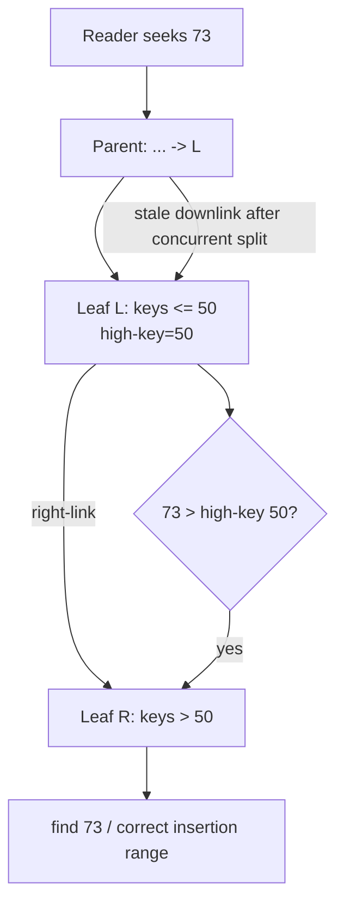

# 2026-09-22 16:00 — Interview Study Packages

README ve yakın `daily/2026-09-22/15-00.md` kontrol edildi. GraphQL execution-cost/N+1 ve engineering investment portfolio tekrar edilmiyor. Repo-wide aramada JIT deoptimization/OSR/safepoints, property-based testing/fuzzing, Linux CFS/EEVDF ve filesystem fsync/crash-consistency zaten canonical bulundu. Bu tur iki temel boşluğa dönüyor: **B+Tree concurrent page split / B-link invariants** ve **compiler→ABI→stack-frame/unwind zinciri**.

## Paket 1 — Mid → Principal Databases: Concurrent B+Tree Splits, High Keys, Right Links & Latch Ordering
**Süre:** 20–30 dk

### Konu anlatımı
Tek-thread B+Tree anlatımında insert sırasında dolu leaf ikiye bölünür, separator parent'a taşınır ve gerekirse split root'a kadar yayılır. Concurrency eklenince kritik problem şudur: bir reader parent'tan child'a inerken başka bir writer tam o child'ı split ederse reader eski child'a ulaşabilir. B-link yaklaşımı bu geçici yapısal tutarsızlığı **high key + right sibling link** ile güvenli hale getirir.

Her non-rightmost page kendi key-range üst sınırını taşıyan bir `high key` ve sağ kardeşe `right-link` tutar. Reader eski parent downlink'i ile sol page'e inse bile aradığı key `high key` sınırını aşıyorsa split olduğunu anlayıp sağa yürür. Böylece parent separator update'i ile child split'in tek dev atomik işlem olması gerekmez.

PostgreSQL `nbtree` implementation'ı Lehman–Yao high-concurrency B-tree algoritmasını temel alır. PostgreSQL shared buffer'ları nedeniyle page incelenirken page-level read locking uygular; buna rağmen high-key/right-link invariant'ı concurrent split recovery'nin merkezindedir. Lock/latch ordering de deadlock açısından kritiktir: özellikle farklı yönlerde page lock coupling rastgele yapılamaz.

### Mental model


**Invariant sezgisi:** parent kısa süre stale olabilir; leaf-level sibling chain reader'a doğru key-range'e yeniden yön buldurur.

### İçeride ne oluyor?
1. Search root'tan leaf'e downlink'leri izler.
2. Writer dolu page'i split eder; sağ sibling yaratılır ve key-range iki page'e ayrılır.
3. Sol page'in high key'i yeni sınırı gösterir, right-link yeni sibling'i gösterir.
4. Parent'a yeni pivot/downlink eklenmesi split'in başka bir aşamasıdır; reader arada stale parent görebilir.
5. Reader child'a geldikten sonra search key high key'i aşıyorsa right-link'i takip eder; birden fazla concurrent split varsa bu adım tekrarlanabilir.
6. Writer parent'a separator eklerken parent da dolarsa structural modification yukarı yayılır; root split yeni root gerektirebilir.
7. Page latch sırası deadlock yaratmayacak şekilde tasarlanmalıdır. PostgreSQL bazı geçişlerde current page'i bırakmadan next page'i kilitlemenin güvenli, bazı yönlerde ise tehlikeli olduğunu açıkça ayırır.
8. Transaction lock ile page latch aynı kavram değildir: transaction lock logical isolation sağlar; latch kısa ömürlü in-memory/index-structure correctness primitive'idir.

### Yüksek getirili mülakat soruları
1. Concurrent B+Tree split sırasında stale parent pointer neden correctness bug olmak zorunda değildir?
2. `high key` ve `right-link` birlikte hangi problemi çözer?
3. Transaction lock ile page latch arasındaki fark nedir?
4. Reader neden split sonrası birden fazla kez sağa yürümek zorunda kalabilir?
5. Root split neden özel bir concurrency problemi yaratır?
6. Senior: latch coupling'i agresif azaltmanın throughput ve correctness trade-off'u nedir?
7. Staff: hot ascending-key workload'da rightmost leaf contention'ını nasıl gözlemler ve azaltırsın?
8. Principal: optimistic/latch-free-ish read path ile recovery/reclamation karmaşıklığını nasıl değerlendirirsin?

### Beklenen cevap derinliği
- **Mid:** page split, parent separator, sibling link ve latch kavramlarını ayırır.
- **Senior:** stale parent + high-key/right-link recovery invariant'ını adım adım açıklar; deadlock ordering'i tartışır.
- **Staff:** contention, hot pages, buffer manager, WAL/crash recovery ve structural modification interactions'ını bağlar.
- **Principal:** concurrency protocol'ünü correctness proof obligation, observability ve alternative index structures ile kıyaslar.

### Kısa alıştırma
Leaf `L=[10,20,30,40,50]` doluyken 60 insert'i split başlatsın. Aynı anda reader 55 arasın ve parent henüz yeni right sibling downlink'ini görmesin. Split sonrası high key/right-link değerlerini çiz ve reader'ın hangi adımlarla doğru page'e ulaştığını yaz. Sonra iki ardışık split olmuş senaryoyu ekle.

### Proje fikri
`blink-tree-lab`: fixed-size in-memory page'lerle küçük B+Tree/B-link simulator yaz. Reader/writer thread'lerine deterministic scheduler hook'ları koy; split'in `new sibling -> high-key/right-link -> parent pivot` aşamalarında thread'leri durdurup stale-parent interleaving'lerini test et. Invariant checker ekle: sorted keys, range coverage, sibling reachability, parent/downlink eventual consistency.

### Failure modes / trade-off / production
Yanlış high key lost lookup üretebilir; sibling link'i publish etmeden key'leri taşımak reader'ı boşluğa düşürebilir; inconsistent latch order deadlock yaratabilir. Çok kaba root-to-leaf locking correctness'i kolaylaştırır ama multicore throughput'u boğar. Çok optimistic protokol ise restart/revalidation ve memory reclamation maliyetini büyütür. Production'da index page split rate, tree height, page fill, rightmost-page contention, latch wait, buffer hit ratio, WAL volume ve p95/p99 insert latency birlikte izlenmelidir.

### Kaynaklar
- PostgreSQL source — `src/backend/access/nbtree/README`: https://github.com/postgres/postgres/blob/master/src/backend/access/nbtree/README
- PostgreSQL source — `nbtree.h` high-key invariant: https://github.com/postgres/postgres/blob/master/src/include/access/nbtree.h
- Lehman & Yao, *Efficient Locking for Concurrent Operations on B-Trees* (1981): https://doi.org/10.1145/319628.319663

---

## Paket 2 — Junior → Staff Foundations/Compiler: Calling Conventions, Stack Frames, Prologue/Epilogue & Unwind Metadata
**Süre:** 20–30 dk

### Konu anlatımı
Compiler zinciri source→IR→machine code'da bitmez. Ayrı derlenmiş fonksiyonların birbirini çağırabilmesi için **ABI (Application Binary Interface)** üzerinde anlaşması gerekir: argümanların hangi register/stack konumlarından geçtiği, return value'nun nerede olduğu, hangi register'ı caller'ın hangisini callee'nin koruduğu, stack alignment ve unwind bilgisinin nasıl temsil edildiği gibi kurallar.

Calling convention bu sözleşmenin çağrı kısmıdır. Compiler call site'ta argument lowering yapar; callee girişinde gerekiyorsa **prologue** ile stack frame ayırır ve callee-saved register'ları saklar. Çıkışta **epilogue** bunları geri yükler. Optimized code frame pointer'ı atlayabilir; debugger, profiler ve exception runtime yine de stack'i yürüyebilmek için DWARF CFI / platform-specific unwind metadata gibi bilgiye ihtiyaç duyabilir.

Önemli mental ayrım: **ISA** CPU'nun instruction/register dünyasıdır; **ABI** ayrı binary parçalarının birlikte çalışma sözleşmesidir; **compiler backend** IR'yi bu ISA+ABI kısıtları altında gerçek machine code'a indirger.

### Mental model
```mermaid
flowchart LR
  S[Source call f(a,b)] --> IR[IR call]
  IR --> CL[Call lowering / ABI]
  CL --> A[args -> registers/stack]
  A --> C[CALL instruction]
  C --> P[callee prologue]
  P --> B[function body]
  B --> E[epilogue]
  E --> R[RET]
  P -.described by.-> U[unwind/CFI metadata]
  E -.described by.-> U
  U --> X[exception runtime / debugger / profiler]
```

### İçeride ne oluyor?
1. Frontend function signature'ı IR type/call'a dönüştürür.
2. Backend target calling convention'a göre arguments/return values için physical locations seçer.
3. Register allocation sonrası live values ve callee-saved kullanımına göre frame layout netleşir.
4. Prologue stack pointer'ı ayarlayabilir, alignment sağlayabilir, callee-saved register'ları spill edebilir; leaf function bunların çoğunu gerektirmeyebilir.
5. Caller-saved register'da call sonrasında gereken live value varsa caller onu call öncesi korumalıdır; callee-saved register'ı kullanan callee eski değeri restore etmelidir.
6. Epilogue frame'i çözer, preserved state'i geri yükler ve return eder.
7. Unwind metadata, runtime'ın her function body/prologue/epilogue noktasından caller state'ini yeniden kurmasına yardım eder. Bu yalnız exceptions için değil stack traces/profiling/debugging için de önemlidir.
8. LLVM IR'de caller ve callee calling convention eşleşmelidir; LLVM codegen'in frame-lowering katmanı prologue/epilogue ve callee-save işlerini target'a göre üretir.

### Yüksek getirili mülakat soruları
1. ABI ile ISA arasındaki fark nedir?
2. Caller-saved ve callee-saved register neden iki sınıfa ayrılır?
3. Stack frame her function için zorunlu mudur?
4. Frame pointer omission ne kazandırır, debugging/unwinding'i nasıl etkiler?
5. Stack alignment neden ABI'nin parçasıdır?
6. Senior: tail call optimization stack-frame ve calling-convention açısından hangi şartları ister?
7. Senior: exception stack unwinding, normal `return` zincirinden nasıl farklıdır?
8. Staff: JIT/native FFI boundary'sinde calling-convention mismatch nasıl production crash/corruption üretir?

### Beklenen cevap derinliği
- **Junior:** stack, return address, argument passing ve prologue/epilogue sezgisini anlatır.
- **Mid:** caller/callee-saved, alignment, leaf function ve frame pointer trade-off'unu açıklar.
- **Senior:** register allocation→frame lowering→unwind metadata zincirini ve tail-call/exception etkilerini bağlar.
- **Staff:** FFI/JIT, profiler/debugger, async stack walking, platform ABI compatibility ve rollout risklerini tartışır.

### Kısa alıştırma
Küçük bir C/C++ fonksiyonu yaz: altı integer argüman alsın, başka bir fonksiyon çağırsın ve local array kullansın. `clang -O0 -S` ve `clang -O2 -S` çıktısını karşılaştır: stack adjustment, saved registers, frame pointer ve call site farklarını işaretle. Ardından `readelf --debug-dump=frames` veya eşdeğer araçla unwind bilgisini incele.

### Proje fikri
`abi-frame-lab`: aynı C API'yi C, Rust veya küçük JIT stub'ından çağır. Generated assembly ve unwind sections için rapor üret; intentionally yanlış calling-convention/stack-alignment örneğini yalnız izole test binary'sinde göster ve sanitizer/debugger ile failure'ı teşhis et.

### Failure modes / trade-off / production
ABI mismatch silent register corruption veya crash üretebilir. Stack alignment ihlali bazı vector instructions/callees'de patlayabilir. Eksik/yanlış unwind metadata exception handling'i, profiler stack'lerini veya crash symbolication'ı bozabilir. Frame pointer tutmak observability'yi kolaylaştırabilir fakat register pressure/cost yaratabilir; modern unwind metadata bazı ortamlarda bu ihtiyacı azaltır ama async-profiler/tooling desteği ayrıca doğrulanmalıdır. Production native/JIT sistemlerinde ABI versioning, symbol visibility, FFI boundary tests, crash unwinding ve profiler doğruluğu release kriteri olmalıdır.

### Kaynaklar
- LLVM Language Reference — Calling Conventions: https://llvm.org/docs/LangRef.html#calling-conventions
- LLVM Target-Independent Code Generator: https://llvm.org/docs/CodeGenerator.html
- LLVM AArch64 prologue/epilogue implementation docs: https://llvm.org/docs/doxygen/AArch64PrologueEpilogue_8h_source.html
- System V AMD64 ABI project: https://gitlab.com/x86-psABIs/x86-64-ABI
