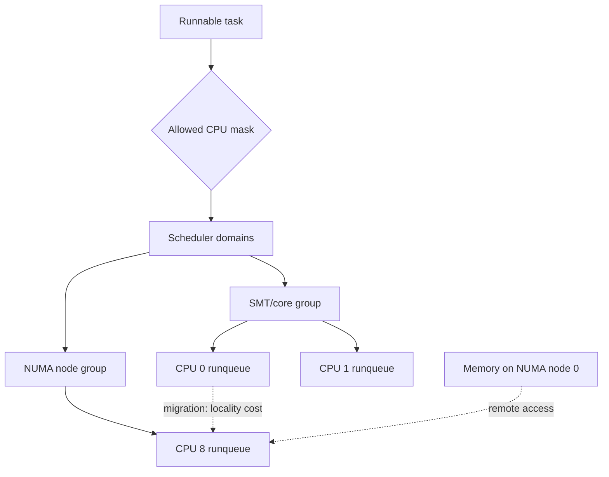
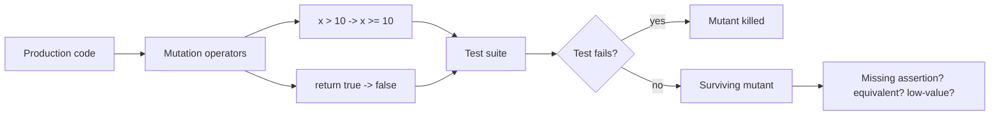

# 2026-09-22 17:00 — Interview Study Packages

README ve yakın `daily/2026-09-22/16-00.md` kontrol edildi. Concurrent B+Tree/B-link ve ABI/stack-frame tekrar edilmiyor. Ek repo-wide kontrol, ilk aday WASI 0.3'ün zaten birden fazla canonical/daily içerikte bulunduğunu gösterdi; bu tekrar elendi. ELF/linker, filesystem page-cache/crash-consistency ve CFS/EEVDF de mevcut. Bu tur iki tamamlayıcı boşluğa odaklanıyor: **Linux scheduler topology/load balancing/CPU affinity/NUMA locality** ve **mutation testing/test-suite sensitivity**.

## Paket 1 — Mid → Principal Foundations/SRE: Linux Scheduler Domains, Load Balancing, CPU Affinity & NUMA Locality
**Süre:** 20–30 dk

### Konu anlatımı
Tek CPU'da scheduler sorusu çoğunlukla “hangi runnable task sırada?”dır. Çok çekirdekte ikinci problem vardır: **task hangi CPU'da çalışmalı?** Linux hardware topology'yi temsil eden scheduler domain/group hiyerarşisi üzerinden load balancing yapar. SMT sibling, core/package ve NUMA node gibi seviyeler migration maliyetini değiştirir.

Load balancing boş CPU'yu doldurup throughput'u artırabilir; fakat migration cache/TLB locality kaybı ve NUMA remote-memory erişimi yaratabilir. CPU affinity (`sched_setaffinity`, `taskset`) placement alanını daraltır. cpuset/cgroup politikaları workload isolation sağlar. “Pinning her zaman hızlıdır” yanlıştır: locality kazanırken imbalance ve stranded capacity üretebilirsin.

### Mental model

**Mental model:** scheduler iki bütçeyi dengeler: **compute imbalance** ve **movement/locality cost**.

### İçeride ne oluyor?
1. Her CPU'nun runnable work'ünü temsil eden runqueue state'i vardır.
2. `sched_domain` hierarchy hangi CPU grupları arasında balancing yapılacağını topology-aware biçimde tanımlar.
3. Periodic/newly-idle/wakeup yolları uygun koşullarda placement veya migration tetikleyebilir.
4. Affinity mask task'ın çalışabileceği CPU kümesini sınırlar; scheduler bu sınırı aşamaz.
5. NUMA'da CPU migration execution locality yanında memory locality sorununa dönüşebilir; remote memory daha pahalı olabilir.
6. cpuset/cgroup ile CPU ve memory placement policy birlikte sınırlandırılabilir.
7. CPU isolation scheduler balancing/noise'u azaltabilir fakat kapasite paylaşımını kötüleştirebilir.
8. Tuning önce ölçüm ister: runqueue pressure, migrations, context switches, utilization, NUMA locality ve tail latency birlikte değerlendirilmelidir.

### Yüksek getirili mülakat soruları
1. Per-CPU runqueue varken neden load balancing gerekir?
2. Scheduler domain neyi temsil eder?
3. CPU affinity latency'yi ne zaman iyileştirir, ne zaman kötüleştirir?
4. Task migration neden “boş CPU bulduk, taşı” kadar basit değildir?
5. NUMA locality ile scheduler placement ilişkisi nedir?
6. Senior: cache-hot task'ı başka socket'a taşımak hangi maliyetleri yaratır?
7. Staff: latency-sensitive servis için pinning/cpuset/isolation kararını hangi metriklerle verirsin?
8. Principal: throughput, fairness, locality ve tenant isolation arasında policy'yi nasıl değerlendirirsin?

### Beklenen cevap derinliği
- **Mid:** runqueue, migration, affinity ve NUMA'yı ayırır.
- **Senior:** scheduler-domain topology, cache locality ve imbalance trade-off'unu açıklar.
- **Staff:** cgroup/cpuset, IRQ/workqueue noise, observability ve tail latency'yi bağlar.
- **Principal:** NUMA topology, isolation ve fleet-level utilization ekonomisini birlikte tartışır.

### Kısa alıştırma
2 NUMA node × 8 CPU'lu makine düşün. Service A 6 CPU-bound worker ve node-0'da 20 GiB hot memory kullanıyor; Service B bursty 4 worker. A'yı `0-5` CPU'larına pinleme, serbest bırakma ve node-local cpuset seçeneklerini p50/p99, cache locality ve stranded capacity açısından karşılaştır. `taskset`, `numactl --hardware`, `/proc/schedstat` ve `perf stat` ile hangi gözlemleri toplayacağını yaz.

### Proje fikri
`sched-locality-lab`: CPU-bound + memory-bound iki workload üret; unpinned, CPU-affined ve cpuset-isolated modları benchmark et. CPU migration, context switch, LLC miss, NUMA remote access ve p99 latency'yi raporla; topology'yi `lscpu -e` ile kaydet.

### Failure modes / trade-off / production
Aşırı pinning idle CPU varken kuyruk yaratabilir. Cross-NUMA migration remote-memory penalty doğurabilir. Isolation kernel housekeeping/IRQ yerleşimi düşünülmeden yapılırsa beklenen determinism oluşmaz. Container CPU quota ile cpuset aynı şey değildir. Production tuning host topology, workload shape ve gerçek tail-latency ölçümü olmadan kopyalanmamalıdır.

### Kaynaklar
- Linux Kernel — Scheduler Domains: https://docs.kernel.org/scheduler/sched-domains.html
- Linux Kernel — NUMA: https://docs.kernel.org/mm/numa.html
- Linux Kernel — CPU Isolation: https://docs.kernel.org/admin-guide/cpu-isolation.html
- Linux Kernel — CPUSETS: https://docs.kernel.org/admin-guide/cgroup-v1/cpusets.html
- Linux Kernel — Scheduler Statistics: https://docs.kernel.org/scheduler/sched-stats.html

---

## Paket 2 — Junior → Staff Testing Engineering: Mutation Testing, Test Sensitivity & Surviving Mutants
**Süre:** 20–30 dk

### Konu anlatımı
Code coverage “bu satır test sırasında çalıştı mı?” sorusunu cevaplar; **testin yanlış davranışı gerçekten yakalayıp yakalamadığını** tek başına söylemez. Mutation testing programda kontrollü küçük değişiklikler üretir: `>` → `>=`, `true` → `false`, arithmetic operator veya return value değişimi gibi. Test suite mutantı öldürürse davranış farkını yakalamıştır; mutant yaşarsa assertion/oracle zayıf olabilir, path etkisiz olabilir veya mutant semantik olarak eşdeğer olabilir.

Mutation score kabaca `killed / relevant mutants` sinyalidir; hedef körlemesine %100 değildir. Mutation testing coverage'ın alternatifi değil, coverage sonrası **oracle kalitesini ve test sensitivity'yi** sorgulayan ikinci katmandır.

### Mental model

### İçeride ne oluyor?
1. Mutation engine candidate code locations belirler.
2. Bir operator küçük syntactic/semantic değişiklik uygular.
3. İlgili testler mutant üzerinde çalıştırılır.
4. Test failure mutantı `killed`; tüm ilgili testlerin geçmesi `survived` yapar.
5. Coverage/test-impact bilgisi hangi testlerin koşturulacağını daraltıp maliyeti azaltabilir.
6. Equivalent mutant observable behavior'ı değiştirmediği için öldürülemez; score yorumunda gürültüdür.
7. Timeout/hang üreten mutantlar ayrıca ele alınmalıdır.
8. CI'da tüm repo yerine kritik modül, diff veya periyodik job daha ekonomik olabilir.

### Yüksek getirili mülakat soruları
1. %100 line coverage neden güçlü test suite garantisi değildir?
2. Mutation testing hangi problemi ölçmeye çalışır?
3. Surviving mutant her zaman eksik test midir?
4. Equivalent mutant nedir?
5. Mutation score'u KPI yapmanın riski nedir?
6. Senior: mutation testing'in CPU maliyetini nasıl azaltırsın?
7. Staff: payment/risk engine için mutation policy'yi nasıl tasarlarsın?
8. Staff: flaky testler mutation sonuçlarını nasıl kirletir?

### Beklenen cevap derinliği
- **Junior:** coverage ile assertion strength farkını anlatır.
- **Mid:** killed/survived/equivalent mutant ve boundary-test ilişkisini açıklar.
- **Senior:** operator seçimi, test-impact analysis, timeout ve CI maliyetini tartışır.
- **Staff:** risk-based scope, governance, flaky-test hygiene ve business-critical invariants ile bağ kurar.

### Kısa alıştırma
`isEligible(age) = age >= 18` için yalnız `age=20` testi olduğunu düşün. `>=` → `>` mutantının neden yaşayabileceğini göster; 17/18/19 boundary testleri ekle. Sonra `price * 0.9` → `price * 1.0` mutantını öldürecek assertion tasarla.

### Proje fikri
`mutation-gate-lab`: pricing, permissions veya rate-limit policy içeren küçük domain library kur. Normal coverage ve mutation score'u yan yana raporla. Surviving mutantları `missing-test`, `equivalent`, `low-value` diye triage et; yalnız kritik package için CI threshold uygula.

### Failure modes / trade-off / production
Mutation suite pahalı olabilir; kötü operator seçimi gürültü üretir. Score'u hedefe dönüştürmek anlamsız assertion'ları teşvik edebilir. Flaky testler sinyali güvenilmez yapar. Buna karşılık money movement, authorization, parser/compiler, validation ve safety-critical decision logic gibi küçük kritik çekirdeklerde mutation testing yüksek getiri sağlayabilir.

### Kaynaklar
- PIT Mutation Testing: https://pitest.org/
- PIT — Mutation operators: https://pitest.org/quickstart/mutators/
- Google Testing Blog — Code Coverage Best Practices: https://testing.googleblog.com/2020/08/code-coverage-best-practices.html
