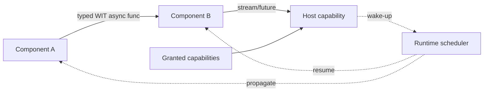
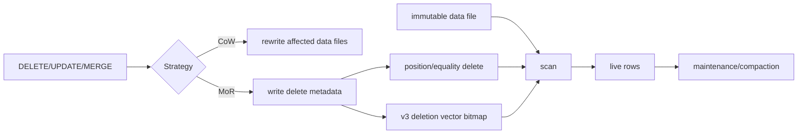

# 2026-09-22 17:00 — Interview Study Packages

README ve yakın `daily/2026-09-22/16-00.md` kontrol edildi. Concurrent B+Tree split/B-link ve ABI stack-frame/unwind tekrar edilmiyor. Repo-wide aramada WASI 0.3 native async/Component Model ile Iceberg v3 deletion vectors için doğrudan canonical eşleşme bulunmadı.

## Paket 1 — Mid → Principal Backend/Cloud: WASI 0.3, Component Model & Native Async
**Süre:** 20–30 dk

### Konu anlatımı
WebAssembly core spec taşınabilir bytecode ve execution semantics verir; host filesystem, socket veya HTTP gibi yetenekleri kendiliğinden sağlamaz. WASI bu host interface katmanıdır. WASI 0.2 Component Model + WIT ile typed, composable component sınırları getirdi. **WASI 0.3 (11 Haziran 2026)** native async'i Component Model/Canonical ABI içine taşıdı: `async func`, `stream<T>` ve `future<T>` artık component sınırları boyunca scheduling/wakeup semantiğini runtime'a bırakır. 0.2'deki `wasi:io` pollable modeli component zincirlerinde wake-up forwarding problemi yaratabiliyordu; 0.3 bunu modelin içine alır.

WASI capability-oriented'dir: component ambient OS authority ile başlamaz; host hangi interface/resource'u verirse onu kullanabilir. Bu, plugin/extension platformlarında isolation sınırını daha açık hale getirir; yine de CPU/memory/time/resource quotas ayrıca tasarlanmalıdır.

### Mental model

### İçeride ne oluyor?
1. Interface contract WIT ile tanımlanır; component import/export'ları typed olur.
2. Canonical ABI language-specific values ile component representation arasında lowering/lifting yapar.
3. `async func` çağrısı caller thread'ini zorunlu bloklamadan suspend/resume edilebilir.
4. `stream<T>` çok-değerli async akışı, `future<T>` tek completion value'sunu taşır.
5. Runtime component zincirindeki wake-up/scheduling'i yönetir; 0.2'nin `pollable` relay sorununu azaltır.
6. Host yalnız açıkça granted filesystem/socket/HTTP vb. capability'leri expose eder.
7. Version/toolchain mismatch instantiation'da type/link errors üretebilir; runtime ve bindings target'ı pinlenmelidir.

### Yüksek getirili mülakat soruları
1. WebAssembly ile WASI arasındaki sınır nedir?
2. Module ile Component Model component'i arasındaki fark nedir?
3. WIT ve Canonical ABI hangi problemi çözer?
4. WASI 0.3 neden `async func`, `stream<T>`, `future<T>` ekledi?
5. Capability-based host access neden plugin güvenliğinde değerlidir?
6. Senior: 0.2→0.3 migration'da hangi compatibility risklerini test edersin?
7. Staff: HTTP microservice yerine in-process component composition ne kazandırır/ne kaybettirir?
8. Principal: multi-tenant plugin platformunda capability grant, quota, observability ve runtime upgrade politikasını nasıl kurarsın?

### Beklenen cevap derinliği
- **Mid:** Wasm/WASI, import/export, WIT ve capability ayrımını açıklar.
- **Senior:** Canonical ABI, async composition ve versioning/toolchain risklerini bağlar.
- **Staff:** language interoperability, host boundary, resource governance ve observability trade-off'larını tartışır.
- **Principal:** platform standardı, tenant isolation, rollout/compatibility matrix ve build-vs-HTTP economics'ini değerlendirir.

### Kısa alıştırma
`fetch -> transform -> store` üç-component zinciri çiz. 0.2 pollable yaklaşımında wake-up'ın B component'inde neden relay problemi yaratabileceğini; 0.3 stream/future ile runtime'ın hangi sorumluluğu aldığını anlat.

### Proje fikri
`wasi-async-plugin-lab`: WIT ile küçük transform interface'i tanımla; iki farklı dilde component üret; host yalnız gerekli capability'leri grant etsin. 0.2/0.3 target matrix'i, cold start, throughput, memory ve denied-capability testlerini raporla.

### Failure modes / trade-off / production
Version skew `wrong type`/instantiation failures üretebilir. Capability modeli CPU/memory DoS'u tek başına çözmez. Cross-language binding semantics ve cancellation/backpressure test edilmelidir. Production'da runtime/toolchain version, instantiation failure, trap, memory, CPU/fuel/epoch limits, async queue depth, latency ve denied capability olayları izlenmelidir.

### Kaynaklar
- WASI Releases: https://wasi.dev/releases
- WASI 0.3: https://wasi.dev/releases/wasi-p3
- WASI Languages/toolchain support: https://wasi.dev/languages
- WASI introduction/security model: https://wasi.dev/

---

## Paket 2 — Mid → Principal Data Engineering: Apache Iceberg Row Deletes, Deletion Vectors & Merge-on-Read
**Süre:** 20–30 dk

### Konu anlatımı
Immutable columnar data files üzerinde tek satır silmek pahalı olabilir: tüm Parquet dosyasını rewrite etmek **copy-on-write (CoW)** yaklaşımıdır. **Merge-on-read (MoR)** ise data file'ı hemen rewrite etmek yerine ayrı delete metadata yazar; reader scan sırasında data + delete bilgisini birleştirir. Iceberg v2 position/equality delete files kullanabilir. Iceberg v3 deletion vector (DV), belirli bir data file içindeki silinmiş row positions kümesini Puffin içindeki bitmap olarak temsil eder; spec v3'te position delete representation DV'ye taşınır.

Position delete fiziksel `(file, row-position)` kimliğine; equality delete logical key equality'ye dayanır. DV de position-temellidir ve `referenced_data_file` ile tek data file'a bağlanır. Böylece write amplification azalabilir fakat read path delete application maliyeti, metadata/maintenance ve compaction yükü artar.

### Mental model

### İçeride ne oluyor?
1. Planner identifies affected rows/files.
2. CoW rewrites affected data files and atomically commits new metadata.
3. MoR records logical/physical deletes without immediate full rewrite.
4. Equality delete uses equality field IDs; position delete identifies file + row position.
5. DV stores deleted positions as a bitmap and references one data file; Iceberg Puffin uses Roaring bitmap serialization.
6. Scan planning attaches applicable deletes using file path, partition and sequence-number rules.
7. Reader filters deleted rows while reading data.
8. Maintenance eventually rewrites data/delete state to control read amplification and small metadata artifacts.

### Yüksek getirili mülakat soruları
1. CoW ile MoR delete arasındaki temel trade-off nedir?
2. Equality delete ile position delete ne zaman tercih edilir?
3. Deletion vector neden bitmap için iyi bir adaydır?
4. Sequence number delete correctness'inde neden önemlidir?
5. DV write amplification'i azaltırken read amplification'i nasıl artırabilir?
6. Senior: compaction delete semantics'i nasıl korumalıdır?
7. Staff: high-update table için CoW/MoR policy'sini workload'a göre nasıl seçersin?
8. Principal: engine interoperability ve format-version upgrade'i nasıl rollout edersin?

### Beklenen cevap derinliği
- **Mid:** immutable files, snapshot, CoW/MoR ve delete-file farkını açıklar.
- **Senior:** position/equality/DV application, sequence numbers ve compaction correctness'i anlatır.
- **Staff:** write/read amplification, scan planning, maintenance cadence ve engine support matrix'ini bağlar.
- **Principal:** format upgrade, interoperability, rollback, cost/SLO ve governance kararlarını tartışır.

### Kısa alıştırma
1 GB Parquet dosyasında yalnız 100 satır siliniyor. CoW ve MoR/DV için yazılan byte, sonraki scan maliyeti ve maintenance debt'i nitel olarak karşılaştır. Ardından delete oranı %40 olduğunda kararının neden değişebileceğini açıkla.

### Proje fikri
`iceberg-delete-lab`: küçük bir Iceberg table kur; CoW ve MoR delete workload'larını çalıştır. Snapshot metadata, delete-file/DV sayısı, scan bytes, p50/p95 query latency ve compaction sonrası durumu karşılaştır; engine support matrix'i ekle.

### Failure modes / trade-off / production
Delete metadata uygulanmazsa deleted rows geri görünür; yanlış sequence/partition scope correctness bug'ıdır. Çok sayıda delete artifact scan planning ve read CPU'yu artırır. Compaction eşzamanlı mutation'larla doğru snapshot isolation altında koordine edilmelidir. Production'da delete-file/DV count, deleted-row cardinality, scan planning time, read amplification, file sizes, compaction backlog, snapshot age ve engine/version compatibility izlenmelidir.

### Kaynaklar
- Apache Iceberg Specification: https://iceberg.apache.org/spec/
- Puffin deletion-vector-v1: https://iceberg.apache.org/puffin-spec/
- Apache Iceberg implementation status: https://iceberg.apache.org/status/
- Iceberg Flink maintenance / equality-delete→DV conversion: https://iceberg.apache.org/docs/nightly/flink-maintenance/
