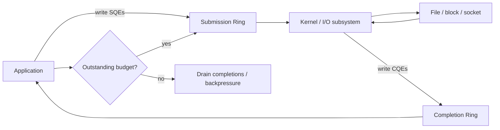
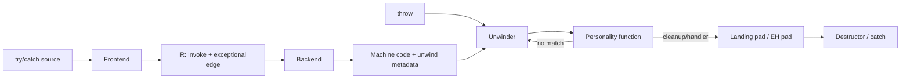

# 2026-09-22 18:00 — Interview Study Packages

README ve yakın `daily/2026-09-22/17-00.md` kontrol edildi. Scheduler-domain/NUMA ve mutation-testing tekrar edilmiyor. Repo-wide kontrolde generational GC/write barriers, LSM compaction ve Kafka idempotence/transactions'ın zaten işlendiği görüldü; bu nedenle tekrar eden Kafka adayı çıkarıldı. Bu tur iki temel boşluğu kapatıyor: **Linux io_uring async I/O modeli** ve **compiler/runtime exception handling + stack unwinding zinciri**.

## Paket 1 — Mid → Principal Foundations/Backend: Linux io_uring, Submission/Completion Rings & Backpressure
**Süre:** 20–30 dk

### Konu anlatımı
Klasik blocking I/O'da thread bir `read()` çağrısında uyuyabilir; readiness tabanlı `epoll` ise “şimdi I/O denemek mantıklı mı?” sinyali verir, I/O operasyonunun kendisini completion nesnesi olarak modellemez. `io_uring`, userspace ile kernel arasında paylaşılan ring buffer'lar üzerinden **submission** ve **completion** tabanlı bir model sunar.

Uygulama SQE (submission queue entry) hazırlar, kernel işi tüketir ve tamamlandığında CQE (completion queue entry) üretir. Kazanç yalnız “daha az syscall” değildir: batching, operation chaining, registered files/buffers ve multishot operasyonlar hot path'teki koordinasyon maliyetini azaltabilir. Fakat queue depth sınırsız throughput değildir; aşırı outstanding I/O memory pressure, device queueing ve p99 latency üretir.

### Mental model

**Mental model:** `io_uring` bir “syscall hilesi” değil, bounded **submit → execute → complete** pipeline'ıdır.

### İçeride ne oluyor?
1. `io_uring_setup` ring state oluşturur; userspace SQ/CQ alanlarını mmap eder.
2. Uygulama SQE'lere opcode, fd, buffer, offset ve `user_data` koyar.
3. Kernel submission'ları consume eder; operasyon destek durumuna göre ilgili async/subsystem yolunda ilerler.
4. Completion sonucu CQE'nin `res` alanına gelir; `user_data` request correlation sağlar.
5. Batch submission/completion syscall ve wakeup maliyetini amortize edebilir.
6. Registered files/buffers tekrar eden lookup/pinning maliyetlerini azaltabilir; lifecycle ve memory-accounting karmaşıklığı getirir.
7. Linked operations dependency zinciri kurabilir; cancellation/timeout yarışları dikkat ister.
8. Multishot operasyonlar tek submission'dan birden fazla completion üretebilir; CQ tüketimi ve buffer ownership doğru tasarlanmalıdır.
9. SQ/CQ kapasitesi ile application-level in-flight budget aynı şey değildir.

### Yüksek getirili mülakat soruları
1. `epoll` readiness ile `io_uring` completion modeli arasındaki temel fark nedir?
2. SQE ve CQE neyi temsil eder?
3. Batching neden throughput'u artırabilir ama tail latency'yi bozabilir?
4. Registered buffer hangi maliyeti azaltır, hangi riski ekler?
5. Queue depth'i neden mümkün olduğunca büyük seçmezsin?
6. Senior: timeout/cancel ile gerçek I/O completion yarışını nasıl düşünürsün?
7. Staff: io_uring kullanan storage proxy'de backpressure'ı nerelerde uygularsın?
8. Principal: thread-per-request, epoll ve io_uring arasında seçim için hangi workload ölçülerini istersin?

### Beklenen cevap derinliği
- **Mid:** submission/completion, SQE/CQE ve bounded queue kavramlarını doğru açıklar.
- **Senior:** batching, registered resources, cancellation ve tail-latency trade-off'unu bağlar.
- **Staff:** queue-depth budget, buffer ownership, overload control ve observability tasarlar.
- **Principal:** kernel/device queue'ları ile application concurrency budget'ını birlikte optimize eder; benchmark sonucunu workload ve kernel sürümüne bağlar.

### Kısa alıştırma
Bir file server aynı anda 10.000 adet 16 KiB read alıyor. In-flight limiti 64, 256 ve 2048 için throughput, memory footprint ve p99 latency'nin nasıl değişebileceğini tahmin et. Ölçülecek metrikleri yaz: outstanding ops, CQ backlog, IOPS, device utilization, context switches, p50/p99 ve cancellation rate.

### Proje fikri
`uring-read-lab`: aynı file-read workload'unu blocking thread pool ve `liburing` ile uygula. Queue depth 8/32/128/512 için throughput, CPU/op ve p99 ölç. Sonra registered buffers ekleyip farkı ölç; “io_uring her zaman hızlıdır” sonucunu varsayma.

### Failure modes / trade-off / production
Unbounded submission latency'yi kernel/device queue'larına saklar. CQ yeterince hızlı drain edilmezse completion pressure oluşur. Buffer'ı completion gelmeden reuse etmek data corruption yaratabilir. Cancellation “iş fiziksel olarak hiç yapılmadı” garantisi değildir; completion yarışları state machine gerektirir. Registered memory fazla tutulursa reclaim esnekliği azalır. Production'da kernel, filesystem, storage ve opcode desteği benchmark sonucunu ciddi etkiler.

### Kaynaklar
- Linux `io_uring` UAPI: https://github.com/torvalds/linux/blob/master/include/uapi/linux/io_uring.h
- liburing upstream: https://github.com/axboe/liburing
- Linux Kernel — io_uring zero-copy Rx: https://docs.kernel.org/networking/iou-zcrx.html
- Linux Kernel — FUSE over io_uring: https://docs.kernel.org/filesystems/fuse/fuse-io-uring.html

---

## Paket 2 — Junior → Staff Compiler/Runtime: Exceptions, Unwind Tables, Personality Functions & Landing Pads
**Süre:** 20–30 dk

### Konu anlatımı
Kaynak koddaki `try { f(); } catch (...) { ... }`, makine seviyesinde yalnız bir branch değildir. Modern C++/LLVM ekosistemindeki yaygın “zero-cost” exception modelinde normal path'e her çağrıda checkpoint koymak yerine compiler **out-of-line unwind metadata** üretir. Exception gerçekten oluştuğunda runtime stack frame'leri inceler, uygun handler/cleanup'ı bulur ve stack'i unwind eder.

Compiler front-end throwing olabilecek çağrıları IR'de normal ve exceptional successor'ları olan yapılara lower edebilir. Backend hedef ABI'ye uygun `.eh_frame`/CFI ve language-specific exception table bilgisi üretir. Runtime unwinder frame'i nasıl geri saracağını bilir; **personality function** ise o dilin catch/type/cleanup kurallarını yorumlar. Böylece compiler, ABI ve runtime tek zincirde buluşur.

### Mental model

**Mental model:** unwind metadata “frame nasıl geri alınır?”, personality “bu frame exception için ne yapmalı?” sorusunu cevaplar.

### İçeride ne oluyor?
1. Throw runtime'a exception object/type bilgisiyle girer.
2. Unwinder aktif frame'ler için unwind metadata'yı kullanır.
3. Personality routine language-specific table'a bakarak handler veya cleanup eşleşmesini değerlendirir.
4. Uygun handler yoksa arama caller frame'e devam eder.
5. Cleanup gereken frame'lerde destructor/finally benzeri kod çalıştırılır.
6. LLVM'in Itanium-style modelinde throwing call `invoke`, exceptional target ise landing-pad/EH region olabilir.
7. `.eh_frame` içindeki CFI stack/frame/register restoration bilgisini taşır; LSDA benzeri tablolar call-site/action bilgisini taşır.
8. Windows SEH/funclet modeli farklı IR ve ABI ayrıntıları kullanabilir; tek evrensel exception implementation yoktur.
9. `noexcept`/nounwind bilgisi optimizer'a exceptional edge'leri sadeleştirme fırsatı verebilir.

### Yüksek getirili mülakat soruları
1. “Zero-cost exception” gerçekten sıfır maliyet mi demektir?
2. Stack unwinding için compiler neden metadata üretir?
3. Personality function'ın görevi nedir?
4. C++ destructor'ları exception sırasında nasıl devreye girer?
5. `call` ile exceptional successor taşıyan `invoke` arasındaki kavramsal fark nedir?
6. Senior: `.eh_frame` ile language-specific action table neden ayrı problemlerdir?
7. Senior: `noexcept` optimizer ve runtime davranışını nasıl etkileyebilir?
8. Staff: farklı ABI/language runtime'ları FFI sınırında exception geçirirken hangi riskleri doğurur?

### Beklenen cevap derinliği
- **Junior:** throw → stack unwind → catch zincirini ve cleanup ihtiyacını açıklar.
- **Mid:** unwind metadata, handler table ve normal/exceptional control flow'u ayırır.
- **Senior:** CFI, personality, LSDA/landing pad ve ABI ilişkisini kurar.
- **Staff:** cross-language/ABI sınırları, optimizer assumptions, binary size ve failure semantics'i production tasarımına bağlar.

### Kısa alıştırma
`main -> A -> B -> C` çağrı zincirinde `C` exception atsın; `B`'de destructor çalışması gereken local object, `A`'da matching catch olsun. Search ve cleanup/unwind aşamalarını frame frame çiz. Sonra `B`'nin `noexcept` olduğunu varsayıp semantiğin nasıl değiştiğini araştır.

### Proje fikri
`eh-inspector`: küçük bir C++ programını `clang++ -O2` ile derle. `llvm-objdump`/`readelf` ile `.eh_frame` ve exception-related section'ları incele; aynı fonksiyonun `noexcept` ve exceptions-disabled varyantlarında binary size/disassembly farkını kaydet. LLVM IR çıktısında exceptional CFG'yi işaretle.

### Failure modes / trade-off / production
Exception-heavy hot path “zero-cost” adındaki normal-path optimizasyonuna rağmen pahalı olabilir. Unwind metadata binary size ekler. Destructor/cleanup sırasında yeni exception propagation terminate davranışına gidebilir. FFI sınırından ABI tarafından desteklenmeyen exception geçirmek unsafe olabilir. Stripped debug metadata ile unwind metadata aynı şey değildir; observability ve crash unwinding ayrıca doğrulanmalıdır.

### Kaynaklar
- LLVM — Exception Handling: https://llvm.org/docs/ExceptionHandling.html
- LLVM Language Reference — EH instructions: https://llvm.org/docs/LangRef.html
- Clang — LLVM IR Generation for Exception Handling and Cleanups: https://clang.llvm.org/docs/LLVMExceptionHandlingCodeGen.html
- Itanium C++ ABI — Exception Handling: https://itanium-cxx-abi.github.io/cxx-abi/abi-eh.html
