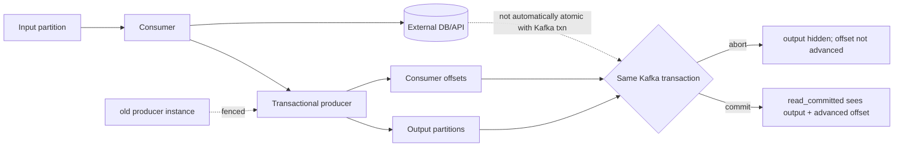
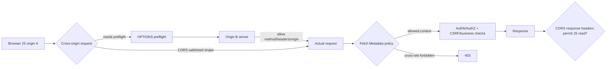

# 2026-09-22 18:00 — Interview Study Packages

README ve yakın `daily/2026-09-22/17-00.md` kontrol edildi. Scheduler topology/NUMA ve mutation testing tekrar edilmiyor. Repo-wide aramada bu turun iki konusu için doğrudan eşleşme bulunmadı. Bu tur **Kafka transactional processing/fencing** ve **CORS preflight/Fetch Metadata resource isolation** boşluklarına odaklanıyor.

## Paket 1 — Mid → Principal Data Engineering/Distributed Systems: Kafka Transactions, Producer Fencing & Exactly-Once Boundaries
**Süre:** 20–30 dk

### Konu anlatımı
Kafka'da “exactly once” tek bir sihirli delivery modu değildir. İki farklı problem ayrılmalıdır: producer retry'larının aynı record'u log'a iki kez yazmaması ve bir consume-process-produce döngüsünde **output records + input offsets** değişikliklerinin atomik olması. Idempotent producer ilk probleme producer identity ve sequence bilgisiyle yaklaşır. Transactional producer ikinci problemde birden fazla partition'a yazıları ve consumer-group offset ilerlemesini tek transaction sınırına alabilir.

`transactional.id` yalnız isim değildir; yeniden başlayan veya aynı kimliği yanlışlıkla paylaşan producer instance'ları arasında eski writer'ın devam etmesini engelleyen fencing modelinin parçasıdır. `read_committed` consumer aborted transaction kayıtlarını uygulama görünümünden filtreler. Fakat Kafka transaction'ı keyfi harici DB/API side effect'ini otomatik olarak atomik yapmaz; end-to-end guarantee sınırı açıkça çizilmelidir.

### Mental model

**Mental model:** exactly-once iddiasını “hangi state transitions aynı atomic boundary içinde?” sorusuyla test et.

### İçeride ne oluyor?
1. Idempotent producer retry duplicate'larını broker tarafındaki producer/sequence state'i ile bastırır.
2. Transactional producer `beginTransaction` ile bir atomic write set açar.
3. Process edilen input'a karşılık output records transaction içinde yazılır.
4. Consumer offsets aynı transaction'a eklenebilir; böylece output görünürlüğü ile progress checkpoint birlikte commit olur.
5. Abort durumunda `read_committed` consumer transactional output'u görünür kabul etmez; input yeniden işlenebilir.
6. `transactional.id` restart sonrası eski/in-flight producer instance'ının güvenli biçimde devre dışı kalmasına yardım eder; aynı ID'yi eşzamanlı kullanan instance tasarımı fencing hatalarına yol açabilir.
7. Rebalance transaction sınırını etkiler; partition ownership değişirken stale processing sonucu commit edilmemelidir.
8. External sink Kafka transaction protokolüne dahil değilse exactly-once iddiası sink'in idempotency/dedup/transaction modeliyle ayrıca çözülür.

### Yüksek getirili mülakat soruları
1. Idempotent producer ile transactional producer arasındaki fark nedir?
2. Producer retry duplicate'ı nasıl oluşur ve idempotence bunu nasıl azaltır?
3. `read_committed` neden gereklidir?
4. Input offset ile output record neden aynı transaction'a alınır?
5. Producer fencing hangi split-brain/stale-writer problemini çözer?
6. Senior: rebalance transaction ortasında olursa recovery akışını nasıl tasarlarsın?
7. Staff: Kafka → PostgreSQL sink için “exactly once” iddiasını nasıl sınırlandırırsın?
8. Principal: transaction timeout, throughput, batch size ve recovery-time trade-off'unu nasıl yönetirsin?

### Beklenen cevap derinliği
- **Mid:** idempotence, transaction, offset ve `read_committed` rollerini ayırır.
- **Senior:** abort/retry, rebalance ve fencing failure mode'larını açıklar.
- **Staff:** external side-effect sınırını, outbox/idempotency/dedup seçeneklerini tartışır.
- **Principal:** correctness contract'ını latency, transaction duration, broker load ve operability ile birlikte yönetir.

### Kısa alıştırma
`orders-in -> enrich -> orders-out` pipeline'ında 100–109 offsetlerini işlediğini düşün. Output'lar yazıldıktan sonra offset commit edilmeden process crash ediyor. At-least-once ve transactional consume-transform-produce modellerinde restart sonrası ne olur? Ardından aynı akışın harici payment API çağırdığını varsay ve Kafka transaction'ının neden tek başına yeterli olmadığını yaz.

### Proje fikri
`kafka-txn-lab`: iki topic arasında transactional copier kur. Normal commit, forced abort, process kill ve rebalance senaryoları ekle. `read_uncommitted` ile `read_committed` çıktısını karşılaştır; duplicate/loss invariant'larını otomatik test et.

### Failure modes / trade-off / production
Uzun transaction'lar timeout ve recovery maliyetini artırır. Aynı `transactional.id`'nin yanlış paylaşımı producer fencing üretir. `read_uncommitted` aborted kayıtları uygulamaya sızdırabilir. External side effect'leri Kafka EOS kapsamındaymış gibi sunmak correctness bug'ıdır. Production'da transaction abort/error oranı, fencing exceptions, consumer lag, rebalance, transaction duration ve end-to-end business invariants birlikte izlenmelidir.

### Kaynaklar
- Apache Kafka 4.1 Design — Using Transactions: https://kafka.apache.org/41/design/design/
- Apache Kafka 4.2 Introduction: https://kafka.apache.org/42/getting-started/introduction/

---

## Paket 2 — Junior → Staff Frontend/Backend/Cybersecurity: CORS Preflight, Credentials & Fetch Metadata Resource Isolation
**Süre:** 20–30 dk

### Konu anlatımı
CORS bir server-to-server firewall değildir; browser'ın cross-origin script erişimini yöneten HTTP-header protokolüdür. Bazı cross-origin isteklerde browser önce `OPTIONS` preflight göndererek hedef server'ın gerçek method/header kombinasyonuna izin verip vermediğini sorar. “Preflight geçti = CSRF çözüldü” yanlıştır: bazı form-benzeri cross-site istekler preflight olmadan gönderilebilir ve CORS esasen response'un JavaScript'e açılmasını kontrol eder.

Fetch Metadata (`Sec-Fetch-Site`, `Sec-Fetch-Mode`, `Sec-Fetch-Dest`, `Sec-Fetch-User`) server'a request'in browser bağlamı hakkında ek sinyal verir. Bu sinyallerle resource isolation policy kurulabilir: örneğin hassas state-changing endpoint'te `cross-site` request'i default deny ederken gerçek cross-origin API endpoint'lerini açıkça allowlist etmek. Bu katman CSRF token/SameSite/authz yerine geçmez; defense-in-depth'tir.

### Mental model

### İçeride ne oluyor?
1. Origin scheme + host + port üçlüsüdür; site kavramıyla aynı değildir.
2. Browser request mode/method/header şekline göre CORS protocol'ünü uygular; gerekli durumda preflight `OPTIONS` gönderir.
3. Server `Access-Control-Allow-Origin/Methods/Headers` ile policy bildirir.
4. Credentialed cross-origin request'te wildcard origin güvenli/uygun çözüm değildir; explicit origin ve credential policy gerekir.
5. Preflight request'in kendisi credentials taşımaz; actual request policy izin verirse credentials içerebilir.
6. `Sec-Fetch-Site` same-origin/same-site/cross-site/none bağlamını; mode/dest/user header'ları request'in kullanım bağlamını anlatır.
7. Server Fetch Metadata ile hassas resource'larda cross-site request'leri erken reddedebilir.
8. Legacy/non-browser clients veya endpoint'in gerçek cross-origin kullanım ihtiyacı için rollout/allowlist gerekir.

### Yüksek getirili mülakat soruları
1. Same-origin policy ile CORS arasındaki ilişki nedir?
2. Hangi durumda browser preflight yapar; preflight neyi garanti etmez?
3. CORS neden CSRF koruması değildir?
4. Credentialed request'te `Access-Control-Allow-Origin: *` neden problemli?
5. `Sec-Fetch-Site: cross-site` server'a hangi yeni sinyali verir?
6. Senior: public API ile cookie-authenticated admin endpoint için farklı policy nasıl kurarsın?
7. Staff: Fetch Metadata rollout'unda legacy browser/client uyumluluğunu nasıl yönetirsin?
8. Staff: CDN/cache katmanında origin-varying CORS response'larında hangi cache-poisoning/misrouting risklerini düşünürsün?

### Beklenen cevap derinliği
- **Junior:** origin, SOP ve CORS'un browser-enforced olduğunu açıklar.
- **Mid:** preflight, credentials ve allow headers akışını bilir.
- **Senior:** CORS/CSRF ayrımını ve Fetch Metadata defense-in-depth modelini kurar.
- **Staff:** proxy/CDN caching, allowlist governance, legacy clients ve endpoint sınıflandırmasını production policy'ye bağlar.

### Kısa alıştırma
`app.example` cookie ile `api.example`'a erişiyor; ayrıca `evil.example.net` kullanıcının browser'ından POST deniyor. JSON + custom header kullanan request ile HTML form-benzeri POST'u ayrı ayrı çiz. Hangisi preflight olur? CORS response okunabilirliği ile request side effect'inin oluşmasını birbirinden ayır.

### Proje fikri
`browser-boundary-lab`: iki origin üzerinde küçük frontend/API kur. Simple/preflighted/credentialed request örnekleri, strict origin allowlist ve `Sec-Fetch-Site` tabanlı resource-isolation middleware ekle. Browser DevTools ve integration testlerle OPTIONS/actual request akışını kaydet.

### Failure modes / trade-off / production
Origin'i körlemesine reflect etmek allowlist'i anlamsızlaştırır. CORS'u authz sanmak veri açığı yaratır; CORS'u CSRF sanmak state-changing endpoint'i savunmasız bırakabilir. CDN cache key/Vary hataları farklı origin policy'lerini karıştırabilir. Fetch Metadata'yı sert biçimde açmak legitimate non-browser/legacy akışları bozabilir. Production'da rejected origin/site, preflight error rate, endpoint sınıfı ve credential mode gözlemlenmelidir.

### Kaynaklar
- MDN — CORS: https://developer.mozilla.org/en-US/docs/Web/HTTP/Guides/CORS
- MDN — Fetch Metadata: https://developer.mozilla.org/en-US/docs/Web/HTTP/Guides/Fetch_metadata
- MDN — Sec-Fetch-Site: https://developer.mozilla.org/en-US/docs/Web/HTTP/Reference/Headers/Sec-Fetch-Site
