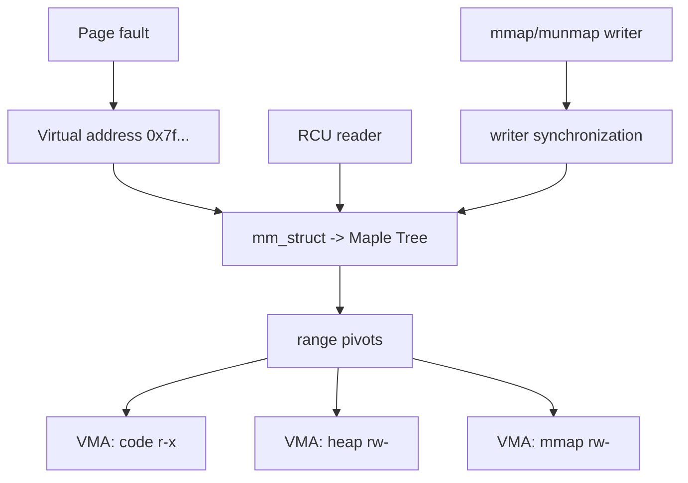
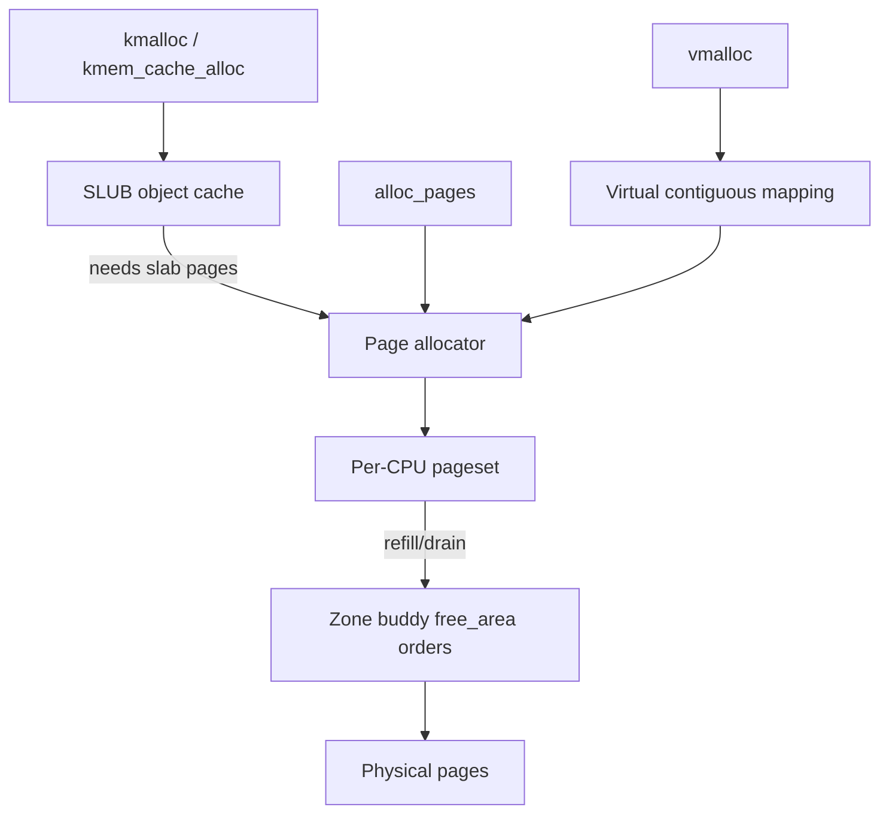

# 2026-09-22 19:00 — Interview Study Packages

README ve yakın `daily/2026-09-22/18-00.md` kontrol edildi. `io_uring` ve exception/unwind zinciri tekrar edilmiyor. Repo-wide kontrolde page-cache/fsync/crash-consistency, sanitizers, contract testing ve distributed-history/linearizability testing'in zaten işlendiği görüldü. Bu tur iki temel sistem boşluğunu kapatıyor: **Linux VMA indexing için Maple Tree** ve **Linux physical-page/object allocation için buddy + SLUB katmanları**.

## Paket 1 — Mid → Principal Foundations/Algorithms: Linux Maple Tree, VMA Range Indexing & RCU Reads
**Süre:** 20–30 dk

### Konu anlatımı
Bir process'in sanal adres uzayı tek tek page'lerden ibaret değildir; benzer permission/backing özelliklerine sahip contiguous aralıklar `vm_area_struct` (VMA) ile temsil edilir. Kernel bir page fault, `mmap`, `munmap` veya `mprotect` sırasında belirli bir adresi kapsayan VMA'yı hızlı bulmak ve aralıkları güncellemek zorundadır. Güncel Linux'ta her `mm_struct`, VMA'ları **Maple Tree** adlı range-optimized B-Tree ailesi veri yapısında tutar.

Maple Tree non-overlapping ranges için tasarlanmıştır; cache-efficient iteration, gap search ve RCU-safe read yollarını destekler. Buradaki önemli interview bağlantısı şudur: textbook B/B+Tree fikri yalnız database index değildir; kernel virtual-memory metadata'sında da branching factor, cache locality, range lookup ve concurrency trade-off'larıyla karşımıza çıkar.

### Mental model

**Mental model:** page table “virtual address hangi physical page'e gider?” sorusuna; VMA tree ise “bu virtual address geçerli mi ve hangi policy/permissions/backing'e sahip?” sorusuna cevap veren üst metadata indexidir.

### İçeride ne oluyor?
1. `mm_struct` process address-space metadata'sını taşır; VMA'lar non-overlapping virtual ranges'tir.
2. Maple Tree bir B-Tree türevidir; range lookup ve ordered iteration için yüksek branching factor/cache locality hedefler.
3. `mtree_load`/find/iteration yolları RCU read-side ile kullanılabilir; mutation tarafı synchronization ister.
4. Page fault path önce uygun VMA ve access permission bilgisini bulur, sonra page-table tarafına ilerler.
5. `mmap`/`munmap`/`mprotect` VMA split/merge veya range replacement yaratabilir; yalnız “tree insert/delete” olarak düşünmek eksiktir.
6. Allocation-tree varyantı boş range/gap aramasını destekler; regular tree daha yüksek branching factor kullanabilir.
7. Node preallocation, allocation'ın yapılamadığı kritik bölgelerde mutation güvenilirliği için önemlidir.
8. RCU “writer yok” anlamına gelmez; object lifetime ve writer coordination ayrı correctness problemidir.

### Yüksek getirili mülakat soruları
1. VMA ile page-table entry arasındaki fark nedir?
2. VMA'ları linked list yerine tree'de tutmak neden önemlidir?
3. Maple Tree neden generic binary search tree yerine range-oriented/high-fanout yapı kullanır?
4. `mmap` veya `munmap` neden VMA split/merge yaratabilir?
5. RCU-safe lookup hangi contention'ı azaltır; hangi problemi çözmez?
6. Senior: page fault hot path'inde cache locality neden asymptotic complexity kadar önemlidir?
7. Staff: read-mostly metadata indexinde lock granularity ve lifetime safety'yi nasıl ayırırsın?
8. Principal: Maple Tree fikrini database B+Tree ile karşılaştır; workload ve invariants nerede ayrışır?

### Beklenen cevap derinliği
- **Mid:** VMA/page-table ayrımını, range lookup ve high-fanout tree gerekçesini açıklar.
- **Senior:** split/merge, cache locality, RCU reader ve writer synchronization ilişkisini kurar.
- **Staff:** object lifetime, lock ordering, allocation-under-lock ve hot-path observability'yi tartışır.
- **Principal:** veri yapısı seçimini workload distribution, read/write ratio, NUMA/cache davranışı ve correctness invariants ile savunur.

### Kısa alıştırma
Şu mapping'leri çiz: `[0x1000,0x5000) r-x`, `[0x8000,0xc000) rw-`, `[0x10000,0x18000) rw-`. Son aralığın ortasındaki `[0x12000,0x14000)` bölümünü `mprotect(..., PROT_READ)` yaptığında kaç VMA gerekebileceğini ve hangi range split'lerinin oluşacağını göster.

### Proje fikri
`vma-map-lab`: küçük C programında `mmap`, `mprotect`, `munmap` çağrıları yap; her adımdan sonra `/proc/self/maps` snapshot'ı al. Mapping split/merge davranışını gözlemle ve fault latency için `perf` ile basit ölçüm yap.

### Failure modes / trade-off / production
VMA lookup'ı page-table walk ile karıştırmak yanlış mental model üretir. Read-side scalability için RCU kullanmak freed object dereference riskini kendiliğinden çözmez. Çok parçalı mapping'ler metadata ve update maliyetini artırabilir. Production'da mapping count, page-fault rate, major/minor faults, mmap-lock contention ve memory fragmentation birlikte düşünülür.

### Kaynaklar
- Linux Kernel — Maple Tree: https://docs.kernel.org/core-api/maple_tree.html
- Linux Kernel — Process Addresses / VMA locking: https://docs.kernel.org/mm/process_addrs.html
- Linux source — Maple Tree: https://github.com/torvalds/linux/blob/master/lib/maple_tree.c

---

## Paket 2 — Junior → Staff Foundations/SRE: Linux Buddy Allocator, Per-CPU Pagesets & SLUB
**Süre:** 20–30 dk

### Konu anlatımı
Kernel memory allocation tek bir `malloc` benzeri mekanizma değildir. Physical page seviyesinde Linux zone'lar içindeki free page'leri **buddy allocator** ile power-of-two order'larda yönetir; sık page allocation/free için per-CPU pagesets global contention'ı azaltır. Küçük kernel object'leri için ise her istekte bütün page ayırmak israf olur; `kmalloc`/`kmem_cache` yolları SLUB/slab katmanında page'leri küçük object slot'larına böler.

Bu iki katmanı ayırmak temel mental modeldir: **buddy page sağlar; slab/SLUB page'in üstünde object sağlar**. `vmalloc` ise virtually contiguous fakat fiziksel olarak contiguous olması gerekmeyen mapping kurarak başka bir trade-off sunar.

### Mental model

**Mental model:** object allocator ile physical-page allocator farklı abstraction katmanlarıdır; latency, fragmentation ve contiguity gereksinimleri hangi yolu kullanacağını belirler.

### İçeride ne oluyor?
1. Buddy allocator free memory'yi order 0,1,2... biçiminde `2^order` page bloklarında tutar.
2. Büyük blok küçük isteğe split edilir; free sırasında uygun buddy boşsa tekrar merge edilebilir.
3. External fragmentation yüzünden toplam free memory yeterli olsa bile high-order contiguous allocation başarısız olabilir.
4. Per-CPU pagesets sık order-0 allocation/free işlemlerini CPU-local tutup zone lock/cache-line contention'ını azaltır; refill/drain batch halinde yapılır.
5. SLUB benzer boyut/tip object'leri cache'lerde tutar; slab page'leri object slot'larına bölünür.
6. `kmalloc` fiziksel contiguity beklentileri nedeniyle büyük allocation için kötü seçim olabilir; `vmalloc` virtually contiguous mapping ile fiziksel contiguity şartını kaldırır fakat page-table/TLB maliyeti getirir.
7. GFP flags allocation context ve reclaim/sleep davranışı gibi kısıtları ifade eder; yanlış context'te sleeping allocation deadlock/bug yaratabilir.
8. NUMA sisteminde allocator node locality'yi dikkate alır; remote memory fallback latency/bandwidth etkiler.

### Yüksek getirili mülakat soruları
1. Buddy allocator neden power-of-two bloklar kullanır?
2. Internal ve external fragmentation farkı nedir?
3. `kmalloc` ile `vmalloc` arasındaki temel contiguity farkı nedir?
4. SLUB neden buddy allocator'ın yerini almaz?
5. Per-CPU pageset scalability'yi nasıl artırır?
6. Senior: sistemde free RAM varken high-order allocation neden fail olabilir?
7. Senior: object cache reuse CPU cache locality'yi nasıl etkiler?
8. Staff: NUMA + allocator contention + fragmentation kaynaklı p99 spike'ı nasıl teşhis edersin?

### Beklenen cevap derinliği
- **Junior:** page/object allocator ayrımını ve buddy split/merge fikrini açıklar.
- **Mid:** kmalloc/vmalloc, fragmentation ve SLUB cache gerekçesini bağlar.
- **Senior:** PCP batching, GFP context, high-order failure ve NUMA locality'yi tartışır.
- **Staff:** allocator telemetry, reclaim/compaction, lock contention ve tail-latency etkisini production incident'a bağlar.

### Kısa alıştırma
16 page'lik tek free bloktan sırasıyla 1, 1, 4 ve 2 page allocate edildiğini varsay. Buddy split'lerini çiz. Sonra ilk iki 1-page blok free edildiğinde hangi koşulda merge olabileceklerini göster; “toplam free page” ile “en büyük contiguous free block” değerlerini ayrı takip et.

### Proje fikri
`allocator-pressure-lab`: Linux VM'de farklı boyutlarda allocation/free pattern'leri üret. `/proc/buddyinfo`, `/proc/slabinfo`, `vmstat` ve `perf`/tracepoint'lerle order dağılımı, slab kullanımı ve allocation latency'yi izle. Ardından fragmentation oluşturan pattern ile high-order allocation davranışını karşılaştır.

### Failure modes / trade-off / production
Free-memory yüzdesi tek başına allocation health değildir. High-order fragmentation, reclaim/compaction stall, NUMA remote allocation ve slab growth tail latency yaratabilir. Per-CPU cache'ler contention'ı azaltırken memory'nin CPU'lar arasında geçici dengesiz görünmesine yol açabilir. Production'da buddy order dağılımı, slab growth, reclaim/compaction, allocation stalls, OOM ve NUMA locality birlikte incelenir.

### Kaynaklar
- Linux Kernel — Physical Memory: https://docs.kernel.org/mm/physical_memory.html
- Linux Kernel — Memory Allocation Guide: https://docs.kernel.org/core-api/memory-allocation.html
- Linux Kernel — kmem tracepoints: https://docs.kernel.org/trace/events-kmem.html
- Linux Kernel — SLUB users guide: https://docs.kernel.org/mm/slub.html
