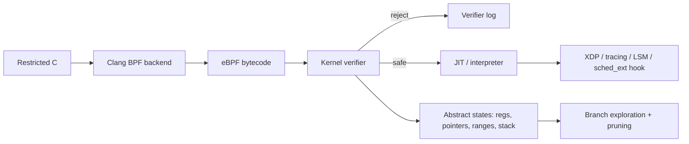
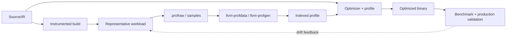

# 2026-09-22 20:00 — Interview Study Packages

README ve yakın `daily/2026-09-22/19-00.md` kontrol edildi. Maple Tree ile buddy/PCP/SLUB tekrar edilmiyor. Repo-wide aramada TLB shootdown/PCID, B+Tree deletion, extents/reflink, model-based testing ve register allocation gibi adayların zaten işlendiği görüldü. Bu tur iki yeni boşluğu kapatıyor: **eBPF verifier'ın safety modeli** ve **compiler PGO'nun runtime profile → optimization feedback zinciri**.

## Paket 1 — Mid → Principal Foundations/Security/SRE: eBPF Verifier, Abstract State & Safe Kernel Extensibility
**Süre:** 20–30 dk

### Konu anlatımı
BPF programı kernel içinde yüksek ayrıcalıklı hook'larda çalışabildiği için yalnız bytecode'un syntactically valid olması yetmez. Kernel verifier programı yükleme sırasında analiz ederek register türleri/değer aralıkları, pointer provenance, stack erişimleri, helper çağrıları ve control-flow hakkında güvenlik koşullarını ispatlamaya çalışır. Başarılı program interpreter veya JIT ile yürütülebilir.

Verifier'ı “antivirüs” değil, **abstract interpreter + proof gate** olarak düşün: concrete runtime değerlerini tek tek denemek yerine olası değer kümelerini ve state'leri takip eder. Branch'ler state'i böler; state pruning/equivalence exploration patlamasını sınırlar. Loop güvenliği de yalnız `for` sözcüğüne bakmak değil, verifier'ın güvenli bir state envelope gösterebilmesi problemidir.

### Mental model

### İçeride ne oluyor?
1. Verifier CFG'yi ve reachable instruction yollarını inceler; invalid jump/exit/control-flow biçimleri reddedilebilir.
2. Register state yalnız “64-bit sayı” değildir: scalar, context pointer, map-value pointer gibi provenance/type bilgisi taşır.
3. Scalar range bilgisi bounds check sonrasında pointer arithmetic/memory access'in güvenli olup olmadığını kanıtlamaya yardım eder.
4. Helper/kfunc çağrılarında argument ve lifetime kuralları verifier contract'ının parçasıdır.
5. Branch exploration yeni abstract state'ler üretir; equivalent/subsumed state pruning verification maliyetini kontrol eder.
6. Loop/iterator doğrulaması termination ve state-envelope reasoning gerektirir; open-coded BPF iterators verifier'ın NULL/non-NULL yollarını ayrı simüle etmesine örnektir.
7. Verification başarısı runtime correctness garantisi değildir: race, yanlış policy veya pahalı fakat legal iş yine production problemi olabilir.
8. Güncel production bağlantısı: `sched_ext`, BPF ile scheduler policy tanımlayabilir; kernel hata/stall algıladığında varsayılan scheduler'a geri dönecek safety mekanizması sunar.

### Yüksek getirili mülakat soruları
1. eBPF verifier neden runtime sandbox'tan farklıdır?
2. Pointer provenance neden yalnız numeric bounds check'ten daha güçlü bir modele ihtiyaç duyar?
3. Branch sayısı verifier complexity'sini neden büyütebilir?
4. Bounded loop ile verifier-friendly loop aynı şey midir?
5. Helper contract yanlış kullanılırsa program neden load-time'da reddedilebilir?
6. Senior: state pruning güvenliği bozmadan exploration'ı nasıl azaltabilir?
7. Staff: verifier kabul ettiği halde production'da hangi failure mode'lar kalır?
8. Principal: kernel extensibility'de verifier + JIT modelini module yükleme veya userspace sandbox ile karşılaştır.

### Beklenen cevap derinliği
- **Mid:** load-time verification, register/pointer state ve JIT zincirini açıklar.
- **Senior:** range/provenance, branch-state explosion, helper contracts ve loop reasoning'i bağlar.
- **Staff:** verifier complexity, observability, map concurrency ve operational rollback'u tartışır.
- **Principal:** programmable kernel surface'in güvenlik sınırını, blast radius'u ve policy governance'ını değerlendirir.

### Kısa alıştırma
Bir packet pointer `data` ve `data_end` için `hdr = data + 14` erişimini düşün. Bounds check olmadan verifier'ın neden erişimi reddetmesi gerektiğini; `if (hdr + sizeof(*hdr) > data_end) return XDP_DROP;` sonrasında hangi range bilgisinin oluştuğunu sözlü olarak çıkar.

### Proje fikri
`verifier-lab`: libbpf/bpftool ile üç küçük program yaz: güvenli map counter, bounds check'i eksik packet parser ve verifier state-space'i büyüten branch'li sürüm. Load loglarını karşılaştır; sonra güvenli programın JIT edilmiş çıktısını ve runtime counters'ını gözlemle.

### Failure modes / trade-off / production
Verifier rejection deploy-time failure yaratabilir; kernel sürümleri/BTF/helper availability portability sorunları çıkarabilir. Karmaşık control-flow verification süresini artırabilir. Kabul edilmiş BPF programı yine contention, map memory growth veya hook hot-path latency yaratabilir. Production'da verifier log, program load latency, JIT durumu, map memory, hook latency ve fallback/rollback yolu birlikte izlenmelidir.

### Kaynaklar
- Linux Kernel — BPF verifier: https://docs.kernel.org/bpf/verifier.html
- Linux Kernel — BPF iterators/verifier state reasoning: https://docs.kernel.org/bpf/bpf_iterators.html
- Linux Kernel — BPF maps: https://docs.kernel.org/bpf/maps.html
- Linux Kernel — sched_ext: https://docs.kernel.org/scheduler/sched-ext.html

---

## Paket 2 — Junior → Staff Compiler/Runtime: Profile-Guided Optimization, Instrumentation vs Sampling & Profile Drift
**Süre:** 20–30 dk

### Konu anlatımı
Statik optimizer programın olası davranışını IR ve analizlerden tahmin eder; PGO ise gerçek çalıştırmadan gelen **hangi path/function/call target sıcak?** bilgisini sonraki compilation'a geri besler. Temel pipeline iki aşamalıdır: profile üret → representative workload çalıştır → profilleri birleştir → profile-use build üret.

Instrumentation-based PGO compiler'ın counter eklemesiyle daha kontrollü frekans bilgisi toplar fakat training run overhead'i getirir. Sample-based PGO ise `perf`/hardware sampling gibi dış gözlemlerden profile üretir; production'a daha yakın veri toplayabilir fakat sampling bias, symbolization ve attribution sorunları vardır. PGO'nun kritik riski “profile var” değil, **profile gelecekteki workload'u temsil ediyor mu?** sorusudur.

### Mental model

### İçeride ne oluyor?
1. Instrumentation counters edge/block/function frequency ve bazı value-profile bilgilerini toplayabilir.
2. `llvm-profdata merge` raw instrumentation profillerini indexed profile'a dönüştürür; farklı training girdilerinin ağırlığı sonucu etkileyebilir.
3. Sample PGO için `llvm-profgen`, örneğin Linux `perf` branch-stack verisini compiler'ın kullanabileceği profile çevirebilir.
4. Optimizer hot/cold bilgisini inlining, block layout, branch placement ve code-size trade-off'larında kullanabilir.
5. Profile source/IR ile uyuşmazsa stale/mismatched profile kaliteyi düşürebilir; profile formatı function/CFG kimliğiyle eşleşme bilgileri taşır.
6. Representative training set kritik girdidir: tek benchmark'a optimize etmek gerçek trafik dağılımını kötü temsil edebilir.
7. PGO ile benchmark leakage ayrılmalıdır; optimize edilen workload ile evaluation workload'unu bilinçli ayırmak gerekir.
8. Güncel LLVM ekosisteminde MemProf control-flow hotness'in ötesinde allocation hotness/lifetime bilgisini profile-guided optimizasyona taşır.

### Yüksek getirili mülakat soruları
1. PGO statik `-O2/-O3` optimizasyondan ne ekler?
2. Instrumentation PGO ile sample PGO trade-off'u nedir?
3. Representative workload neden compiler flag kadar önemlidir?
4. Hot function'ı her zaman inline etmek neden yanlış olabilir?
5. Profile drift ne demektir ve nasıl fark edilir?
6. Senior: code layout instruction-cache davranışını nasıl etkiler?
7. Senior: profile mismatch hangi durumda performance regression yaratabilir?
8. Staff: fleet'ten profile toplayıp release pipeline'a beslerken güvenilirlik ve reproducibility'yi nasıl tasarlarsın?

### Beklenen cevap derinliği
- **Junior:** train/profile-use iki aşamasını ve hot/cold kavramını anlatır.
- **Mid:** instrumentation/sample ayrımını, inlining/layout etkisini ve representative workload gereğini açıklar.
- **Senior:** profile drift, code size/i-cache, sampling bias ve regression validation'ı tartışır.
- **Staff:** profile provenance, fleet representativeness, release gating ve rollback ekonomisini tasarlar.

### Kısa alıştırma
İki endpoint düşün: A trafik %95 ama kısa; B %5 ama CPU'nun %60'ını tüketiyor. Yalnız request-count ile oluşturulan training set'in neden yanlış optimization sinyali verebileceğini açıkla ve weighted workload öner.

### Proje fikri
`pgo-lab`: branch-heavy küçük C/C++ benchmark'ını önce `-O2`, sonra instrumentation PGO ile derle. Training distribution'ı 90/10 iken test'i önce 90/10 sonra 10/90 çalıştır. Binary size, wall time ve `perf stat` sonuçlarını karşılaştır; profile drift'in kazancı nasıl tersine çevirebildiğini raporla.

### Failure modes / trade-off / production
Overfitting, stale profile, instrumentation overhead, nondeterministic training, symbol/profile mismatch ve code-size growth temel risklerdir. Ortalama throughput artarken cold-path veya p99 gerileyebilir. Production rollout'ta aynı binary için representative canary, CPU/time, i-cache göstergeleri, binary size ve tail latency birlikte karşılaştırılmalıdır.

### Kaynaklar
- LLVM — How to build with PGO: https://llvm.org/docs/HowToBuildWithPGO.html
- LLVM — llvm-profdata: https://llvm.org/docs/CommandGuide/llvm-profdata.html
- LLVM — llvm-profgen / sample PGO: https://llvm.org/docs/CommandGuide/llvm-profgen.html
- Clang — User Manual / profile instrumentation: https://clang.llvm.org/docs/UsersManual.html
- LLVM — MemProf: https://llvm.org/docs/MemProf.html
