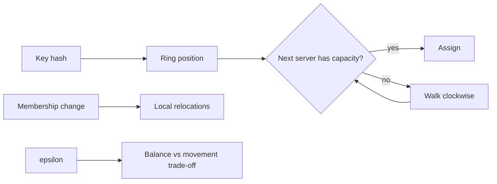
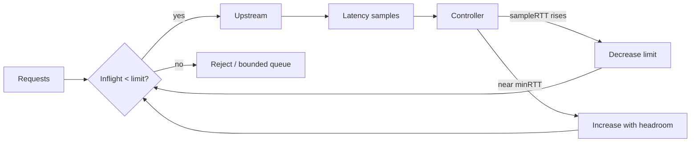

# 2026-09-22 21:00 — Interview Study Packages

README ve yakın `daily/2026-09-22/20-00.md` kontrol edildi. eBPF verifier ve PGO tekrar edilmiyor. Repo-wide aramada speculative decoding'in zaten birkaç kez işlendiği görülerek elendi. Bu tur iki yeni boşluğu kapatıyor: **bounded-load consistent hashing** ve **adaptive concurrency control**.

## Paket 1 — Mid → Principal Algorithms / Distributed Systems / System Design: Consistent Hashing with Bounded Loads
**Süre:** 20–30 dk

### Konu anlatımı
Klasik consistent hashing'in ana vaadi dengeden çok **membership değiştiğinde az key taşımaktır**. Ring üzerinde node ekleyip çıkarınca key'lerin yalnız bir bölümü yeniden yerleşir; fakat bu tek başına her node'un yükünü ortalamaya yakın tutmaz. Hot key'ler, heterojen kapasite ve rastgele dağılım varyansı bazı node'ları aşırı yükleyebilir.

Bounded-load yaklaşımı bu iki hedefi birlikte ele alır: her bin/server için ortalama yükün `(1+ε)` katı civarında bir kapasite sınırı tanımla; key kendi hash konumundan başlayıp kapasitesi olan ilk server'a ilerlesin. Küçük ε daha sıkı denge ama membership/key değişiminde daha fazla relocation; büyük ε daha gevşek denge ama daha yüksek stabilite demektir.

### Mental model

### İçeride ne oluyor?
1. Key ve server'lar deterministik hash uzayına yerleşir.
2. Capacity yaklaşık `ceil((1+ε) * keys/servers)` olarak düşünülür.
3. Bir server doluysa key ring üzerinde sonraki kapasitesi olan server'a taşar.
4. Server ekleme/çıkarma yalnız assignment değil capacity hedefini de değiştirebilir; cascade relocation mümkündür.
5. Paper'ın temel sonucu, kapasite sınırı getirirken update başına beklenen hareket sayısını sistem boyutundan bağımsız tutabilen garantiler vermesidir.
6. Weighted/heterogeneous node'larda kapasiteyi CPU, memory veya storage weight ile ilişkilendirmek gerekir.
7. Hash key seçimi algoritmanın dışındadır ama sonucu belirler: tenant ID ile hashing sticky tenant sağlar; request ID yükü daha çok yayabilir.
8. Maglev/ring-hash gibi production LB'ler aynı problem ailesindedir; seçim lookup cost, remapping, weighting ve operational simplicity arasında yapılır.

### Yüksek getirili mülakat soruları
1. Consistent hashing hangi problemi çözer, hangi problemi çözmez?
2. Virtual node kullanmak load variance'ı neden azaltabilir ama garanti etmez?
3. `ε` küçüldükçe neden relocation maliyeti artabilir?
4. Hot key varsa bounded-load hashing tek başına yeterli midir?
5. Mid: node eklenince hangi key'ler hareket eder?
6. Senior: heterogeneous capacity ve tenant stickiness'i nasıl modelliyorsun?
7. Staff: cache hit-rate ile load balance çatışırsa hangi metriği optimize edersin?
8. Principal: ring hash, rendezvous hashing ve Maglev'i failure/remapping/operability açısından nasıl seçersin?

### Beklenen cevap derinliği
- **Mid:** ring, remapping ve capacity overflow fikrini doğru açıklar.
- **Senior:** ε, hot-key, weights ve cache-locality trade-off'larını bağlar.
- **Staff:** membership churn, failover, skew telemetry ve rollout stratejisini tasarlar.
- **Principal:** algoritmik garantiyi SLO, cost ve multi-tenant isolation hedeflerine çevirir.

### Kısa alıştırma
3 server ve 12 key için ortalama yük 4. `ε=0.25` ile capacity sınırını hesapla. Bir server kaldırıldığında hangi metrikleri ölçerek relocation'ın kabul edilebilir olduğunu belirlersin: moved-key ratio, max/mean load, cache miss ve p99 latency'yi birlikte yorumla.

### Proje fikri
`hashing-lab`: ring hash, rendezvous hash ve bounded-load varyantını simüle et. Zipf key popularity, node churn ve heterojen weights altında max/mean load, moved-key ratio ve simulated cache-hit oranını karşılaştır.

### Failure modes / trade-off / production
Uniform hash varsayımı gerçek tenant skew'unda kırılabilir. Tek hot key kapasiteyi request-count bazında değil CPU/time bazında tüketebilir. Membership flap relocation fırtınası yaratabilir. Capacity metadata tutarsızlığı farklı router'ların farklı assignment üretmesine yol açabilir. Production'da membership epoch, max/mean load, remap rate, hot-key concentration, cache-hit ve tail latency birlikte izlenmelidir.

### Kaynaklar
- Google Research — Consistent Hashing with Bounded Loads: https://research.google/pubs/consistent-hashing-with-bounded-loads/
- Google Research Blog — Consistent Hashing with Bounded Loads: https://research.google/blog/consistent-hashing-with-bounded-loads/
- Envoy — Supported load balancers / Maglev & ring hash: https://www.envoyproxy.io/docs/envoy/latest/intro/arch_overview/upstream/load_balancing/load_balancers.html

---

## Paket 2 — Junior → Staff Backend / Cloud / SRE: Adaptive Concurrency Control & Queue Collapse
**Süre:** 20–30 dk

### Konu anlatımı
Rate limit “birim zamanda kaç istek?” sorusunu, concurrency limit ise “aynı anda kaç iş sistemin içinde?” sorusunu kontrol eder. Downstream yavaşladığında aynı RPS daha uzun request lifetime üreterek inflight sayısını büyütür. Little's Law sezgisiyle `L ≈ λW`: latency yükselirse aynı arrival rate altında concurrency de yükselir; queue büyür, latency daha da artar ve sistem positive-feedback ile collapse'a gidebilir.

Adaptive concurrency statik bir sayı yerine latency feedback ile inflight limitini ayarlar. Envoy gradient controller periyodik ideal `minRTT` ölçümü ile güncel `sampleRTT`'yi karşılaştırır. Basitleştirilmiş gradient `(minRTT + buffer) / sampleRTT`; latency şişince gradient düşer ve limit aşağı çekilir. Sistem rahatken headroom limiti yeniden büyütür.

### Mental model

### İçeride ne oluyor?
1. Controller baseline olarak no-load'a yakın RTT tahmini tutar.
2. Sampling window'daki latency percentile/aggregate güncel congestion sinyalidir.
3. `gradient = (minRTT + B) / sampleRTT`; `B` normal jitter için tolerans sağlar.
4. Yeni limit kabaca `gradient * old_limit + headroom`; Envoy headroom'u limitin kareköküyle ilişkilendirir.
5. Limit dolunca sonsuz queue yerine reject/reset/503 veya bounded waiting gerekir; aksi halde limiter yalnız kuyruğu başka yere taşır.
6. Retry yanlış tasarlanırsa overload sırasında ek yük üretir. Retry budget, jitter ve farklı host seçimi gerekir.
7. Health-check veya çok ucuz request'leri latency sample'a katmak baseline'ı bozabilir.
8. Controller tüm trafiği görmüyorsa feedback loop eksik gözlemle karar verir; bypass yolları limitin etkisini kırabilir.

### Yüksek getirili mülakat soruları
1. Rate limiting ile concurrency limiting farkı nedir?
2. Aynı RPS neden downstream yavaşladığında sistemi çökertmeye başlayabilir?
3. minRTT neden congestion sinyali için kullanışlıdır?
4. Neden limiter önünde unbounded queue istemezsin?
5. Mid: timeout ve retry adaptive limiter ile nasıl etkileşir?
6. Senior: minRTT drift ederse controller neyi yanlış yorumlar?
7. Staff: endpoint maliyetleri çok farklıysa tek global limit neden kötü olabilir?
8. Staff: autoscaling ile adaptive concurrency aynı anda çalışırken oscillation'ı nasıl azaltırsın?

### Beklenen cevap derinliği
- **Junior:** inflight, queue, latency ve rate/concurrency farkını açıklar.
- **Mid:** Little's Law sezgisi, overload feedback ve rejection davranışını bağlar.
- **Senior:** sampling, retry amplification, fairness ve baseline drift'i tartışır.
- **Staff:** multi-controller interaction, per-route isolation, rollout ve SLO telemetry tasarlar.

### Kısa alıştırma
Bir servis 200 RPS alıyor. Ortalama latency 50 ms iken yaklaşık inflight sayısını; latency 500 ms olduğunda aynı RPS için yeni inflight sayısını hesapla. Sonra connection pool 80 ise hangi noktada queue oluşacağını açıkla.

### Proje fikri
`adaptive-limit-lab`: küçük HTTP upstream'e kontrollü latency enjekte et. Sabit semaphore ile gradient-benzeri controller'ı karşılaştır. Throughput, p50/p99, inflight, reject rate ve queue depth grafiklerini çıkar; overload başladığında hangi controller'ın daha hızlı stabilize olduğunu ölç.

### Failure modes / trade-off / production
Noisy latency, GC pause, cold start veya network jitter congestion sanılabilir. Fazla agresif controller throughput'u gereksiz düşürür; yavaş controller queue collapse'ı durduramaz. Autoscaler, circuit breaker ve retry policy ayrı feedback loop'lardır ve birbirini osile ettirebilir. Production'da concurrency limit, inflight, rejected requests, min/sample RTT, queue depth, retry volume, saturation ve p99 birlikte izlenmelidir.

### Kaynaklar
- Envoy — Adaptive Concurrency: https://www.envoyproxy.io/docs/envoy/latest/configuration/http/http_filters/adaptive_concurrency_filter.html
- Envoy — Adaptive Concurrency v3 API: https://www.envoyproxy.io/docs/envoy/latest/api-v3/extensions/filters/http/adaptive_concurrency/v3/adaptive_concurrency.proto
- Netflix concurrency-limits (upstream project): https://github.com/Netflix/concurrency-limits
