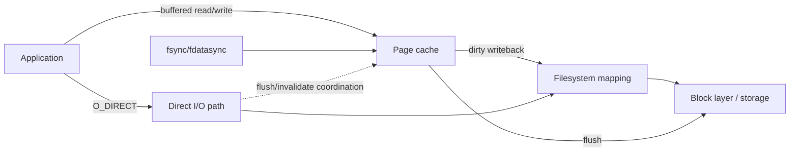
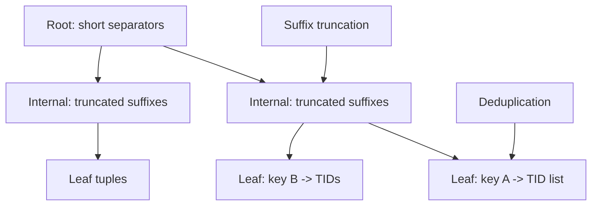

# 2026-09-22 22:00 — Interview Study Packages

README ve yakın `daily/2026-09-22/21-00.md` kontrol edildi. Consistent hashing/adaptive concurrency tekrar edilmiyor. Repo-wide aramada filesystem direct-I/O ile B+Tree suffix truncation/deduplication için ayrı paket bulunmadı. Bu tur iki temel boşluğu ilerletiyor.

## Paket 1 — Junior → Staff Foundations / Filesystems: Buffered I/O, Direct I/O, Writeback & Cache Coherency
**Süre:** 20–30 dk

### Konu anlatımı
Linux'ta normal file I/O page cache üzerinden geçer. Read cache hit ise storage'a gitmeden dönebilir; write çoğu zaman cache folio'larını dirty yapar ve writeback daha sonra storage'a taşır. `fsync` dirty state'in kalıcılık sınırını zorlamak için kullanılır. `O_DIRECT` ise page cache'i bypass ederek uygulama buffer'ı ile storage arasında daha doğrudan I/O yolu kurar; fakat bu otomatik olarak `fsync`/durability anlamına gelmez.

Direct ve buffered I/O aynı file range üzerinde karıştırıldığında coherency kritik olur. Linux iomap direct-read öncesi ilgili dirty cache'i flush eder; direct-write öncesi dirty cache'i flush edip cache'i invalidation ile koordine eder. Bu yüzden “O_DIRECT = her zaman daha hızlı” yanlış mental modeldir: cache hit/readahead kaybedilir, alignment ve I/O granularity uygulamanın sorumluluğuna yaklaşır.

### Mental model

### İçeride ne oluyor?
1. Buffered read page-cache hit/miss üretir; sequential access readahead'den yararlanabilir.
2. Buffered write dirty folio üretir; syscall completion storage persistence değildir.
3. Background writeback ve memory pressure dirty pages'i storage'a yollar; `fsync` explicit durability boundary sağlar.
4. Direct I/O page cache'i bypass eder; filesystem/device alignment kısıtları olabilir.
5. Direct read/write ile cached state çakışırsa stale-data riskini önlemek için flush/invalidation gerekir.
6. DAX, `O_DIRECT` ile aynı şey değildir: memory-like persistent storage için page cache kopyasını kaldıran ayrı bir mapping modelidir.
7. Database engines kendi buffer pool'ları olduğu için direct I/O seçebilir; generic app workloads page cache'den daha çok fayda görebilir.

### Yüksek getirili mülakat soruları
1. `write()` başarıyla döndüğünde veri diskte midir?
2. Page cache neden hem performans hem memory-pressure problemi olabilir?
3. `O_DIRECT` ile `O_SYNC`/`fsync` arasındaki fark nedir?
4. Direct ve buffered I/O aynı range'de neden pahalı/tehlikelidir?
5. Mid: readahead ve writeback hangi workload'larda yardımcı olur?
6. Senior: database neden OS page cache'i bypass etmek isteyebilir?
7. Staff: latency SLO, memory budget ve durability hedefleriyle I/O mode nasıl seçilir?

### Beklenen cevap derinliği
- **Junior:** cache hit, dirty page, writeback ve fsync ayrımını bilir.
- **Mid:** direct/buffered path, readahead ve alignment trade-off'unu açıklar.
- **Senior:** double caching, coherency, tail latency ve durability'yi bağlar.
- **Staff:** workload ölçümü, rollout ve failure-domain bazlı I/O politikasını tasarlar.

### Kısa alıştırma
1 GiB RAM bütçeli bir storage service için 700 MiB application buffer pool + kontrolsüz page cache'in neden double-caching yaratabileceğini çiz. Sonra buffered ve direct I/O benchmark'ında p50/p99 latency, cache hit, throughput ve fsync latency ölçümlerini seç.

### Proje fikri
`io-path-lab`: aynı büyük dosyada sequential/random buffered I/O ile `O_DIRECT` varyantını karşılaştır. Cold/warm cache, queue depth ve block size değiştir; throughput, p99 ve CPU'yu kaydet.

### Failure modes / trade-off / production
`write()` ile durability'yi karıştırmak veri kaybına; direct I/O'yu ölçmeden açmak cache/readahead kaybına; buffered+direct karışımı flush/invalidation maliyetine; büyük dirty working set writeback burst ve tail-latency sıçramasına yol açabilir. Production'da dirty memory, writeback, major faults, device latency/queue depth, fsync latency ve application p99 birlikte izlenir.

### Kaynaklar
- Linux Kernel — Page Cache: https://docs.kernel.org/mm/page_cache.html
- Linux Kernel — iomap Supported File Operations: https://docs.kernel.org/filesystems/iomap/operations.html
- Linux Kernel — Direct Access (DAX): https://docs.kernel.org/filesystems/dax.html

---

## Paket 2 — Mid → Principal Databases / B+Tree: Suffix Truncation, Deduplication & Index Density
**Süre:** 20–30 dk

### Konu anlatımı
B+Tree performansını yalnız `O(log n)` diye düşünmek eksiktir; gerçek maliyet tree height, page fan-out, cache locality ve split/vacuum davranışından gelir. PostgreSQL B-tree iki önemli space optimization kullanır. **Suffix truncation**, internal separator tuple'larda navigation için gerekmeyen trailing key/non-key payload'ı atarak upper-level tuple'ları küçültür ve fan-out'u yükseltir. **Deduplication** ise leaf page'deki aynı key'e sahip tuple'ları tek key + sıralı TID posting list biçiminde birleştirir.

Bunlar farklı katmanları optimize eder: suffix truncation internal navigation yoğunluğunu; dedup leaf storage yoğunluğunu ve version churn etkisini iyileştirir. Daha yüksek density daha az page, daha iyi cache locality ve bazı workload'larda daha az split/vacuum baskısı demektir.

### Mental model

### İçeride ne oluyor?
1. Internal page tuple'ın görevi heap row'u temsil etmek değil doğru child range'e yönlendirmektir; ayırt etmeye yeten prefix yeterli olabilir.
2. PostgreSQL suffix truncation non-key `INCLUDE` payload'ını upper levels'dan kaldırır; yeterliyse trailing key columns da separator'dan çıkarılabilir.
3. Leaf duplicates, key'i bir kez tutup sorted TID array içeren posting-list tuple'a dönüştürülebilir.
4. Dedup lazy uygulanabilir: insert leaf'e sığmayınca split öncesi alan kazanma fırsatı aranır.
5. Duplicate-heavy indexes daha çok kazanır; unique/high-cardinality workload'da fayda sınırlı olabilir.
6. `INCLUDE` indexleri PostgreSQL'de dedup kullanamaz; payload seçimi index-only-scan faydası ile size/density arasında trade-off yaratır.
7. MVCC version churn fiziksel duplicate üretebildiği için logical uniqueness, on-disk representation'ın her an tek tuple olması anlamına gelmez.

### Yüksek getirili mülakat soruları
1. B+Tree fan-out neden önemlidir?
2. Internal separator neden full user key olmak zorunda değildir?
3. Dedup ile unique constraint aynı kavram mıdır?
4. Posting list lookup/storage trade-off'u nedir?
5. Senior: `INCLUDE` covering index neden index'i büyütebilir?
6. Staff: dedup page split ve VACUUM baskısını nasıl etkiler?
7. Principal: index density düşüşünü hangi telemetry ile fark eder ve remediation'ı nasıl güvenli yaparsın?

### Beklenen cevap derinliği
- **Mid:** leaf/internal ayrımı, fan-out ve posting-list fikrini açıklar.
- **Senior:** MVCC churn, split, cache locality ve covering-index trade-off'unu bağlar.
- **Staff:** workload/cardinality üzerinden index tasarımını ve bakım stratejisini kurar.
- **Principal:** storage amplification, operational rebuild cost ve fleet-level standards'ı tartışır.

### Kısa alıştırma
Bir leaf page'de aynı 32-byte key için 100 ayrı tuple yerine key'i bir kez ve 100 TID'yi posting list olarak tuttuğunu varsay. Exact byte hesabından çok hangi metadata'nın tekrarının kalktığını ve bunun page split sıklığına etkisini açıklayan bir model çıkar.

### Proje fikri
`btree-density-lab`: PostgreSQL'de düşük ve yüksek cardinality kolonlarda index oluştur; `deduplicate_items` açık/kapalı varyantlarda index size, insert latency ve scan latency karşılaştır. Ardından `INCLUDE` ekleyip density etkisini gözle.

### Failure modes / trade-off / production
Index'i sadece row count ile boyutlandırmak tuple width/cardinality/MVCC churn'ü kaçırır. Aşırı covering index write amplification ve cache pressure yaratır. Dedup her datatype/collation/index biçiminde güvenli değildir. Production'da index size, page density, splits, cache hit, vacuum/reindex süresi, write amplification ve query latency birlikte değerlendirilir.

### Kaynaklar
- PostgreSQL 18 — B-Tree Indexes / Deduplication: https://www.postgresql.org/docs/18/btree.html
- PostgreSQL — Index-Only Scans and Covering Indexes: https://www.postgresql.org/docs/current/indexes-index-only-scans.html
- PostgreSQL source — `src/backend/access/nbtree/README`: https://github.com/postgres/postgres/blob/master/src/backend/access/nbtree/README
