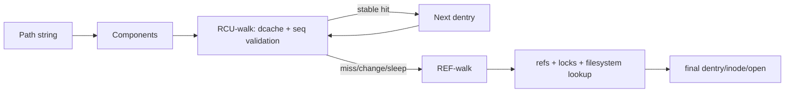
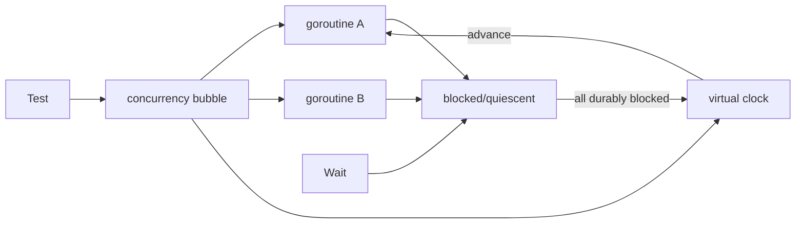

# 2026-09-22 23:00 — Interview Study Packages

README ve yakın `daily/2026-09-22/22-00.md` kontrol edildi. Ek repo-wide kontrolde WebAuthn/passkeys'in daha eski notlarla çakıştığı görüldüğü için ilk 23:00 taslağından çıkarıldı. Ayrıca 22:00 B+Tree suffix-truncation içeriğinin 12:00 ile örtüşmesi nedeniyle B+Tree bu tur tekrar edilmiyor. `pathname lookup RCU-walk REF-walk dentry namei` ve `testing/synctest fake clock deterministic concurrency` aramalarında ayrı paket bulunmadı. Bu tur filesystem internals ve testing-engineering temel boşluklarını ilerletiyor.

## Paket 1 — Junior → Staff Filesystem Internals: Pathname Lookup, Dentry Cache, RCU-walk & REF-walk
**Süre:** 20–30 dk

### Konu anlatımı
`open("/srv/app/config.json")` yalnız bir string'i inode numarasına çevirmek değildir. VFS pathname'i component'lere böler, root/cwd başlangıcını seçer, her component için dentry cache üzerinde ilerler, mount/symlink sınırlarını işler ve final component'in syscall semantiğine göre lookup/open/create kararını verir.

Linux common-case lookup'ı ucuzlatmak için önce **RCU-walk** kullanır. Cached ve stabil path üzerinde refcount/lock yazmaları yapmadan ilerlemeye çalışır. Dentry/mount sequence bilgileri değişirse, cache miss/revalidation/sleep gerektiren durum oluşursa güvenli **REF-walk** yoluna düşülür. REF-walk counted references ve gerektiğinde lock kullanabilir. Mental model: **fast optimistic read → validate → conservative fallback**.

### Mental model

### İçeride ne oluyor?
1. `struct path` mount + dentry ile yürüyüşün konumunu taşır; inode filesystem object metadata/operations tarafını temsil eder.
2. Dentry cache isim→object lookup maliyetini düşürür; negative dentry olmayan isim bilgisini de cache'leyebilir.
3. RCU-walk `rcu_read_lock()` ile temel yapıların lifetime'ını korur; sequence counters concurrent rename/mount/dentry değişikliklerini fark etmeye yardım eder.
4. RCU-walk yalnız REF-walk'ın eşzamanlı olarak verebileceği kararla uyumlu karar vermelidir; validation bozulursa retry/fallback gerekir.
5. REF-walk counted references ve gerektiğinde locks ile mutation/revalidation gibi zor durumları işler.
6. Remote/network filesystem cached dentry'yi server state'e göre revalidate etmek zorunda kalabilir.
7. Final component ayrı ele alınır; `stat`, `open`, `O_CREAT`, unlink/rename semantiği aynı değildir.

### Yüksek getirili mülakat soruları
1. Dentry ile inode farkı nedir?
2. Negative dentry neden yararlıdır?
3. RCU-walk neden refcount artırmaktan kaçınır?
4. Hangi durumda REF-walk'a düşülür?
5. Senior: concurrent rename sırasında stale path kararı nasıl engellenir?
6. Staff: metadata-heavy workload'da path lookup CPU hotspot ise ne ölçersin?

### Beklenen cevap derinliği
- **Junior:** component, dentry, inode ve cache fikrini ayırır.
- **Mid:** cache hit/miss, symlink/mount ve final-component farkını açıklar.
- **Senior:** RCU lifetime, sequence validation ve fallback invariant'ını bağlar.
- **Staff:** lookup contention, remote revalidation ve path-layout trade-off'larını production'a taşır.

### Kısa alıştırma
`/a/b/c` lookup'ında `a` ve `b` dcache hit, `c` miss olsun. Hangi noktaya kadar RCU-walk yapılabileceğini ve neden filesystem lookup/REF-walk gerekebileceğini çiz.

### Proje fikri
`pathwalk-lab`: derin/sığ directory tree oluştur; hot/cold cache altında `stat/open` throughput'u ölç. `perf`/strace ile syscall ve CPU maliyetini karşılaştır.

### Failure modes / trade-off / production
Derin path, metadata storm, rename churn ve remote revalidation lookup latency'yi yükseltebilir. Dcache hit oranını tek başına başarı metriği saymak CPU contention ve filesystem/server round-trip'lerini kaçırır. Production'da syscall latency, metadata IOPS, CPU profile, dentry/inode cache pressure ve remote filesystem latency birlikte incelenir.

### Kaynaklar
- Linux Kernel — Pathname lookup: https://docs.kernel.org/filesystems/path-lookup.html
- Linux Kernel — VFS: https://docs.kernel.org/filesystems/vfs.html

---

## Paket 2 — Mid → Principal Testing Engineering: Deterministic Concurrency Tests, Virtual Time & Quiescence
**Süre:** 20–30 dk

### Konu anlatımı
Concurrent/asynchronous testlerin klasik kokusu `time.Sleep(...)` kullanıp "background iş bitmiştir" varsaymaktır. Bu hem yavaştır hem scheduler/load değişince flaky olur. Daha sağlam model üç kontrol noktası kurar: **zaman**, **eşzamanlı ilerleme** ve **gözlemlenebilir quiescence**.

Go 1.25 ile `testing/synctest` standard library'ye girdi. Test bir "bubble" içinde çalıştırılabilir; bubble içindeki `time` fake clock kullanır ve tüm goroutine'ler uygun biçimde bloklandığında sanal zaman ileri atlayabilir. `synctest.Wait()` background activity'nin quiescent noktaya gelmesini beklemeyi sağlar. Genel ders Go'dan büyüktür: wall-clock sleep yerine controllable clock + explicit synchronization + deterministic progress tercih et.

### Mental model

### İçeride ne oluyor?
1. Real sleep correctness ile wall-clock/scheduler timing'i birbirine bağlar.
2. Virtual clock timeout, retry, debounce ve deadline testlerini gerçek süreyi beklemeden çalıştırır.
3. Quiescence, "henüz CPU almadı" ile "ilerlemek için dış olay/zaman bekliyor" durumunu ayırmayı hedefler.
4. Explicit wait/happens-before ilişkisi assertion'ın background mutation'a göre yerini deterministic yapar.
5. Determinism race detector'ın alternatifi değildir: race detector unsafe memory access'i; deterministic harness scheduling/time kaynaklı flakiness'i hedefler.
6. Go 1.25 release notes'a göre `testing/synctest`, Go 1.24'te deneysel başladıktan sonra standard library'ye genel kullanıma girdi.
7. Clock/scheduler abstraction testability sağlar ama production API complexity yaratabilir; platform primitive'i varsa gereksiz custom abstraction'dan kaçın.

### Yüksek getirili mülakat soruları
1. `sleep` tabanlı async test neden flaky olur?
2. Fake clock hangi bug sınıflarını kolaylaştırır?
3. Quiescence ile thread/goroutine'in scheduler tarafından henüz çalıştırılmaması arasındaki fark nedir?
4. Deterministic harness ile race detector neden birbirinin yerine geçmez?
5. Senior: retry/backoff testini 30 gerçek saniye beklemeden nasıl tasarlarsın?
6. Staff/Principal: testability için production API'ye abstraction ekleme sınırını nasıl belirlersin?

### Beklenen cevap derinliği
- **Mid:** sleep/polling flakiness ve fake-clock değerini açıklar.
- **Senior:** happens-before, quiescence, timeout/retry state machine ve race detection ayrımını kurar.
- **Staff:** deterministic harness, CI runtime ve abstraction-cost trade-off'unu tasarlar.
- **Principal:** flaky-test bütçesi, concurrency-test standardı ve migration stratejisi kurar.

### Kısa alıştırma
`retry()` 1s, 2s, 4s backoff ile üç deneme yapıyor. `Sleep(7s)` kullanan testi virtual clock + observable attempt counter ile yeniden tasarla; assertion'ların synchronization noktalarını belirt.

### Proje fikri
`deterministic-retry-lab`: timeout, exponential backoff, cancellation ve background worker içeren küçük Go service yaz. Önce real sleeps, sonra `testing/synctest` kullan; CI süresi ve 1.000 tekrar içindeki flaky oranını karşılaştır.

### Failure modes / trade-off / production
Fake clock kullanıp gerçek network/filesystem gibi bubble dışı blocking kaynaklarını unutmak sahte determinism yaratabilir. Aşırı mocking gerçek scheduler/I/O davranışını gizleyebilir; deterministic unit testleri race detector, stress/integration ve production telemetry ile tamamla. Flaky testleri otomatik retry ile gizlemek güveni aşındırır.

### Kaynaklar
- Go 1.25 Release Notes — `testing/synctest`: https://go.dev/doc/go1.25
- Go Blog — Testing Time: https://go.dev/blog/testing-time
- Go package docs — `testing/synctest`: https://pkg.go.dev/testing/synctest
