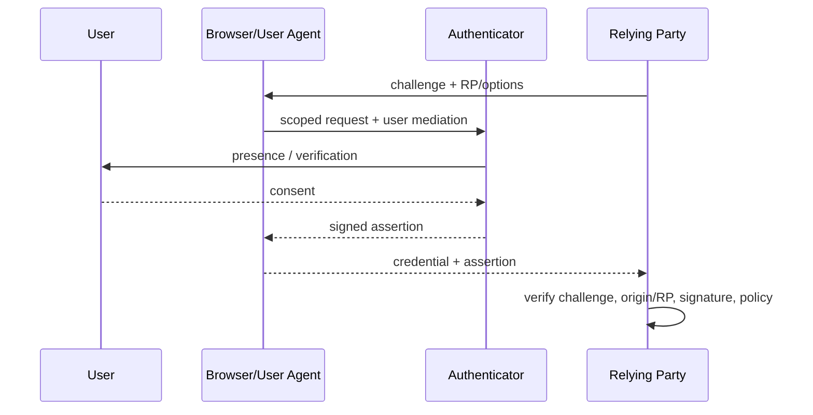
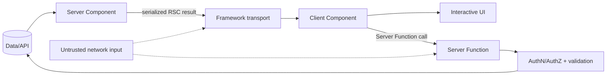

# 2026-09-22 23:00 — Interview Study Packages

README ve yakın `daily/2026-09-22/22-00.md` kontrol edildi. Buffered/direct I/O ile B+Tree density konuları tekrar edilmiyor. Repo-wide aramada aşağıdaki iki konu için doğrudan paket/canonical eşleşme bulunmadı.

## Paket 1 — Junior → Principal Cybersecurity / Backend: WebAuthn Level 3, Passkeys, RP Binding & Phishing Resistance
**Süre:** 20–30 dk

### Konu anlatımı
WebAuthn parola yerine/asıl faktör olarak public-key credential kullanır. Registration sırasında authenticator yeni bir key pair üretir; relying party (RP) public key ve credential metadata'yı saklar, private key authenticator'dan çıkmaz. Authentication'da sunucu rastgele challenge üretir; authenticator RP context'i ve user-presence/user-verification koşulları altında challenge'a bağlı veriyi imzalar. Sunucu signature, challenge, origin/RP binding ve policy'yi doğrular.

Passkey, WebAuthn credential modelinin kullanıcı dostu deployment biçimidir; discoverable credential ve gerektiğinde multi-device/sync deneyimi username/password akışını azaltabilir. Güvenlik özelliğinin çekirdeği shared secret göndermemek ve credential'ı RP'ye scope etmektir. Bu phishing resistance sağlar; fakat account recovery, device enrollment, session theft ve kötü RP-side authorization problemlerini otomatik çözmez.

25 Ağustos 2026'da WebAuthn Level 3 W3C Recommendation oldu. Mülakatta “passkey = sihirli phishing çözümü” yerine credential lifecycle ve trust boundary konuşmak daha değerlidir.

### Mental model

### İçeride ne oluyor?
1. Challenge replay'i engellemek için server-generated ve kısa ömürlü olmalıdır.
2. Credential RP scope'u phishing origin'inde aynı credential'ın kullanılmasını engelleyen temel sınırdır.
3. User presence (UP) ile user verification (UV) aynı değildir; UV PIN/biometric gibi local verification policy'sini ifade eder.
4. Discoverable credentials username olmadan credential discovery akışına izin verebilir.
5. Attestation authenticator özellikleri hakkında kanıt sağlayabilir; her consumer app'in bunu zorunlu tutması gerekmez ve privacy/deployment trade-off'u vardır.
6. Passkey sync kullanılabilirliği artırırken credential ecosystem/account recovery trust boundary'sini genişletebilir.
7. Authentication sonrası session cookie/token ele geçirilirse WebAuthn tek başına session hijacking'i durdurmaz.

### Yüksek getirili mülakat soruları
1. WebAuthn neden password hashing'den farklı bir phishing-resistance modeli sağlar?
2. Challenge neyi engeller; neden nonce gibi düşünülür?
3. UP ve UV farkı nedir?
4. Discoverable credential nedir?
5. Senior: attestation'ı hangi ürünlerde zorunlu tutarsın/tutmazsın?
6. Staff: passkey rollout sırasında password fallback güvenliği nasıl bozar?
7. Principal: recovery, device enrollment, session management ve fraud kontrollerini hangi trust boundary'lerle tasarlarsın?

### Beklenen cevap derinliği
- **Junior:** public/private key, challenge ve signature akışını açıklar.
- **Mid:** RP/origin binding, UP/UV ve discoverable credential ayrımını bilir.
- **Senior:** fallback/recovery, attestation ve session risklerini bağlar.
- **Staff/Principal:** migration, telemetry, fraud, enterprise policy ve ecosystem trust trade-off'larını tasarlar.

### Kısa alıştırma
Bir login akışı çiz: password + TOTP ile passkey akışını phishing, credential stuffing, replay, stolen session ve account recovery saldırıları açısından karşılaştır. Her saldırıda hangi kontrolün işe yaradığını işaretle.

### Proje fikri
`passkey-lab`: küçük bir RP geliştir; registration/authentication challenge'larını server-side tek kullanımlık sakla, UV policy varyantlarını ve discoverable credential login'i dene. Audit log'a credential lifecycle event'leri ekle.

### Failure modes / trade-off / production
Uzun ömürlü/reused challenge replay riskini; zayıf password recovery güçlü passkey'i bypass etmeyi; yanlış RP/origin doğrulaması phishing boundary'sini; kontrolsüz credential enrollment account takeover'ı kolaylaştırabilir. Production'da registration/auth success/failure, fallback oranı, recovery kullanımı, device/credential churn, suspicious enrollment ve session anomaly telemetry'si izlenir.

### Kaynaklar
- W3C — WebAuthn Level 3 Recommendation announcement (2026-08-25): https://www.w3.org/news/2026/web-authentication-an-api-for-accessing-public-key-credentials-level-3-is-now-a-w3c-recommendation/
- W3C — Web Authentication Level 3: https://www.w3.org/TR/webauthn-3/

---

## Paket 2 — Mid → Principal Frontend / Backend / Security: React Server Components, Server Functions & Trust Boundaries
**Süre:** 20–30 dk

### Konu anlatımı
React Server Components (RSC), component'ların client bundle dışında bir server/build environment'ında çalışmasına izin verir. Server Component doğrudan data layer'a erişebilir ve Client Component'a render edilebilir veri/JSX geçebilir; browser'a component implementation'ı gönderilmez. Client Component ise interactivity/state için browser tarafındadır ve `"use client"` boundary'si ile ayrılır.

Server Functions, Client Components'ın server'da çalışan async function'ları çağırmasını sağlar. Bu ergonomi güvenlik sınırını kaldırmaz: network üzerinden çağrılabilen her Server Function bir server endpoint'i gibi authentication, authorization, input validation, rate limiting ve abuse controls gerektirir. React ekibi 2025 sonu/2026 başında RSC payload decoding ve Server Function yollarında kritik RCE, DoS ve source-code-exposure açıkları yayımladı; production dersi framework serialization boundary'sinin saldırı yüzeyi olduğudur.

### Mental model

### İçeride ne oluyor?
1. Server Components browser bundle'ına gönderilmez; server/build-time capability kullanabilir.
2. Client Components state/effects/browser APIs için kullanılır; boundary bundle ve data-flow kararını etkiler.
3. Async Server Components render sırasında data bekleyebilir; bu client-side effect waterfall'larını azaltabilir.
4. Server Function bir RPC-benzeri trust boundary'dir; “UI içinden çağrılıyor” authorization kanıtı değildir.
5. Serialized transport'a yalnız client'a açıklanması güvenli data konmalıdır; secret/server capability boundary dışına taşmamalıdır.
6. Framework/bundler RSC implementation API'leri React 19.x minor sürümler arasında semver-stable değildir; framework implementer'ları version pinning düşünmelidir.
7. RSC security advisories dependency patching, asset inventory ve exposure mapping'in framework katmanında da gerekli olduğunu gösterir.

### Yüksek getirili mülakat soruları
1. Server Component ile SSR aynı şey midir?
2. `use client` boundary'si neyi değiştirir?
3. Server Function neden normal backend endpoint'i gibi korunmalıdır?
4. RSC data fetching hangi waterfall'ı azaltabilir, hangisini yaratabilir?
5. Senior: client/server boundary'yi bundle size, latency ve cacheability ile nasıl seçersin?
6. Staff: serialization boundary'de secret/data exposure'ı nasıl engellersin?
7. Principal: RSC framework vulnerability çıktığında fleet-level patch/exposure programını nasıl yönetirsin?

### Beklenen cevap derinliği
- **Mid:** Server/Client Component farkını ve data flow'u açıklar.
- **Senior:** caching, streaming, bundle ve auth boundary trade-off'larını bağlar.
- **Staff:** endpoint security, serialization, observability ve rollout stratejisi kurar.
- **Principal:** framework supply-chain, patch SLA, blast radius ve platform guardrail'lerini yönetir.

### Kısa alıştırma
Bir dashboard'u Server/Client Component'lara böl. Her component için “neden server/client?”, hangi veri serialize oluyor, authz nerede yapılıyor ve cache policy nedir yaz.

### Proje fikri
`rsc-boundary-lab`: React 19 uyumlu bir framework üzerinde read-heavy dashboard kur; server-side data fetch, küçük interactive islands ve bir Server Function ekle. Authorization testleri, payload-size ölçümü ve dependency vulnerability gate'i ekle.

### Failure modes / trade-off / production
Server Function'ı trusted local call sanmak authz bypass'a; fazla Client Component bundle şişmesine; fazla server round-trip latency'ye; secrets'i serialized props'a koymak disclosure'a; framework patchlerini geciktirmek yüksek etkili exploit riskine yol açabilir. Production'da RSC payload size, server render latency, cache hit, Server Function error/latency, authz denial, dependency version ve security advisory exposure izlenir.

### Kaynaklar
- React — Server Components: https://react.dev/reference/rsc/server-components
- React — Server Functions: https://react.dev/reference/rsc/server-functions
- React Security Advisory — Critical RSC vulnerability (2025-12-03, updated 2026): https://react.dev/blog/2025/12/03/critical-security-vulnerability-in-react-server-components
- React Security Advisory — DoS/source exposure (2025-12-11, updated 2026-01-26): https://react.dev/blog/2025/12/11/denial-of-service-and-source-code-exposure-in-react-server-components
