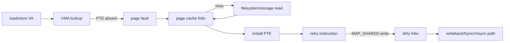
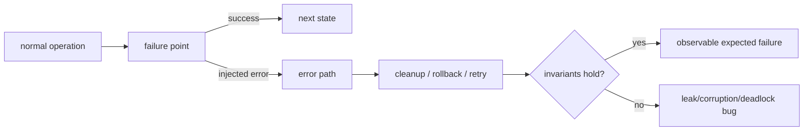

# 2026-09-23 00:00 — Interview Study Packages

README ve yakın `daily/2026-09-22/23-00.md` kontrol edildi. Repo-wide kontrolde önceki fallback adayları olan ext4/JBD2 journaling ile lexer/parser/AST'nin zaten canonical içeriklerde bulunduğu görüldüğü için tekrar edilmedi. Bu tur filesystem internals ve testing engineering temel boşluklarını ilerletiyor.

## Paket 1 — Junior → Staff Filesystem Internals: File-backed mmap, Page Faults, Dirty Folios & Writeback
**Süre:** 20–30 dk

### Konu anlatımı
`mmap()` bir dosyanın tüm byte'larını syscall anında RAM'e kopyalamaz; process virtual-address range'i ile file offset range arasında bir mapping kurar. İlk erişim çoğu zaman page fault üretir. Kernel ilgili file-backed page-cache folio'sunu bulur veya storage'dan getirir, page table entry kurar ve instruction tekrar yürür. Linux'ta normal read/write yanında file-backed `mmap` de page cache üzerinden gider.

`MAP_SHARED` mapping üzerinde write, file-backed cache'i dirty hale getirebilir ve writeback daha sonra storage'a taşır. `MAP_PRIVATE` ise copy-on-write semantiğiyle process-private değişiklik üretir; dosyayı değiştirmek için kullanılmaz. Bu yüzden mental model `mmap = disk byte'larına doğrudan pointer` değil, **VMA + page fault + page cache + page tables + writeback** zinciridir.

### Mental model

### İçeride ne oluyor?
1. VMA mapping'in address range, permissions ve file/offset ilişkisini taşır; page table yalnız gerçekten materialize edilmiş pages için translation kurabilir.
2. Page fault her zaman disk I/O demek değildir: page cache hit olup yalnız PTE eksik olabilir.
3. Major/minor fault ayrımı kabaca storage/I/O gereksinimi ile memory-resident resolution farkını anlamaya yardım eder; production'da platform sayaçlarının kesin semantiğini doğrulamak gerekir.
4. `MAP_SHARED` write file-backed state'i dirty yapabilir; dirty cache writeback ile storage'a gider. `msync`/`fsync` gibi durability sınırları workload ve API semantiğine göre ayrıca düşünülür.
5. `MAP_PRIVATE` write copy-on-write ile private anonymous page'e ayrılabilir; file'ın persistent içeriği değişmez.
6. Random access büyük mapping'lerde page-fault ve cache churn yaratabilir; sequential locality readahead için daha elverişlidir.
7. `mmap` syscall overhead'ini azaltabilir ama lifetime, truncation, SIGBUS, address-space pressure ve durability semantics gibi yeni failure mode'lar getirir.

### Yüksek getirili mülakat soruları
1. `mmap()` çağrısı neden dosyanın tamamını hemen RAM'e yüklemez?
2. Page fault neden her zaman disk read değildir?
3. `MAP_SHARED` ve `MAP_PRIVATE` write semantiği nasıl ayrılır?
4. `read()` ile file-backed `mmap()` page cache açısından nasıl ilişkilidir?
5. Senior: başka process file'ı truncate ederse mapping erişiminde ne tür failure düşünürsün?
6. Staff: büyük read-mostly index için `mmap` mı explicit buffered I/O mu seçersin; hangi metriklerle karar verirsin?

### Beklenen cevap derinliği
- **Junior:** virtual mapping, page fault ve shared/private farkını doğru tanımlar.
- **Mid:** page cache hit/miss, PTE installation, dirty/writeback ve COW'u bağlar.
- **Senior:** truncation, SIGBUS, readahead/cache churn ve durability trade-off'larını açıklar.
- **Staff:** workload locality, memory pressure, tail latency ve observability ile I/O modelini seçer.

### Kısa alıştırma
1 GiB file `MAP_SHARED` ile map edilmiş olsun. Process yalnız 4 KiB'lik 100 random region okuyor. `mmap()` anında, ilk erişimlerde ve cache warm olduktan sonra hangi maliyetlerin oluşacağını çiz.

### Proje fikri
`mmap-lab`: aynı büyük dosyada `pread` ve `mmap` ile sequential/random access benchmark et. Cold/warm cache, working-set size ve access stride değiştir; throughput, p50/p99, major/minor faults ve RSS gözle.

### Failure modes / trade-off / production
File truncation/mapping lifetime hataları, random-fault storm, memory pressure altında cache thrash ve shared dirty data'nın durability'sini yanlış varsaymak başlıca risklerdir. Production'da page faults, reclaim, page-cache pressure, storage latency, RSS ve application p99 birlikte okunur.

### Kaynaklar
- Linux Kernel — Page Cache: https://docs.kernel.org/mm/page_cache.html
- Linux Kernel — Memory Management APIs / File Mapping and Page Cache: https://docs.kernel.org/core-api/mm-api.html
- Linux Kernel — iomap Supported File Operations: https://docs.kernel.org/filesystems/iomap/operations.html
- Linux man-pages — mmap(2): https://man7.org/linux/man-pages/man2/mmap.2.html

---

## Paket 2 — Mid → Principal Testing Engineering: Fault Injection, Fail-Nth & Error-Path Coverage
**Süre:** 20–30 dk

### Konu anlatımı
Happy-path test coverage, production reliability için yeterli değildir. Gerçek sistemler allocation failure, disk I/O error, timeout, short write, connection reset ve partial initialization gibi nadir yollarla kırılır. Fault injection bu yolları beklemek yerine kontrollü olarak üretir. Ama amaç rastgele kaos yaratmak değil; **belirli failure point → beklenen invariant → cleanup/retry/rollback sonucu** zincirini test etmektir.

Linux kernel fault-injection framework `failslab`, `fail_page_alloc`, `fail_make_request`, `fail_futex`, `fail_function` gibi capability'ler sunar. Probability/interval/times ile probabilistic kampanya yapılabilir; `/proc/<pid>/fail-nth` ise bir syscall içindeki N'inci uygun failure point'i sistematik olarak fail ettirerek error-path keşfini daha deterministic hale getirir.

### Mental model

### İçeride ne oluyor?
1. Error-path test önce invariant tanımlar: lock bırakıldı mı, resource leak var mı, partial state görünür mü, retry idempotent mı?
2. Probabilistic injection geniş arama sağlar ama reproducibility zayıf olabilir; seed/config kaydetmek gerekir.
3. Fail-Nth yaklaşımı failure point'leri sırayla gezerek tek syscall/operation içinde sistematik exploration sağlar.
4. Kernel dokümantasyonundaki injectable-function kuralı önemlidir: zorla erken error return verilen fonksiyon, return öncesinde caller'ın beklediği geri döndürülemez state mutation yapmamalıdır.
5. Disk fault injection yalnız `EIO` görmek değildir; retry policy, partial completion, metadata/data consistency ve observability de doğrulanmalıdır.
6. Fault injection race detector, sanitizer, property test veya chaos engineering'in yerine geçmez; farklı bug sınıflarını hedefler.
7. Production benzeri failure rate'i testte aynen taklit etmek gerekmez; nadir path'i yoğunlaştırıp invariant'ı sınamak daha değerlidir.

### Yüksek getirili mülakat soruları
1. %90 line coverage neden güvenilir error handling kanıtı değildir?
2. Random fault injection ile fail-Nth arasındaki trade-off nedir?
3. Allocation failure sonrası hangi invariant'ları kontrol edersin?
4. Retry testinde idempotency neden kritik?
5. Senior: disk `EIO` ile timeout'u aynı retry policy'ye koymak neden tehlikeli olabilir?
6. Staff/Principal: organization-wide fault-injection standardında reproducibility, blast radius ve CI budget nasıl yönetilir?

### Beklenen cevap derinliği
- **Mid:** fault point, expected error ve cleanup invariant'ını kurar.
- **Senior:** retryability, idempotency, partial state ve deterministic reproduction'ı bağlar.
- **Staff:** CI campaign, failure taxonomy ve observability standardı tasarlar.
- **Principal:** platform primitive'i, adoption maliyeti, risk tiering ve production-chaos sınırlarını belirler.

### Kısa alıştırma
`open → allocate buffer → read → parse → write temp → fsync → rename` pipeline'ı için en az altı injection point çıkar. Her biri için beklenen external result ve cleanup invariant'ını bir tabloya yaz.

### Proje fikri
`failpoint-lab`: küçük bir storage service'e named failpoint'ler ekle. ENOSPC/EIO/timeout/allocation-failure benzetimleri üret; her failpoint için invariant assertions, deterministic seed ve CI replay komutu ekle. Sonra random campaign ile fail-Nth benzeri systematic exploration sonuçlarını karşılaştır.

### Failure modes / trade-off / production
Sadece rastgele chaos kullanmak reproducibility'yi düşürür; yalnız unit-level failpoint kullanmak gerçek kernel/network davranışını gizleyebilir. Unsafe injection state corruption yaratabilir. Test ortamını production'dan izole et; injected-failure telemetry'sini gerçek incident sinyalinden ayır; CI'da seed/config/artifact sakla.

### Kaynaklar
- Linux Kernel — Fault injection capabilities infrastructure: https://docs.kernel.org/fault-injection/fault-injection.html
- Linux Kernel — NVMe Fault Injection: https://docs.kernel.org/fault-injection/nvme-fault-injection.html
