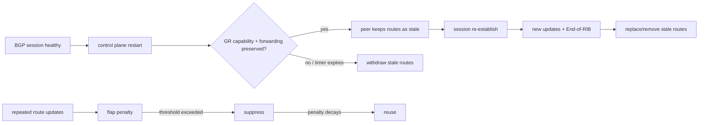
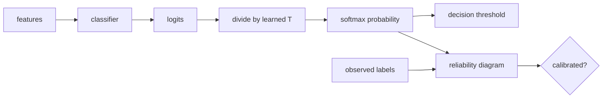

# 2026-09-23 01:00 — Interview Study Packages

README ve yakın `daily/2026-09-23/00-00.md` kontrol edildi. File-backed mmap/page-fault/writeback ve fault-injection konuları tekrar edilmedi. Repo-wide aramada BGP Graceful Restart / route-flap damping ile probability calibration / temperature scaling için doğrudan canonical eşleşme bulunmadı. Bu tur networking/SRE ile ML/MLOps eksenlerini döndürüyor.

## Paket 1 — Mid → Principal Networking / SRE: BGP Graceful Restart, Stale Routes & Route-Flap Damping
**Süre:** 20–30 dk

### Konu anlatımı
BGP control-plane restart normalde TCP session'ın düşmesine, route withdrawal/recomputation'a ve geniş çaplı churn'e yol açabilir. RFC 4724 Graceful Restart (GR), restarting speaker'ın forwarding state'i koruyabildiğini capability ile bildirmesine ve helper peer'in önceden öğrenilmiş route'ları geçici olarak **stale** işaretleyip tutmasına izin verir. Session geri gelir, yeni routing state alınır ve End-of-RIB marker ile initial update'in tamamlandığı anlaşılır.

GR'nin kritik trade-off'u açıktır: control-plane restart sırasında forwarding continuity kazanırsın; fakat gerçekten artık geçerli olmayan stale route'u tutarsan blackhole/loop süresini uzatabilirsin. Bu nedenle restart timer, forwarding-state doğruluğu, BFD/L2 sinyalleri ve failure türü birlikte düşünülür.

Route-Flap Damping (RFD) farklı bir mekanizmadır: sık update üreten prefix'e penalty biriktirir, threshold aşılınca route'u suppress eder ve penalty zamanla decay eder. Ancak path hunting ve aşırı suppression convergence/reachability'yi kötüleştirebilir; bu nedenle 'flap var → damping aç' otomatik bir reçete değildir.

### Mental model

### İçeride ne oluyor?
1. GR capability OPEN sırasında address-family bazında negotiate edilir; restart time helper'ın stale state'i sonsuza kadar tutmamasına üst sınır verir.
2. Helper, session kaybında uygun route'ları stale işaretleyebilir; restart time içinde peer dönmezse bunları silmelidir.
3. End-of-RIB marker initial update'in tamamlandığını bildirir ve stale temizliğinin ilerlemesine yardım eder.
4. Forwarding state gerçekten korunmadıysa stale route tutmak availability değil blackhole üretebilir; control-plane liveness ile data-plane viability aynı şey değildir.
5. RFD penalty/decay/suppress/reuse state machine'idir; amacı pathological update churn'ü azaltmaktır.
6. RFD parametreleri fazla agresifse meşru path exploration'ı cezalandırıp convergence'i geciktirebilir.
7. Production troubleshooting'de BGP session state, stale-route count, GR timers, FIB next-hop reachability, BFD ve update rate birlikte okunur.

### Yüksek getirili mülakat soruları
1. BGP Graceful Restart hangi problemi çözer?
2. Stale route neden hemen silinmez ve neden sonsuza kadar tutulamaz?
3. End-of-RIB marker ne işe yarar?
4. Control plane restart ile forwarding-plane failure neden ayrılmalıdır?
5. Senior: GR hangi durumda outage'ı azaltmak yerine uzatabilir?
6. Staff/Principal: GR, BFD ve maintenance automation için hangi invariant/SLO'ları tanımlarsın?
7. Route-Flap Damping neden her flapping prefix için güvenli default değildir?

### Beklenen cevap derinliği
- **Mid:** GR capability, stale route ve restart timer mental modelini kurar.
- **Senior:** forwarding-state doğruluğu, BFD ve transient blackhole trade-off'unu açıklar.
- **Staff:** multi-vendor policy, timer alignment, observability ve maintenance rollout tasarlar.
- **Principal:** convergence, blast radius ve backbone/customer reachability riskini organizasyon standardına bağlar.

### Kısa alıştırma
R1–R2 eBGP session'ında R2, R1'den 10k prefix öğreniyor. R1 control plane 20 saniye restart oluyor fakat FIB forwarding'i koruyor. Aynı senaryoyu (a) GR kapalı, (b) GR açık, (c) GR açık ama forwarding state kaybolmuş olarak çiz; blackhole/churn farkını yaz.

### Proje fikri
`bgp-restart-lab`: FRRouting/containerlab ile iki-üç router kur. BGP daemon restart, process kill ve link failure senaryolarını ayır; GR açık/kapalı durumda withdrawal/update sayısı, convergence süresi, ping loss ve stale-route davranışını ölç.

### Failure modes / trade-off / production
GR stale forwarding'i uzatabilir; yanlış timer alignment uzun blackhole yaratabilir. RFD yanlış threshold ile meşru reachability'yi suppress edebilir. Production'da session resets, route updates/s, stale prefixes, convergence time, FIB next-hop health, BFD state ve packet loss birlikte izlenmelidir.

### Kaynaklar
- RFC 4724 — Graceful Restart Mechanism for BGP: https://www.rfc-editor.org/rfc/rfc4724
- RFC 8538 — Notification Message Support for BGP Graceful Restart: https://www.rfc-editor.org/rfc/rfc8538
- RFC 2439 — BGP Route Flap Damping: https://www.rfc-editor.org/rfc/rfc2439
- RIPE Routing WG — Route-flap Damping recommendations: https://www.ripe.net/publications/docs/ripe-580/

---

## Paket 2 — Junior → Staff ML / MLOps: Probability Calibration, Reliability Diagrams & Temperature Scaling
**Süre:** 20–30 dk

### Konu anlatımı
Classification modelinin accuracy'si iyi olsa bile verdiği olasılıklar güvenilir olmayabilir. **Calibration**, model `p=0.8` dediği örneklerin uzun vadede yaklaşık %80'inin gerçekten doğru/pozitif olması fikridir. Ranking quality ile calibration aynı şey değildir: iki model aynı sıralamayı üretip farklı confidence değerleri verebilir.

Reliability diagram prediction'ları probability bin'lerine ayırır ve her bin için ortalama predicted confidence ile empirical outcome frequency'yi karşılaştırır. Brier score ve log-loss gibi proper scoring rule'lar probability kalitesini değerlendirir; ECE pratik bir özet olsa da binning seçimine duyarlıdır ve tek başına karar metriği olmamalıdır.

Temperature scaling, validation/calibration set üzerinde tek bir `T` parametresi öğrenip logits'i `z/T` ile ölçekleyen post-hoc yöntemdir. Class argmax sıralamasını değiştirmeden confidence sharpness'ını ayarlayabilir. Ancak calibration set production dağılımını temsil etmiyorsa veya drift varsa iyi calibration hızla bozulabilir.

### Mental model

### İçeride ne oluyor?
1. Calibration discrimination değildir: AUROC/ranking iyi olup probabilities overconfident olabilir.
2. Reliability diagram local miscalibration'i görünür kılar; sample count/bin mutlaka gösterilmelidir.
3. ECE binning-dependent'tir; Brier/log-loss gibi proper scoring rule'larla birlikte okunmalıdır.
4. Temperature scaling tek scalar parametreyle logits'i yeniden ölçekler; basitliği overfit riskini azaltır ama class/group-specific hataları düzeltemeyebilir.
5. Calibration data model-training data'dan ayrılmalıdır; aksi halde optimistic estimate oluşabilir.
6. Decision threshold calibration'dan ayrı business-cost problemidir: calibrated probability, FP/FN maliyetine göre threshold seçimini anlamlı hale getirir.
7. Drift, class-prior shift ve segment değişimi global calibration metriğini yanıltabilir; kritik cohort'lar ayrı izlenmelidir.

### Yüksek getirili mülakat soruları
1. Accuracy yüksekken model neden kötü calibrated olabilir?
2. Reliability diagram nasıl okunur?
3. ECE'nin temel zayıflığı nedir?
4. Temperature scaling argmax accuracy'yi neden genellikle değiştirmez?
5. Senior: calibration set'i nasıl ayırırsın ve leakage'i nasıl önlersin?
6. Staff: fraud/medical/recommendation sisteminde global ve cohort calibration monitoring'i nasıl tasarlarsın?
7. Calibration ile threshold optimization neden aynı şey değildir?

### Beklenen cevap derinliği
- **Junior:** confidence ile empirical correctness ilişkisinin calibration olduğunu açıklar.
- **Mid:** reliability diagram, Brier/log-loss ve temperature scaling'i bağlar.
- **Senior:** leakage, drift, class imbalance ve threshold economics'i tartışır.
- **Staff:** cohort monitoring, retraining/recalibration trigger'ları ve downstream decision riskini tasarlar.

### Kısa alıştırma
1000 prediction'ın 200 tanesi 0.9–1.0 confidence bin'inde ve yalnız 150'si doğru. Bu bin için observed accuracy'yi hesapla; over/under-confidence yorumunu yap. Sonra bu sapmanın threshold-based automation'a etkisini yaz.

### Proje fikri
`calibration-lab`: bir classifier eğit; held-out set üzerinde reliability diagram, log-loss, Brier ve ECE hesapla. Temperature scaling uygula; accuracy/AUROC ile calibration metriklerinin hangilerinin değiştiğini karşılaştır. Sonra synthetic prior shift ekleyip drift etkisini göster.

### Failure modes / trade-off / production
Training set üzerinde calibration fit etmek leakage'dir. Yalnız ECE raporlamak binning artefact'larını gizleyebilir. Global calibration azınlık cohort'taki ciddi hatayı maskeleyebilir. Production'da log-loss/Brier, reliability curve, cohort calibration gap, confidence distribution, class prior, abstention rate ve business-cost metriği birlikte izlenmelidir.

### Kaynaklar
- Guo et al., ICML 2017 — On Calibration of Modern Neural Networks: https://proceedings.mlr.press/v70/guo17a.html
- scikit-learn — Probability calibration: https://scikit-learn.org/stable/modules/calibration.html
- scikit-learn — CalibratedClassifierCV: https://scikit-learn.org/stable/modules/generated/sklearn.calibration.CalibratedClassifierCV.html
