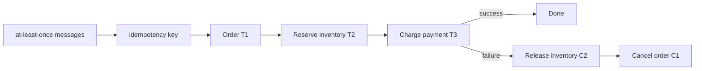
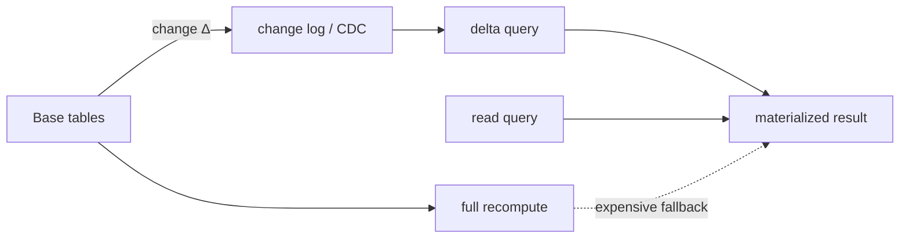

# 2026-09-23 02:00 — Interview Study Packages

README ve yakın `daily/2026-09-23/01-00.md` kontrol edildi. BGP Graceful Restart / route-flap damping ve probability calibration / temperature scaling tekrar edilmedi. Repo-wide aramada Saga compensation semantics ile incremental view maintenance için doğrudan canonical eşleşme bulunmadı. Bu tur distributed systems/backend ile data engineering/databases eksenlerini döndürüyor.

## Paket 1 — Mid → CTO Distributed Systems / Backend: Sagas, Compensation Semantics & Isolation Gaps
**Süre:** 20–30 dk

### Konu anlatımı
Saga, uzun veya servisler arası bir iş akışını tek global ACID transaction yerine bir dizi kısa transaction'a böler. Garcia-Molina ve Salem'in 1987 çalışmasındaki temel fikir, `T1..Tn` adımlarının commit olması; sonraki bir adım başarısız olduğunda daha önce tamamlanan işin `C_i` compensating transaction'larla semantik olarak düzeltilmesidir. Compensation bir database rollback değildir: dış dünyaya görünmüş bir rezervasyonu iptal etmek, yapılmış bir tahsilatı iade etmek gibi yeni bir business operation'dır.

Modern microservice kullanımında iki yaygın coordination stili vardır. Choreography'de servisler event'lere tepki vererek akışı ilerletir; coupling görünürde düşüktür fakat workflow state ve failure reasoning sistem geneline dağılabilir. Orchestration'da durable coordinator hangi adımın/compensation'ın sırada olduğunu bilir; observability ve policy merkezi hale gelir ama coordinator kritik bir control-plane bileşenidir.

En önemli mülakat noktası şudur: saga atomicity illusion'ı vermez. Local commits arasındaki intermediate state başka transaction'larca görülebilir. Bu nedenle isolation anomaly, duplicate delivery, compensation failure, irreversible side effect ve concurrent saga conflict'leri tasarımın parçasıdır.

### Mental model

### İçeride ne oluyor?
1. Her forward step kendi local transaction'ında commit olur; global rollback log'u yoktur.
2. Compensation exact inverse olmak zorunda değildir; business-equivalent corrective action'dır.
3. At-least-once delivery nedeniyle forward ve compensation handler'ları idempotent tasarlanmalıdır.
4. Transactional outbox/CDC, local DB commit ile event publication arasındaki dual-write boşluğunu azaltır.
5. Isolation kaybı semantic lock/status (`PENDING`), version check, commutative update veya reread gibi tekniklerle yönetilebilir.
6. Irreversible side effect'ler mümkün olduğunca pivot point sonrasına bırakılır; email göndermek veya fiziksel shipment gibi etkiler klasik rollback değildir.
7. Durable orchestration'da workflow history/replay, retry policy ve compensation state production correctness'in parçasıdır.

### Yüksek getirili mülakat soruları
1. Saga ile 2PC arasındaki temel consistency/availability trade-off nedir?
2. Compensation neden `ROLLBACK` değildir?
3. Choreography ne zaman orchestration'dan daha kötü hale gelir?
4. Outbox hangi failure window'unu kapatır, hangilerini kapatmaz?
5. Senior: payment başarılı, inventory compensation başarısızsa ne yaparsın?
6. Staff: iki concurrent saga aynı inventory/order üzerinde çalışırken hangi invariant'ları korursun?
7. Principal/CTO: hangi business flow'larda saga'yı reddedip stronger transaction boundary veya farklı bounded context seçersin?

### Beklenen cevap derinliği
- **Mid:** local transaction + compensation modelini ve eventual consistency'yi açıklar.
- **Senior:** idempotency, outbox, retries ve isolation anomaly'lerini tasarıma bağlar.
- **Staff:** durable orchestration, concurrency control, observability ve manual-repair yolunu tasarlar.
- **Principal/CTO:** bounded-context sınırları, financial/legal irreversibility, operational ownership ve blast radius üzerinden pattern seçer.

### Kısa alıştırma
Order → reserve stock → charge card akışında charge başarılı olduktan sonra process crash ediyor ve aynı command tekrar geliyor. Idempotency key, persisted workflow state ve compensation kullanarak duplicate charge oluşmayacağını gösteren state machine çiz.

### Proje fikri
`saga-lab`: üç servis veya üç logical module ile order/inventory/payment workflow kur. Outbox tablosu ve at-least-once worker ekle. Her adımdan sonra crash inject et; duplicate command, timeout ve compensation failure senaryolarında invariant'ları property test ile doğrula.

### Failure modes / trade-off / production
Compensation'ın kendisi başarısız olabilir; retry sonsuz side effect üretebilir; choreography event cycle veya görünmeyen dependency yaratabilir; orchestration coordinator overload olabilir. Production'da stuck saga age, step/compensation retry count, idempotency conflicts, outbox lag, manual-repair queue, business invariant violations ve end-to-end completion latency izlenmelidir.

### Kaynaklar
- Garcia-Molina & Salem — Sagas, SIGMOD 1987: https://doi.org/10.1145/38713.38742
- Princeton technical report — SAGAS: https://www.cs.princeton.edu/techreports/598
- Temporal documentation — durable execution: https://docs.temporal.io/

---

## Paket 2 — Junior → Principal Data Engineering / Databases: Incremental View Maintenance, Delta Queries & Freshness
**Süre:** 20–30 dk

### Konu anlatımı
Materialized view pahalı bir query sonucunu fiziksel olarak saklayarak read latency'yi düşürür. Bedeli freshness ve maintenance'tır. Full refresh backing query'yi yeniden çalıştırıp sonucu baştan üretir. Incremental View Maintenance (IVM) ise base table'daki değişikliğin view sonucuna etkisini — delta'yı — hesaplayıp yalnız gerekli insert/delete/update'ları uygular.

Basit örnek: `V = A JOIN B`. `A`'ya `ΔA` eklendiğinde bütün `A JOIN B`yi yeniden hesaplamak yerine yeni katkı yaklaşık `ΔA JOIN B` üzerinden bulunabilir. Aggregate'larda `SUM` ve `COUNT` gibi decomposable state incremental tutulabilir; `AVG` pratikte `sum/count` state'iyle güncellenebilir. DELETE, DISTINCT, MIN/MAX, outer join ve yüksek fan-out join'ler maintenance'i daha zor hale getirir.

Immediate maintenance freshness'i transaction'a yaklaştırır fakat write latency/contension ekler. Deferred/CDC-driven maintenance write path'i ayırır ve throughput'u artırabilir; karşılığında view lag ve replay correctness yönetilir. Bu nedenle doğru soru 'materialized view hızlı mı?' değil, 'hangi freshness SLO'su için full recompute, incremental sync veya async delta propagation seçmeliyim?'dir.

### Mental model

### İçeride ne oluyor?
1. Full refresh compute ve I/O'yu tüm dataset boyutuna bağlar; incremental maintenance change volume'a yaklaşmayı hedefler.
2. Delta algebra insert ve delete değişimlerini view sonucuna propagate eder; joins diğer relation state'ine lookup gerektirir.
3. Aggregate maintenance için yardımcı state gerekebilir; `AVG` için sum+count tipik örnektir.
4. Immediate IVM base write transaction'ına ek iş koyar; deferred IVM log/CDC, ordering, checkpoint ve replay gerektirir.
5. Duplicate/replayed CDC event'leri idempotent delta application veya exactly-once state transition gerektirir.
6. Schema/query değişikliği incremental planı geçersiz kılabilir; backfill/rebuild stratejisi gerekir.
7. Periodic full reconciliation incremental bug veya missed event'e karşı correctness safety net olabilir.

### Yüksek getirili mülakat soruları
1. Normal view ile materialized view farkı nedir?
2. Full refresh ile IVM hangi workload'larda ayrışır?
3. `SUM`, `COUNT`, `AVG` neden incremental maintenance'e uygundur?
4. CDC-driven maintenance'de duplicate event'i nasıl güvenli uygularsın?
5. Senior: join fan-out'un delta cost'una etkisini nasıl tahmin edersin?
6. Staff: freshness SLO, write amplification ve replay/backfill tasarımını nasıl dengelersin?
7. Principal: serving DB, stream processor ve warehouse materialization arasında ownership'i nasıl bölersin?

### Beklenen cevap derinliği
- **Junior:** view/materialized view ve stale-data kavramını ayırır.
- **Mid:** full refresh ile delta maintenance cost modelini açıklar.
- **Senior:** joins, aggregates, CDC ordering/idempotency ve rebuild'i tartışır.
- **Staff/Principal:** freshness SLO, lineage, schema evolution, capacity ve reconciliation politikasını platform seviyesinde tasarlar.

### Kısa alıştırma
`daily_sales(day, total, count)` materialization'ı için `orders` tablosuna INSERT/DELETE geldiğinde delta update formüllerini yaz. `avg = total/count` üret. Aynı CDC event'i iki kez gelirse sonucu neden bozacağını ve nasıl dedupe edeceğini açıkla.

### Proje fikri
`ivm-lab`: PostgreSQL'de orders tablosu ve daily aggregate kur. Önce periodic `REFRESH MATERIALIZED VIEW`, sonra trigger veya CDC-benzeri change table ile incremental aggregate uygula. 1M satır + %0.1 change workload'unda refresh latency, write overhead, freshness lag ve correctness'i karşılaştır.

### Failure modes / trade-off / production
Delta pipeline event kaçırırsa view sessizce yanlış olabilir; replay duplicate üretirse aggregate drift eder; hot key contention write path'i boğabilir; high-fanout join küçük input delta'yı büyük output delta'ya çevirebilir. Production'da source-to-view lag, delta batch size, apply latency, duplicate/drop counters, reconciliation mismatch, rebuild duration ve storage/write amplification izlenmelidir.

### Kaynaklar
- PostgreSQL 18 — REFRESH MATERIALIZED VIEW: https://www.postgresql.org/docs/18/sql-refreshmaterializedview.html
- PostgreSQL Wiki — Incremental View Maintenance: https://wiki.postgresql.org/wiki/Incremental_View_Maintenance
