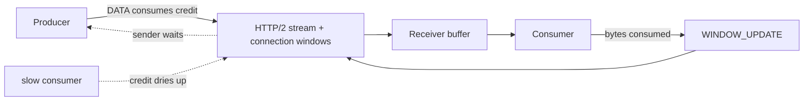
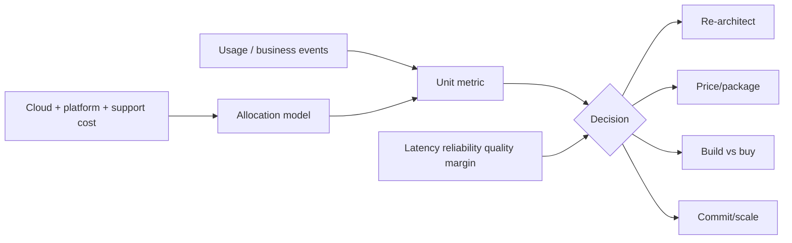

# 2026-09-23 03:00 — Interview Study Packages

README ve yakın `daily/2026-09-23/02-00.md` kontrol edildi. Saga/compensation ve incremental view maintenance tekrar edilmedi. Repo-wide aramada HTTP/2 flow control + gRPC backpressure ile FinOps unit economics için doğrudan canonical eşleşme bulunmadı. Bu tur networking/backend ile leadership/product/business eksenlerini döndürüyor.

## Paket 1 — Junior → Staff Networking / Backend: HTTP/2 Flow Control, gRPC Backpressure & Buffer Bloat
**Süre:** 20–30 dk

### Konu anlatımı
Backpressure, hızlı producer'ın yavaş consumer'ı sınırsız buffer ile boğmasını önleyen feedback mekanizmasıdır. HTTP/2 bunu credit-based flow control ile uygular: receiver hem connection hem stream düzeyinde kaç byte daha kabul edebileceğini window ile bildirir; sender DATA gönderdikçe credit azalır, receiver veriyi tüketince `WINDOW_UPDATE` ile credit geri verir. RFC 9113'e göre bu mekanizma hop-by-hop'tur ve yalnız DATA frame'leri flow-control hesabına girer.

gRPC streaming RPC'lerde alttaki transport flow control'ünden yararlanır. Uygulamanın `write()` çağrısının dönmesi verinin ağdan çıktığı anlamına gelmez; framework buffer'ına kabul edilmiş olabilir. Receiver okumayı yavaşlatırsa transport credit tükenir ve sender sonunda bekler. Bu, application queue limitleri ve admission control ile birlikte düşünülmelidir: transport backpressure tek başına CPU-bound handler veya downstream database overload'unu çözmez.

Window çok küçükse bandwidth-delay product doldurulamaz ve throughput düşer; çok büyükse slow consumer başına fazla memory tutulabilir ve queueing latency büyür. Hedef 'en büyük buffer' değil, bounded memory + yeterli pipe utilization + kontrollü tail latency'dir.

### Mental model

### İçeride ne oluyor?
1. HTTP/2 sender aynı anda hem stream-level hem connection-level window'a uymalıdır.
2. Default initial window 65,535 byte'tır; stream initial window SETTINGS ile değişebilir, connection window `WINDOW_UPDATE` ile büyür.
3. Receiver DATA tüketip buffer boşalttıkça credit iade eder; küçük ve çok sık updates control overhead yaratabilir.
4. Connection window ortak olduğu için kötü tuning bağımsız stream'leri dolaylı etkileyebilir.
5. gRPC flow control streaming RPC'lerde önemlidir; unary RPC için aynı application-facing anlamda kullanılmaz.
6. Manual flow control yanlış kullanılırsa iki tarafın da write edip read etmemesi deadlock benzeri ilerleme kaybı yaratabilir.
7. Transport backpressure ile application-level bounded queue, concurrency limit ve deadline birbirinin yerine geçmez.

### Yüksek getirili mülakat soruları
1. Backpressure ile rate limiting arasındaki fark nedir?
2. HTTP/2 neden hem stream hem connection flow-control window tutar?
3. `WINDOW_UPDATE` end-to-end mu, hop-by-hop mu?
4. gRPC `write()` döndüğünde veri kesin karşı tarafa ulaşmış mıdır?
5. Senior: 100 ms RTT ve yüksek bandwidth linkinde küçük window neden throughput'u düşürür?
6. Senior: büyük window neden slow consumer memory blow-up ve tail latency yaratabilir?
7. Staff: proxy → gRPC service → DB zincirinde backpressure'ı hangi katmanlarda ve hangi sinyallerle tasarlarsın?

### Beklenen cevap derinliği
- **Junior:** producer/consumer hız uyumsuzluğunu ve bounded buffering ihtiyacını açıklar.
- **Mid:** stream/connection credit, `WINDOW_UPDATE` ve gRPC streaming davranışını anlatır.
- **Senior:** BDP, memory budget, queueing, deadlines ve slow-consumer failure mode'larını ölçer.
- **Staff:** proxy/application/downstream katmanlarında flow control, admission control ve load shedding'i tek overload-control tasarımında birleştirir.

### Kısa alıştırma
Connection window 1 MiB, Stream A window 256 KiB, Stream B window 512 KiB olsun. A 200 KiB, B 400 KiB DATA gönderdikten sonra kalan connection ve stream credit'lerini hesapla. Consumer A 128 KiB tüketip yalnız stream-level `WINDOW_UPDATE` gönderirse neden connection credit'in ayrıca geri verilmesi gerektiğini açıkla.

### Proje fikri
`grpc-backpressure-lab`: bidirectional streaming servis kur. Fast producer ve ayarlanabilir slow consumer ekle. Bounded/unbounded application queue, farklı message size ve consumer delay kombinasyonlarında RSS, p50/p99 latency, throughput ve blocked-write süresini ölç. Proxy eklersen hop-by-hop davranışı ayrıca gözlemle.

### Failure modes / trade-off / production
Unbounded application queue transport backpressure'ını geciktirip OOM'a götürebilir. Aşırı küçük windows throughput'u sınırlar; aşırı büyük windows memory ve queueing latency'yi artırır. Read yapmadan karşılıklı synchronous write progress'i durdurabilir. Production'da active streams, send/receive queue bytes, blocked-write time, message age, per-stream throughput, connection memory, deadline exceeded/cancel oranı ve downstream saturation birlikte izlenmelidir.

### Kaynaklar
- RFC 9113 — HTTP/2, §5.2 ve §6.9: https://www.rfc-editor.org/rfc/rfc9113.html
- gRPC — Flow Control: https://grpc.io/docs/guides/flow-control/

---

## Paket 2 — Senior → CTO Leadership / Product / Business: Cloud Unit Economics, Cost-to-Serve & Architecture Decisions
**Süre:** 20–30 dk

### Konu anlatımı
Toplam cloud faturası tek başına iyi bir engineering KPI değildir: trafik veya gelir iki katına çıkarken fatura %50 artıyorsa mutlak maliyet yükselmiş olsa da ekonomi iyileşmiş olabilir. Unit economics, teknoloji maliyetini anlamlı bir business veya technical unit'e böler: `cost / transaction`, `cost / active tenant`, `cost / GB served`, `cost / successful inference`, `cost / case resolved` gibi.

FinOps Foundation unit metrics'i resource-efficiency ve business-unit metrics olarak ayırır. İlk grup mühendisliğin doğrudan kontrol ettiği CPU/GB/token gibi birimleri; ikinci grup müşteri/iş sonucuna yakın transaction, tenant veya cost-to-serve ölçülerini temsil eder. CTO seviyesinde amaç yalnız cost cutting değildir: unit cost'u latency, reliability, conversion, retention ve gross margin ile birlikte optimize etmektir.

Pay/paylaşılmış platform maliyetleri attribution problemidir. Shared Kubernetes cluster, observability, egress ve platform-team maliyetini yanlış dağıtmak takımları yanlış davranışa iter. Bu yüzden allocation anahtarı, fully-loaded/TCO kapsamı ve metric ownership açık olmalıdır. Birim metriği Goodhart tuzağına düşürmemek için numerator/denominator tanımı version'lanmalı ve kalite guardrail'leriyle birlikte kullanılmalıdır.

### Mental model

### İçeride ne oluyor?
1. Basit unit cost = attributable cost / meaningful unit count; tanımın zaman penceresi ve scope'u sabit olmalıdır.
2. Fixed/shared cost ile variable/marginal cost ayrılmalıdır; kısa vadeli architecture kararı çoğu kez marginal cost'tan etkilenir.
3. Egress, observability, managed-service minimums ve idle headroom görünmezse unit cost eksik çıkar.
4. Tenant mix değişimi ortalamayı yanıltabilir; cohort veya percentile cost-to-serve gerekebilir.
5. Reservation/commit discount unit price'ı düşürür fakat demand uncertainty ve lock-in riski ekler.
6. GenAI'da `cost/token` yararlı teknik metric'tir ama business sonucu için `cost/successful task` veya `cost/case deflected` daha güçlü olabilir.
7. Unit cost düşerken SLO veya ürün kalitesi bozuluyorsa optimizasyon ekonomik olarak yanlış olabilir.

### Yüksek getirili mülakat soruları
1. Cloud faturası %30 arttı; bu tek başına kötü haber midir?
2. Cost per request ile cost per successful business transaction neden farklı kararlar üretebilir?
3. Shared platform maliyetini ürün takımlarına nasıl dağıtırsın?
4. Reservation/commit satın almak hangi riskleri taşır?
5. Staff: multi-tenant SaaS'ta 'pahalı müşteri'yi nasıl ölçersin ve noisy-neighbor ile nasıl ilişkilendirirsin?
6. Principal: managed DB'den self-hosted DB'ye geçiş için TCO modeline hangi kalemleri eklersin?
7. CTO: unit cost, gross margin, reliability ve roadmap velocity çatıştığında karar çerçeven nedir?

### Beklenen cevap derinliği
- **Senior:** attribution, fixed/variable cost ve workload driver'larını doğru kurar.
- **Staff:** unit metric'i architecture ve capacity kararına bağlar; quality guardrail ekler.
- **Principal:** TCO, commitment risk, shared-platform allocation ve portfolio trade-off'larını yönetir.
- **CTO:** unit economics'i pricing, gross margin, product strategy, vendor leverage ve yatırım temposuyla birleştirir.

### Kısa alıştırma
Aylık maliyet: compute $60k, DB $25k, egress $10k, observability $5k. 20M başarılı işlem var. Basit cost/success hesapla. Sonra yeni cache tasarımı compute'u $15k azaltırken egress'i $8k artırıyor ve p99'u %20 iyileştiriyor. Net unit-cost etkisini hesapla; hangi ek business metric olmadan kararı tamamlayamayacağını yaz.

### Proje fikri
`unit-economics-dashboard`: billing export ile request/business-event telemetry'sini birleştir. Service ve tenant bazında cost/request, cost/success ve gross-margin proxy üret. Shared cost allocation yöntemini değiştirilebilir yap; metric tanımlarını ADR ile version'la ve latency/error-rate guardrail'leri ekle.

### Failure modes / trade-off / production
Yanlış denominator ekipleri metric gaming'e iter; averages pahalı tenant cohort'unu gizler; amortized commitment maliyeti ile on-demand marginal cost karıştırılabilir; eksik egress/observability/support allocation build-vs-buy kararını çarpıtır. Production/operating review'da unit cost trendi, attribution coverage, idle/headroom, commitment utilization, cost anomaly, p99 latency, error budget ve business outcome birlikte okunmalıdır.

### Kaynaklar
- FinOps Foundation — Unit Economics capability: https://www.finops.org/framework/capabilities/unit-economics/
- FinOps Foundation — Terminology / TCO & Unit Economics: https://framework.finops.org/assets/terminology/
