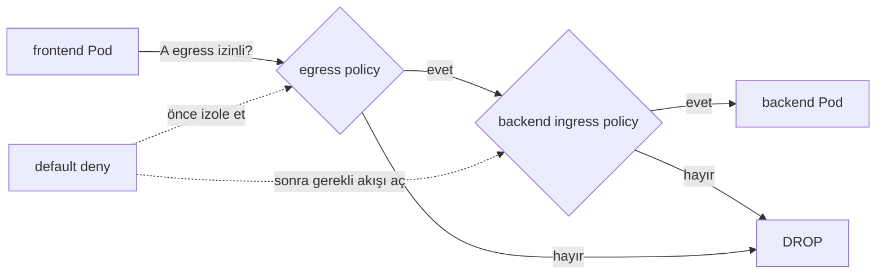
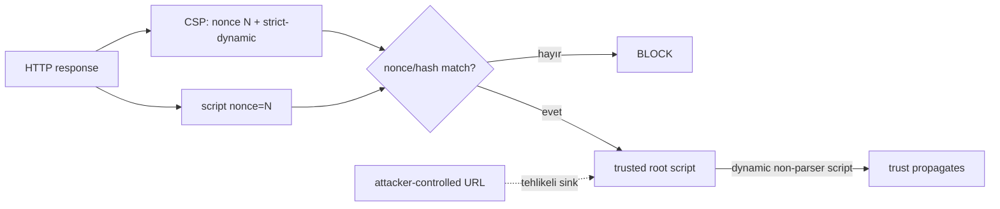

# 2026-09-23 04:00 — Interview Study Packages

README ve yakın `daily/2026-09-23/03-00.md` kontrol edildi. HTTP/2/gRPC backpressure ve cloud unit economics tekrar edilmedi. Repo-wide aramada Kubernetes NetworkPolicy microsegmentation ve CSP nonce/strict-dynamic için doğrudan canonical eşleşme bulunmadı. Bu tur cybersecurity + cloud/networking ile frontend/security eksenlerini döndürüyor.

## Paket 1 — Junior → Staff Cybersecurity / Cloud / Networking: Kubernetes NetworkPolicy, Default-Deny & Microsegmentation
**Süre:** 20–30 dk

### Konu anlatımı
Kubernetes'te bir Pod'un başka bir Pod'a ağ üzerinden erişebilmesi, uygulamanın gerçekten bu erişime ihtiyacı olduğu anlamına gelmez. NetworkPolicy, L3/L4 seviyesinde Pod trafiğini label/namespace/IP/port üzerinden sınırlandırarak blast radius'u küçültür. Kritik mental model şudur: policy yokken Pod varsayılan olarak non-isolated'dır; bir direction için Pod'u seçen policy oluştuğunda o direction allow-list davranışına geçer.

Ingress ve egress birbirinden bağımsızdır. Bir A→B bağlantısının kurulabilmesi için A'nın egress'i ve B'nin ingress'i izin vermelidir. Birden fazla policy birbirini override etmez; izinler additive union olarak birleşir. Bu yüzden firewall rule ordering sezgisi burada yanıltıcıdır.

Zero-trust yaklaşımında default-deny başlangıç noktasıdır, fakat tek başına yeterli değildir. Kimlik, authorization ve application-layer kontrolleri yine gerekir. NetworkPolicy ayrıca kullanılan CNI tarafından gerçekten enforce edilmelidir.

### Mental model

### İçeride ne oluyor?
1. `podSelector` policy'nin uygulandığı Pod'ları seçer; boş selector namespace içindeki tüm Pod'ları seçer.
2. `policyTypes` ingress, egress veya ikisini belirtir.
3. Pod bir direction için isolate edildikten sonra yalnız applicable policy'lerin izin verdiği trafik geçer.
4. Applicable policy'lerin allow kuralları additive'dir; deny rule precedence modeli yoktur.
5. Source egress ve destination ingress'in ikisi de bağlantıya izin vermelidir.
6. Default-deny egress DNS'i de kesebilir; DNS için açık izin gerekebilir.
7. NetworkPolicy esas olarak L4 bağlantıları içindir; HTTP path/user gibi L7 authorization sağlamaz.

### Yüksek getirili mülakat soruları
1. NetworkPolicy yoksa Pod trafiğinin varsayılan davranışı nedir?
2. A→B bağlantısında neden hem A egress hem B ingress önemlidir?
3. İki policy aynı Pod'u seçerse hangisi kazanır?
4. Default-deny egress sonrası DNS neden bozulabilir?
5. Senior: namespace selector ile pod selector'ı birlikte kullanırken hangi label-governance risklerini görürsün?
6. Staff: service mesh authorization ile NetworkPolicy'yi nasıl katmanlarsın?
7. Staff: multi-tenant cluster'da policy rollout'unu connectivity outage yaratmadan nasıl yaparsın?

### Beklenen cevap derinliği
- **Junior:** ingress/egress ve allow-list mantığını açıklar.
- **Mid:** selectors, additive semantics ve default-deny rollout'unu bilir.
- **Senior:** DNS, CNI enforcement, observability ve policy testlerini tasarlar.
- **Staff:** network identity, workload identity, L7 authz ve tenant blast-radius modelini birlikte kurar.

### Kısa alıştırma
`frontend`, `api`, `db` Pod'ları için önce namespace-wide default-deny tasarla. Sonra yalnız `frontend→api:8080`, `api→db:5432` ve gerekli DNS egress'ine izin ver. `frontend→db` neden hâlâ başarısız olmalı, iki yönlü policy mantığıyla açıkla.

### Proje fikri
`k8s-microseg-lab`: kind/k3d cluster'da üç servis kur. Default allow baseline'ını ölç, sonra default-deny + minimum allow policies uygula. Connectivity matrix testi, DNS testi ve yanlış label senaryosu ekle; CI'da beklenmeyen edge açılırsa testi fail ettir.

### Failure modes / trade-off / production
Yanlış selector tüm namespace'i açabilir veya kapatabilir. Default-deny egress DNS/telemetry/control-plane bağımlılıklarını kesebilir. CNI NetworkPolicy'yi desteklemiyorsa YAML var olsa bile enforcement beklediğin gibi olmayabilir. Çok ince policy seti operasyonel karmaşıklık yaratır. Production'da denied-flow telemetry, policy coverage, namespace/Pod label drift, DNS failures, connection errors ve deployment sonrası connectivity regression birlikte izlenmelidir.

### Kaynaklar
- Kubernetes — Network Policies: https://kubernetes.io/docs/concepts/services-networking/network-policies/
- Kubernetes API — NetworkPolicy v1: https://kubernetes.io/docs/reference/kubernetes-api/networking-resources/network-policy-v1/
- NIST SP 800-207 — Zero Trust Architecture: https://csrc.nist.gov/pubs/sp/800/207/final

---

## Paket 2 — Mid → Principal Frontend / Cybersecurity: Content Security Policy, Nonces & `strict-dynamic`
**Süre:** 20–30 dk

### Konu anlatımı
Content Security Policy (CSP), tarayıcıya hangi kaynakların yüklenip hangi script'lerin çalıştırılabileceğini söyleyen defense-in-depth mekanizmasıdır. XSS'in kök nedenini düzeltmenin yerine geçmez; başarılı injection'ın executable JavaScript'e dönüşmesini zorlaştırır.

Host allowlist tabanlı CSP'ler büyüdükçe kırılganlaşabilir. Strict CSP yaklaşımı script trust'ını origin listesi yerine nonce veya hash'e bağlar. Nonce sunucu tarafından her response için tahmin edilemez şekilde üretilir ve hem `Content-Security-Policy` header'ında hem izin verilen script elementlerinde bulunur. Hash yaklaşımı statik script içerikleri için uygundur.

`strict-dynamic`, nonce/hash ile güvenilen root script'in programatik olarak yüklediği non-parser-inserted script'lere trust aktarır. Bu deployment'ı kolaylaştırır ama trusted loader attacker-controlled URL'den script yaratıyorsa trust zinciri saldırgana taşınabilir. Dolayısıyla CSP bir taint/sink audit'inin alternatifi değildir.

### Mental model

### İçeride ne oluyor?
1. CSP response header ile browser enforcement policy'si kurar.
2. Nonce her response için yeni ve tahmin edilemez olmalıdır; sabit nonce güven sınırını bozar.
3. Hash-based CSP script içeriğine bağlıdır; içerik değişirse hash güncellenir.
4. `strict-dynamic` nonce/hash ile trusted root'tan dinamik yüklenen script'lere trust aktarır.
5. `strict-dynamic` etkin olduğunda script yüklemede host/scheme allowlist ve `self` gibi kaynak ifadeleri modern CSP3 davranışında göz ardı edilebilir.
6. Parser-inserted ve programmatically inserted script ayrımı trust propagation için önemlidir.
7. `Content-Security-Policy-Report-Only` rollout öncesi violation gözlemlemek için kullanılabilir; enforcement değildir.

### Yüksek getirili mülakat soruları
1. CSP XSS'i tamamen çözer mi?
2. Nonce ile hash ne zaman tercih edilir?
3. Nonce neden her HTTP response'ta değişmelidir?
4. `strict-dynamic` hangi problemi çözer ve hangi yeni trust riskini yaratır?
5. Senior: CDN/cache kullanan SSR uygulamasında per-response nonce hangi caching trade-off'unu doğurur?
6. Staff: CSP'yi report-only'den enforcement'a nasıl geçirirsin?
7. Principal: microfrontend ve third-party tag ekosisteminde CSP ownership/governance modelini nasıl kurarsın?

### Beklenen cevap derinliği
- **Mid:** directive, nonce/hash ve defense-in-depth rolünü anlatır.
- **Senior:** SSR/cache, report-only rollout, third-party script ve XSS sink ilişkisini açıklar.
- **Staff:** framework entegrasyonu, violation telemetry ve supply-chain trust sınırlarını tasarlar.
- **Principal:** organization-wide policy baseline, exception governance ve ürün kırılma riskini güvenlik hedefleriyle dengeler.

### Kısa alıştırma
SSR sayfasında bir first-party bundle ve analytics loader var. `unsafe-inline` kullanmadan nonce-based CSP tasarla. Analytics loader dinamik child script yüklediğinde `strict-dynamic` eklemenin etkisini ve loader URL'si user input'tan üretilebiliyorsa neden hâlâ risk bulunduğunu açıkla.

### Proje fikri
`strict-csp-lab`: küçük SSR uygulamasında önce permissive policy, sonra report-only nonce CSP, son olarak enforcing strict CSP kur. Inline handler, `eval`, third-party loader ve attacker-controlled dynamic script URL senaryolarını test et; violation report'larını dashboard'a gönder.

### Failure modes / trade-off / production
Sabit/reused nonce CSP'yi zayıflatır. `unsafe-inline` geniş saldırı yüzeyi bırakır. `strict-dynamic` trusted loader'ın attacker-controlled script URL oluşturduğu sink'i güvenli yapmaz. Çok agresif enforcement production UI'ı kırabilir; çok gevşek allowlist ise anlamlı koruma sağlamaz. Production'da CSP violation oranı, blocked directive/source, browser cohort, release correlation ve gerçek XSS/sink bulguları birlikte izlenmelidir.

### Kaynaklar
- W3C — Content Security Policy Level 3: https://www.w3.org/TR/CSP/
- MDN — Content Security Policy guide: https://developer.mozilla.org/en-US/docs/Web/HTTP/Guides/CSP
- MDN — CSP practical implementation guide: https://developer.mozilla.org/en-US/docs/Web/Security/Practical_implementation_guides/CSP
