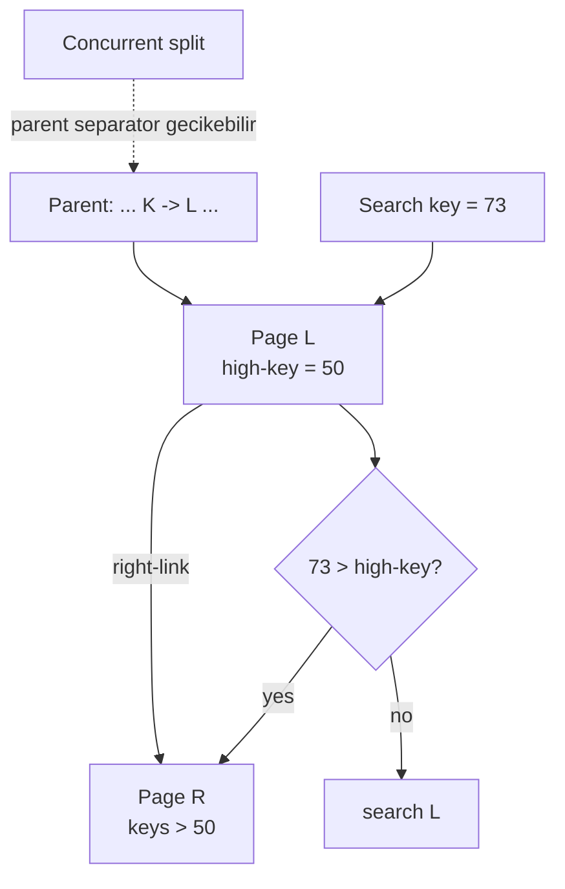
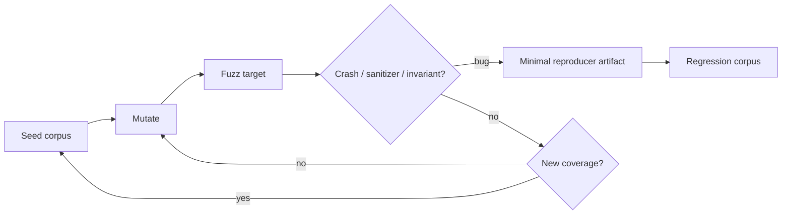

# 2026-09-23 05:00 — Interview Study Packages

README ve yakın `daily/2026-09-23/04-00.md` kontrol edildi. Kubernetes NetworkPolicy ve CSP nonce/strict-dynamic tekrar edilmedi. Repo-wide aramada Linux CFS/EEVDF'nin zaten işlendiği görüldü; bu nedenle bu tur temel boşluklardan B+Tree concurrency ve testing engineering'e odaklanıyor.

## Paket 1 — Mid → Principal Databases: Concurrent B+Tree, High Keys, Right Links & Safe Splits
**Süre:** 20–30 dk

### Konu anlatımı
Tek-thread B+Tree anlatımı `search → leaf → insert → gerekirse split → parent'a separator ekle` diye görünür. Production database'te asıl zorluk, bir reader aşağı inerken başka bir thread'in aynı page'i split edebilmesidir. Lehman–Yao yaklaşımının güçlü fikri her page'e **right sibling link** ve key-range'in üst sınırını belirten **high key** eklemektir. Reader yanlış/eski child'a inse bile aradığı key high key'i aşıyorsa sağa yürüyerek doğru page'i bulabilir.

Bu yapı split'i tek dev atomik tree mutation olmak zorundan çıkarır. Önce sibling/page state güvenli hale getirilebilir; parent separator daha sonra görünür olabilir. PostgreSQL'in nbtree implementasyonu bu aileden gelir, fakat shared buffer pages nedeniyle page'i okurken tuple'ların değişmemesi için page-level read locking kullanır.

### Mental model

### İçeride ne oluyor?
1. Page high key, o page'in geçerli key-space üst sınırını temsil eder.
2. Split yeni right sibling üretir ve right-link zincirini korur.
3. Reader stale parent downlink üzerinden eski page'e inse bile high-key kontrolüyle split'i fark eder.
4. Aranan key high key'i aşıyorsa reader right-link'i bir veya daha fazla kez takip eder.
5. Parent separator installation split'in ayrı bir aşaması olabilir; side-link invariant geçici parent staleness'ını tolere eder.
6. PostgreSQL shared buffers nedeniyle page içeriğini okurken page-level read lock kullanır; saf Lehman–Yao varsayımlarından biri burada değişir.
7. Lock acquisition order önemlidir: yanlış coupling deadlock üretebilir. PostgreSQL dokümantasyonu bazı right/up hareketlerin güvenli, left/down coupling'in ise deadlock riski taşıdığını açıklar.

### Yüksek getirili mülakat soruları
1. Concurrent split sırasında reader neden key kaçırabilir?
2. High key ve right-link birlikte hangi invariant'ı sağlar?
3. Parent separator henüz yazılmamışken search nasıl doğru sonucu bulabilir?
4. B+Tree page latch ile transaction lock arasındaki fark nedir?
5. Senior: root split sırasında stale root pointer okuyan reader neden yine doğru key'e ulaşabilir?
6. Staff: latch coupling'i azaltmak throughput'u nasıl artırır, hangi correctness proof yükünü getirir?
7. Principal: page split, WAL, buffer manager ve crash recovery invariant'larını nasıl birlikte tasarlarsın?

### Beklenen cevap derinliği
- **Mid:** leaf/internal page, split, sibling link ve latch kavramlarını ayırır.
- **Senior:** high-key/right-link ile concurrent split correctness'ını açıklar; latch ve logical lock ayrımını bilir.
- **Staff:** lock ordering, optimistic traversal, root split ve scan semantics trade-off'larını tartışır.
- **Principal:** concurrency protocol'ünü WAL/recovery, buffer manager ve observability ile birlikte sistem invariant'ı olarak ele alır.

### Kısa alıştırma
Parent `K<=50 -> L`, `K>50 -> R` separator'ını henüz görmüyor olsun. L split edilmiş ve yeni sibling S `high-key=75` ile araya girmiş olsun. Search key=73 ve key=90 için stale parent'tan başlayan traversal'ı high-key/right-link adımlarıyla çiz.

### Proje fikri
`concurrent-btree-lab`: fixed-size in-memory pages, high-key ve right-link içeren küçük B+Tree yaz. Bir thread random insert/split yaparken diğerleri lookup çalıştırsın. Reference `std::map`/ordered map ile sonuçları karşılaştır. Split'in parent update'ini kasıtlı geciktiren deterministic test hook'u ekle.

### Failure modes / trade-off / production
Side-link yanlış publish edilirse reader key kaçırabilir; high-key yanlışsa yanlış page'de durabilir. Lock order ihlali deadlock yaratır. Çok coarse latch contention üretir, aşırı optimistic protocol ise correctness ve reclamation karmaşıklığını artırır. Production'da split rate, latch wait, page density, tree height, buffer hit, deadlock/retry ve index-operation p99 birlikte izlenmelidir.

### Kaynaklar
- PostgreSQL source — `src/backend/access/nbtree/README`: https://github.com/postgres/postgres/blob/master/src/backend/access/nbtree/README
- PostgreSQL — B-Tree Indexes: https://www.postgresql.org/docs/current/btree.html
- Lehman & Yao, Efficient Locking for Concurrent Operations on B-Trees (ACM DOI): https://doi.org/10.1145/319628.319663

---

## Paket 2 — Junior → Staff Testing Engineering: Coverage-Guided Fuzzing, Corpus Design & Sanitizer Oracles
**Süre:** 20–30 dk

### Konu anlatımı
Example-based test seçtiğin birkaç input'u doğrular. Fuzzing input space'i otomatik keşfetmeye çalışır. **Coverage-guided fuzzing** ise mutasyonları kör rastgele bırakmaz: yeni control-flow/code-coverage bölgelerine ulaşan input'ları corpus'ta tutup onların varyasyonlarını üretir. Böylece parser, codec, protocol handler ve binary format gibi geniş malformed-input yüzeylerinde yüksek getirili olur.

Fuzzer'ın asıl gücü yalnız generator değildir; iyi bir **oracle** gerekir. Crash/assert bir oracle'dır, fakat memory corruption için ASan, undefined behavior için UBSan gibi sanitizers çok daha erken ve lokal sinyal verir. Differential oracle iki implementation'ın aynı input'ta aynı sonucu üretmesini; invariant oracle ise `decode(encode(x)) == x` gibi özellikleri kontrol eder.

### Mental model

### İçeride ne oluyor?
1. Target mümkün olduğunca deterministic, hızlı ve dar kapsamlı olmalıdır.
2. Seed corpus valid + invalid küçük örneklerle structured input grammar'ına başlangıç verir.
3. Instrumentation hangi code edge/feature'ların görüldüğünü feedback olarak fuzzer'a taşır.
4. Yeni coverage üreten input corpus'a eklenir; gereksiz büyük corpus minimize edilebilir.
5. ASan/UBSan/MSan gibi sanitizers crash'ten önce memory/UB bug'larını oracle'a dönüştürür.
6. Crash artifact küçültülerek minimal reproducer yapılır ve regression corpus'a eklenir.
7. Fuzz coverage yüksek olması correctness kanıtı değildir; unreachable semantic states ve zayıf oracle hâlâ bug saklayabilir.

### Yüksek getirili mülakat soruları
1. Random testing ile coverage-guided fuzzing farkı nedir?
2. Seed corpus neden önemlidir?
3. Fuzz target neden deterministic ve hızlı olmalıdır?
4. Coverage yüksekse yazılım doğru mudur?
5. Senior: sanitizer neden fuzzing'in bug-finding gücünü artırır?
6. Staff: parser fuzzing'de grammar-aware mutation ne zaman byte-level mutation'dan daha iyi olur?
7. Staff: CI'da sürekli fuzzing ile normal PR test bütçesini nasıl ayırırsın?

### Beklenen cevap derinliği
- **Junior:** malformed input, crash oracle ve corpus fikrini açıklar.
- **Mid:** coverage feedback, seed/minimization ve deterministic target gereksinimini bilir.
- **Senior:** sanitizers, differential/invariant oracle ve structured input stratejisini bağlar.
- **Staff:** continuous fuzzing, corpus lifecycle, flake control, resource budget ve security triage modelini tasarlar.

### Kısa alıştırma
Bir URL parser için 8 seed seç: boş input, minimal valid URL, Unicode host, percent-encoding, çok uzun path, invalid UTF-8 byte sequence, duplicate delimiters ve embedded NUL. Her seed'in hangi parser state'ini açmayı hedeflediğini yaz. Sonra iki invariant belirle.

### Proje fikri
`parser-fuzz-lab`: küçük JSON/URL parser veya decoder için libFuzzer target yaz. ASan+UBSan ile build et; başlangıç corpus'u oluştur, 10 dakikalık fuzz run yap, corpus minimize et. Bulunan her crash'i minimal reproducer + normal regression test'e dönüştür. İkinci aşamada reference implementation ile differential oracle ekle.

### Failure modes / trade-off / production
Nondeterministic target corpus'u şişirir. Çok yavaş target exploration hızını öldürür. Sadece coverage metric'i optimize etmek semantic bug'ları kaçırır. Global state resetlenmezse bir input diğerini kirletir. Fuzz crash'leri triage edilmeden birikirse sinyal değeri düşer. Production bağlantısında özellikle network/parser boundary'leri, file upload/codec, serialization ve security-sensitive native code için continuous fuzzing güçlü bir pre-production savunmasıdır.

### Güncel teknoloji notu
LLVM'nin güncel libFuzzer dokümantasyonu libFuzzer'ın hâlâ desteklendiğini, ancak özgün yazarların aktif yeni özellik geliştirmeyi bırakıp Centipede üzerinde çalıştığını belirtiyor. Bu yüzden mülakatta motor adından çok feedback-guided fuzzing prensiplerini anlatmak daha kalıcıdır.

### Kaynaklar
- LLVM — libFuzzer: https://llvm.org/docs/LibFuzzer.html
- LLVM — SanitizerCoverage: https://clang.llvm.org/docs/SanitizerCoverage.html
- LLVM — AddressSanitizer: https://clang.llvm.org/docs/AddressSanitizer.html
- Google — OSS-Fuzz: https://google.github.io/oss-fuzz/
