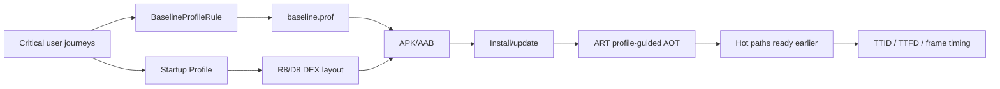

# 2026-09-23 06:00 — Interview Study Packages

README ve yakın `daily/2026-09-23/05-00.md` kontrol edildi. Concurrent B+Tree ve coverage-guided fuzzing tekrar edilmedi. Repo-wide aramada Arrow Flight SQL'in zaten canonical olduğu görüldü; aday listesinden çıkarıldı. Bu tur mobile/runtime performance ile leadership/product strategy eksenlerine dönüyor.

## Paket 1 — Junior → Staff Frontend/Mobile: Android Baseline Profiles, ART AOT/JIT & Startup Performance
**Süre:** 20–30 dk

### Konu anlatımı
Android uygulamasında “kod doğru ama ilk açılış yavaş” problemi yalnız UI ağacından gelmez; runtime'ın kodu hangi biçimde çalıştırdığı da önemlidir. ART, interpretation/JIT ile çalışma zamanı esnekliği ve AOT compilation ile önden optimizasyon arasında denge kurar. **Baseline Profile**, uygulamanın kritik user journey'lerinde kullanılan class/method yollarını paketle birlikte taşıyarak ART'a install-time'da hangi yolları AOT compile etmesinin değerli olduğunu söyler. Böylece yeni kurulum veya update sonrasında Cloud Profile birikmesini beklemeden kritik yollar optimize edilebilir.

**Startup Profile** aynı şey değildir: R8/D8 build-time'da startup için kritik kodu DEX içinde daha elverişli yerleştirmek için bu bilgiyi kullanır; amaç code layout/page-fault davranışını iyileştirmektir. Baseline Profile ise ART'ın on-device compilation kararını yönlendirir. Production yaklaşımı ikisini birlikte ölçmektir.

### Mental model


**Invariant:** Profile bir performans ipucudur; yanlış user journey seçimi veya kötü benchmark uygulama mimarisindeki gerçek startup işini ortadan kaldırmaz.

### İçeride ne oluyor?
1. Baseline Profile generator gerçekçi critical user journey'leri çalıştırarak profile rules üretir.
2. Rules APK/AAB içinde binary profile olarak paketlenir; Play/install pipeline üzerinden cihaza ulaşır.
3. ART profildeki method/code path'leri AOT compile ederek ilk kullanımda interpretation/JIT maliyetini azaltabilir.
4. Cloud Profiles gerçek kullanıcı davranışından zamanla oluşur; Baseline Profile release'in ilk kullanıcıları için bu bekleme boşluğunu kapatır.
5. Startup Profile compile-time DEX layout'u etkiler; Baseline Profile on-device compilation'ı yönlendirir.
6. Macrobenchmark `CompilationMode.None` ile profilesız fresh-install benzeri durum ve `CompilationMode.Partial` ile Baseline Profile durumunu karşılaştırabilir.
7. TTID ilk frame'i, TTFD ise uygulamanın gerçekten kullanılabilir hale gelmesini temsil eder; yalnız TTID optimize etmek deferred work'ü kullanıcı etkileşimine itebilir.

### Yüksek getirili mülakat soruları
1. JIT ve AOT arasındaki temel trade-off nedir?
2. Baseline Profile neden özellikle first-run/update sonrası deneyimi iyileştirir?
3. Baseline Profile ile Startup Profile arasındaki fark nedir?
4. Neden debug build üzerinde startup benchmark'ı güvenilir değildir?
5. Senior: Profile coverage'ı büyütmek neden sınırsızca iyi değildir?
6. Senior: TTID iyileşirken TTFD kötüleşiyorsa ne olmuş olabilir?
7. Staff: multi-module büyük bir uygulamada profile generation, CI regression gate ve production telemetry'yi nasıl tasarlarsın?

### Beklenen cevap derinliği
- **Junior:** interpretation/JIT/AOT ayrımını ve startup latency'nin kullanıcı deneyimine etkisini açıklar.
- **Mid:** Baseline vs Startup Profile ayrımını, critical user journey ve Macrobenchmark rolünü bilir.
- **Senior:** TTID/TTFD/frame timing, release-like benchmark, profile staleness ve DEX layout trade-off'larını tartışır.
- **Staff:** profile generation'ı release pipeline, representative device matrix, regression budget ve production telemetry ile sistemleştirir.

### Kısa alıştırma
Bir e-commerce app için profile'a girecek üç journey seç: cold launch→home, search→result ve product→cart. Her biri için hangi metric'i izleyeceğini yaz. Sonra `CompilationMode.None` ile Baseline Profile enabled ölçüm arasında beklediğin farkı ve confounder'ları listele.

### Proje fikri
`android-startup-lab`: küçük Compose uygulamasında Baseline Profile generator + Macrobenchmark modülü kur. Cold-start TTID/TTFD ve scroll frame timing'i profilesız/profilli karşılaştır. Startup Profile'ı ayrıca etkinleştirip DEX-layout etkisini ayrı deney olarak raporla.

### Failure modes / trade-off / production
Yanlış journey'ler profile'ı şişirip gerçek hot path'i kaçırabilir. Benchmark debug build, emulator noise veya warm filesystem/cache nedeniyle sahte iyileşme gösterebilir. Release sonrası navigation değişirse profile stale kalabilir. Startup işi yalnız ertelenirse TTID iyileşirken TTFD veya ilk interaction jank kötüleşebilir. Production'da cold/warm startup dağılımları, TTID, TTFD, slow frames/jank, ANR, release/version ve low-end-device cohort'ları birlikte izlenmelidir.

### Kaynaklar
- Android Developers — Baseline Profiles overview: https://developer.android.com/topic/performance/baselineprofiles/overview
- Android Developers — Create Baseline Profiles: https://developer.android.com/topic/performance/baselineprofiles/create-baselineprofile
- Android Developers — Macrobenchmark: https://developer.android.com/topic/performance/benchmarking/macrobenchmark-overview
- Android Developers — Manually create and measure Baseline Profiles: https://developer.android.com/topic/performance/baselineprofiles/manually-create-measure

---

## Paket 2 — Senior → CTO Leadership/Product/Business: Wardley Mapping, Evolution & Build-vs-Buy Strategy
**Süre:** 20–30 dk

### Konu anlatımı
Architecture kararı yalnız “hangi teknoloji daha iyi?” sorusu değildir. Aynı bileşen kullanıcı için ne kadar görünür/değerli ve piyasada ne kadar olgun/commodity olduğuna göre farklı yönetim yaklaşımı ister. **Wardley Map** iki eksen kullanır: dikey eksen kullanıcı ihtiyacına görünürlük/value-chain bağımlılığı, yatay eksen ise bileşenin genesis → custom-built → product/rental → commodity/utility evrimidir.

Bu bir tahmin makinesi değil, stratejik konuşma aracıdır. Harita “şirketin farklılaştırıcı algoritmasını outsource edelim mi?”, “commodity queue sistemini neden sıfırdan yazıyoruz?”, “vendor lock-in gerçekten hangi dependency'de risk?” gibi soruları dependency graph üzerinde görünür kılar. Build-vs-buy kararı yalnız lisans maliyeti değil; opportunity cost, switching cost, operational burden, strategic differentiation ve market evolution ile değerlendirilir.

### Mental model
```text
Visibility / user need
^
|  Customer need
|       |
|  Differentiating workflow ---- proprietary decision engine
|       |                         |
|       +------ managed DB ------+---- object storage
|                    |
|                 compute
+--------------------------------------------------------> evolution
   Genesis       Custom-built       Product       Commodity/Utility
```

**Invariant:** Her şeyi custom yapmak stratejik kontrol değildir; her şeyi SaaS almak da hız değildir. Kontrol edilmesi gereken yer, şirketin farklılaştırıcı capability'si ile dependency riskinin kesişimidir.

### İçeride ne oluyor?
1. Önce kullanıcı/consumer ihtiyacı belirlenir; teknoloji listesinden başlanmaz.
2. İhtiyacı sağlayan capabilities dependency/value chain olarak aşağı doğru açılır.
3. Her capability mevcut evolution aşamasına yaklaşık yerleştirilir.
4. Commodity'ye yaklaşan parçalar standardization, automation ve utility consumption'a adaydır.
5. Genesis/custom-built parçalar yüksek belirsizlik taşır; discovery ve learning ağırlıklı yönetilir.
6. Build-vs-buy için TCO'ya ek olarak time-to-market, reversibility, switching cost, data gravity, compliance ve talent scarcity değerlendirilir.
7. Harita statik değildir: market evrildikçe önce farklılaştırıcı olan capability commodity olabilir; platform stratejisi buna göre değişmelidir.

### Yüksek getirili mülakat soruları
1. Build-vs-buy kararında lisans fiyatı dışında hangi maliyetleri hesaba katarsın?
2. Commodity bir capability'yi custom build etmek ne zaman mantıklı olabilir?
3. Vendor lock-in her zaman kötü müdür? Hangi lock-in kabul edilebilir?
4. Senior: Bir auth sistemi için build/buy kararını nasıl çerçevelersin?
5. Staff: Platform ekibinin hangi capability'leri standartlaştırması gerektiğini nasıl seçersin?
6. Principal: Şirketin differentiator'ı zamanla commodity olursa architecture strategy nasıl değişir?
7. CTO: 18 aylık ürün roadmap'i, gross margin ve engineering headcount aynı haritada nasıl etkiler?

### Beklenen cevap derinliği
- **Senior:** TCO, opportunity cost, operational ownership ve reversibility'yi konuşur.
- **Staff:** capability dependency'leri ve cross-team platform etkisini görünür kılar.
- **Principal:** evolution, ecosystem ve switching-cost dinamiklerini architecture portfolio'ya bağlar.
- **CTO:** teknik seçimleri differentiation, time-to-market, margin, compliance, capital allocation ve organizational capability ile birlikte yönetir.

### Kısa alıştırma
Bir B2B analytics SaaS için şu capability'leri haritala: identity, billing, columnar storage, dashboard renderer, proprietary anomaly detector, email delivery. Her biri için build/buy/partner varsayımı yaz ve kararın değişmesine yol açacak tek bir market sinyali belirle.

### Proje fikri
`strategy-map-casebook`: hayali bir SaaS şirketinin 12 capability'sini dependency graph + evolution ekseninde haritala. Üç ADR üret: auth buy, anomaly engine build, observability managed-service. Her ADR'de 3 yıllık TCO, switching planı ve kill criterion ekle.

### Failure modes / trade-off / production
Haritayı objektif gerçek sanmak sahte kesinlik yaratır; evolution konumu hipotezdir. Vendor'ın bugünkü fiyatını tek karar değişkeni yapmak migration/data-egress ve organizational switching cost'u gizler. “Core değil, outsource” kuralı security/compliance veya latency gibi constraints'i kaçırabilir. Production bağlantısında kararlar reliability SLO, unit cost, vendor incidents, contract renewal, engineer toil, change lead time ve exit-test sonuçlarıyla periyodik yeniden değerlendirilmelidir.

### Kaynaklar
- Simon Wardley — Wardley Maps (Creative Commons kitap deposu): https://github.com/HiredThought/wardley-maps-ebook
- Simon Wardley — On Being Lost (mapping fundamentals): https://medium.com/wardleymaps/on-being-lost-2ef5f05eb1ec
- FinOps Foundation — FinOps Framework: https://www.finops.org/framework/
