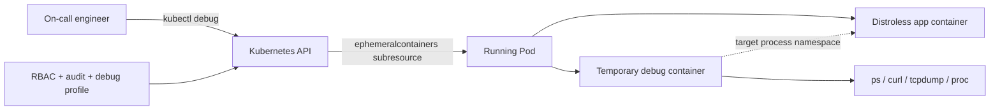
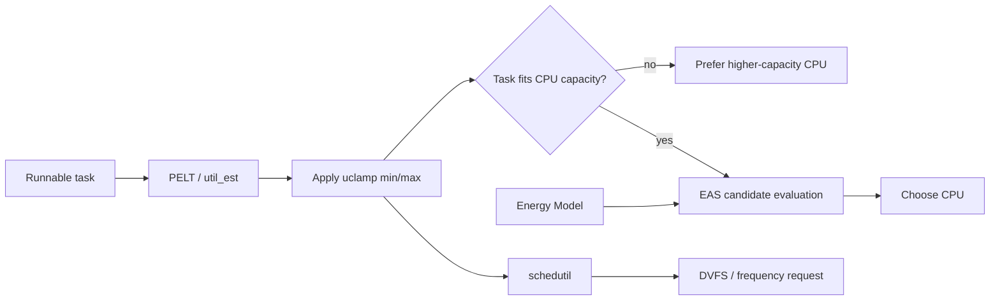

# 2026-09-23 07:00 — Interview Study Packages

README ve yakın `daily/2026-09-23/06-00.md` kontrol edildi. Android Baseline Profiles ve Wardley Mapping tekrar edilmedi. Repo-wide kontrolde Kafka Tiered Storage'ın daha önce `daily/2026-09-16/12-00.md` ve canonical chapter olarak işlendiği görüldüğü için ilk taslaktaki Kafka paketi çıkarıldı. CFS/EEVDF, cgroup CPU throttling/PSI ve SCHED_DEADLINE/priority inversion da daha önce işlendiğinden Linux scheduling boşluğu **capacity-aware scheduling + uclamp + EAS** yönünde ilerletildi.

## Paket 1 — Junior → Staff Cloud/DevOps/SRE + Cybersecurity: Kubernetes Ephemeral Containers, Distroless Debugging & Privilege Boundaries
**Süre:** 20–30 dk

### Konu anlatımı
Production container image'ını küçük tutmak attack surface, image pull süresi ve dependency riskini azaltır; fakat distroless/minimal image içinde shell, `ps`, `curl`, `tcpdump` gibi araçlar olmayabilir. Kubernetes **ephemeral container**, çalışan Pod'u yeniden build/restart etmeden geçici bir debug container ekleyerek bu gözlemlenebilirlik boşluğunu kapatır. Feature Kubernetes v1.25'ten beri stable'dır.

Ephemeral container normal sidecar değildir: uygulama yaşam döngüsünün parçası olmak için tasarlanmamıştır, otomatik restart garantisi yoktur; port, readiness/liveness probe ve `resources` gibi alanları kullanamaz. API'de Pod spec'e sıradan container eklemek yerine özel `ephemeralcontainers` subresource'u üzerinden eklenir. `kubectl debug` bunun kullanıcı dostu yoludur.

Asıl production sorusu “debug shell nasıl açarım?” değil, **debug yetkisini nasıl sınırlarım?** sorusudur. `--target` ile hedef container'ın process namespace'ine erişim runtime desteğine bağlıdır. Güçlü debug profilleri geniş Linux capabilities verebilir; bu nedenle RBAC, audit log, image allowlist/signing, kısa süreli erişim ve incident prosedürü birlikte düşünülmelidir.

### Mental model

**Invariant:** Debug tooling'i production image'a kalıcı gömmek zorunda değilsin; fakat debug container'a verilen privilege production trust boundary'sinin parçasıdır.

### İçeride ne oluyor?
1. `kubectl debug` API üzerinden mevcut Pod'a ephemeral container tanımı ekler.
2. Ephemeral container Pod'un network/storage bağlamının bir kısmını paylaşabilir; process görünürlüğü namespace paylaşımı ve runtime'ın `--target` desteğine bağlıdır.
3. Eklenen ephemeral container sonradan normal container gibi silinip değiştirilemez; Pod yaşam döngüsüyle birlikte gider.
4. Port/probe/resource tanımları desteklenmediğinden workload/sidecar yerine kullanılması yanlıştır.
5. Distroless image uygulama attack surface'ini küçültür; debug araçları ayrı ve kontrollü image'da tutulabilir.
6. Debug profilleri farklı securityContext ihtiyaçlarını ifade eder; custom profile desteği de vardır.
7. Node debugging daha güçlü bir sınırdır: host namespace/filesystem görünürlüğü incident müdahalesinde faydalı, güvenlik açısından daha risklidir.

### Yüksek getirili mülakat soruları
1. Distroless image neden faydalıdır ve debugging'i neden zorlaştırır?
2. Ephemeral container ile sidecar arasındaki yaşam döngüsü farkı nedir?
3. `kubectl exec` çalışmıyorsa `kubectl debug` ne kazandırır?
4. `--target` neyi amaçlar; neden her runtime'da aynı sonucu vermeyebilir?
5. Senior: Production'da güçlü debug profile erişimini nasıl sınırlandırırsın?
6. Staff: Debug image supply-chain güvenliği, RBAC ve audit politikasını nasıl tasarlarsın?
7. Staff: Pod debug ile node debug arasında hangi blast-radius kriterleriyle seçim yaparsın?

### Beklenen cevap derinliği
- **Junior:** minimal/distroless image, exec ve ephemeral debug container farkını açıklar.
- **Mid:** namespace görünürlüğü, lifecycle kısıtları ve `kubectl debug` akışını bilir.
- **Senior:** Linux capabilities, RBAC, audit ve least-privilege debug profile tasarımını tartışır.
- **Staff:** incident access'i JIT authorization, signed debug images, policy enforcement ve forensic evidence ile sistemleştirir.

### Kısa alıştırma
Shell içermeyen bir API Pod'unda DNS timeout var. Önce `logs`, sonra ephemeral container ile `nslookup/curl`, gerekirse network capability gerektiren packet capture sırasını tasarla. Her adımda gereken minimum privilege'ı yaz.

### Proje fikri
`k8s-debug-lab`: distroless HTTP app deploy et; `kubectl exec` başarısızlığını gözle. Ephemeral debug container ile process/network teşhisi yap. Restricted ve daha yetkili profillerin erişebildiği kaynakları karşılaştırıp bir incident runbook üret.

### Failure modes / trade-off / production
Aşırı yetkili debug container container isolation'ı anlamsızlaştırabilir. Rastgele registry'den debug image çekmek supply-chain riskidir. Packet capture müşteri verisi/secret taşıyabilir. Ephemeral container resource reservation alamadığı için zaten baskı altındaki Pod/node'u daha da zorlayabilir. Production'da debug subresource audit event'leri, privileged profile kullanımı, image digest, session süresi, node pressure ve incident ticket korelasyonu izlenmelidir.

### Kaynaklar
- Kubernetes — Ephemeral Containers: https://kubernetes.io/docs/concepts/workloads/pods/ephemeral-containers/
- Kubernetes — Debug Running Pods: https://kubernetes.io/docs/tasks/debug/debug-application/debug-running-pod/
- Kubernetes — kubectl debug reference: https://kubernetes.io/docs/reference/kubectl/generated/kubectl_debug/

---

## Paket 2 — Mid → Staff Foundations/Linux: CPU Capacity, uclamp, PELT & Energy-Aware Scheduling
**Süre:** 20–30 dk

### Konu anlatımı
Modern Linux scheduler yalnız “hangi runnable task sıradaki?” sorusunu çözmez. Özellikle heterojen CPU'larda **hangi task hangi CPU'ya yerleşmeli ve hangi performans noktasında çalışmalı?** sorusu da önemlidir.

Scheduler task/CPU utilization'ını PELT ile zamana yayılmış bir sinyal olarak takip eder. Capacity-aware scheduling, task talebi ile CPU'nun normalize edilmiş kapasitesini karşılaştırır. `uclamp` userspace'in scheduler'a **minimum/maximum performance hint'i** vermesini sağlar: `UCLAMP_MIN` latency-sensitive işi boost etmeye, `UCLAMP_MAX` işi daha düşük performans/enerji bandında tutmaya yardım edebilir. Bu değerler CPU zamanı rezervasyonu değildir; scheduling ve `schedutil` DVFS kararlarını etkileyen constraint/hint'tir.

Energy-Aware Scheduling (EAS), heterojen CPU topolojilerinde Energy Model kullanarak task-placement adaylarının tahmini enerji etkisini karşılaştırır. Amaç salt en düşük güç değil, gerekli performansı koruyarak işi daha az enerjiyle tamamlamaktır.

### Mental model

**Invariant:** `uclamp` bir CPU quota değildir. `cpu.max` “ne kadar CPU zamanı tüketebilirsin?” sınırına yaklaşırken, uclamp “scheduler bu task'ın performans ihtiyacını hangi aralıkta değerlendirsin?” sinyalidir.

### İçeride ne oluyor?
1. PELT geçmiş CPU kullanımını decay ile utilization sinyaline dönüştürür; yakın geçmiş daha yüksek ağırlık taşır.
2. `UTIL_EST`, sleep/wakeup yapan periyodik işlerde PELT'in yavaş ramp-up etkisini azaltmak için beklenen utilization'a daha hızlı tepki verebilir.
3. Capacity-aware scheduling kabaca `task_util < cpu_capacity` fitness fikrini kullanır; heterojen sistemde tüm CPU'lar eşdeğer değildir.
4. `UCLAMP_MIN` effective utilization tabanını yükseltebilir; kısa ama latency-sensitive task'ın daha yüksek performans noktasına daha hızlı çıkmasına yardım eder.
5. `UCLAMP_MAX` effective utilization tavanını düşürerek background work'ün yüksek-capacity/power-hungry CPU'lara taşınmasını sınırlamaya yardımcı olabilir.
6. `schedutil`, scheduler utilization sinyalinden DVFS frequency request üretir; uclamp bu sinyali etkiler.
7. EAS, Energy Model'deki performance-domain maliyetlerini kullanarak wakeup placement için enerji/performance tahmini yapar; esas kazanç asimetrik CPU topolojilerindedir.
8. cpuset/root-domain sınırları, thermal pressure ve frequency invariance gibi platform ayrıntıları “en iyi CPU” kararını değiştirebilir.

### Yüksek getirili mülakat soruları
1. CPU utilization ile CPU capacity arasındaki fark nedir?
2. PELT neden anlık CPU kullanımını doğrudan kullanmaktan farklıdır?
3. `UCLAMP_MIN` ile CPU priority aynı şey midir?
4. `UCLAMP_MAX` ile cgroup `cpu.max` arasındaki fark nedir?
5. Senior: kısa periodic task neden DVFS ramp-up yüzünden deadline/frame kaçırabilir; `UTIL_EST` ve uclamp nasıl yardım eder?
6. Senior: big.LITTLE sistemde background CPU-bound task'ı küçük çekirdeklerde tutmanın trade-off'u nedir?
7. Staff: latency, energy, thermal throttling ve throughput hedeflerini aynı scheduler policy'sinde nasıl ölçer ve rollout edersin?

### Beklenen cevap derinliği
- **Mid:** utilization, capacity, PELT, DVFS ve uclamp kavramlarını ayırır.
- **Senior:** wakeup placement, `UTIL_EST`, `schedutil`, heterogeneous CPU ve thermal etkilerini bağlar.
- **Staff:** workload class'ları için uclamp/cpuset/cgroup policy'sini SLO + energy + thermal telemetry ile tasarlar; hint ile hard isolation arasındaki farkı korur.

### Kısa alıştırma
İki CPU düşün: LITTLE capacity=400, big capacity=1024. Task'ın tahmini utilization'ı 300. Şu üç durumda hangi CPU'nun aday olacağını tartış: (a) clamp yok, (b) `uclamp.min=700`, (c) `uclamp.max=350`. Sonra bunun “kesin placement garantisi” olmadığını açıklayan iki kernel/platform faktörü yaz.

### Proje fikri
`uclamp-scheduler-lab`: izole Linux test ortamında CPU-bound ve periodic-latency workload'ları üret. `sched_setattr()`/cgroup uclamp ayarlarıyla task-clock, context switches, frequency ve latency dağılımını ölç. Heterojen donanım varsa big/LITTLE migration'larını; yoksa uclamp + schedutil etkisini gözlemle.

### Failure modes / trade-off / production
`UCLAMP_MIN`'i gereksiz yüksek tutmak enerji tüketimini ve thermal pressure'ı artırabilir; thermal throttling sonunda latency'yi tersine kötüleştirebilir. `UCLAMP_MAX`'i fazla düşük tutmak background backlog oluşturabilir. PELT/utilization değerini doğrudan “CPU yüzde kullanımı” sanmak hatalıdır. Heterojen olmayan sistemde EAS beklentisi kurmak da yanlıştır. Production'da task latency, runqueue delay, CPU frequency/residency, migrations, thermal throttling, energy/battery, PSI ve application p95/p99 birlikte değerlendirilmelidir.

### Kaynaklar
- Linux Kernel — Utilization Clamping: https://docs.kernel.org/scheduler/sched-util-clamp.html
- Linux Kernel — Capacity Aware Scheduling: https://docs.kernel.org/scheduler/sched-capacity.html
- Linux Kernel — Energy Aware Scheduling: https://docs.kernel.org/scheduler/sched-energy.html
- Linux Kernel — schedutil / PELT / UTIL_EST: https://www.kernel.org/doc/html/latest/scheduler/schedutil.html
